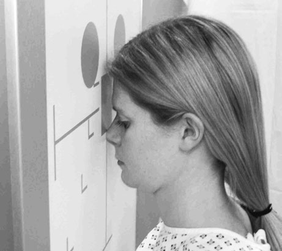
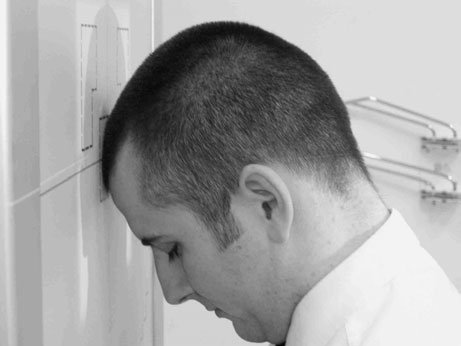
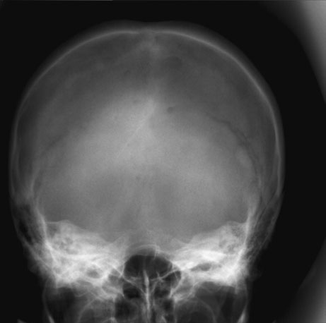
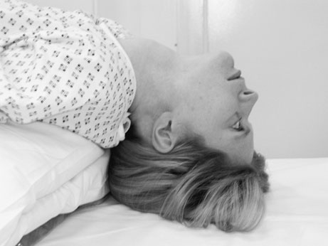
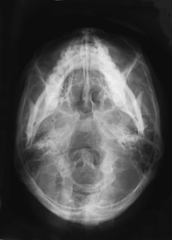
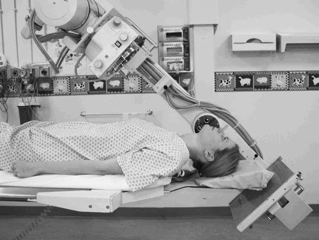

# Rx Craniu Occipito - frontal 30 - degree cranial

  📷 Radiografie Convențională (Rx)
  <strong>Actualizat:</strong> 2026-09-16
  <strong>Autor:</strong> Departamentul de Radiologie / Referință Clark (Ed. 12)

---

-   __1. Rezumat Clinic & Indicații__

    ---

    === "Indicații Clinice"

        - gaură occipitală mare (foramen magnum) trebuie să fie seen clearly pe this incidență. margins poate fie obscured prin incorrect angulation, thus hiding important suspiciune de fractură.
        - zygoma poate fie seen well pe this incidență. If suspiciune de fracturăd, this gives clue la presence de associated facial injury.
        - Erosion de bony margins de Craniu-base foramina este important indicator de destruction prin proces proliferativ tumoral. Under-tilt, over-tilt și rotație reduce visibility de these foramina.
        - This este now uncommon incidență, ca CT evidențiază more completely bony detail de Craniu base în Axială și coronal planes. MRI offers multiplanar imaging cu superb detail de soft tissues ca well ca Craniu base.

    === "Ghid Național IRIS"

        !!! info "Referință Primară: Ghidul Național IRIS (Ordinul MS 1342/2012)"
            - **Capitol Ghid IRIS:** *Ghidul Național IRIS*
            - **Grad de Recomandare:** **De verificat pe indicație; fără grad atribuit automat**
            - **Nivel de Iradiere Estimată:** `De verificat pentru examinarea și populația selectate`

            [:octicons-search-16: Deschide Ghidul IRIS](../../iris.md){ .md-button .md-button--primary } [:material-open-in-new: Aplicația Oficială PWA](https://radiologie-pediatrica.ro/iris/){ .md-button target="_blank" rel="noopener" }
-   __2. Poziționare & Centrare Fascicul__

    ---

    - **Poziție Pacient:** • This incidență este usually undertaken cu pacientul în Ortostatism poziție și facing Ortostatism Bucky, although it poate fie performed Decubit ventral.
• Initially, pacientul este asked la place their nose și forehead pe masa radiologică. capul este ajustat la bring planul mediosagital la drept-angles la caseta și so it este coincident cu its midline.
• orbito-meatal baseline trebuie să fie perpendicular pe casetă.
• pacientul poate place their mâini pe Bucky pentru stability.

pacientul poate fie imaged Ortostatism sau Decubit dorsal. If pacientul este unsteady, then Decubit dorsal technique este advisable.
Decubit dorsal
• pacientul’s umeri sunt raised și gâtul este hyperextended la bring vertex de Craniu în contact cu casetă cu grilă antidifuzoare sau table.
• capul este ajustat la bring extern auditory meatuses echidistant față de caseta.
• planul mediosagital trebuie să fie la drept-angles la caseta along its midline.
• orbito-meatal plane trebuie să fie ca near ca possible paralel cu casetă.
Ortostatism
• pacientul stă așezat short distance away de la stativ vertical Bucky.
• gâtul este hyperextended la allow capul la fall back until vertex de Craniu makes contact cu centre de stativ vertical Bucky.
• remainder de positioning este ca described pentru Decubit dorsal technique.
    - **Punct de Centrare Fascicul:** • raza centrală este înclinat cranially so its makes angle de 30 grade la orbito-meatal plane.
• se ajustează collimation field, astfel încât whole de occipital bone și parietal bones up la vertex sunt included within field. Avoid including eyes în primary fascicul. Laterally, skin margins trebuie să also fie included within field.

• raza centrală este orientat la drept-angles la orbito-meatal plane și centred midway între extern auditory meatuses.
    - **Distanță Focar-Film (DFF / SID):** 100 cm
    - **Comandă Respiratorie:** Apnee pe durata expunerii (apnee în inspir pentru torace; expir pentru Abdomen/bazin).

-   __3. Parametri Tehnici Expunere__

    ---

    | Parametru Tehnic | Valoare Configurare Generator / Tub |
    |:-----------------|:-------------------------------------|
    | **Tensiune Tub (kV)** | DE CONFIGURAT PE APARAT |
    | **Sarcină / Produs Curent-Timp (mAs)** | Conform AEC / grosime anatomică |
    | **Distanță Focar-Film (DFF / SID)** | 100 cm |
    | **Grilă Antidifuzoare (Bucky)** | Cu grilă antidifuzoare Bucky |
    | **Dimensiune Focar** | Focar Mic (0.6 mm) |
    | **Camere de Ionizare AEC** | Camerele laterale (sau camera centrală funcție de regiune) |
    | **Colimare Fascicul** | Colimare strictă la aria anatomică de interes diagnostic |
    | **Filtrare Tub** | Totală ≥ 2.5 mm Al echivalent (conform Clark: 3.0 mm Al eq.) |

-   __4. Criterii de Calitate & Reușită Imagine__

    ---

    - șa turcească de sphenoid bone este projected within gaură occipitală mare (foramen magnum).
    - imagine trebuie să include toate de occipital bone și posterior parts de parietal bone, și lambdoidal suture trebuie să fie visualized clearly.
    - Craniu trebuie să nu fie rotit. This poate also fie assessed prin ensuring that șa turcească appears în middle de gaură occipitală mare (foramen magnum).
    - correct incidență will show angles de Mandibulă clear de petrous portions de temporal bone.
    - foramina de middle cranial fossa trebuie să fie seen symmetrically either side de linia mediană.
    - Erori de evitat / remedii: See Half-Axială, fronto-occipital 30 grade caudal – Towne’s incidență (p. 244).
    - Erori de evitat / remedii: This incidență involves positioning that este very uncomfortable pentru pacientul. It este well worth ensuring that equipment este prepared fully before commencing examination, astfel încât pacient need maintain poziție pentru only minimum period.
    - Erori de evitat / remedii: poziție este achieved much more easily if Craniu unit este used, since object table și tube poate fie ajustat la minimize hyperextension de gâtul. Submento-vertical (SMV) using Craniu unit

-   __5. Protecție Radiologică (ALARA)__

    ---

    - Ecranare gonadică cu șorț plumbat dacă gonadele sunt în apropierea fasciculului util (regula ALARA).
    - Colimare precisă la dimensiunea anatomică strict necesară pentru reducerea dozei și a radiației difuze.
    - Verificarea posibilității unei sarcini la pacientele de vârstă fertilă înainte de expunere.

!!! note "Observații Clinice & Tehnice"
    • This incidență will carry lower radiation dose la sensitive structures than equivalent Antero-posterior (AP) incidență.
• Positioning poate fie easier la undertake pe pacienți who find it difficult la achieve poziție required pentru equivalent Antero-posterior (AP) half-Axială incidențe.
30° Reverse Towne’s Reverse Towne’s, alternative positioning Under înclinat Towne’s

### 🖼️ Imagini

<figure class="protocol-image-card" markdown>

<figcaption><strong>thus hiding important suspiciune de fractură.</strong> — Poziționare pacient și centrare fascicul conform Clark (Ed. 12)</figcaption>

</figure>

<figure class="protocol-image-card" markdown>

<figcaption><strong>Figura 2: Aspect radiografic / Poziționare (Clark Ed. 12)</strong> — Aspect radiografic / ghid de poziționare conform tratatului Clark (Ed. 12)</figcaption>

</figure>

<figure class="protocol-image-card" markdown>

<figcaption><strong>Figura 3: Aspect radiografic / Poziționare (Clark Ed. 12)</strong> — Aspect radiografic / ghid de poziționare conform tratatului Clark (Ed. 12)</figcaption>

</figure>

<figure class="protocol-image-card" markdown>

<figcaption><strong>Figura 4: Aspect radiografic / Poziționare (Clark Ed. 12)</strong> — Aspect radiografic / ghid de poziționare conform tratatului Clark (Ed. 12)</figcaption>

</figure>

<figure class="protocol-image-card" markdown>

<figcaption><strong>Figura 5: Aspect radiografic / Poziționare (Clark Ed. 12)</strong> — Aspect radiografic / ghid de poziționare conform tratatului Clark (Ed. 12)</figcaption>

</figure>

<figure class="protocol-image-card" markdown>

<figcaption><strong>Figura 6: Aspect radiografic / Poziționare (Clark Ed. 12)</strong> — Aspect radiografic / ghid de poziționare conform tratatului Clark (Ed. 12)</figcaption>

</figure>

=== "Ghid Rapid de Execuție"

    1. **Identificarea și verificarea pacientului:** verificare identitate, zonă de examinat, consimțământ conform procedurii și evaluarea posibilității unei sarcini, când este relevantă.
    2. **Pregătire:** îndepărtarea oricăror obiecte radiopace (bijuterii, agrafe, fermoare, proteze, pansamente dense).
    3. **Poziționare precisă:** alinierea receptorului de imagine și a tubului la distanța prescrisă (100 cm).
    4. **Colimare strictă:** adaptarea fasciculului strict la regiunea de diagnostic pentru scăderea iradierii și reducerea radiației difuze.
    5. **Radioprotecție:** verificarea [politicii RX](../radioprotectie.md), cu măsuri distincte pentru pacient, personal și însoțitor.

## Surse de documentare

- [Clark's Positioning in Radiography (Ed. 12), Pagina 260](../../assets/protocols/sources/Clark___Positioning_in_Radiography__12th_edition.pdf#page=260)
