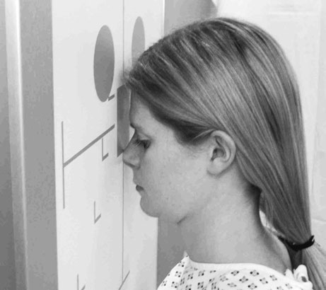
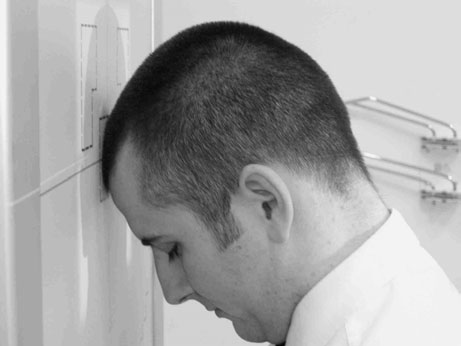
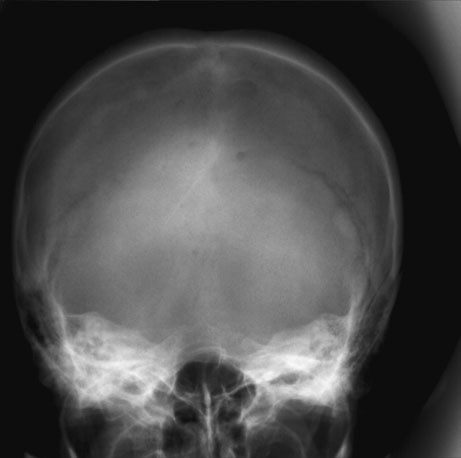
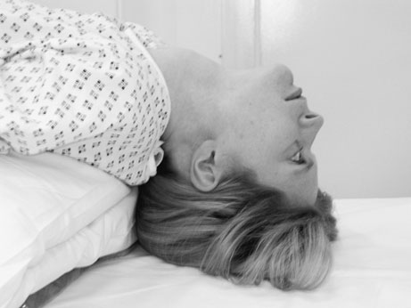
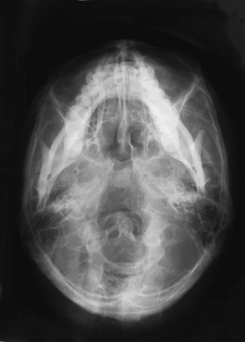
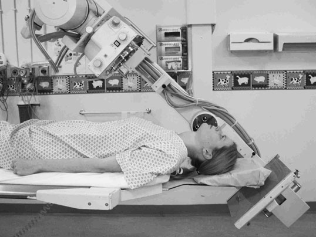

# Radiografia craniului: incidență occipitofrontală cu 30 grade cranial

  📷 Radiografie Convențională (Rx)
  <strong>Actualizat:</strong> 2026-09-16
  <strong>Autor:</strong> Departamentul de Radiologie / Referință Clark (Ed. 12)

---

-   __1. Rezumat Clinic & Indicații__

    ---

    === "Indicații Clinice"

        - Gaura occipitală mare (foramen magnum) trebuie vizualizată clar pe această incidență. Marginile pot fi mascate de angulația incorectă, ascunzând astfel o suspiciune importantă de fractură.
        - Zigomul poate fi vizualizat bine pe această incidență. Dacă există suspiciune de fractură, aceasta oferă un indiciu privind prezența unei leziuni faciale asociate.
        - Eroziunea marginilor osoase ale foramina bazei craniului este un indicator important al distrucției printr-un proces proliferativ tumoral. Înclinarea insuficientă, înclinarea excesivă și rotația reduc vizibilitatea acestor foramina.
        - Aceasta este în prezent o incidență neobișnuită, deoarece CT evidențiază mai complet detaliile osoase ale bazei craniului în planurile axial și coronal. RMN oferă imagini multiplanare cu detalii excelente ale țesuturilor moi, precum și ale bazei craniului.

    === "Ghid Național IRIS"

        !!! info "Referință Primară: Ghidul Național IRIS (Ordinul MS 1342/2012)"
            - **Capitol Ghid IRIS:** *Ghidul Național IRIS*
            - **Grad de Recomandare:** **De verificat pe indicație; fără grad atribuit automat**
            - **Nivel de Iradiere Estimată:** `De verificat pentru examinarea și populația selectate`

            [:octicons-search-16: Deschide Ghidul IRIS](../../iris.md){ .md-button .md-button--primary } [:material-open-in-new: Aplicația Oficială PWA](https://radiologie-pediatrica.ro/iris/){ .md-button target="_blank" rel="noopener" }
-   __2. Poziționare & Centrare Fascicul__

    ---

    - **Poziție Pacient:** • Această incidență se efectuează de obicei cu pacientul în ortostatism, cu fața spre stativul Bucky vertical, deși poate fi efectuată și în decubit ventral.
• Inițial, pacientului i se cere să-și așeze nasul și fruntea pe masa radiologică. Capul este ajustat pentru a aduce planul mediosagital în unghi drept față de casetă, astfel încât să coincidă cu linia mediană a acesteia.
• Linia de bază orbitomeatală trebuie să fie perpendiculară pe casetă.
• Pacientul își poate așeza mâinile pe Bucky pentru stabilitate.

Pacientul poate fi examinat în ortostatism sau în decubit dorsal. Dacă pacientul este instabil, se recomandă tehnica în decubit dorsal.
Decubit dorsal
• Umerii pacientului sunt ridicați, iar gâtul este hiperextins pentru a aduce vertexul craniului în contact cu caseta cu grilă antidifuzoare sau cu masa.
• Capul este ajustat pentru a aduce conductele auditive externe la distanțe egale față de casetă.
• Planul mediosagital trebuie să fie în unghi drept față de casetă, de-a lungul liniei sale mediane.
• Planul orbitomeatal trebuie să fie cât mai paralel posibil cu caseta.
Ortostatism
• Pacientul stă așezat la mică distanță de stativul vertical Bucky.
• Gâtul este hiperextins pentru a permite capului să cadă posterior până când vertexul craniului intră în contact cu centrul stativului vertical Bucky.
• Restul poziționării este cel descris pentru tehnica în decubit dorsal.
    - **Punct de Centrare Fascicul:** • Raza centrală este înclinată cranial, astfel încât formează un unghi de 30 grade față de planul orbitomeatal.
• Câmpul de colimare se ajustează astfel încât întregul os occipital și oasele parietale până la vertex să fie incluse în câmp. Evitați includerea ochilor în fasciculul primar. Lateral, marginile cutanate trebuie, de asemenea, incluse în câmp.

• Raza centrală este orientată în unghi drept față de planul orbitomeatal și centrată la jumătatea distanței dintre conductele auditive externe.
    - **Distanță Focar-Film (DFF / SID):** 100 cm
    - **Comandă Respiratorie:** Apnee pe durata expunerii (apnee în inspir pentru torace; expir pentru Abdomen/bazin).

-   __3. Parametri Tehnici Expunere__

    ---

    | Parametru Tehnic | Valoare Configurare Generator / Tub |
    |:-----------------|:-------------------------------------|
    | **Tensiune Tub (kV)** | DE CONFIGURAT PE APARAT |
    | **Sarcină / Produs Curent-Timp (mAs)** | Conform AEC / grosimii anatomice |
    | **Distanță Focar-Film (DFF / SID)** | 100 cm |
    | **Grilă Antidifuzoare (Bucky)** | Cu grilă antidifuzoare Bucky |
    | **Dimensiune Focar** | Focar Mic (0.6 mm) |
    | **Camere de Ionizare AEC** | Camerele laterale (sau camera centrală, în funcție de regiune) |
    | **Colimare Fascicul** | Colimare strictă la aria anatomică de interes diagnostic |
    | **Filtrare Tub** | Totală ≥ 2.5 mm Al echivalent (conform Clark: 3.0 mm Al echivalent) |

-   __4. Criterii de Calitate & Reușită Imagine__

    ---

    - Șaua turcească a osului sfenoid este proiectată în interiorul găurii occipitale mari (foramen magnum).
    - Imaginea trebuie să includă întregul os occipital și porțiunile posterioare ale oaselor parietale, iar sutura lambdoidă trebuie vizualizată clar.
    - Craniul nu trebuie să fie rotit. Acest lucru poate fi evaluat și prin verificarea faptului că șaua turcească apare în mijlocul găurii occipitale mari (foramen magnum).
    - Incidența corectă va evidenția clar unghiurile mandibulei față de porțiunile pietroase ale oaselor temporale.
    - Foramina fosei craniene mijlocii trebuie vizualizate simetric de o parte și de alta a liniei mediane.
    - Erori de evitat / remedii: Vezi incidența semi-axială fronto-occipitală cu 30 grade caudal – incidența Towne (p. 244).
    - Erori de evitat / remedii: Această incidență implică o poziționare foarte incomodă pentru pacient. Merită să vă asigurați că echipamentul este pregătit complet înainte de începerea examinării, astfel încât pacientul să fie nevoit să mențină poziția doar pentru perioada minimă.
    - Erori de evitat / remedii: Poziția se obține mult mai ușor dacă se utilizează unitatea pentru craniu, deoarece masa pentru obiect și tubul pot fi ajustate pentru a minimiza hiperextensia gâtului. Incidență submento-verticală (SMV) utilizând unitatea pentru craniu

-   __5. Protecție Radiologică (ALARA)__

    ---

    - Ecranare gonadică cu șorț plumbat dacă gonadele sunt în apropierea fasciculului util (regula ALARA).
    - Colimare precisă la dimensiunea anatomică strict necesară pentru reducerea dozei și a radiației difuze.
    - Verificarea posibilității unei sarcini la pacientele de vârstă fertilă înainte de expunere.

!!! note "Observații Clinice & Tehnice"
    • Această incidență implică o doză de radiație mai mică pentru structurile sensibile decât incidența anteroposterioară (AP) echivalentă.
• Poziționarea poate fi mai ușor realizată la pacienții cărora le este dificil să obțină poziția necesară pentru incidențele anteroposterioare (AP) semi-axiale echivalente.
30° Towne inversă Towne inversă, poziționare alternativă Towne subînclinată

### 🖼️ Imagini

<figure class="protocol-image-card" markdown>

<figcaption><strong>ascunzând astfel o suspiciune importantă de fractură.</strong> — Poziționarea pacientului și centrarea fasciculului conform Clark (Ed. 12)</figcaption>

</figure>

<figure class="protocol-image-card" markdown>

<figcaption><strong>Figura 2: Aspect radiografic / Poziționare (Clark Ed. 12)</strong> — Aspect radiografic / ghid de poziționare conform tratatului Clark (Ed. 12)</figcaption>

</figure>

<figure class="protocol-image-card" markdown>

<figcaption><strong>Figura 3: Aspect radiografic / Poziționare (Clark Ed. 12)</strong> — Aspect radiografic / ghid de poziționare conform tratatului Clark (Ed. 12)</figcaption>

</figure>

<figure class="protocol-image-card" markdown>

<figcaption><strong>Figura 4: Aspect radiografic / Poziționare (Clark Ed. 12)</strong> — Aspect radiografic / ghid de poziționare conform tratatului Clark (Ed. 12)</figcaption>

</figure>

<figure class="protocol-image-card" markdown>

<figcaption><strong>Figura 5: Aspect radiografic / Poziționare (Clark Ed. 12)</strong> — Aspect radiografic / ghid de poziționare conform tratatului Clark (Ed. 12)</figcaption>

</figure>

<figure class="protocol-image-card" markdown>

<figcaption><strong>Figura 6: Aspect radiografic / Poziționare (Clark Ed. 12)</strong> — Aspect radiografic / ghid de poziționare conform tratatului Clark (Ed. 12)</figcaption>

</figure>

=== "Ghid Rapid de Execuție"

    1. **Identificarea și verificarea pacientului:** verificare identitate, zonă de examinat, consimțământ conform procedurii și evaluarea posibilității unei sarcini, când este relevantă.
    2. **Pregătire:** îndepărtarea oricăror obiecte radiopace (bijuterii, agrafe, fermoare, proteze, pansamente dense).
    3. **Poziționare precisă:** alinierea receptorului de imagine și a tubului la distanța prescrisă (100 cm).
    4. **Colimare strictă:** adaptarea fasciculului strict la regiunea de diagnostic pentru scăderea iradierii și reducerea radiației difuze.
    5. **Radioprotecție:** verificarea [politicii RX](../radioprotectie.md), cu măsuri distincte pentru pacient, personal și însoțitor.

## Surse de documentare

- [Clark's Positioning in Radiography (Ed. 12), Pagina 260](https://books.google.com/books/about/Clark_s_Positioning_in_Radiography.html?id=Xxu6MwEACAAJ)
