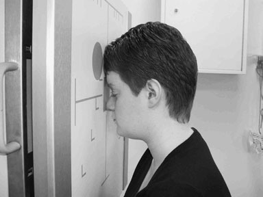
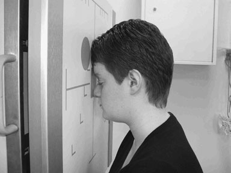
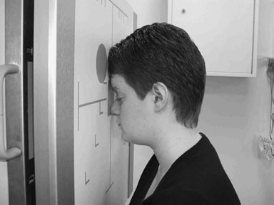
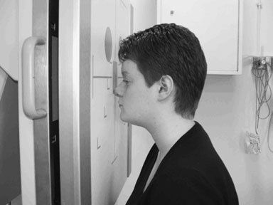
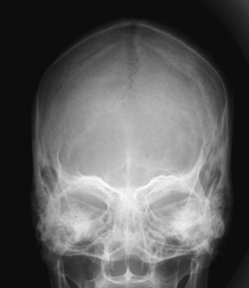
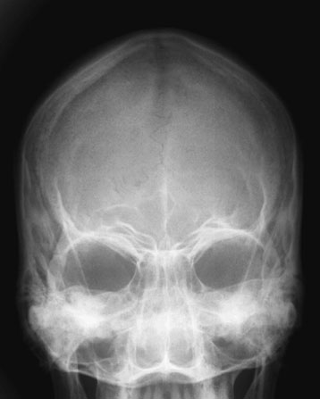
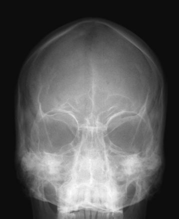

# Rx Craniu Occipito - frontal

  📷 Radiografie Convențională (Rx)
  <strong>Actualizat:</strong> 2026-09-16
  <strong>Autor:</strong> Departamentul de Radiologie / Referință Clark (Ed. 12)

---

-   __1. Rezumat Clinic & Indicații__

    ---

    === "Indicații Clinice"

        - Asymmetry de incidență de squamo-parietal suture due la rotație increases risk de it being mistaken pentru suspiciune de fractură.
        - ca fascicul angle increases, more de orbital region este evidențiat și less de upper part de frontal bone anterior parietal bones este vizualizat. Thus, site de suspected pathology trebuie să fie considered when selecting fascicul angle, e.g. injury la upper orbital region este best evaluated cu OF20°↓incidență.

    === "Ghid Național IRIS"

        !!! info "Referință Primară: Ghidul Național IRIS (Ordinul MS 1342/2012)"
            - **Capitol Ghid IRIS:** *Ghidul Național IRIS*
            - **Grad de Recomandare:** **De verificat pe indicație; fără grad atribuit automat**
            - **Nivel de Iradiere Estimată:** `De verificat pentru examinarea și populația selectate`

            [:octicons-search-16: Deschide Ghidul IRIS](../../iris.md){ .md-button .md-button--primary } [:material-open-in-new: Aplicația Oficială PWA](https://radiologie-pediatrica.ro/iris/){ .md-button target="_blank" rel="noopener" }
-   __2. Poziționare & Centrare Fascicul__

    ---

    - **Poziție Pacient:** • This incidență poate fie undertaken Ortostatism sau în Decubit ventral poziție. Ortostatism incidență will fie described, ca Decubit ventral incidență este uncomfortable pentru pacientul și will usually fie carried out only în absence de stativ vertical Bucky.
• pacientul este așezat pe scaun facing Ortostatism Bucky, astfel încât plan mediosagital este coincident cu linia mediană Bucky și este also perpendicular la it.
• gâtul este flectat astfel încât orbito-meatal base line este perpendicular pe Bucky. This poate usually fie achieved prin ensuring that nasul și forehead sunt în contact cu Bucky.
• Ensure that mid-part de frontal bone este poziționat în centre de Bucky.
• pacientul poate place palms de fiecare Mână either side de capul (out de primary fascicul) pentru stability.
• A 24  30-cm casetă este plasat longitudinally în tăvița Bucky. Ensure that lead name blocker will nu interfere cu final imagine.
    - **Punct de Centrare Fascicul:** Occipito-frontal
• raza centrală este orientat perpendicular pe Bucky along planul mediosagital.
• collimation field trebuie să fie set pentru include vertex de Craniu superiorly, region immediately below base de occipital bone inferiorly, și Profil (lateral) skin margins. It este important la ensure that tubul este centred la middle de Bucky.
Occipito-frontal caudal angulation:
10, 15 și 20 grade
• technique used pentru these three incidențe este similar la that employed pentru occipito-frontal incidență, except that caudal angulation este applied. grade de angulation will depend pe technique, e.g. pentru OF20°↓incidență, a 20-grade caudal angulation will fie employed.
• Ensure that raza centrală este always centred la middle de Bucky once tubul angulation has been applied și nu before.
    - **Distanță Focar-Film (DFF / SID):** 100 cm
    - **Comandă Respiratorie:** Apnee pe durata expunerii (apnee în inspir pentru torace; expir pentru Abdomen/bazin).

-   __3. Parametri Tehnici Expunere__

    ---

    | Parametru Tehnic | Valoare Configurare Generator / Tub |
    |:-----------------|:-------------------------------------|
    | **Tensiune Tub (kV)** | DE CONFIGURAT PE APARAT |
    | **Sarcină / Produs Curent-Timp (mAs)** | Conform AEC / grosime anatomică |
    | **Distanță Focar-Film (DFF / SID)** | 100 cm |
    | **Grilă Antidifuzoare (Bucky)** | Cu grilă antidifuzoare Bucky |
    | **Dimensiune Focar** | Focar Mic (0.6 mm) |
    | **Camere de Ionizare AEC** | Camerele laterale (sau camera centrală funcție de regiune) |
    | **Colimare Fascicul** | Colimare strictă adaptată pe receptor 24 x 30 cm |
    | **Filtrare Tub** | Totală ≥ 2.5 mm Al echivalent (conform Clark: 3.0 mm Al eq.) |

-   __4. Criterii de Calitate & Reușită Imagine__

    ---

    - toate cranial bones trebuie să fie included within imagine, including skin margins.
    - It este important la ensure that Craniu este nu rotit. This poate fie assessed prin measuring distance de la point în linia mediană Craniu la Profil (lateral) margin. If this este same pe ambele părți (bilateral) de Craniu, then it este nu rotit. 10° 20° 20° Positioning pentru occipito-frontal Craniu incidență Positioning pentru OF10°↓Craniu incidență Positioning pentru OF20°↓Craniu incidență Alternative positioning pentru OF20°↓using straight tube cu orbito-meatal baseline raised 20 grade
    - Erori de evitat / remedii: rotație: ensure that pacientul’s cap este straight immediately before expunere este made.
    - Erori de evitat / remedii: Incorrect fascicul angulation: it este worth remembering that greater fascicul angulations will result în stânci temporale (piramide pietroase) appearing further down orbit. If OF20°↓este undertaken și petrous bones appear în middle third de orbit, then greater angle trebuie să have been applied, în this case further 10 grade.

-   __5. Protecție Radiologică (ALARA)__

    ---

    - Ecranare gonadică cu șorț plumbat dacă gonadele sunt în apropierea fasciculului util (regula ALARA).
    - Colimare precisă la dimensiunea anatomică strict necesară pentru reducerea dozei și a radiației difuze.
    - Verificarea posibilității unei sarcini la pacientele de vârstă fertilă înainte de expunere.

!!! note "Observații Clinice & Tehnice"
    • pacienți often find it difficult la maintain their orbito-meatal baseline perpendicular pe film radiologic, ca this este unnatural poziție și they sunt likely la move.
• Instead de angling fascicul la achieve desired poziție de stânci temporale (piramide pietroase) within orbit, vertical raza centrală, i.e.
perpendicular pe film radiologic, poate fie used. desired angulation pentru incidență poate then fie achieved prin raising orbitomeatal baseline prin desired angle, e.g. pentru OF20°↓, bărbia poate fie raised astfel încât orbito-meatal baseline will fie la un unghi de 20 grade la orizontal (see photograph).
Similarly, pentru OF10°↓, linie orbitomeatală (LOM) will fie raised prin 10 grade.
de OF20°↓ OF10°↓

### 🖼️ Imagini

<figure class="protocol-image-card" markdown>

<figcaption><strong>Figura 1: Aspect radiografic / Poziționare (Clark Ed. 12)</strong> — Poziționare pacient și centrare fascicul conform Clark (Ed. 12)</figcaption>

</figure>

<figure class="protocol-image-card" markdown>

<figcaption><strong>Figura 2: Aspect radiografic / Poziționare (Clark Ed. 12)</strong> — Aspect radiografic / ghid de poziționare conform tratatului Clark (Ed. 12)</figcaption>

</figure>

<figure class="protocol-image-card" markdown>

<figcaption><strong>Figura 3: Aspect radiografic / Poziționare (Clark Ed. 12)</strong> — Aspect radiografic / ghid de poziționare conform tratatului Clark (Ed. 12)</figcaption>

</figure>

<figure class="protocol-image-card" markdown>

<figcaption><strong>Figura 4: Aspect radiografic / Poziționare (Clark Ed. 12)</strong> — Aspect radiografic / ghid de poziționare conform tratatului Clark (Ed. 12)</figcaption>

</figure>

<figure class="protocol-image-card" markdown>

<figcaption><strong>Figura 5: Aspect radiografic / Poziționare (Clark Ed. 12)</strong> — Aspect radiografic / ghid de poziționare conform tratatului Clark (Ed. 12)</figcaption>

</figure>

<figure class="protocol-image-card" markdown>

<figcaption><strong>Figura 6: Aspect radiografic / Poziționare (Clark Ed. 12)</strong> — Aspect radiografic / ghid de poziționare conform tratatului Clark (Ed. 12)</figcaption>

</figure>

<figure class="protocol-image-card" markdown>

<figcaption><strong>Figura 7: Aspect radiografic / Poziționare (Clark Ed. 12)</strong> — Aspect radiografic / ghid de poziționare conform tratatului Clark (Ed. 12)</figcaption>

</figure>

=== "Ghid Rapid de Execuție"

    1. **Identificarea și verificarea pacientului:** verificare identitate, zonă de examinat, consimțământ conform procedurii și evaluarea posibilității unei sarcini, când este relevantă.
    2. **Pregătire:** îndepărtarea oricăror obiecte radiopace (bijuterii, agrafe, fermoare, proteze, pansamente dense).
    3. **Poziționare precisă:** alinierea receptorului de imagine și a tubului la distanța prescrisă (100 cm).
    4. **Colimare strictă:** adaptarea fasciculului strict la regiunea de diagnostic pentru scăderea iradierii și reducerea radiației difuze.
    5. **Radioprotecție:** verificarea [politicii RX](../radioprotectie.md), cu măsuri distincte pentru pacient, personal și însoțitor.

## Surse de documentare

- [Clark's Positioning in Radiography (Ed. 12), Pagina 255](../../assets/protocols/sources/Clark___Positioning_in_Radiography__12th_edition.pdf#page=255)
