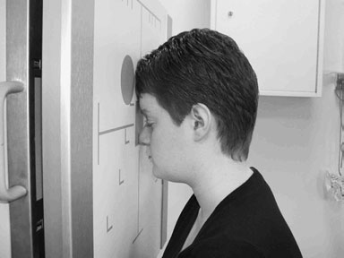
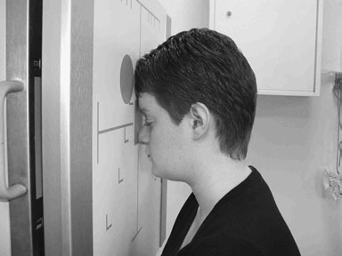
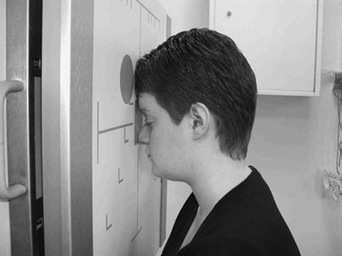
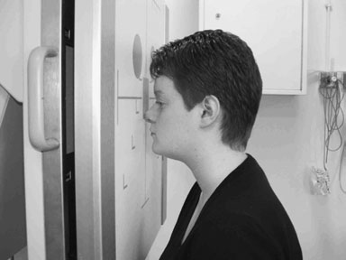
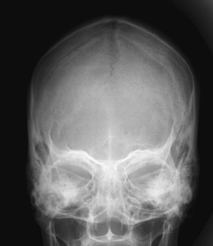
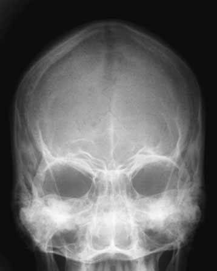
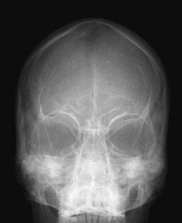

# Radiografia craniului: incidență occipitofrontală

  📷 Radiografie Convențională (Rx)
  <strong>Actualizat:</strong> 2026-09-16
  <strong>Autor:</strong> Departamentul de Radiologie / Referință Clark (Ed. 12)

---

-   __1. Rezumat Clinic & Indicații__

    ---

    === "Indicații Clinice"

        - Asimetria incidenței suturii scuamo-parietale datorată rotației crește riscul ca aceasta să fie confundată cu o suspiciune de fractură.
        - Pe măsură ce unghiul fasciculului crește, o proporție mai mare din regiunea orbitală este evidențiată, iar o proporție mai mică din partea superioară a osului frontal și din oasele parietale anterioare este vizualizată. Prin urmare, localizarea patologiei suspectate trebuie luată în considerare la selectarea unghiului fasciculului; de exemplu, o leziune a regiunii orbitale superioare este evaluată cel mai bine prin incidența OF20°↓.

    === "Ghid Național IRIS"

        !!! info "Referință Primară: Ghidul Național IRIS (Ordinul MS 1342/2012)"
            - **Capitol Ghid IRIS:** *Ghidul Național IRIS*
            - **Grad de Recomandare:** **De verificat pe indicație; fără grad atribuit automat**
            - **Nivel de Iradiere Estimată:** `De verificat pentru examinarea și populația selectate`

            [:octicons-search-16: Deschide Ghidul IRIS](../../iris.md){ .md-button .md-button--primary } [:material-open-in-new: Aplicația Oficială PWA](https://radiologie-pediatrica.ro/iris/){ .md-button target="_blank" rel="noopener" }
-   __2. Poziționare & Centrare Fascicul__

    ---

    - **Poziție Pacient:** • Această incidență poate fi efectuată în ortostatism sau în decubit ventral. Va fi descrisă incidența în ortostatism, deoarece incidența în decubit ventral este incomodă pentru pacient și se efectuează de obicei numai în absența unui stativ vertical Bucky.
• Pacientul este așezat pe scaun cu fața spre stativul Bucky vertical, astfel încât planul mediosagital să coincidă cu linia mediană a Bucky și să fie, de asemenea, perpendicular pe acesta.
• Gâtul este flectat astfel încât linia de bază orbitomeatală să fie perpendiculară pe Bucky. Aceasta se obține de obicei asigurându-se că nasul și fruntea sunt în contact cu Bucky.
• Asigurați-vă că porțiunea mijlocie a osului frontal este poziționată în centrul Bucky.
• Pacientul își poate așeza palmele de fiecare parte a capului, în afara fasciculului primar, pentru stabilitate.
• O casetă de 24 × 30 cm este plasată longitudinal în tava Bucky. Asigurați-vă că plăcuța de identificare din plumb nu interferează cu imaginea finală.
    - **Punct de Centrare Fascicul:** Occipitofrontală
• Raza centrală este orientată perpendicular pe Bucky, de-a lungul planului mediosagital.
• Câmpul de colimare trebuie ajustat pentru a include superior vertexul craniului, inferior regiunea imediat sub baza osului occipital și marginile cutanate de profil. Este important să vă asigurați că tubul este centrat pe mijlocul Bucky.
Incidență occipitofrontală cu angulație caudală:
10, 15 și 20 grade
• Tehnica utilizată pentru aceste trei incidențe este similară celei folosite pentru incidența occipitofrontală, cu excepția aplicării angulației caudale. Gradul de angulație va depinde de tehnică, de exemplu, pentru incidența OF20°↓ se va utiliza o angulație caudală de 20 grade.
• Asigurați-vă că raza centrală este întotdeauna centrată pe mijlocul Bucky după aplicarea angulației tubului, nu înainte.
    - **Distanță Focar-Film (DFF / SID):** 100 cm
    - **Comandă Respiratorie:** Apnee pe durata expunerii (apnee în inspir pentru torace; expir pentru Abdomen/bazin).

-   __3. Parametri Tehnici Expunere__

    ---

    | Parametru Tehnic | Valoare Configurare Generator / Tub |
    |:-----------------|:-------------------------------------|
    | **Tensiune Tub (kV)** | DE CONFIGURAT PE APARAT |
    | **Sarcină / Produs Curent-Timp (mAs)** | Conform AEC / grosimii anatomice |
    | **Distanță Focar-Film (DFF / SID)** | 100 cm |
    | **Grilă Antidifuzoare (Bucky)** | Cu grilă antidifuzoare Bucky |
    | **Dimensiune Focar** | Focar Mic (0.6 mm) |
    | **Camere de Ionizare AEC** | Camerele laterale (sau camera centrală, în funcție de regiune) |
    | **Colimare Fascicul** | Colimare strictă adaptată pe receptor 24 x 30 cm |
    | **Filtrare Tub** | Totală ≥ 2.5 mm Al echivalent (conform Clark: 3.0 mm Al echivalent) |

-   __4. Criterii de Calitate & Reușită Imagine__

    ---

    - Toate oasele craniene trebuie incluse în imagine, inclusiv marginile cutanate.
    - Este important să vă asigurați că craniul nu este rotit. Aceasta poate fi evaluată prin măsurarea distanței de la un punct de pe linia mediană a craniului la marginea de profil. Dacă aceasta este egală bilateral, craniul nu este rotit. 10° 20° 20° Poziționarea pentru incidența occipitofrontală a craniului Poziționarea pentru incidența OF10°↓ a craniului Poziționarea pentru incidența OF20°↓ a craniului Poziționare alternativă pentru OF20°↓ utilizând tubul drept, cu linia de bază orbitomeatală ridicată la 20 grade
    - Erori de evitat / remedii: Rotație: asigurați-vă că pacientul are capul drept imediat înainte de efectuarea expunerii.
    - Erori de evitat / remedii: Angulație incorectă a fasciculului: merită reținut că angulațiile mai mari ale fasciculului vor determina apariția porțiunilor pietroase ale oaselor temporale mai jos în orbite. Dacă se efectuează OF20°↓ și oasele pietroase apar în treimea mijlocie a orbitelor, atunci trebuie să fi fost aplicat un unghi mai mare, în acest caz cu încă 10 grade.

-   __5. Protecție Radiologică (ALARA)__

    ---

    - Ecranare gonadică cu șorț plumbat dacă gonadele sunt în apropierea fasciculului util (regula ALARA).
    - Colimare precisă la dimensiunea anatomică strict necesară pentru reducerea dozei și a radiației difuze.
    - Verificarea posibilității unei sarcini la pacientele de vârstă fertilă înainte de expunere.

!!! note "Observații Clinice & Tehnice"
    • Pacienților le este adesea dificil să mențină linia de bază orbitomeatală perpendiculară pe filmul radiologic, deoarece aceasta este o poziție nenaturală și este probabil să se miște.
• În loc să se încline fasciculul pentru a obține poziția dorită a porțiunilor pietroase ale oaselor temporale în orbite, poate fi utilizată o rază centrală verticală, adică perpendiculară pe filmul radiologic. Angulația dorită pentru incidență poate fi apoi obținută prin ridicarea liniei de bază orbitomeatale cu unghiul dorit; de exemplu, pentru OF20°↓, bărbia poate fi ridicată astfel încât linia de bază orbitomeatală să formeze un unghi de 20 grade față de orizontală (vezi fotografia).
În mod similar, pentru OF10°↓, linia orbitomeatală (LOM) va fi ridicată cu 10 grade.
OF20°↓ OF10°↓

### 🖼️ Imagini

<figure class="protocol-image-card" markdown>

<figcaption><strong>Figura 1: Aspect radiografic / Poziționare (Clark Ed. 12)</strong> — Poziționarea pacientului și centrarea fasciculului conform Clark (Ed. 12)</figcaption>

</figure>

<figure class="protocol-image-card" markdown>

<figcaption><strong>Figura 2: Aspect radiografic / Poziționare (Clark Ed. 12)</strong> — Aspect radiografic / ghid de poziționare conform tratatului Clark (Ed. 12)</figcaption>

</figure>

<figure class="protocol-image-card" markdown>

<figcaption><strong>Figura 3: Aspect radiografic / Poziționare (Clark Ed. 12)</strong> — Aspect radiografic / ghid de poziționare conform tratatului Clark (Ed. 12)</figcaption>

</figure>

<figure class="protocol-image-card" markdown>

<figcaption><strong>Figura 4: Aspect radiografic / Poziționare (Clark Ed. 12)</strong> — Aspect radiografic / ghid de poziționare conform tratatului Clark (Ed. 12)</figcaption>

</figure>

<figure class="protocol-image-card" markdown>

<figcaption><strong>Figura 5: Aspect radiografic / Poziționare (Clark Ed. 12)</strong> — Aspect radiografic / ghid de poziționare conform tratatului Clark (Ed. 12)</figcaption>

</figure>

<figure class="protocol-image-card" markdown>

<figcaption><strong>Figura 6: Aspect radiografic / Poziționare (Clark Ed. 12)</strong> — Aspect radiografic / ghid de poziționare conform tratatului Clark (Ed. 12)</figcaption>

</figure>

<figure class="protocol-image-card" markdown>

<figcaption><strong>Figura 7: Aspect radiografic / Poziționare (Clark Ed. 12)</strong> — Aspect radiografic / ghid de poziționare conform tratatului Clark (Ed. 12)</figcaption>

</figure>

=== "Ghid Rapid de Execuție"

    1. **Identificarea și verificarea pacientului:** verificare identitate, zonă de examinat, consimțământ conform procedurii și evaluarea posibilității unei sarcini, când este relevantă.
    2. **Pregătire:** îndepărtarea oricăror obiecte radiopace (bijuterii, agrafe, fermoare, proteze, pansamente dense).
    3. **Poziționare precisă:** alinierea receptorului de imagine și a tubului la distanța prescrisă (100 cm).
    4. **Colimare strictă:** adaptarea fasciculului strict la regiunea de diagnostic pentru scăderea iradierii și reducerea radiației difuze.
    5. **Radioprotecție:** verificarea [politicii RX](../radioprotectie.md), cu măsuri distincte pentru pacient, personal și însoțitor.

## Surse de documentare

- [Clark's Positioning in Radiography (Ed. 12), Pagina 255](https://books.google.com/books/about/Clark_s_Positioning_in_Radiography.html?id=Xxu6MwEACAAJ)
