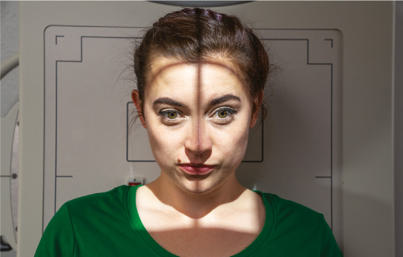
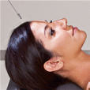
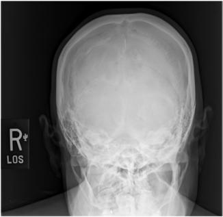
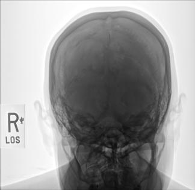

# Rx Craniu SERIES AP Axială (Incidență AP Axială (Metoda Towne))

  📷 Radiografie Convențională (Rx)
  <strong>Actualizat:</strong> 2026-09-15
  <strong>Autor:</strong> Departamentul de Radiologie / Referință Bontrager

---

-   __1. Rezumat Clinic & Indicații__

    ---

    === "Indicații Clinice"

        - Craniu suspiciune de fractură (medial și lateral displacement), neoplastic processes, și Paget disease

    === "Ghid Național IRIS"

        !!! info "Referință Primară: Ghidul Național IRIS (Ordinul MS 1342/2012)"
            - **Capitol Ghid IRIS:** *Ghidul Național IRIS*
            - **Grad de Recomandare:** **De verificat pe indicație; fără grad atribuit automat**
            - **Nivel de Iradiere Estimată:** `De verificat pentru examinarea și populația selectate`

            [:octicons-search-16: Deschide Ghidul IRIS](../../iris.md){ .md-button .md-button--primary } [:material-open-in-new: Aplicația Oficială PWA](https://radiologie-pediatrica.ro/iris/){ .md-button target="_blank" rel="noopener" }
-   __2. Poziționare & Centrare Fascicul__

    ---

    - **Poziție Pacient:** Pacient: Remove toate metal, plastic, sau other removable objects de la pacient’s cap. Take radiografie cu pacientul în Ortostatism sau Decubit dorsal poziție.; Regiune anatomică: Depress chin, bringing linie orbitomeatală (LOM) perpendicular pe receptorul de imagine. pentru pacienți unable la se flectează neck la this extent, align linie infraorbitomeatală (LIOM) perpendicular pe receptorul de imagine. Add radiolucent support under capul if needed (see
    - **Punct de Centrare Fascicul:** Raza centrală se înclină 30° caudal (spre picioare) la linie orbitomeatală (LOM) sau 37° caudal la IOM linie infraorbitomeatală (LIOM) (Fig. 11.107) (see NOTE). Center la MSP 2½ inches (6.5 cm) above glabelă la pass through gaură occipitală mare (foramen magnum) la nivelul base de occiput. Se centrează receptorul de imagine pe proiecția razei centrale.
    - **Distanță Focar-Film (DFF / SID):** 100 cm
    - **Comandă Respiratorie:** Apnee pe durata expunerii.

-   __3. Parametri Tehnici Expunere__

    ---

    | Parametru Tehnic | Valoare Configurare Generator / Tub |
    |:-----------------|:-------------------------------------|
    | **Tensiune Tub (kV)** | 75-90 kV |
    | **Sarcină / Produs Curent-Timp (mAs)** | DE CONFIGURAT PE APARAT |
    | **Distanță Focar-Film (DFF / SID)** | 100 cm |
    | **Grilă Antidifuzoare (Bucky)** | Cu grilă antidifuzoare Bucky |
    | **Dimensiune Focar** | Focar Mare (1.0 - 1.2 mm) |
    | **Camere de Ionizare AEC** | Camerele laterale (sau camera centrală funcție de regiune) |
    | **Colimare Fascicul** | Collimate pe four sides la anatomy de interest. |
    | **Filtrare Tub** | Totală ≥ 2.5 mm Al echivalent |

-   __4. Criterii de Calitate & Reușită Imagine__

    ---

    - Occipital bone, stânci temporale (piramide pietroase), și gaură occipitală mare (foramen magnum) sunt evidențiat cu dorsum sellae și posterior clinoid processes visualized în shadow de gaură occipitală mare (foramen magnum) (Figs. 11.108 și 11.109). poziție:
    - stânci temporale (piramide pietroase) trebuie să fie simetric, indicating Absența rotației anatomice: clavicule echidistante față de linia apofizelor spinoase (stânci temporale (piramide pietroase) will appear wider în direction de rotație spre receptorul de imagine).
    - Dorsum sellae și posterior clinoid processes visualized în gaură occipitală mare (foramen magnum) indicate correct raza centrală angle și corect neck flexion/extension.
    - underangulation de raza centrală sau insufficient flexion de neck projects dorsum sellae superior la gaură occipitală mare (foramen magnum). overangulation de raza centrală sau excessive neck flexion superimposes posterior arch de C1 over dorsum sellae within gaură occipitală mare (foramen magnum) și produces foreshortening de dorsum sellae.
    - Shifting de anterior sau posterior clinoid processes laterally within gaură occipitală mare (foramen magnum) indicates tilt.7
    - Collimation la aria de interes diagnostic. expunere:
    - optim receptorul de imagine expunere și contrast sunt sufficient la visualize occipital bone și sellar structures within gaură occipitală mare (foramen magnum).
    - net bony margins indicate fără mișcare. Fig. 11.108 AP axial. posterior clinoid process gaură occipitală mare (foramen magnum) Occipital bone stânci temporale (piramide pietroase) Mastoid region Dorsum sellae Fig. 11.109 AP axial. Craniu SERIES ROUTINE
    - AP axial (Incidență AP Axială (Metoda Towne))
    - lateral
    - PA axial 15° (Incidență Occipito-Frontală (Metoda Caldwell)) sau PA axial 25° la 30°
    - PA

-   __5. Protecție Radiologică (ALARA)__

    ---

    - Ecranare gonadică și a organelor radiosensibile conform procedurilor locale de radioprotecție ALARA.
    - Colimare strictă la aria de interes pentru limitarea radiației difuze.
    - Verificarea posibilității unei sarcini la pacientele de vârstă fertilă înainte de expunere.

!!! note "Observații Clinice & Tehnice"
    If pacient este unable la depress bărbia sufficiently la bring linie orbitomeatală (LOM) perpendicular pe receptorul de imagine even cu small sponge under capul, linie infraorbitomeatală (LIOM) poate fie plasat perpendicular instead și raza centrală angle increased la 37° caudal. This maintains 30° angle între linie orbitomeatală (LOM) și raza centrală și evidențiază same anatomic relationships. (A 7° difference exists între linie orbitomeatală (LOM) și linie infraorbitomeatală (LIOM).) 37° Fig. 11.107 Ortostatism și Decubit dorsal (inset)—AP axial.

### 🖼️ Imagini

<figure class="protocol-image-card" markdown>

<figcaption><strong>Fig. 11.107 Ortostatism și Decubit dorsal (inset)—AP axial.</strong> — Poziționare pacient conform Ghidului Bontrager (Fig. 11.107 în ortostatism și în decubit dorsal (inset)—AP axial.)</figcaption>

</figure>

<figure class="protocol-image-card" markdown>

<figcaption><strong>Fig. 11.108 AP axial.</strong> — Aspect radiografic de referință conform Ghidului Bontrager (Fig. 11.108 AP axial.)</figcaption>

</figure>

<figure class="protocol-image-card" markdown>

<figcaption><strong>Fig. 11.109 AP axial.</strong> — Aspect radiografic de referință conform Ghidului Bontrager (Fig. 11.109 AP axial.)</figcaption>

</figure>

<figure class="protocol-image-card" markdown>

<figcaption><strong>Figura 4</strong> — Aspect radiografic de referință conform Ghidului Bontrager (Figura 4)</figcaption>

</figure>

=== "Ghid Rapid de Execuție"

    1. **Identificarea și verificarea pacientului:** verificare identitate, zonă de examinat, consimțământ conform procedurii și evaluarea posibilității unei sarcini, când este relevantă.
    2. **Pregătire:** îndepărtarea oricăror obiecte radiopace (bijuterii, agrafe, fermoare, proteze, pansamente dense).
    3. **Poziționare precisă:** alinierea receptorului de imagine și a tubului la distanța prescrisă (100 cm).
    4. **Colimare strictă:** adaptarea fasciculului strict la regiunea de diagnostic pentru scăderea iradierii și reducerea radiației difuze.
    5. **Radioprotecție:** verificarea [politicii RX](../radioprotectie.md), cu măsuri distincte pentru pacient, personal și însoțitor.

## Surse de documentare

- [Bontrager's Textbook of Radiographic Positioning (Ed. 9/10), Pagina 437](https://www.elsevier.com/books/textbook-of-radiographic-positioning-and-related-anatomy/lampignano/978-0-323-65367-1)
