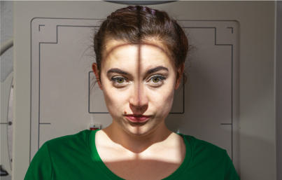
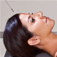
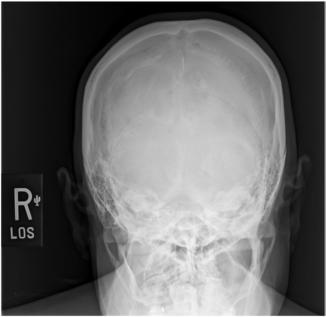
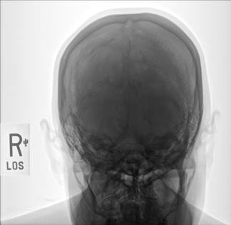

# Rx Craniu SERIE AP axială (incidență AP axială (metoda Towne))

  📷 Radiografie Convențională (Rx)
  <strong>Actualizat:</strong> 2026-09-15
  <strong>Autor:</strong> Departamentul de Radiologie / Referință Bontrager

---

-   __1. Rezumat Clinic & Indicații__

    ---

    === "Indicații Clinice"

        - Craniu, suspiciune de fractură (deplasare medială și laterală), procese neoplazice și boala Paget

    === "Ghid Național IRIS"

        !!! info "Referință Primară: Ghidul Național IRIS (Ordinul MS 1342/2012)"
            - **Capitol Ghid IRIS:** *Traumatisme — Față și orbite*
            - **Grad de Recomandare:** **Grad B**
            - **Nivel de Iradiere Estimată:** `Clasa 1 (Minimă < 0.2 mSv)`

            [:octicons-search-16: Deschide Ghidul IRIS](../../iris.md){ .md-button .md-button--primary } [:material-open-in-new: Aplicația Oficială PWA](https://radiologie-pediatrica.ro/iris/){ .md-button target="_blank" rel="noopener" }

-   __2. Poziționare & Centrare Fascicul__

    ---

    - **Poziție Pacient:** Pacient: Se îndepărtează toate obiectele metalice, din plastic sau alte obiecte detașabile de pe capul pacientului. Se efectuează radiografia cu pacientul în poziție de ortostatism sau decubit dorsal.; Regiune anatomică: Se coboară bărbia, aducând linia orbitomeatală (LOM) perpendiculară pe receptorul de imagine. Pentru pacienții care nu pot flecta gâtul până la acest nivel, se aliniază linia infraorbitomeatală (LIOM) perpendicular pe receptorul de imagine. Se adaugă, dacă este necesar, un suport radiotransparent sub cap (vezi
    - **Punct de Centrare Fascicul:** Raza centrală se înclină cu 30° caudal (spre picioare) față de linia orbitomeatală (LOM) sau cu 37° caudal față de linia infraorbitomeatală (LIOM) (Fig. 11.107) (vezi NOTA). Se centrează la MSP, la 2½ țoli (6.5 cm) deasupra glabelei, pentru a trece prin gaura occipitală mare (foramen magnum) la nivelul bazei occiputului. Se centrează receptorul de imagine pe proiecția razei centrale.
    - **Distanță Focar-Film (DFF / SID):** 100 cm
    - **Comandă Respiratorie:** Apnee pe durata expunerii.

-   __3. Parametri Tehnici Expunere__

    ---

    | Parametru Tehnic | Valoare Configurare Generator / Tub |
    |:-----------------|:-------------------------------------|
    | **Tensiune Tub (kV)** | 75-90 kV |
    | **Sarcină / Produs Curent-Timp (mAs)** | DE CONFIGURAT PE APARAT |
    | **Distanță Focar-Film (DFF / SID)** | 100 cm |
    | **Grilă Antidifuzoare (Bucky)** | Cu grilă antidifuzoare Bucky |
    | **Dimensiune Focar** | Focar Mare (1.0 - 1.2 mm) |
    | **Camere de Ionizare AEC** | Camerele laterale (sau camera centrală, în funcție de regiune) |
    | **Colimare Fascicul** | Colimați pe cele patru laturi la anatomia de interes. |
    | **Filtrare Tub** | Totală ≥ 2.5 mm Al echivalent |

-   __4. Criterii de Calitate & Reușită Imagine__

    ---

    - Osul occipital, stâncile temporale (piramidele pietroase) și gaura occipitală mare (foramen magnum) sunt evidențiate, cu dorsum sellae și procesele clinoide posterioare vizualizate în umbra găurii occipitale mari (foramen magnum) (Fig. 11.108 și 11.109). poziție:
    - Stâncile temporale (piramidele pietroase) trebuie să fie simetrice, indicând absența rotației anatomice: claviculele sunt echidistante față de linia apofizelor spinoase (stânca temporală (piramida pietroasă) va apărea mai lată în direcția rotației spre receptorul de imagine).
    - Dorsum sellae și procesele clinoide posterioare vizualizate în gaura occipitală mare (foramen magnum) indică un unghi corect al razei centrale și o flexie/extensie corectă a gâtului.
    - Subangularea razei centrale sau flexia insuficientă a gâtului proiectează dorsum sellae superior față de gaura occipitală mare (foramen magnum). Supraagularea razei centrale sau flexia excesivă a gâtului suprapune arcul posterior al C1 peste dorsum sellae în gaura occipitală mare (foramen magnum) și produce scurtarea aparentă a dorsum sellae.
    - Deplasarea proceselor clinoide anterior și posterior lateral, în interiorul găurii occipitale mari (foramen magnum), indică înclinare.7
    - Colimare la aria de interes diagnostic. Expunere:
    - Expunerea și contrastul receptorului de imagine sunt suficiente pentru a vizualiza osul occipital și structurile șeii în interiorul găurii occipitale mari (foramen magnum).
    - Marginile osoase nete indică absența mișcării. Fig. 11.108 AP axială. Proces clinoid posterior Gaura occipitală mare (foramen magnum) Os occipital Stânci temporale (piramide pietroase) Regiune mastoidiană Dorsum sellae Fig. 11.109 AP axială. Craniu SERIE DE RUTINĂ
    - AP axială (incidență AP axială (metoda Towne))
    - laterală
    - PA axială 15° (incidență occipito-frontală (metoda Caldwell)) sau PA axială 25° la 30°
    - PA

-   __5. Protecție Radiologică (ALARA)__

    ---

    - Ecranare gonadică și a organelor radiosensibile conform procedurilor locale de radioprotecție ALARA.
    - Colimare strictă la aria de interes pentru limitarea radiației difuze.
    - Verificarea posibilității unei sarcini la pacientele de vârstă fertilă înainte de expunere.

!!! note "Observații Clinice & Tehnice"
    Dacă pacientul nu poate coborî suficient bărbia pentru a aduce linia orbitomeatală (LOM) perpendiculară pe receptorul de imagine, chiar și cu un burete mic sub cap, linia infraorbitomeatală (LIOM) poate fi plasată perpendicular în schimb, iar unghiul razei centrale este mărit la 37° caudal. Astfel se menține un unghi de 30° între linia orbitomeatală (LOM) și raza centrală și se evidențiază aceleași relații anatomice. (Există o diferență de 7° între linia orbitomeatală (LOM) și linia infraorbitomeatală (LIOM).) 37° Fig. 11.107 Ortostatism și decubit dorsal (inserție)—AP axială.

### 🖼️ Imagini

<figure class="protocol-image-card" markdown>

<figcaption><strong>Fig. 11.107 Ortostatism și decubit dorsal (inserție)—AP axială.</strong> — Poziționarea pacientului conform Ghidului Bontrager (Fig. 11.107 în ortostatism și în decubit dorsal (inserție)—AP axială.)</figcaption>

</figure>

<figure class="protocol-image-card" markdown>

<figcaption><strong>Fig. 11.108 AP axială.</strong> — Aspect radiografic de referință conform Ghidului Bontrager (Fig. 11.108 AP axială.)</figcaption>

</figure>

<figure class="protocol-image-card" markdown>

<figcaption><strong>Fig. 11.109 AP axială.</strong> — Aspect radiografic de referință conform Ghidului Bontrager (Fig. 11.109 AP axială.)</figcaption>

</figure>

<figure class="protocol-image-card" markdown>

<figcaption><strong>Figura 4</strong> — Aspect radiografic de referință conform Ghidului Bontrager (Figura 4)</figcaption>

</figure>

=== "Ghid Rapid de Execuție"

    1. **Identificarea și verificarea pacientului:** verificare identitate, zonă de examinat, consimțământ conform procedurii și evaluarea posibilității unei sarcini, când este relevantă.
    2. **Pregătire:** îndepărtarea oricăror obiecte radiopace (bijuterii, agrafe, fermoare, proteze, pansamente dense).
    3. **Poziționare precisă:** alinierea receptorului de imagine și a tubului la distanța prescrisă (100 cm).
    4. **Colimare strictă:** adaptarea fasciculului strict la regiunea de diagnostic pentru scăderea iradierii și reducerea radiației difuze.
    5. **Radioprotecție:** verificarea [politicii RX](../radioprotectie.md), cu măsuri distincte pentru pacient, personal și însoțitor.

## Surse de documentare

- [Bontrager's Textbook of Radiographic Positioning (Ed. 9/10), Pagina 437](https://www.elsevier.com/books/textbook-of-radiographic-positioning-and-related-anatomy/lampignano/978-0-323-65367-1)
