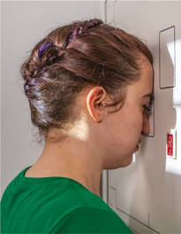
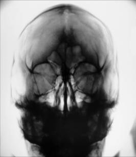
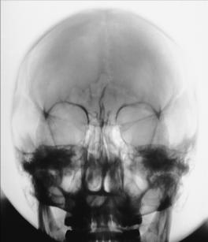

# Rx Craniu SERIES PA Axială (15° CR (Incidență Occipito-Frontală (Metoda Caldwell)) OR 25° TO 30° CR)

  📷 Radiografie Convențională (Rx)
  <strong>Actualizat:</strong> 2026-09-15
  <strong>Autor:</strong> Departamentul de Radiologie / Referință Bontrager

---

-   __1. Rezumat Clinic & Indicații__

    ---

    === "Indicații Clinice"

        - Craniu suspiciune de fractură, neoplastic processes, și Paget disease

    === "Ghid Național IRIS"

        !!! info "Referință Primară: Ghidul Național IRIS (Ordinul MS 1342/2012)"
            - **Capitol Ghid IRIS:** *Ghidul Național IRIS*
            - **Grad de Recomandare:** **De verificat pe indicație; fără grad atribuit automat**
            - **Nivel de Iradiere Estimată:** `De verificat pentru examinarea și populația selectate`

            [:octicons-search-16: Deschide Ghidul IRIS](../../iris.md){ .md-button .md-button--primary } [:material-open-in-new: Aplicația Oficială PWA](https://radiologie-pediatrica.ro/iris/){ .md-button target="_blank" rel="noopener" }
-   __2. Poziționare & Centrare Fascicul__

    ---

    - **Poziție Pacient:** Pacient: se îndepărtează toate obiectele radio-opace (metalice sau din plastic) de la pacient’s cap și neck. Take radiografie cu pacient în Ortostatism sau Decubit ventral poziție.; Regiune anatomică: Rest pacient’s nose și forehead against table/imaging device surface. Flex neck ca needed la align linie orbitomeatală (LOM) perpendicular pe receptorul de imagine. se aliniază MsP perpendicular pe receptorul de imagine (RI) la prevent rotație și/sau tilt. Se centrează receptorul de imagine pe raza centrală.
    - **Punct de Centrare Fascicul:** Raza centrală se înclină 15° caudal (spre picioare), și center la exit la nazion (Fig. 11.113). Alternative cu raza centrală 25° la 30° caudal, și center la exit la nazion.
    - **Distanță Focar-Film (DFF / SID):** 100 cm
    - **Comandă Respiratorie:** Apnee pe durata expunerii. Alternative 25° la 30° alternative incidență este a 25° la 30° caudal tube angle (Fig. 11.114) that allows better visualization de superior orbital fissures (black arrows), foramen rotundum (small white arrows) (see Fig. 11.114), și inferior orbital rim region. raza centrală exits la level de midorbit.

-   __3. Parametri Tehnici Expunere__

    ---

    | Parametru Tehnic | Valoare Configurare Generator / Tub |
    |:-----------------|:-------------------------------------|
    | **Tensiune Tub (kV)** | 75-85 kV |
    | **Sarcină / Produs Curent-Timp (mAs)** | DE CONFIGURAT PE APARAT |
    | **Distanță Focar-Film (DFF / SID)** | 100 cm |
    | **Grilă Antidifuzoare (Bucky)** | Cu grilă antidifuzoare Bucky |
    | **Dimensiune Focar** | Focar Mic (0.6 mm) |
    | **Camere de Ionizare AEC** | Camerele laterale (sau camera centrală funcție de regiune) |
    | **Colimare Fascicul** | Collimate pe four sides la anatomy de interest. |
    | **Filtrare Tub** | Totală ≥ 2.5 mm Al echivalent |

-   __4. Criterii de Calitate & Reușită Imagine__

    ---

    - Frontal bone, greater și lesser sphenoid wings, superior orbital fissures, frontal și anterior sinusuri etmoidale, supraorbital margins, și crista galli sunt evidențiat (Fig. 11.115). PA axial 25° la 30° caudal Angle
    - în addition la structures mentioned previously, foramen rotundum adjacent la fiecare IOM este visualized, și superior orbital fissures (see Fig. 11.114, white și black arrows) sunt visualized within Orbite. poziție:
    - Absența rotației anatomice: clavicule echidistante față de linia apofizelor spinoase ca assessed prin equal distance de la midlateral orbital margins la lateral cortex de Craniu pe fiecare side și superior orbital fissures simetric within Orbite.
    - Example: If distance între drept lateral orbit și lateral cranial cortex este greater than stâng side, fața este rotit spre drept side (side rotit spre receptorul de imagine este wider).
    - fără tilt cu MsP perpendicular pe receptorul de imagine. raza centrală angle și linie orbitomeatală (LOM) alignment will impact location de stânci temporale (piramide pietroase) within Orbite. PA axial 15° caudal Angle:
    - stânci temporale (piramide pietroase) sunt projected into lower onethird de Orbite.
    - Supraorbital margin este visualized fără superimposition de la stânci temporale (piramide pietroase). PA axial 25° la 30° caudal Angle:
    - stânci temporale (piramide pietroase) sunt projected la sau just below IOM la allow visualization de entire orbital base.
    - Collimation la aria de interes diagnostic. expunere:
    - optim receptorul de imagine expunere și contrast sunt sufficient la visualize frontal bone și sellar structures fără overexposure la perimeter regions de Craniu.
    - net bony margins indicate fără mișcare. Lambdoidal suture Supraorbital margin stânci temporale (piramide pietroase) Sagittal suture Sphenoid bone sinusuri etmoidale Infraorbital margin R Fig. 11.115 PA axial—15° caudal (Incidență Occipito-Frontală (Metoda Caldwell)).

-   __5. Protecție Radiologică (ALARA)__

    ---

    - Ecranare gonadică și a organelor radiosensibile conform procedurilor locale de radioprotecție ALARA.
    - Colimare strictă la aria de interes pentru limitarea radiației difuze.
    - Verificarea posibilității unei sarcini la pacientele de vârstă fertilă înainte de expunere.

!!! note "Observații Clinice & Tehnice"
    Decreased caudal angulation de raza centrală la 15° și/sau increased neck flexion (chin down) will result în incidență de stânci temporale (piramide pietroase) la lower third de Orbite. Alternative Incidență AP Axială pentru pacienți who sunt unable la fie poziționat pentru Incidență Postero-Anterioară (PA) (e.g., traumatism acuttism / Regim Urgență pacienți), Incidență AP Axială poate fie obtained cu use de a 15° cephalic angle, cu linie orbitomeatală (LOM) poziționat perpendicular pe receptorul de imagine (see Chapter 15). Fig. 11.114 Alternative PA axial—30° caudal. Fig. 11.113 PA axial—raza centrală 15° caudal, linie orbitomeatală (LOM) perpendicular; inset (solid arrow), și alternative raza centrală 30° caudal (dotted arrow). Craniu SERIES ROUTINE AP axial (Incidență AP Axială (Metoda Towne)) lateral PA axial 15° (Incidență Occipito-Frontală (Metoda Caldwell)) sau PA axial 25° la 30° PA

### 🖼️ Imagini

<figure class="protocol-image-card" markdown>

<figcaption><strong>Fig. 11.114 Alternative PA axial—30° caudal.</strong> — Poziționare pacient conform Ghidului Bontrager (Fig. 11.114 Alternative PA axial—30° caudal.)</figcaption>

</figure>

<figure class="protocol-image-card" markdown>

<figcaption><strong>Fig. 11.113 PA axial—raza centrală 15° caudal, linie orbitomeatală (LOM) perpendicular; inset (solid</strong> — Aspect radiografic de referință conform Ghidului Bontrager (Fig. 11.113 PA axial—raza centrală 15° caudal, linie orbitomeatală (LOM) perpendicular; inset (solid)</figcaption>

</figure>

<figure class="protocol-image-card" markdown>

<figcaption><strong>Fig. 11.115 PA axial—15° caudal (Incidență Occipito-Frontală (Metoda Caldwell)).</strong> — Aspect radiografic de referință conform Ghidului Bontrager (Fig. 11.115 PA axial—15° caudal (Caldwell method).)</figcaption>

</figure>

=== "Ghid Rapid de Execuție"

    1. **Identificarea și verificarea pacientului:** verificare identitate, zonă de examinat, consimțământ conform procedurii și evaluarea posibilității unei sarcini, când este relevantă.
    2. **Pregătire:** îndepărtarea oricăror obiecte radiopace (bijuterii, agrafe, fermoare, proteze, pansamente dense).
    3. **Poziționare precisă:** alinierea receptorului de imagine și a tubului la distanța prescrisă (100 cm).
    4. **Colimare strictă:** adaptarea fasciculului strict la regiunea de diagnostic pentru scăderea iradierii și reducerea radiației difuze.
    5. **Radioprotecție:** verificarea [politicii RX](../radioprotectie.md), cu măsuri distincte pentru pacient, personal și însoțitor.

## Surse de documentare

- [Bontrager's Textbook of Radiographic Positioning (Ed. 9/10), Pagina 439](https://www.elsevier.com/books/textbook-of-radiographic-positioning-and-related-anatomy/lampignano/978-0-323-65367-1)
