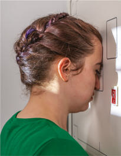
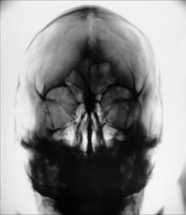
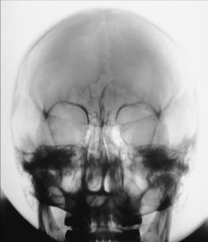

# Rx Craniu SERIE PA axială (15° CR (incidență occipito-frontală (metoda Caldwell)) SAU 25° LA 30° CR)

  📷 Radiografie Convențională (Rx)
  <strong>Actualizat:</strong> 2026-09-15
  <strong>Autor:</strong> Departamentul de Radiologie / Referință Bontrager

---

-   __1. Rezumat Clinic & Indicații__

    ---

    === "Indicații Clinice"

        - Craniu, suspiciune de fractură, procese neoplazice și boala Paget

    === "Ghid Național IRIS"

        !!! info "Referință Primară: Ghidul Național IRIS (Ordinul MS 1342/2012)"
            - **Capitol Ghid IRIS:** *Cap — ORL*
            - **Grad de Recomandare:** **Grad B**
            - **Nivel de Iradiere Estimată:** `Clasa 1 (Minimă < 0.1 mSv)`

            [:octicons-search-16: Deschide Ghidul IRIS](../../iris.md){ .md-button .md-button--primary } [:material-open-in-new: Aplicația Oficială PWA](https://radiologie-pediatrica.ro/iris/){ .md-button target="_blank" rel="noopener" }

-   __2. Poziționare & Centrare Fascicul__

    ---

    - **Poziție Pacient:** Pacient: Se îndepărtează toate obiectele radioopace (metalice sau din plastic) de pe capul și gâtul pacientului. Se efectuează radiografia cu pacientul în poziție de ortostatism sau decubit ventral.; Regiune anatomică: Pacientul își sprijină nasul și fruntea pe masa/suprafața dispozitivului de imagistică. Se flectează gâtul după necesitate pentru a alinia linia orbitomeatală (LOM) perpendicular pe receptorul de imagine. Se aliniază MSP perpendicular pe receptorul de imagine (RI) pentru a preveni rotația și/sau înclinarea. Se centrează receptorul de imagine pe raza centrală.
    - **Punct de Centrare Fascicul:** Raza centrală se înclină cu 15° caudal (spre picioare) și se centrează la punctul de ieșire la nivelul nazionului (Fig. 11.113). Alternativ, raza centrală se înclină cu 25° la 30° caudal și se centrează la punctul de ieșire la nivelul nazionului.
    - **Distanță Focar-Film (DFF / SID):** 100 cm
    - **Comandă Respiratorie:** Apnee pe durata expunerii. Incidența alternativă 25° la 30° este o angulație caudală a tubului de 25° la 30° (Fig. 11.114), care permite o vizualizare mai bună a fisurilor orbitare superioare (săgeți negre), foramen rotundum (săgeți albe mici) (vezi Fig. 11.114) și regiunii marginii orbitare inferioare. Raza centrală iese la nivelul mijlocului orbitei.

-   __3. Parametri Tehnici Expunere__

    ---

    | Parametru Tehnic | Valoare Configurare Generator / Tub |
    |:-----------------|:-------------------------------------|
    | **Tensiune Tub (kV)** | 75-85 kV |
    | **Sarcină / Produs Curent-Timp (mAs)** | DE CONFIGURAT PE APARAT |
    | **Distanță Focar-Film (DFF / SID)** | 100 cm |
    | **Grilă Antidifuzoare (Bucky)** | Cu grilă antidifuzoare Bucky |
    | **Dimensiune Focar** | Focar Mic (0.6 mm) |
    | **Camere de Ionizare AEC** | Camerele laterale (sau camera centrală, în funcție de regiune) |
    | **Colimare Fascicul** | Colimați pe cele patru laturi la anatomia de interes. |
    | **Filtrare Tub** | Totală ≥ 2.5 mm Al echivalent |

-   __4. Criterii de Calitate & Reușită Imagine__

    ---

    - Osul frontal, aripile sfenoidale mari și mici, fisurile orbitare superioare, sinusurile frontale și etmoidale anterioare, marginile supraorbitale și crista galli sunt evidențiate (Fig. 11.115). Unghi de 25° la 30° caudal pentru PA axială
    - În plus față de structurile menționate anterior, foramen rotundum adiacent fiecărei LIOM este vizualizat, iar fisurile orbitare superioare (vezi Fig. 11.114, săgețile albe și negre) sunt vizualizate în interiorul orbitelor. poziție:
    - Absența rotației anatomice: claviculele sunt echidistante față de linia apofizelor spinoase, evaluat prin distanța egală de la marginile orbitare midlaterale la corticala craniană laterală de fiecare parte, iar fisurile orbitare superioare sunt simetrice în orbite.
    - Exemplu: Dacă distanța dintre orbita laterală dreaptă și corticala craniană laterală este mai mare decât pe partea stângă, fața este rotită spre partea dreaptă (partea rotită spre receptorul de imagine este mai lată).
    - Fără înclinare, cu MSP perpendicular pe receptorul de imagine. Unghiul razei centrale și alinierea liniei orbitomeatale (LOM) vor influența localizarea stâncilor temporale (piramidelor pietroase) în orbite. Unghi de 15° caudal pentru PA axială:
    - Stâncile temporale (piramidele pietroase) sunt proiectate în treimea inferioară a orbitelor.
    - Marginea supraorbitală este vizualizată fără suprapunerea stâncilor temporale (piramidelor pietroase). Unghi de 25° la 30° caudal pentru PA axială:
    - Stâncile temporale (piramidele pietroase) sunt proiectate la nivelul LIOM sau imediat sub aceasta pentru a permite vizualizarea întregului planșeu orbital.
    - Colimare la aria de interes diagnostic. Expunere:
    - Expunerea și contrastul receptorului de imagine sunt suficiente pentru a vizualiza osul frontal și structurile șeii fără supraexpunerea regiunilor periferice ale craniului.
    - Marginile osoase nete indică absența mișcării. Sutura lambdoidă Marginea supraorbitală Stânci temporale (piramide pietroase) Sutura sagitală Os sfenoid Sinusuri etmoidale Marginea infraorbitală R Fig. 11.115 PA axială—15° caudal (incidență occipito-frontală (metoda Caldwell)).

-   __5. Protecție Radiologică (ALARA)__

    ---

    - Ecranare gonadică și a organelor radiosensibile conform procedurilor locale de radioprotecție ALARA.
    - Colimare strictă la aria de interes pentru limitarea radiației difuze.
    - Verificarea posibilității unei sarcini la pacientele de vârstă fertilă înainte de expunere.

!!! note "Observații Clinice & Tehnice"
    Reducerea angulației caudale a razei centrale la 15° și/sau creșterea flexiei gâtului (bărbia în jos) va avea ca rezultat proiectarea stâncilor temporale (piramidelor pietroase) în treimea inferioară a orbitelor. Incidență AP axială alternativă pentru pacienții care nu pot fi poziționați pentru incidența postero-anterioară (PA) (de exemplu, pacienți cu traumatism acut / în regim de urgență); incidența AP axială poate fi obținută utilizând un unghi cefalic de 15°, cu linia orbitomeatală (LOM) poziționată perpendicular pe receptorul de imagine (vezi Capitolul 15). Fig. 11.114 PA axială alternativă—30° caudal. Fig. 11.113 PA axială—raza centrală 15° caudal, linia orbitomeatală (LOM) perpendiculară; inserție (săgeată continuă) și raza centrală alternativă 30° caudal (săgeată punctată). Craniu SERIE DE RUTINĂ AP axială (incidență AP axială (metoda Towne)) laterală PA axială 15° (incidență occipito-frontală (metoda Caldwell)) sau PA axială 25° la 30° PA

### 🖼️ Imagini

<figure class="protocol-image-card" markdown>

<figcaption><strong>Fig. 11.114 PA axială alternativă—30° caudal.</strong> — Poziționarea pacientului conform Ghidului Bontrager (Fig. 11.114 PA axială alternativă—30° caudal.)</figcaption>

</figure>

<figure class="protocol-image-card" markdown>

<figcaption><strong>Fig. 11.113 PA axială—raza centrală 15° caudal, linia orbitomeatală (LOM) perpendiculară; inserție (săgeată continuă)</strong> — Aspect radiografic de referință conform Ghidului Bontrager (Fig. 11.113 PA axială—raza centrală 15° caudal, linia orbitomeatală (LOM) perpendiculară; inserție (săgeată continuă)</figcaption>

</figure>

<figure class="protocol-image-card" markdown>

<figcaption><strong>Fig. 11.115 PA axială—15° caudal (incidență occipito-frontală (metoda Caldwell)).</strong> — Aspect radiografic de referință conform Ghidului Bontrager (Fig. 11.115 PA axială—15° caudal (metoda Caldwell).)</figcaption>

</figure>

=== "Ghid Rapid de Execuție"

    1. **Identificarea și verificarea pacientului:** verificare identitate, zonă de examinat, consimțământ conform procedurii și evaluarea posibilității unei sarcini, când este relevantă.
    2. **Pregătire:** îndepărtarea oricăror obiecte radiopace (bijuterii, agrafe, fermoare, proteze, pansamente dense).
    3. **Poziționare precisă:** alinierea receptorului de imagine și a tubului la distanța prescrisă (100 cm).
    4. **Colimare strictă:** adaptarea fasciculului strict la regiunea de diagnostic pentru scăderea iradierii și reducerea radiației difuze.
    5. **Radioprotecție:** verificarea [politicii RX](../radioprotectie.md), cu măsuri distincte pentru pacient, personal și însoțitor.

## Surse de documentare

- [Bontrager's Textbook of Radiographic Positioning (Ed. 9/10), Pagina 439](https://www.elsevier.com/books/textbook-of-radiographic-positioning-and-related-anatomy/lampignano/978-0-323-65367-1)
