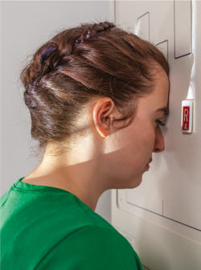
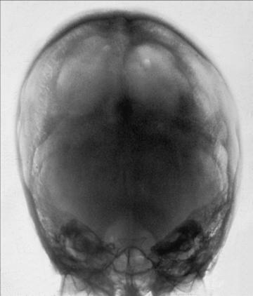

# Rx Craniu SERIE PA axială (metoda Haas)

  📷 Radiografie Convențională (Rx)
  <strong>Actualizat:</strong> 2026-09-15
  <strong>Autor:</strong> Departamentul de Radiologie / Referință Bontrager

---

-   __1. Rezumat Clinic & Indicații__

    ---

    === "Indicații Clinice"

        - Craniu: suspiciune de fractură (deplasare medială și laterală), procese neoplazice și boala Paget. Aceasta este o incidență alternativă pentru pacienții care nu pot flecta suficient gâtul pentru incidența AP axială (incidența AP axială (metoda Towne)). Poate fi efectuată și la pacienții hipersthenici și bariatrici cu amplitudine limitată a mișcărilor cervicale. Produce mărirea regiunii occipitale, dar doze mai mici la nivelul structurilor faciale și glandei tiroide. Această incidență nu este recomandată când osul occipital este aria de interes diagnostic, din cauza măririi excesive.

    === "Ghid Național IRIS"

        !!! info "Referință Primară: Ghidul Național IRIS (Ordinul MS 1342/2012)"
            - **Capitol Ghid IRIS:** *Traumatisme — Față și orbite*
            - **Grad de Recomandare:** **Grad B**
            - **Nivel de Iradiere Estimată:** `Clasa 1 (Minimă < 0.2 mSv)`

            [:octicons-search-16: Deschide Ghidul IRIS](../../iris.md){ .md-button .md-button--primary } [:material-open-in-new: Aplicația Oficială PWA](https://radiologie-pediatrica.ro/iris/){ .md-button target="_blank" rel="noopener" }

-   __2. Poziționare & Centrare Fascicul__

    ---

    - **Poziție Pacient:** Pacient: se îndepărtează toate obiectele radioopace (metalice sau din plastic) de la nivelul capului și gâtului pacientului. Se efectuează radiografia cu pacientul în ortostatism sau în decubit ventral. Regiune anatomică: pacientul își sprijină nasul și fruntea pe suprafața mesei/dispozitivului de imagistică. Se flectează gâtul, aducând linia orbitomeatală (LOM) perpendicular pe receptorul de imagine (Fig. 11.122). Se aliniază MSP cu raza centrală și cu linia mediană a grilei sau a suprafeței mesei/dispozitivului de imagistică. Se verifică absența rotației anatomice: claviculele sunt echidistante față de linia apofizelor spinoase; nu există înclinare (MSP perpendicular pe receptorul de imagine).
    - **Punct de Centrare Fascicul:** Raza centrală se înclină cu 25° cranial (spre cap) față de linia orbitomeatală (LOM). Se centrează raza centrală la MSP și la 1½ țoli (4 cm) inferior față de inion și se proiectează la 1½ țoli (4 cm) superior față de nazion. Se centrează receptorul de imagine pe proiecția razei centrale.
    - **Distanță Focar-Film (DFF / SID):** 100 cm
    - **Comandă Respiratorie:** Apnee pe durata expunerii. Fig. 11.122 PA axială—raza centrală 25° cranial față de linia orbitomeatală (LOM), ortostatism și decubit ventral (inserție). Craniu SERIE SPECIALĂ SMV PA axială (metoda Haas)

-   __3. Parametri Tehnici Expunere__

    ---

    | Parametru Tehnic | Valoare Configurare Generator / Tub |
    |:-----------------|:-------------------------------------|
    | **Tensiune Tub (kV)** | 75-90 kV |
    | **Sarcină / Produs Curent-Timp (mAs)** | DE CONFIGURAT PE APARAT |
    | **Distanță Focar-Film (DFF / SID)** | 100 cm |
    | **Grilă Antidifuzoare (Bucky)** | Cu grilă antidifuzoare Bucky |
    | **Dimensiune Focar** | Focar Mare (1.0 - 1.2 mm) |
    | **Camere de Ionizare AEC** | Camerele laterale (sau camera centrală, în funcție de regiune) |
    | **Colimare Fascicul** | Colimați pe cele patru laturi la anatomia de interes. |
    | **Filtrare Tub** | Totală ≥ 2.5 mm Al echivalent |

-   __4. Criterii de Calitate & Reușită Imagine__

    ---

    - Osul occipital, stâncile temporale (piramidele pietroase) și gaura occipitală mare (foramen magnum) sunt evidențiate, cu dorsum sellae și procesele clinoide posterioare vizualizate în umbra găurii occipitale mari (foramen magnum) (Fig. 11.123 și 11.124). Poziție:
    - Absența rotației anatomice: claviculele echidistante față de linia apofizelor spinoase sunt evidente, după cum indică stâncile temporale (piramidele pietroase) bilaterale simetrice.
    - Dorsum sellae și procesele clinoide posterioare sunt vizualizate în gaura occipitală mare (foramen magnum), ceea ce indică un unghi corect al razei centrale și o flexie și extensie corecte ale gâtului.
    - Fără înclinare, după cum indică poziționarea corectă a proceselor clinoide anterioare în porțiunea mijlocie a găurii occipitale mari (foramen magnum).
    - Colimare la aria de interes diagnostic. Expunere:
    - Expunerea și contrastul receptorului de imagine sunt suficiente pentru a vizualiza osul occipital și structurile șeii în interiorul găurii occipitale mari (foramen magnum).
    - Marginile osoase nete indică absența mișcării. L Fig. 11.123 PA axial. Mastoide L stânci temporale (piramide pietroase) Dorsum sellae procese clinoide posterioare gaură occipitală mare (foramen magnum) Fig. 11.124 PA axial. 24 30 R

-   __5. Protecție Radiologică (ALARA)__

    ---

    - Ecranare gonadică și a organelor radiosensibile conform procedurilor locale de radioprotecție ALARA.
    - Colimare strictă la aria de interes pentru limitarea radiației difuze.
    - Verificarea posibilității unei sarcini la pacientele de vârstă fertilă înainte de expunere.

### 🖼️ Imagini

<figure class="protocol-image-card" markdown>

<figcaption><strong>Fig. 11.122 PA axială—raza centrală la 25° cranial față de linia orbitomeatală (LOM), în ortostatism și în decubit ventral</strong> — Poziționarea pacientului conform Ghidului Bontrager (Fig. 11.122 PA axială—raza centrală la 25° cranial față de linia orbitomeatală (LOM), în ortostatism și în decubit ventral)</figcaption>

</figure>

<figure class="protocol-image-card" markdown>

<figcaption><strong>Fig. 11.123 PA axială.</strong> — Aspect radiografic de referință conform Ghidului Bontrager (Fig. 11.123 PA axială.)</figcaption>

</figure>

<figure class="protocol-image-card" markdown>

<figcaption><strong>Fig. 11.124 PA axială.</strong> — Aspect radiografic de referință conform Ghidului Bontrager (Fig. 11.124 PA axială.)</figcaption>

</figure>

=== "Ghid Rapid de Execuție"

    1. **Identificarea și verificarea pacientului:** verificare identitate, zonă de examinat, consimțământ conform procedurii și evaluarea posibilității unei sarcini, când este relevantă.
    2. **Pregătire:** îndepărtarea oricăror obiecte radiopace (bijuterii, agrafe, fermoare, proteze, pansamente dense).
    3. **Poziționare precisă:** alinierea receptorului de imagine și a tubului la distanța prescrisă (100 cm).
    4. **Colimare strictă:** adaptarea fasciculului strict la regiunea de diagnostic pentru scăderea iradierii și reducerea radiației difuze.
    5. **Radioprotecție:** verificarea [politicii RX](../radioprotectie.md), cu măsuri distincte pentru pacient, personal și însoțitor.

## Surse de documentare

- [Bontrager's Textbook of Radiographic Positioning (Ed. 9/10), Pagina 442](https://www.elsevier.com/books/textbook-of-radiographic-positioning-and-related-anatomy/lampignano/978-0-323-65367-1)
