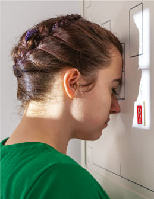
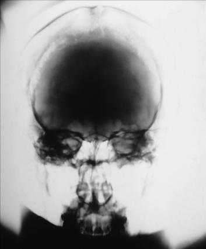

# Rx Craniu SERIES PA (Postero-Anterior)

  📷 Radiografie Convențională (Rx)
  <strong>Actualizat:</strong> 2026-09-15
  <strong>Autor:</strong> Departamentul de Radiologie / Referință Bontrager

---

-   __1. Rezumat Clinic & Indicații__

    ---

    === "Indicații Clinice"

        - Craniu suspiciune de fractură (medial și lateral displacement), neoplastic processes, și Paget disease. This incidență este intended la evidențiază frontal bone cu minimal distortion.

    === "Ghid Național IRIS"

        !!! info "Referință Primară: Ghidul Național IRIS (Ordinul MS 1342/2012)"
            - **Capitol Ghid IRIS:** *Ghidul Național IRIS*
            - **Grad de Recomandare:** **De verificat pe indicație; fără grad atribuit automat**
            - **Nivel de Iradiere Estimată:** `De verificat pentru examinarea și populația selectate`

            [:octicons-search-16: Deschide Ghidul IRIS](../../iris.md){ .md-button .md-button--primary } [:material-open-in-new: Aplicația Oficială PWA](https://radiologie-pediatrica.ro/iris/){ .md-button target="_blank" rel="noopener" }
-   __2. Poziționare & Centrare Fascicul__

    ---

    - **Poziție Pacient:** Pacient: se îndepărtează toate obiectele radio-opace (metalice sau din plastic) de la pacient’s cap și neck. expunere este taken cu pacient în Ortostatism sau Decubit ventral poziție.; Regiune anatomică: Rest pacient’s nose și forehead against table/imaging surface. Flex neck, aligning linie orbitomeatală (LOM) perpendicular pe receptorul de imagine. Align MsP perpendicular la linia mediană mesei/imaging device la prevent cap rotație sau tilt (conduct auditiv extern (CAE) same distance de la table/ imaging device surface). Se centrează receptorul de imagine pe raza centrală.
    - **Punct de Centrare Fascicul:** este perpendicular pe receptorul de imagine (paralel la linie orbitomeatală (LOM)) și este centrat pe exit la glabelă (Fig. 11.116).
    - **Distanță Focar-Film (DFF / SID):** 100 cm
    - **Comandă Respiratorie:** Apnee pe durata expunerii. Fig. 11.116 PA Craniu - Ortostatism și Decubit ventral (inset). Crista galli sinusuri maxilare posterior clinoid Frontal bone stânci temporale (piramide pietroase) oblic orbital line anterior clinoid Fig. 11.118 PA Craniu. Fig. 11.117 PA Craniu.

-   __3. Parametri Tehnici Expunere__

    ---

    | Parametru Tehnic | Valoare Configurare Generator / Tub |
    |:-----------------|:-------------------------------------|
    | **Tensiune Tub (kV)** | 75-85 kV |
    | **Sarcină / Produs Curent-Timp (mAs)** | DE CONFIGURAT PE APARAT |
    | **Distanță Focar-Film (DFF / SID)** | 100 cm |
    | **Grilă Antidifuzoare (Bucky)** | Cu grilă antidifuzoare Bucky |
    | **Dimensiune Focar** | Focar Mic (0.6 mm) |
    | **Camere de Ionizare AEC** | Camerele laterale (sau camera centrală funcție de regiune) |
    | **Colimare Fascicul** | Collimate pe four sides la anatomy de interest. |
    | **Filtrare Tub** | Totală ≥ 2.5 mm Al echivalent |

-   __4. Criterii de Calitate & Reușită Imagine__

    ---

    - Frontal bone, crista galli, intern auditory canals, frontal și anterior sinusuri etmoidale, stânci temporale (piramide pietroase), greater și lesser wings de sphenoid, și dorsum sellae sunt evidențiat (Figs. 11.117 și 11.118). poziție:
    - Absența rotației anatomice: clavicule echidistante față de linia apofizelor spinoase este evident, ca indicated prin equal distance bilaterally de la lateral orbital margin la lateral cortex de Craniu (side rotit spre receptorul de imagine will appear wider).
    - Petrous portion de temporal bone fills Orbite cu stânci temporale (piramide pietroase) la nivelul supraorbital margin.
    - posterior și anterior clinoid processes sunt visualized just superior la sinusuri etmoidale.
    - Collimation la aria de interes diagnostic. expunere:
    - optim receptorul de imagine expunere și contrast sunt sufficient la visualize frontal bone și surrounding bony structures.
    - net bony margins indicate fără mișcare. Craniu SERIES ROUTINE
    - AP axial (Incidență AP Axială (Metoda Towne))
    - lateral
    - PA axial 15° (Incidență Occipito-Frontală (Metoda Caldwell)) sau PA axial 25° la 30°
    - PA

-   __5. Protecție Radiologică (ALARA)__

    ---

    - Ecranare gonadică și a organelor radiosensibile conform procedurilor locale de radioprotecție ALARA.
    - Colimare strictă la aria de interes pentru limitarea radiației difuze.
    - Verificarea posibilității unei sarcini la pacientele de vârstă fertilă înainte de expunere.

### 🖼️ Imagini

<figure class="protocol-image-card" markdown>

<figcaption><strong>Fig. 11.116 PA Craniu -</strong> — Poziționare pacient conform Ghidului Bontrager (Fig. 11.116 PA skull -)</figcaption>

</figure>

<figure class="protocol-image-card" markdown>

<figcaption><strong>Fig. 11.118 PA Craniu.</strong> — Aspect radiografic de referință conform Ghidului Bontrager (Fig. 11.118 PA skull.)</figcaption>

</figure>

<figure class="protocol-image-card" markdown>

<figcaption><strong>Fig. 11.117 PA Craniu.</strong> — Aspect radiografic de referință conform Ghidului Bontrager (Fig. 11.117 PA skull.)</figcaption>

</figure>

<figure class="protocol-image-card" markdown>

<figcaption><strong>Figura 4</strong> — Aspect radiografic de referință conform Ghidului Bontrager (Figura 4)</figcaption>

</figure>

=== "Ghid Rapid de Execuție"

    1. **Identificarea și verificarea pacientului:** verificare identitate, zonă de examinat, consimțământ conform procedurii și evaluarea posibilității unei sarcini, când este relevantă.
    2. **Pregătire:** îndepărtarea oricăror obiecte radiopace (bijuterii, agrafe, fermoare, proteze, pansamente dense).
    3. **Poziționare precisă:** alinierea receptorului de imagine și a tubului la distanța prescrisă (100 cm).
    4. **Colimare strictă:** adaptarea fasciculului strict la regiunea de diagnostic pentru scăderea iradierii și reducerea radiației difuze.
    5. **Radioprotecție:** verificarea [politicii RX](../radioprotectie.md), cu măsuri distincte pentru pacient, personal și însoțitor.

## Surse de documentare

- [Bontrager's Textbook of Radiographic Positioning (Ed. 9/10), Pagina 440](https://www.elsevier.com/books/textbook-of-radiographic-positioning-and-related-anatomy/lampignano/978-0-323-65367-1)
