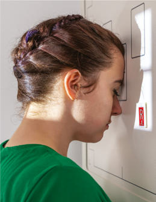
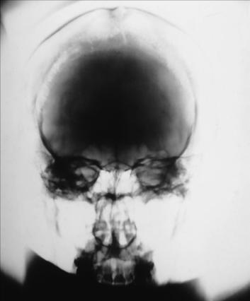

# Rx Craniu SERIE PA (postero-anterioară)

  📷 Radiografie Convențională (Rx)
  <strong>Actualizat:</strong> 2026-09-15
  <strong>Autor:</strong> Departamentul de Radiologie / Referință Bontrager

---

-   __1. Rezumat Clinic & Indicații__

    ---

    === "Indicații Clinice"

        - Craniu: suspiciune de fractură (deplasare medială și laterală), procese neoplazice și boala Paget. Această incidență este destinată evidențierii osului frontal cu distorsiune minimă.

    === "Ghid Național IRIS"

        !!! info "Referință Primară: Ghidul Național IRIS (Ordinul MS 1342/2012)"
            - **Capitol Ghid IRIS:** *Traumatisme — Față și orbite*
            - **Grad de Recomandare:** **Grad B**
            - **Nivel de Iradiere Estimată:** `Clasa 1 (Minimă < 0.2 mSv)`

            [:octicons-search-16: Deschide Ghidul IRIS](../../iris.md){ .md-button .md-button--primary } [:material-open-in-new: Aplicația Oficială PWA](https://radiologie-pediatrica.ro/iris/){ .md-button target="_blank" rel="noopener" }

-   __2. Poziționare & Centrare Fascicul__

    ---

    - **Poziție Pacient:** Pacient: se îndepărtează toate obiectele radioopace (metalice sau din plastic) de la nivelul capului și gâtului pacientului. Expunerea se efectuează cu pacientul în ortostatism sau în decubit ventral. Regiune anatomică: pacientul își sprijină nasul și fruntea pe suprafața mesei/dispozitivului de imagistică. Se flectează gâtul, aliniind linia orbitomeatală (LOM) perpendicular pe receptorul de imagine. Se aliniază MSP perpendicular pe linia mediană a mesei/dispozitivului de imagistică pentru a preveni rotația sau înclinarea capului (conductul auditiv extern (CAE) la aceeași distanță față de suprafața mesei/dispozitivului de imagistică). Se centrează receptorul de imagine pe raza centrală.
    - **Punct de Centrare Fascicul:** Este perpendicular pe receptorul de imagine (paralel cu linia orbitomeatală (LOM)) și este centrat la ieșire la nivelul glabelei (Fig. 11.116).
    - **Distanță Focar-Film (DFF / SID):** 100 cm
    - **Comandă Respiratorie:** Apnee pe durata expunerii. Fig. 11.116 PA craniu - ortostatism și decubit ventral (detaliu). Crista galli sinusuri maxilare procese clinoide posterioare os frontal stânci temporale (piramide pietroase) linie orbitală oblică proces clinoid anterior Fig. 11.118 PA craniu. Fig. 11.117 PA craniu.

-   __3. Parametri Tehnici Expunere__

    ---

    | Parametru Tehnic | Valoare Configurare Generator / Tub |
    |:-----------------|:-------------------------------------|
    | **Tensiune Tub (kV)** | 75-85 kV |
    | **Sarcină / Produs Curent-Timp (mAs)** | DE CONFIGURAT PE APARAT |
    | **Distanță Focar-Film (DFF / SID)** | 100 cm |
    | **Grilă Antidifuzoare (Bucky)** | Cu grilă antidifuzoare Bucky |
    | **Dimensiune Focar** | Focar Mic (0.6 mm) |
    | **Camere de Ionizare AEC** | Camerele laterale (sau camera centrală, în funcție de regiune) |
    | **Colimare Fascicul** | Colimați pe cele patru laturi la anatomia de interes. |
    | **Filtrare Tub** | Totală ≥ 2.5 mm Al echivalent |

-   __4. Criterii de Calitate & Reușită Imagine__

    ---

    - Osul frontal, crista galli, conductele auditive interne, sinusurile frontale și etmoidale anterioare, stâncile temporale (piramidele pietroase), aripile mare și mică ale sfenoidului și dorsum sellae sunt evidențiate (Fig. 11.117 și 11.118). Poziție:
    - Absența rotației anatomice: claviculele echidistante față de linia apofizelor spinoase sunt evidente, după cum indică distanța egală bilateral de la marginea orbitală laterală la cortexul lateral al craniului (partea rotită spre receptorul de imagine va apărea mai largă).
    - Porțiunea pietroasă a osului temporal umple orbitele, cu stâncile temporale (piramidele pietroase) la nivelul marginii supraorbitale.
    - Procesele clinoide posterioare și anterioare sunt vizualizate imediat superior sinusurilor etmoidale.
    - Colimare la aria de interes diagnostic. Expunere:
    - Expunerea și contrastul optime ale receptorului de imagine sunt suficiente pentru vizualizarea osului frontal și a structurilor osoase înconjurătoare.
    - Marginile osoase nete indică absența mișcării. Craniu SERIE DE RUTINĂ
    - AP axială (incidență AP axială (metoda Towne))
    - laterală
    - PA axială 15° (incidență occipito-frontală (metoda Caldwell)) sau PA axială 25° la 30°
    - PA

-   __5. Protecție Radiologică (ALARA)__

    ---

    - Ecranare gonadică și a organelor radiosensibile conform procedurilor locale de radioprotecție ALARA.
    - Colimare strictă la aria de interes pentru limitarea radiației difuze.
    - Verificarea posibilității unei sarcini la pacientele de vârstă fertilă înainte de expunere.

### 🖼️ Imagini

<figure class="protocol-image-card" markdown>

<figcaption><strong>Fig. 11.116 PA craniu -</strong> — Poziționarea pacientului conform Ghidului Bontrager (Fig. 11.116 PA craniu -)</figcaption>

</figure>

<figure class="protocol-image-card" markdown>

<figcaption><strong>Fig. 11.118 PA craniu.</strong> — Aspect radiografic de referință conform Ghidului Bontrager (Fig. 11.118 PA craniu.)</figcaption>

</figure>

<figure class="protocol-image-card" markdown>

<figcaption><strong>Fig. 11.117 PA craniu.</strong> — Aspect radiografic de referință conform Ghidului Bontrager (Fig. 11.117 PA craniu.)</figcaption>

</figure>

<figure class="protocol-image-card" markdown>

<figcaption><strong>Figura 4</strong> — Aspect radiografic de referință conform Ghidului Bontrager (Figura 4)</figcaption>

</figure>

=== "Ghid Rapid de Execuție"

    1. **Identificarea și verificarea pacientului:** verificare identitate, zonă de examinat, consimțământ conform procedurii și evaluarea posibilității unei sarcini, când este relevantă.
    2. **Pregătire:** îndepărtarea oricăror obiecte radiopace (bijuterii, agrafe, fermoare, proteze, pansamente dense).
    3. **Poziționare precisă:** alinierea receptorului de imagine și a tubului la distanța prescrisă (100 cm).
    4. **Colimare strictă:** adaptarea fasciculului strict la regiunea de diagnostic pentru scăderea iradierii și reducerea radiației difuze.
    5. **Radioprotecție:** verificarea [politicii RX](../radioprotectie.md), cu măsuri distincte pentru pacient, personal și însoțitor.

## Surse de documentare

- [Bontrager's Textbook of Radiographic Positioning (Ed. 9/10), Pagina 440](https://www.elsevier.com/books/textbook-of-radiographic-positioning-and-related-anatomy/lampignano/978-0-323-65367-1)
