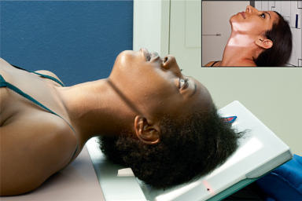
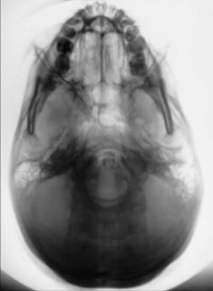

# Rx Craniu SERIE SUBMENTOVERTICALĂ (SMV), incidență

  📷 Radiografie Convențională (Rx)
  <strong>Actualizat:</strong> 2026-09-15
  <strong>Autor:</strong> Departamentul de Radiologie / Referință Bontrager

---

-   __1. Rezumat Clinic & Indicații__

    ---

    === "Indicații Clinice"

        - Patologie osoasă avansată a structurilor osoase temporale interne (baza craniului)
        - Posibilă suspiciune de fractură bazală a craniului

    === "Ghid Național IRIS"

        !!! info "Referință Primară: Ghidul Național IRIS (Ordinul MS 1342/2012)"
            - **Capitol Ghid IRIS:** *Ghidul Național IRIS*
            - **Grad de Recomandare:** **De verificat pe indicație; fără grad atribuit automat**
            - **Nivel de Iradiere Estimată:** `De verificat pentru examinarea și populația selectate`

            [:octicons-search-16: Deschide Ghidul IRIS](../../iris.md){ .md-button .md-button--primary } [:material-open-in-new: Aplicația Oficială PWA](https://radiologie-pediatrica.ro/iris/){ .md-button target="_blank" rel="noopener" }
-   __2. Poziționare & Centrare Fascicul__

    ---

    - **Poziție Pacient:** Pacient: se îndepărtează toate obiectele metalice, din plastic și alte obiecte detașabile de la nivelul capului pacientului. Se efectuează radiografia cu pacientul în ortostatism sau în decubit dorsal. Poziția în ortostatism este recomandată folosind masa de ortostatism sau dispozitivul de imagistică pentru ortostatism (Fig. 11.119, detaliu). Se poate folosi și un scaun rulant. Scaunul rulant oferă sprijin pentru spate și asigură o stabilitate mai mare la menținerea poziției. (Asigurați-vă că roțile sunt blocate înainte de poziționarea pacientului.) Regiune anatomică: se ridică bărbia pacientului și se hiperextinde gâtul, dacă este posibil, până când linia infraorbitomeatală (LIOM) este paralelă cu receptorul de imagine (a se vedea NOTA). Capul pacientului se sprijină pe vertex. Se aliniază MSP perpendicular pe linia mediană a grilei sau a suprafeței mesei/dispozitivului de imagistică, evitând înclinarea sau rotația. Decubit dorsal: cu pacientul în decubit dorsal, se extinde capul pacientului peste capătul mesei și se sprijină caseta cu grilă antidifuzoare și capul, după cum este prezentat în Fig. 11.119, menținând linia infraorbitomeatală (LIOM) paralelă cu receptorul de imagine și perpendiculară pe raza centrală. Se plasează un burete/o pernă de poziționare sub spatele pacientului pentru susținerea extensiei gâtului. Ortostatism: dacă pacientul nu poate extinde suficient gâtul, se compensează prin angularea razei centrale pentru a rămâne perpendiculară pe linia infraorbitomeatală (LIOM). În funcție de echipamentul utilizat, receptorul de imagine poate fi și înclinat pentru a menține relația perpendiculară cu raza centrală (de exemplu, cu un dispozitiv de imagistică reglabil pentru ortostatism).
    - **Punct de Centrare Fascicul:** Este perpendicular pe linia infraorbitomeatală (LIOM) (linia infraorbitomeatală (LIOM)). Se centrează la 1½ inch (4 cm) inferior față de simfiza mandibulară sau la jumătatea distanței dintre gonioane (aproximativ ¾ inch [2 cm] anterior față de nivelul conductului auditiv extern (CAE)). Se centrează receptorul de imagine pe raza centrală.
    - **Distanță Focar-Film (DFF / SID):** 100 cm
    - **Comandă Respiratorie:** Apnee pe durata expunerii. Fig. 11.119 SMV la masă, cu casetă cu grilă antidifuzoare (detaliul evidențiază utilizarea dispozitivului de imagistică în ortostatism). Raza centrală perpendiculară pe linia infraorbitomeatală (LIOM). Craniu SERIE SPECIALĂ SMV

-   __3. Parametri Tehnici Expunere__

    ---

    | Parametru Tehnic | Valoare Configurare Generator / Tub |
    |:-----------------|:-------------------------------------|
    | **Tensiune Tub (kV)** | 75-85 kV |
    | **Sarcină / Produs Curent-Timp (mAs)** | DE CONFIGURAT PE APARAT |
    | **Distanță Focar-Film (DFF / SID)** | 100 cm |
    | **Grilă Antidifuzoare (Bucky)** | Cu grilă antidifuzoare Bucky |
    | **Dimensiune Focar** | Focar Mic (0.6 mm) |
    | **Camere de Ionizare AEC** | Camerele laterale (sau camera centrală, în funcție de regiune) |
    | **Colimare Fascicul** | Colimați pe cele patru laturi la anatomia de interes. |
    | **Filtrare Tub** | Totală ≥ 2.5 mm Al echivalent |

-   __4. Criterii de Calitate & Reușită Imagine__

    ---

    - Foramen ovale și spinosum, mandibula, sfenoidul și sinusurile etmoidale posterioare, procesele mastoide, stâncile temporale (piramidele pietroase), palatul dur, gaura occipitală mare (foramen magnum) și osul occipital sunt evidențiate (Fig. 11.120 și 11.121). Poziție:
    - Extensia corectă a gâtului și relația dintre linia infraorbitomeatală (LIOM) și raza centrală, după cum indică mentumul mandibular anterior față de sinusurile etmoidale.
    - Absența rotației anatomice: claviculele echidistante față de linia apofizelor spinoase sunt evidențiate prin MSP paralel cu marginea receptorului de imagine.
    - Fără înclinare, după cum indică distanța egală dintre ramurile mandibulei și cortexul cranian lateral.
    - Exemplu: dacă distanța pe partea stângă dintre ramură și craniu lateral este mai mare pe stânga decât pe dreapta, vertexul cranian este înclinat spre stânga.
    - Colimare la aria de interes diagnostic. Expunere:
    - Expunerea și contrastul optime ale receptorului de imagine sunt suficiente pentru a vizualiza clar conturul sinusurilor etmoidale și sfenoidale și al orificiilor craniene.
    - Marginile osoase nete indică absența mișcării. Sfenoid și sinusuri etmoidale Os occipital R proces mastoidian condil mandibular Foramen ovale și spinosum gaură occipitală mare (foramen magnum) Mentum stânci temporale (piramide pietroase) Fig. 11.121 SMV. R Fig. 11.120 SMV.

-   __5. Protecție Radiologică (ALARA)__

    ---

    - Ecranare gonadică și a organelor radiosensibile conform procedurilor locale de radioprotecție ALARA.
    - Colimare strictă la aria de interes pentru limitarea radiației difuze.
    - Verificarea posibilității unei sarcini la pacientele de vârstă fertilă înainte de expunere.

!!! note "Observații Clinice & Tehnice"
    Această poziție este incomodă pentru pacienții în ortostatism sau decubit dorsal; efectuați-o cât mai rapid posibil.

### 🖼️ Imagini

<figure class="protocol-image-card" markdown>

<figcaption><strong>Fig. 11.119 SMV la masă, cu casetă cu grilă antidifuzoare (detaliul evidențiază utilizarea</strong> — Poziționarea pacientului conform Ghidului Bontrager (Fig. 11.119 SMV la masă, cu casetă cu grilă antidifuzoare (detaliul evidențiază utilizarea)</figcaption>

</figure>

<figure class="protocol-image-card" markdown>

<figcaption><strong>Fig. 11.121 SMV.</strong> — Aspect radiografic de referință conform Ghidului Bontrager (Fig. 11.121 SMV.)</figcaption>

</figure>

<figure class="protocol-image-card" markdown>

<figcaption><strong>Fig. 11.120 SMV.</strong> — Aspect radiografic de referință conform Ghidului Bontrager (Fig. 11.120 SMV.)</figcaption>

</figure>

=== "Ghid Rapid de Execuție"

    1. **Identificarea și verificarea pacientului:** verificare identitate, zonă de examinat, consimțământ conform procedurii și evaluarea posibilității unei sarcini, când este relevantă.
    2. **Pregătire:** îndepărtarea oricăror obiecte radiopace (bijuterii, agrafe, fermoare, proteze, pansamente dense).
    3. **Poziționare precisă:** alinierea receptorului de imagine și a tubului la distanța prescrisă (100 cm).
    4. **Colimare strictă:** adaptarea fasciculului strict la regiunea de diagnostic pentru scăderea iradierii și reducerea radiației difuze.
    5. **Radioprotecție:** verificarea [politicii RX](../radioprotectie.md), cu măsuri distincte pentru pacient, personal și însoțitor.

## Surse de documentare

- [Bontrager's Textbook of Radiographic Positioning (Ed. 9/10), Pagina 441](https://www.elsevier.com/books/textbook-of-radiographic-positioning-and-related-anatomy/lampignano/978-0-323-65367-1)
