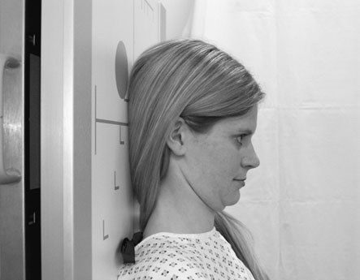
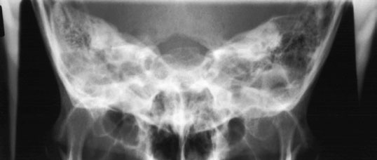
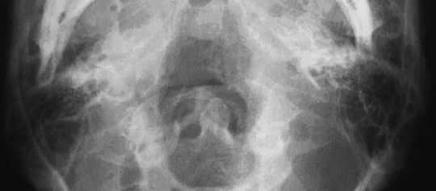
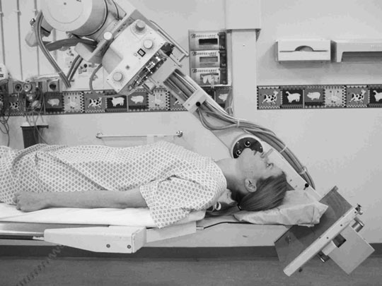

# Rx Craniu Temporal bones

  📷 Radiografie Convențională (Rx)
  <strong>Actualizat:</strong> 2026-09-16
  <strong>Autor:</strong> Departamentul de Radiologie / Referință Clark (Ed. 12)

---

-   __1. Rezumat Clinic & Indicații__

    ---

    === "Indicații Clinice"

        - 8 250 Craniu Temporal bones These incidențe sunt traditionally difficult la perform. They sunt also difficult la interpret, especially if examination este nu de highest quality. Modern CT cu direct coronal imaging affords exquisite demonstration de temporal bone detail și has largely obviated need pentru these incidențe. Frontal-occipital 35 grade caudal 251 8 Craniu Frontal-occipital 35 grade caudal

    === "Ghid Național IRIS"

        !!! info "Referință Primară: Ghidul Național IRIS (Ordinul MS 1342/2012)"
            - **Capitol Ghid IRIS:** *Ghidul Național IRIS*
            - **Grad de Recomandare:** **De verificat pe indicație; fără grad atribuit automat**
            - **Nivel de Iradiere Estimată:** `De verificat pentru examinarea și populația selectate`

            [:octicons-search-16: Deschide Ghidul IRIS](../../iris.md){ .md-button .md-button--primary } [:material-open-in-new: Aplicația Oficială PWA](https://radiologie-pediatrica.ro/iris/){ .md-button target="_blank" rel="noopener" }
-   __2. Poziționare & Centrare Fascicul__

    ---

    - **Poziție Pacient:** • pacientul poate fie Decubit dorsal în linia mediană mesei sau Ortostatism cu their back la Ortostatism Bucky.
• capul este ajustat la bring extern auditory meatuses echidistant față de masa de examinare, astfel încât plan mediosagital este la drept-angles la, și în linia mediană de, masa de examinare.
• bărbia este coborât astfel încât linie orbitomeatală (LOM) este la drept-angles la masa de examinare.
• small (24  30-cm) casetă este plasat transversely în caseta tray și este centred la coincide cu înclinat raza centrală.
    - **Punct de Centrare Fascicul:** • caudal angulation este employed, such that it makes angle de 35 grade la orbito-meatal plane.
• fascicul este centred midway între extern auditory meatuses.
• Collimate laterally pentru include Profil (lateral) margins de Craniu și supra-inferiorly pentru include mastoid și petrous parts de temporal bone. proces mastoidian poate fie palpated easily behind ear.
Semicircular canals Cochlea Auditory ossicles extern auditory meatus intern auditory meatus cap de Mandibulă Zygomatic arch Arcuate eminence Dorsum sellae gaură occipitală mare (foramen magnum) Mastoid air cells sinusuri sfenoidale
    - **Distanță Focar-Film (DFF / SID):** 100 cm
    - **Comandă Respiratorie:** Apnee pe durata expunerii (apnee în inspir pentru torace; expir pentru Abdomen/bazin).

-   __3. Parametri Tehnici Expunere__

    ---

    | Parametru Tehnic | Valoare Configurare Generator / Tub |
    |:-----------------|:-------------------------------------|
    | **Tensiune Tub (kV)** | DE CONFIGURAT PE APARAT |
    | **Sarcină / Produs Curent-Timp (mAs)** | Conform AEC / grosime anatomică |
    | **Distanță Focar-Film (DFF / SID)** | 100 cm |
    | **Grilă Antidifuzoare (Bucky)** | Cu grilă antidifuzoare Bucky |
    | **Dimensiune Focar** | Focar Mic (0.6 mm) |
    | **Camere de Ionizare AEC** | Camerele laterale (sau camera centrală funcție de regiune) |
    | **Colimare Fascicul** | Colimare strictă adaptată pe receptor 24 x 30 cm |
    | **Filtrare Tub** | Totală ≥ 2.5 mm Al echivalent (conform Clark: 3.0 mm Al eq.) |

-   __4. Criterii de Calitate & Reușită Imagine__

    ---

    - șa turcească de sphenoid bone trebuie să fie projected within gaură occipitală mare (foramen magnum).
    - Craniu trebuie să nu fie rotit. This poate also fie assessed prin ensuring that șa turcească appears în middle de gaură occipitală mare (foramen magnum).
    - toate de anatomy included pe radiografie opposite și line diagram below trebuie să fie included.
    - Erori de evitat / remedii: Under-angulation: gaură occipitală mare (foramen magnum) este nu clar evidențiat(e) above stânci temporale (piramide pietroase). This este probably most common fault, since pacientul poate find it difficult la maintain baseline perpendicular pe film radiologic.
    - Erori de evitat / remedii: If pacientul’s chin cannot fie coborât sufficiently la bring orbito-meatal base line perpendicular pe film radiologic, then it will fie necessary la increase angle de tubul more than 35 grade la vertical. A 35-grade angle la orbitomeatal plane trebuie să fie maintained. Submento-vertical ca alternative, SMV incidență (see p. 246 pentru details) collimated down la include only petrous și mastoid parts de temporal bone este further incidență that has been employed la evidențiază anatomy de this region. Cochlea Auditory ossicles extern auditory meatus intern auditory meatus Semicircular canals Mastoid air cells Foramen ovale Foramen lacerum gaură occipitală mare (foramen magnum) Foramen spinosum Carotid canal extern ear Middle ear intern ear pacient poziționat pentru SMV incidență

-   __5. Protecție Radiologică (ALARA)__

    ---

    - Ecranare gonadică cu șorț plumbat dacă gonadele sunt în apropierea fasciculului util (regula ALARA).
    - Colimare precisă la dimensiunea anatomică strict necesară pentru reducerea dozei și a radiației difuze.
    - Verificarea posibilității unei sarcini la pacientele de vârstă fertilă înainte de expunere.

!!! note "Observații Clinice & Tehnice"
    Pregătirea pacientului prin îndepărtarea tuturor accesoriilor radio-opace.

### 🖼️ Imagini

<figure class="protocol-image-card" markdown>

<figcaption><strong>Figura 1: Aspect radiografic / Poziționare (Clark Ed. 12)</strong> — Poziționare pacient și centrare fascicul conform Clark (Ed. 12)</figcaption>

</figure>

<figure class="protocol-image-card" markdown>

<figcaption><strong>Figura 2: Aspect radiografic / Poziționare (Clark Ed. 12)</strong> — Aspect radiografic / ghid de poziționare conform tratatului Clark (Ed. 12)</figcaption>

</figure>

<figure class="protocol-image-card" markdown>

<figcaption><strong>• toate de anatomy included pe radiografie opposite și</strong> — Aspect radiografic / ghid de poziționare conform tratatului Clark (Ed. 12)</figcaption>

</figure>

<figure class="protocol-image-card" markdown>

<figcaption><strong>Figura 4: Aspect radiografic / Poziționare (Clark Ed. 12)</strong> — Aspect radiografic / ghid de poziționare conform tratatului Clark (Ed. 12)</figcaption>

</figure>

=== "Ghid Rapid de Execuție"

    1. **Identificarea și verificarea pacientului:** verificare identitate, zonă de examinat, consimțământ conform procedurii și evaluarea posibilității unei sarcini, când este relevantă.
    2. **Pregătire:** îndepărtarea oricăror obiecte radiopace (bijuterii, agrafe, fermoare, proteze, pansamente dense).
    3. **Poziționare precisă:** alinierea receptorului de imagine și a tubului la distanța prescrisă (100 cm).
    4. **Colimare strictă:** adaptarea fasciculului strict la regiunea de diagnostic pentru scăderea iradierii și reducerea radiației difuze.
    5. **Radioprotecție:** verificarea [politicii RX](../radioprotectie.md), cu măsuri distincte pentru pacient, personal și însoțitor.

## Surse de documentare

- [Clark's Positioning in Radiography (Ed. 12), Pagina 265](../../assets/protocols/sources/Clark___Positioning_in_Radiography__12th_edition.pdf#page=265)
