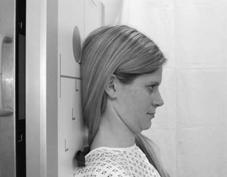
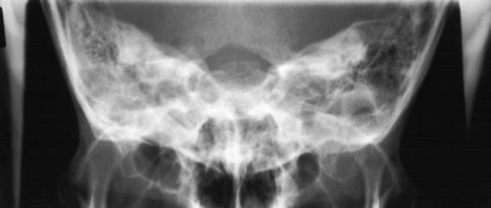
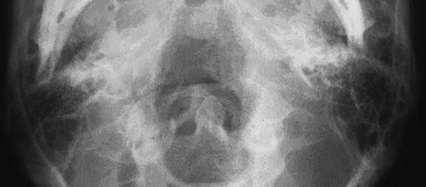
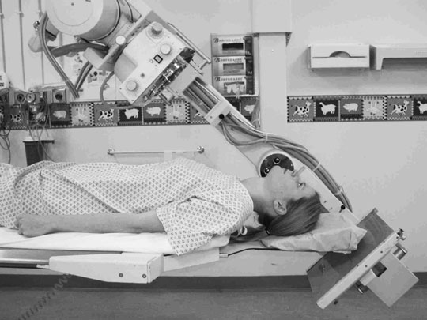

# Rx Craniu Oase temporale

  📷 Radiografie Convențională (Rx)
  <strong>Actualizat:</strong> 2026-09-16
  <strong>Autor:</strong> Departamentul de Radiologie / Referință Clark (Ed. 12)

---

-   __1. Rezumat Clinic & Indicații__

    ---

    === "Indicații Clinice"

        - 8 250 Craniu Oase temporale Aceste incidențe sunt în mod tradițional dificil de efectuat. Sunt, de asemenea, dificil de interpretat, în special dacă examinarea nu este de cea mai înaltă calitate. CT-ul modern cu imagistică coronală directă permite demonstrarea excelentă a detaliilor osului temporal și a eliminat în mare măsură necesitatea acestor incidențe. Fronto-occipitală 35 grade caudală 251 8 Craniu Fronto-occipitală 35 grade caudală

    === "Ghid Național IRIS"

        !!! info "Referință Primară: Ghidul Național IRIS (Ordinul MS 1342/2012)"
            - **Capitol Ghid IRIS:** *Traumatisme — Față și orbite*
            - **Grad de Recomandare:** **Grad B**
            - **Nivel de Iradiere Estimată:** `Clasa 1 (Minimă < 0.2 mSv)`

            [:octicons-search-16: Deschide Ghidul IRIS](../../iris.md){ .md-button .md-button--primary } [:material-open-in-new: Aplicația Oficială PWA](https://radiologie-pediatrica.ro/iris/){ .md-button target="_blank" rel="noopener" }

-   __2. Poziționare & Centrare Fascicul__

    ---

    - **Poziție Pacient:**
        - pacientul poate fi în decubit dorsal pe linia mediană a mesei sau în ortostatism, cu spatele la stativul Bucky pentru ortostatism.
        - capul este ajustat astfel încât conductele auditive externe să fie echidistante față de masa de examinare, astfel încât planul mediosagital să fie la unghiuri drepte față de masa de examinare și pe linia mediană a acesteia.
        - bărbia este coborâtă astfel încât linia orbitomeatală (LOM) să fie la unghiuri drepte față de masa de examinare.
        - o casetă mică (24 × 30-cm) este plasată transversal în suportul casetei și centrată pentru a coincide cu raza centrală înclinată.
    - **Punct de Centrare Fascicul:**
        - se utilizează angularea caudală, astfel încât aceasta să formeze un unghi de 35 grade față de planul orbitomeatal.
        - fasciculul este centrat la jumătatea distanței dintre conductele auditive externe.
        - se colimează lateral pentru a include marginile de profil (laterale) ale craniului și superior-inferior pentru a include porțiunile mastoidiene și pietroase ale osului temporal. Procesul mastoidian poate fi palpat cu ușurință în spatele urechii. Canale semicirculare Cohlee oscioare auditive conduct auditiv extern conduct auditiv intern capul mandibulei arc zigomatic eminență arcuată dorsum sellae gaură occipitală mare (foramen magnum) celule aerice mastoidiene sinusuri sfenoidale
    - **Distanță Focar-Film (DFF / SID):** 100 cm
    - **Comandă Respiratorie:** Apnee pe durata expunerii (apnee în inspir pentru torace; expir pentru Abdomen/bazin).

-   __3. Parametri Tehnici Expunere__

    ---

    | Parametru Tehnic | Valoare Configurare Generator / Tub |
    |:-----------------|:-------------------------------------|
    | **Tensiune Tub (kV)** | DE CONFIGURAT PE APARAT |
    | **Sarcină / Produs Curent-Timp (mAs)** | Conform AEC / grosimii anatomice |
    | **Distanță Focar-Film (DFF / SID)** | 100 cm |
    | **Grilă Antidifuzoare (Bucky)** | Cu grilă antidifuzoare Bucky |
    | **Dimensiune Focar** | Focar Mic (0.6 mm) |
    | **Camere de Ionizare AEC** | Camerele laterale (sau camera centrală, în funcție de regiune) |
    | **Colimare Fascicul** | Colimare strictă adaptată pe receptor 24 x 30 cm |
    | **Filtrare Tub** | Totală ≥ 2.5 mm Al echivalent (conform Clark: 3.0 mm Al echivalent) |

-   __4. Criterii de Calitate & Reușită Imagine__

    ---

    - Șaua turcească a osului sfenoid trebuie proiectată în gaura occipitală mare (foramen magnum).
    - Craniul nu trebuie să fie rotit. Acest lucru poate fi evaluat și prin verificarea faptului că șaua turcească apare în mijlocul găurii occipitale mari (foramen magnum).
    - Toată anatomia inclusă pe radiografia opusă și în schema liniară de mai jos trebuie să fie inclusă.
    - Erori de evitat / remedii: Subangulare: gaura occipitală mare (foramen magnum) nu este evidențiată clar deasupra stâncilor temporale (piramidelor pietroase). Aceasta este probabil cea mai frecventă eroare, deoarece pacientului i se poate părea dificil să mențină linia de bază perpendiculară pe filmul radiologic.
    - Erori de evitat / remedii: dacă bărbia pacientului nu poate fi coborâtă suficient pentru a aduce linia de bază orbitomeatală perpendicular pe filmul radiologic, va fi necesară creșterea unghiului tubului la verticală peste 35 grade. Trebuie menținut un unghi de 35 grade față de planul orbitomeatal. Incidența submento-verticală, ca alternativă, SMV (a se vedea p. 246 pentru detalii), colimată pentru a include numai porțiunile pietroasă și mastoidiană ale osului temporal, este o altă incidență utilizată pentru evidențierea anatomiei acestei regiuni. Cohlee oscioare auditive conduct auditiv extern conduct auditiv intern canale semicirculare celule aerice mastoidiene foramen ovale foramen lacerum gaură occipitală mare (foramen magnum) foramen spinosum canal carotidian ureche externă ureche medie ureche internă pacient poziționat pentru incidența SMV

-   __5. Protecție Radiologică (ALARA)__

    ---

    - Ecranare gonadică cu șorț plumbat dacă gonadele sunt în apropierea fasciculului util (regula ALARA).
    - Colimare precisă la dimensiunea anatomică strict necesară pentru reducerea dozei și a radiației difuze.
    - Verificarea posibilității unei sarcini la pacientele de vârstă fertilă înainte de expunere.

!!! note "Observații Clinice & Tehnice"
    Pregătirea pacientului prin îndepărtarea tuturor accesoriilor radio-opace.

### 🖼️ Imagini

<figure class="protocol-image-card" markdown>

<figcaption><strong>Figura 1: Aspect radiografic / Poziționare (Clark Ed. 12)</strong> — Poziționarea pacientului și centrarea fasciculului conform Clark (Ed. 12)</figcaption>

</figure>

<figure class="protocol-image-card" markdown>

<figcaption><strong>Figura 2: Aspect radiografic / Poziționare (Clark Ed. 12)</strong> — Aspect radiografic / ghid de poziționare conform tratatului Clark (Ed. 12)</figcaption>

</figure>

<figure class="protocol-image-card" markdown>

<figcaption><strong>• toată anatomia inclusă pe radiografia opusă și</strong> — Aspect radiografic / ghid de poziționare conform tratatului Clark (Ed. 12)</figcaption>

</figure>

<figure class="protocol-image-card" markdown>

<figcaption><strong>Figura 4: Aspect radiografic / Poziționare (Clark Ed. 12)</strong> — Aspect radiografic / ghid de poziționare conform tratatului Clark (Ed. 12)</figcaption>

</figure>

=== "Ghid Rapid de Execuție"

    1. **Identificarea și verificarea pacientului:** verificare identitate, zonă de examinat, consimțământ conform procedurii și evaluarea posibilității unei sarcini, când este relevantă.
    2. **Pregătire:** îndepărtarea oricăror obiecte radiopace (bijuterii, agrafe, fermoare, proteze, pansamente dense).
    3. **Poziționare precisă:** alinierea receptorului de imagine și a tubului la distanța prescrisă (100 cm).
    4. **Colimare strictă:** adaptarea fasciculului strict la regiunea de diagnostic pentru scăderea iradierii și reducerea radiației difuze.
    5. **Radioprotecție:** verificarea [politicii RX](../radioprotectie.md), cu măsuri distincte pentru pacient, personal și însoțitor.

## Surse de documentare

- [Clark's Positioning in Radiography (Ed. 12), Pagina 265](https://books.google.com/books/about/Clark_s_Positioning_in_Radiography.html?id=Xxu6MwEACAAJ)
