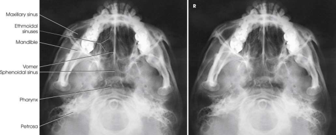

# Rx Sinusuri Etmoidale și Sfenoidale — Submentovertical Incidență (Merrill)

  📷 Radiografie Convențională (Rx)
  <strong>Actualizat:</strong> 2026-09-16
  <strong>Autor:</strong> Referință Merrill

---

-   __1. Rezumat Clinic & Indicații__

    ---

    === "Indicații Clinice"

        - Conform reperelor anatomice standard din tratat

    === "Ghid Național IRIS"

        !!! info "Referință Primară: Ghidul Național IRIS (Ordinul MS 1342/2012)"
            - **Capitol Ghid IRIS:** *Ghidul Național IRIS*
            - **Grad de Recomandare:** **De verificat pe indicație; fără grad atribuit automat**
            - **Nivel de Iradiere Estimată:** `De verificat pentru examinarea și populația selectate`

            [:octicons-search-16: Deschide Ghidul IRIS](../../iris.md){ .md-button .md-button--primary } [:material-open-in-new: Aplicația Oficială PWA](https://radiologie-pediatrica.ro/iris/){ .md-button target="_blank" rel="noopener" }
-   __2. Poziționare & Centrare Fascicul__

    ---

    - **Poziție Pacient:** success de SMV incidență depends pe placing linie infraorbitomeatală (LIOM) ca nearly paralel ca possible cu plane de receptorul de imagine și directing raza centrală perpendicular pe linie infraorbitomeatală (LIOM). ortostatism este recommended pentru toate paranasal sinus imagini și este more comfortable pentru pacientul. following steps sunt observed: Use chair that supports pacientul’s back la obtain greater freedom în positioning pacientul’s corp la place linie infraorbitomeatală (LIOM) paralel cu receptorul de imagine. se așază pacientul pe scaun far enough away de la stativ vertical Bucky that capul poate fie fully extins (Fig. 11.180). If necessary la examine short-necked sau hypersthenic pacienți, angle stativ vertical Bucky downward la achieve paralel relationship între grilă și linie infraorbitomeatală (LIOM) (Fig. 11.181). disadvantage de angling stativ vertical Bucky este that raza centrală este nu orizontal, și air-nivele hidroaerice poate nu fie vizualizat ca easily ca when raza centrală este truly orizontal.; Hyperextend pacientul’s neck ca far ca possible, și rest capul pe its vertex. If pacientul’s mouth opens during hyperextension, Se instruiește pacientul să keep mouth closed la move mandibular simfiză anteriorly. se ajustează pacient’s cap astfel încât MSP este perpendicular pe linia mediană receptorul de imagine. se ajustează tube astfel încât raza centrală este perpendicular pe linie infraorbitomeatală (LIOM) (Fig. 11.182; also see Figs. 11.180 și 11.181). se imobilizează pacient’s cap. în absence de cap clamp, place suitably backed strip de adhesive tape across tip de bărbia și anchor it la sides de radiographic unit. Do nu put adhesive surface directly pe pacientul’s skin.
    - **Punct de Centrare Fascicul:** Horizon̍ al și perpendicular pe linie infraorbitomeatală (LIOM) through șa turcească. raza centrală enters pe MSP approximately inch (1.9 cm) anterior la level de conduct auditiv extern (CAE).
    - **Distanță Focar-Film (DFF / SID):** Nespecificat în fragmentul extras; de verificat în sursă
    - **Comandă Respiratorie:** apnee (oprirea respirației).

-   __3. Parametri Tehnici Expunere__

    ---

    | Parametru Tehnic | Valoare Configurare Generator / Tub |
    |:-----------------|:-------------------------------------|
    | **Tensiune Tub (kV)** | DE CONFIGURAT PE APARAT |
    | **Sarcină / Produs Curent-Timp (mAs)** | DE CONFIGURAT PE APARAT |
    | **Distanță Focar-Film (DFF / SID)** | Nespecificat în fragmentul extras; de verificat în sursă |
    | **Grilă Antidifuzoare (Bucky)** | DE CONFIGURAT PE APARAT |
    | **Dimensiune Focar** | DE CONFIGURAT PE APARAT |
    | **Camere de Ionizare AEC** | DE CONFIGURAT PE APARAT |
    | **Colimare Fascicul** | se ajustează câmp de iradiere la extend 1 inch (2.5 cm) beyond tip de nasul și pe lateral sides. expunere field trebuie să fie fără larger than 8 × 10 inches (18 × 24 cm). Place marker de lateralitate (D/S) în collimated expunere field. |
    | **Filtrare Tub** | DE CONFIGURAT PE APARAT |

-   __4. Criterii de Calitate & Reușită Imagine__

    ---

    - Criterii radiologice de calitate imaginii: n Evidence de corect collimation și presence de marker de lateralitate (D/S) plasat clear de anatomy de interest n Sphenoid și sinusuri etmoidale n fără tilt (MSP poziționat perpendicular pe receptorul de imagine), evidențiat prin:
    - Equal distance de la lateral margine de Craniu la mandibular condyles pe ambele părți (bilateral) n linie infraorbitomeatală (LIOM) poziționat paralel cu receptorul de imagine (suficient neck extension), evidențiat prin:
    - Superimposition de anterior frontal bone prin mental protuberance
    - Insuficient neck extension will cause Mandibulă la superimpose sinusuri etmoidale. n Mandibular condyles anterior la stânci temporale (piramide pietroase) n părți moi, bony detalii trabeculare osoase, și air-nivele hidroaerice, if present References 1. HEW 76-8013, Handbook de Selected Organ Doses. 2. Schüller A. Die schädelbasis im rontgenbild. Fortschr Röntgenstr. 1905;11:215. 3. Towne E.B. Erosion de petrous bone prin acoustic nerve tumor. Arch Otolaryngol. 1926;4:515. 4. Grashey R. Atlas typischer röntgenbilder vom normalen menschen. în. Lehmann’s medizinische atlanten. vol 5. ed 2. Munich: īF Lehmann; 1912. 5. Altschul W. Beiträg zur röntgenologie des gehörorganes. Z Hals Nas Ohr. 1926;14:335. 6. Haas L. Verfahren zur sagittalen aufnahme der sellagegend. Fortschr Röntgenstr. 1927;36:1198. 7. Schüller A. Die schädelbasis im rontgenbild. Fortschr Röntgenstr. 1905;11:215. 8. Pfeifer W. Beitrag zum wert des axialen schädelskiagrammes. Arch Laryngol Rhinol. 1916;30(1). 9. Waters C.A. Modification de occipito-frontal poziție în roentgenography de accessory nasal sinuses. Arch Radiol Electrother. 1915;20(15). 10. Zanelli A. Le proiezioni radiografiche dell’articolazione temporomandibolare. Radiol Med. 1929;16:495. 11. Cross K.S. radiografie de nasal accessory sinuses. Med J Aust. 1927;14:569. 12. Flecker H. Roentgenograms de antrum. AJR Am J Roentgenol. 1928;20:56 (letter). 13. Waters C.A. modification de occipitofrontal poziție în roentgen examination de accessory nasal sinuses. Arch Radiol ǖer. 1915;20(15). 14. Mahoney H.O. cap și sinus poziții. Xray Techn. 1930;1:89.

-   __5. Protecție Radiologică (ALARA)__

    ---

    - Nespecificat în fragmentul extras; de verificat în sursă

!!! note "Observații Clinice & Tehnice"
    Conform reperelor anatomice standard din tratat

### 🖼️ Imagini

<figure class="protocol-image-card" markdown>

<figcaption><strong>Merrill — pagina PDF 959, imaginea 1</strong> — Imagine din fragmentul sursă; asocierea necesită revizie.</figcaption>

</figure>

=== "Ghid Rapid de Execuție"

    1. **Identificarea și verificarea pacientului:** verificare identitate, zonă de examinat, consimțământ conform procedurii și evaluarea posibilității unei sarcini, când este relevantă.
    2. **Pregătire:** îndepărtarea oricăror obiecte radiopace (bijuterii, agrafe, fermoare, proteze, pansamente dense).
    3. **Poziționare precisă:** alinierea receptorului de imagine și a tubului la distanța prescrisă (Nespecificat în fragmentul extras; de verificat în sursă).
    4. **Colimare strictă:** adaptarea fasciculului strict la regiunea de diagnostic pentru scăderea iradierii și reducerea radiației difuze.
    5. **Radioprotecție:** verificarea [politicii RX](../radioprotectie.md), cu măsuri distincte pentru pacient, personal și însoțitor.

## Surse de documentare

- [Merrill’s Atlas, 11. Cranium, pagini PDF 958–961](../../assets/protocols/sources/a56d45c16829_Merrills_Atlas_of_Radiographic_Positioning__Procedures_3Vol_Set.pdf#page=958)

## Fragmente sursă traduse (referință tehnică)

### anatomy

simetric imagine de anterior portion de base de craniul. sinusuri sfenoidale și ethmoidal air cells sunt vizualizat (Fig. 11.183).

### collimation

• se ajustează câmp de iradiere la extend 1 inch (2.5 cm) beyond tip de nasul și pe lateral sides. expunere field trebuie să fie fără
larger than 8 × 10 inches (18 × 24 cm). Place marker de lateralitate (D/S) în collimated expunere field.

### cr

• Horizon̍ al și perpendicular pe linie infraorbitomeatală (LIOM) through șa turcească. raza centrală enters pe MSP approximately
inch (1.9 cm) anterior la level de conduct auditiv extern (CAE).

### criteria

Criterii radiologice de calitate imaginii:
n Evidence de corect collimation și presence de marker de lateralitate (D/S) plasat clear de anatomy de interest
n Sphenoid și sinusuri etmoidale
n fără tilt (MSP poziționat perpendicular pe receptorul de imagine), evidențiat prin:
• Equal distance de la lateral margine de craniul la mandibular condyles pe ambele părți (bilateral)
n linie infraorbitomeatală (LIOM) poziționat paralel cu receptorul de imagine (suficient neck extension), evidențiat prin:
• Superimposition de anterior frontal bone prin mental protuberance
• Insuficient neck extension will cause mandible la superimpose sinusuri etmoidale.
n Mandibular condyles anterior la stânci temporale (piramide pietroase)
n părți moi, bony detalii trabeculare osoase, și air-nivele hidroaerice, if present
References
1. HEW 76-8013, Handbook de Selected Organ Doses.
2. Schüller A. Die schädelbasis im rontgenbild. Fortschr Röntgenstr. 1905;11:215.
3. Towne E.B. Erosion de petrous bone prin acoustic nerve tumor. Arch Otolaryngol. 1926;4:515.
4. Grashey R. Atlas typischer röntgenbilder vom normalen menschen. în. Lehmann’s medizinische atlanten. vol 5. ed 2. Munich: īF Lehmann;
1912.
5. Altschul W. Beiträg zur röntgenologie des gehörorganes. Z Hals Nas Ohr. 1926;14:335.
6. Haas L. Verfahren zur sagittalen aufnahme der sellagegend. Fortschr Röntgenstr. 1927;36:1198.
7. Schüller A. Die schädelbasis im rontgenbild. Fortschr Röntgenstr. 1905;11:215.
8. Pfeifer W. Beitrag zum wert des axialen schädelskiagrammes. Arch Laryngol Rhinol. 1916;30(1).
9. Waters C.A. Modification de occipito-frontal poziție în roentgenography de accessory nasal sinuses. Arch Radiol Electrother.
1915;20(15).
10. Zanelli A. Le proiezioni radiografiche dell’articolazione temporomandibolare. Radiol Med. 1929;16:495.
11. Cross K.S. radiografie de nasal accessory sinuses. Med J Aust. 1927;14:569.
12. Flecker H. Roentgenograms de antrum. AJR Am J Roentgenol. 1928;20:56 (letter).
13. Waters C.A. modification de occipitofrontal poziție în roentgen examination de accessory nasal sinuses. Arch Radiol ǖer.
1915;20(15).
14. Mahoney H.O. cap și sinus poziții. Xray Techn. 1930;1:89.

### part_pos

• Hyperextend pacientul’s neck ca far ca possible, și rest capul pe its vertex. If pacientul’s mouth opens during hyperextension,
Se instruiește pacientul să keep mouth closed la move mandibular simfiză anteriorly.
• se ajustează pacient’s cap astfel încât MSP este perpendicular pe linia mediană receptorul de imagine.
• se ajustează tube astfel încât raza centrală este perpendicular pe linie infraorbitomeatală (LIOM) (Fig. 11.182; also see Figs. 11.180 și 11.181).
• se imobilizează pacient’s cap. în absence de cap clamp, place suitably backed strip de adhesive tape across tip de bărbia
și anchor it la sides de radiographic unit. Do nu put adhesive surface directly pe pacientul’s skin.

### patient_pos

success de SMV incidență depends pe placing linie infraorbitomeatală (LIOM) ca nearly paralel ca possible cu plane de receptorul de imagine și directing central
ray perpendicular pe linie infraorbitomeatală (LIOM). ortostatism este recommended pentru toate paranasal sinus imagini și este more comfortable pentru pacientul. following steps sunt observed:
• Use chair that supports pacientul’s back la obtain greater freedom în positioning pacientul’s corp la place linie infraorbitomeatală (LIOM) paralel cu
receptorul de imagine.
• se așază pacientul pe scaun far enough away de la stativ vertical Bucky that capul poate fie fully extins (Fig. 11.180).
• If necessary la examine short-necked sau hypersthenic pacienți, angle stativ vertical Bucky downward la achieve paralel
relationship între grilă și linie infraorbitomeatală (LIOM) (Fig. 11.181). disadvantage de angling stativ vertical Bucky este that raza centrală este
nu orizontal, și air-nivele hidroaerice poate nu fie vizualizat ca easily ca when raza centrală este truly orizontal.

### respiration

apnee (oprirea respirației).

### tech

poziționat prin manufacturer sau department protocol pentru corect anatomy display orientation; raza centrală plate: 10 × 12 inches (24 ×
30 cm), longitudinal.

