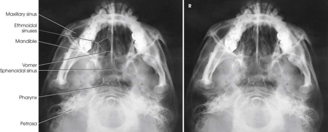

# Radiografia sinusurilor etmoidale și sfenoidale — Incidența submentoverticală (Merrill)

  📷 Radiografie Convențională (Rx)
  <strong>Actualizat:</strong> 2026-09-16
  <strong>Autor:</strong> Referință Merrill

---

-   __1. Rezumat Clinic & Indicații__

    ---

    === "Indicații Clinice"

        - Conform reperelor anatomice standard din tratat

    === "Ghid Național IRIS"

        !!! info "Referință Primară: Ghidul Național IRIS (Ordinul MS 1342/2012)"
            - **Capitol Ghid IRIS:** *Ghidul Național IRIS*
            - **Grad de Recomandare:** **De verificat pe indicație; fără grad atribuit automat**
            - **Nivel de Iradiere Estimată:** `De verificat pentru examinarea și populația selectate`

            [:octicons-search-16: Deschide Ghidul IRIS](../../iris.md){ .md-button .md-button--primary } [:material-open-in-new: Aplicația Oficială PWA](https://radiologie-pediatrica.ro/iris/){ .md-button target="_blank" rel="noopener" }
-   __2. Poziționare & Centrare Fascicul__

    ---

    - **Poziție Pacient:** Succesul incidenței SMV depinde de poziționarea liniei infraorbitomeatale (LIOM) cât mai aproape de paralel cu planul receptorului de imagine și de orientarea razei centrale perpendicular pe linia infraorbitomeatală (LIOM). Ortostatismul este recomandat pentru toate imaginile sinusurilor paranazale și este mai confortabil pentru pacient. Se respectă următorii pași: Se utilizează un scaun care susține spatele pacientului, pentru a obține o libertate mai mare în poziționarea corpului pacientului și pentru a plasa linia infraorbitomeatală (LIOM) paralel cu receptorul de imagine. Pacientul este așezat pe scaun suficient de departe de stativul vertical Bucky, astfel încât capul să poată fi extins complet (Fig. 11.180). Dacă este necesar, pentru examinarea pacienților cu gât scurt sau hipersthenici, se înclină stativul vertical Bucky în jos, pentru a obține relația paralelă dintre grilă și linia infraorbitomeatală (LIOM) (Fig. 11.181). Dezavantajul înclinării stativului vertical Bucky este că raza centrală nu este orizontală, iar nivelurile hidroaerice pot să nu fie vizualizate la fel de ușor ca atunci când raza centrală este cu adevărat orizontală. Se hiperextinde gâtul pacientului cât mai mult posibil și se sprijină capul pe vertex. Dacă gura pacientului se deschide în timpul hiperextensiei, i se indică să țină gura închisă, pentru a deplasa anterior simfiza mandibulară. Se ajustează capul pacientului astfel încât MSP să fie perpendicular pe linia mediană a receptorului de imagine. Se ajustează tubul astfel încât raza centrală să fie perpendiculară pe linia infraorbitomeatală (LIOM) (Fig. 11.182; vezi și Fig. 11.180 și 11.181). Se imobilizează capul pacientului. În absența unei cleme pentru cap, se plasează o bandă de leucoplast cu suport adecvat peste vârful bărbiei și se fixează la părțile laterale ale unității radiografice. Nu se aplică direct suprafața adezivă pe pielea pacientului.
    - **Punct de Centrare Fascicul:** Orizontală și perpendiculară pe linia infraorbitomeatală (LIOM), trecând prin șaua turcească. Raza centrală pătrunde în planul mediosagital (MSP), la aproximativ [valoare lipsă în sursă] inci (1.9 cm) anterior de nivelul conductului auditiv extern (CAE).
    - **Distanță Focar-Film (DFF / SID):** Nespecificat în fragmentul extras; de verificat în sursă
    - **Comandă Respiratorie:** apnee (oprirea respirației).

-   __3. Parametri Tehnici Expunere__

    ---

    | Parametru Tehnic | Valoare Configurare Generator / Tub |
    |:-----------------|:-------------------------------------|
    | **Tensiune Tub (kV)** | DE CONFIGURAT PE APARAT |
    | **Sarcină / Produs Curent-Timp (mAs)** | DE CONFIGURAT PE APARAT |
    | **Distanță Focar-Film (DFF / SID)** | Nespecificat în fragmentul extras; de verificat în sursă |
    | **Grilă Antidifuzoare (Bucky)** | DE CONFIGURAT PE APARAT |
    | **Dimensiune Focar** | DE CONFIGURAT PE APARAT |
    | **Camere de Ionizare AEC** | DE CONFIGURAT PE APARAT |
    | **Colimare Fascicul** | Se ajustează câmpul de iradiere astfel încât să se extindă 1 inch (2.5 cm) dincolo de vârful nasului și pe laturile laterale. Câmpul de expunere trebuie să nu fie mai mare de 8 × 10 inches (18 × 24 cm). Se plasează markerul de lateralitate (D/S) în câmpul de expunere colimat. |
    | **Filtrare Tub** | DE CONFIGURAT PE APARAT |

-   __4. Criterii de Calitate & Reușită Imagine__

    ---

    - Criterii radiologice de calitate a imaginii: n Dovada colimării corecte și prezența markerului de lateralitate (D/S), plasat clar față de anatomia de interes n Sinusul sfenoidal și sinusurile etmoidale n Fără înclinare (MSP poziționat perpendicular pe receptorul de imagine), evidențiat prin:
    - Distanță egală de la marginea laterală a craniului la condilii mandibulari pe ambele părți (bilateral) n Linia infraorbitomeatală (LIOM) poziționată paralel cu receptorul de imagine (extensie suficientă a gâtului), evidențiată prin:
    - Suprapunerea osului frontal anterior peste protuberanța mentonieră
    - Extensia insuficientă a gâtului va determina suprapunerea mandibulei peste sinusurile etmoidale. n Condilii mandibulari anterior față de stâncile temporale (piramidele pietroase) n Părți moi, detalii trabeculare osoase și niveluri hidroaerice, dacă sunt prezente. Referințe 1. HEW 76-8013, Manualul dozelor organice selectate. 2. Schüller A. Baza craniului în imaginea radiografică. Fortschr Röntgenstr. 1905;11:215. 3. Towne E.B. Eroziunea osului pietros prin tumora nervului acustic. Arch Otolaryngol. 1926;4:515. 4. Grashey R. Atlas de imagini radiografice tipice ale omului normal. În: Atlasele medicale Lehmann. vol. 5. ed. 2. München: īF Lehmann; 1912. 5. Altschul W. Contribuții la radiologia organului auditiv. Z Hals Nas Ohr. 1926;14:335. 6. Haas L. Procedeu pentru expunerea sagitală a regiunii șeii turcești. Fortschr Röntgenstr. 1927;36:1198. 7. Schüller A. Baza craniului în imaginea radiografică. Fortschr Röntgenstr. 1905;11:215. 8. Pfeifer W. Contribuție la valoarea schiagramei axiale a craniului. Arch Laryngol Rhinol. 1916;30(1). 9. Waters C.A. Modificarea poziției occipitofrontale în radiografia sinusurilor nazale accesorii. Arch Radiol Electrother. 1915;20(15). 10. Zanelli A. Incidențele radiografice ale articulației temporomandibulare. Radiol Med. 1929;16:495. 11. Cross K.S. Radiografia sinusurilor nazale accesorii. Med J Aust. 1927;14:569. 12. Flecker H. Radiografii ale antrului. AJR Am J Roentgenol. 1928;20:56 (scrisoare). 13. Waters C.A. Modificarea poziției occipitofrontale în examinarea radiografică a sinusurilor nazale accesorii. Arch Radiol ǖer. 1915;20(15). 14. Mahoney H.O. Pozițiile capului și sinusurilor. Xray Techn. 1930;1:89.

-   __5. Protecție Radiologică (ALARA)__

    ---

    - Nespecificat în fragmentul extras; de verificat în sursă

!!! note "Observații Clinice & Tehnice"
    Conform reperelor anatomice standard din tratat

### 🖼️ Imagini

<figure class="protocol-image-card" markdown>

<figcaption><strong>Merrill — pagina 959, imaginea 1</strong> — Imagine din fragmentul sursă; asocierea necesită revizie.</figcaption>

</figure>

=== "Ghid Rapid de Execuție"

    1. **Identificarea și verificarea pacientului:** verificare identitate, zonă de examinat, consimțământ conform procedurii și evaluarea posibilității unei sarcini, când este relevantă.
    2. **Pregătire:** îndepărtarea oricăror obiecte radiopace (bijuterii, agrafe, fermoare, proteze, pansamente dense).
    3. **Poziționare precisă:** alinierea receptorului de imagine și a tubului la distanța prescrisă (Nespecificat în fragmentul extras; de verificat în sursă).
    4. **Colimare strictă:** adaptarea fasciculului strict la regiunea de diagnostic pentru scăderea iradierii și reducerea radiației difuze.
    5. **Radioprotecție:** verificarea [politicii RX](../radioprotectie.md), cu măsuri distincte pentru pacient, personal și însoțitor.

## Surse de documentare

- [Merrill’s Atlas, 11. Cranium, pagini 958–961](https://books.google.com/books/about/Merrill_s_Atlas_of_Radiographic_Position.html?id=BM0lEQAAQBAJ)

## Fragmente sursă traduse (referință tehnică)

### anatomie

Imagine simetrică a porțiunii anterioare a bazei craniului. Sunt vizualizate sinusurile sfenoidale și celulele etmoidale aerate (Fig. 11.183).

### colimare

• Se ajustează câmpul de iradiere astfel încât să se extindă 1 inch (2.5 cm) dincolo de vârful nasului și pe laturile laterale. Câmpul de expunere trebuie să nu fie mai mare de 8 × 10 inches (18 × 24 cm). Se plasează markerul de lateralitate (D/S) în câmpul de expunere colimat.

### raza centrală

• Orizontală și perpendiculară pe linia infraorbitomeatală (LIOM), trecând prin șaua turcească. Raza centrală pătrunde în planul mediosagital (MSP), la aproximativ [valoare lipsă în sursă] inci (1.9 cm) anterior de nivelul conductului auditiv extern (CAE).

### criterii

Criterii radiologice de calitate a imaginii:
n Dovada colimării corecte și prezența markerului de lateralitate (D/S), plasat clar față de anatomia de interes
n Sinusul sfenoidal și sinusurile etmoidale
n Fără înclinare (MSP poziționat perpendicular pe receptorul de imagine), evidențiat prin:
• Distanță egală de la marginea laterală a craniului la condilii mandibulari pe ambele părți (bilateral)
n Linia infraorbitomeatală (LIOM) poziționată paralel cu receptorul de imagine (extensie suficientă a gâtului), evidențiată prin:
• Suprapunerea osului frontal anterior peste protuberanța mentonieră
• Extensia insuficientă a gâtului va determina suprapunerea mandibulei peste sinusurile etmoidale.
n Condilii mandibulari anterior față de stâncile temporale (piramidele pietroase)
n Părți moi, detalii trabeculare osoase și niveluri hidroaerice, dacă sunt prezente
Referințe
1. HEW 76-8013, Manualul dozelor organice selectate.
2. Schüller A. Baza craniului în imaginea radiografică. Fortschr Röntgenstr. 1905;11:215.
3. Towne E.B. Eroziunea osului pietros prin tumora nervului acustic. Arch Otolaryngol. 1926;4:515.
4. Grashey R. Atlas de imagini radiografice tipice ale omului normal. În: Atlasele medicale Lehmann. vol. 5. ed. 2. München: īF Lehmann;
1912.
5. Altschul W. Contribuții la radiologia organului auditiv. Z Hals Nas Ohr. 1926;14:335.
6. Haas L. Procedeu pentru expunerea sagitală a regiunii șeii turcești. Fortschr Röntgenstr. 1927;36:1198.
7. Schüller A. Baza craniului în imaginea radiografică. Fortschr Röntgenstr. 1905;11:215.
8. Pfeifer W. Contribuție la valoarea schiagramei axiale a craniului. Arch Laryngol Rhinol. 1916;30(1).
9. Waters C.A. Modificarea poziției occipitofrontale în radiografia sinusurilor nazale accesorii. Arch Radiol Electrother.
1915;20(15).
10. Zanelli A. Incidențele radiografice ale articulației temporomandibulare. Radiol Med. 1929;16:495.
11. Cross K.S. Radiografia sinusurilor nazale accesorii. Med J Aust. 1927;14:569.
12. Flecker H. Radiografii ale antrului. AJR Am J Roentgenol. 1928;20:56 (scrisoare).
13. Waters C.A. Modificarea poziției occipitofrontale în examinarea radiografică a sinusurilor nazale accesorii. Arch Radiol ǖer.
1915;20(15).
14. Mahoney H.O. Pozițiile capului și sinusurilor. Xray Techn. 1930;1:89.

### part_pos

• Se hiperextinde gâtul pacientului cât mai mult posibil și se sprijină capul pe vertex. Dacă gura pacientului se deschide în timpul hiperextensiei, i se indică să țină gura închisă, pentru a deplasa anterior simfiza mandibulară.
• Se ajustează capul pacientului astfel încât MSP să fie perpendicular pe linia mediană a receptorului de imagine.
• Se ajustează tubul astfel încât raza centrală să fie perpendiculară pe linia infraorbitomeatală (LIOM) (Fig. 11.182; vezi și Fig. 11.180 și 11.181).
• Se imobilizează capul pacientului. În absența unei cleme pentru cap, se plasează o bandă de leucoplast cu suport adecvat peste vârful bărbiei și se fixează la părțile laterale ale unității radiografice. Nu se aplică direct suprafața adezivă pe pielea pacientului.

### patient_pos

Succesul incidenței SMV depinde de poziționarea liniei infraorbitomeatale (LIOM) cât mai aproape de paralel cu planul receptorului de imagine și de orientarea razei centrale perpendicular pe linia infraorbitomeatală (LIOM). Ortostatismul este recomandat pentru toate imaginile sinusurilor paranazale și este mai confortabil pentru pacient. Se respectă următorii pași:
• Se utilizează un scaun care susține spatele pacientului, pentru a obține o libertate mai mare în poziționarea corpului pacientului și pentru a plasa linia infraorbitomeatală (LIOM) paralel cu receptorul de imagine.
• Pacientul este așezat pe scaun suficient de departe de stativul vertical Bucky, astfel încât capul să poată fi extins complet (Fig. 11.180).
• Dacă este necesar, pentru examinarea pacienților cu gât scurt sau hipersthenici, se înclină stativul vertical Bucky în jos, pentru a obține relația paralelă dintre grilă și linia infraorbitomeatală (LIOM) (Fig. 11.181). Dezavantajul înclinării stativului vertical Bucky este că raza centrală nu este orizontală, iar nivelurile hidroaerice pot să nu fie vizualizate la fel de ușor ca atunci când raza centrală este cu adevărat orizontală.

### respirație

apnee (oprirea respirației).

### tehnică

Poziționat conform protocolului producătorului sau al departamentului pentru orientarea corectă a afișării anatomiei; placă pentru raza centrală: 10 × 12 inches (24 × 30 cm), longitudinal.

