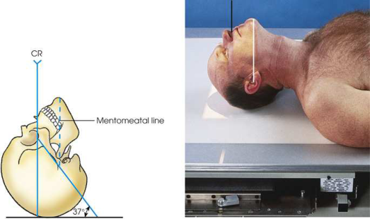

# Rx Facial Bone Radiography — Acanthioparietal Incidență — Reverse Incidență Occipito-Mentonieră (Metoda Waters) (Merrill)

  📷 Radiografie Convențională (Rx)
  <strong>Actualizat:</strong> 2026-09-16
  <strong>Autor:</strong> Referință Merrill

---

-   __1. Rezumat Clinic & Indicații__

    ---

    === "Indicații Clinice"

        - Conform reperelor anatomice standard din tratat

    === "Ghid Național IRIS"

        !!! info "Referință Primară: Ghidul Național IRIS (Ordinul MS 1342/2012)"
            - **Capitol Ghid IRIS:** *Ghidul Național IRIS*
            - **Grad de Recomandare:** **De verificat pe indicație; fără grad atribuit automat**
            - **Nivel de Iradiere Estimată:** `De verificat pentru examinarea și populația selectate`

            [:octicons-search-16: Deschide Ghidul IRIS](../../iris.md){ .md-button .md-button--primary } [:material-open-in-new: Aplicația Oficială PWA](https://radiologie-pediatrica.ro/iris/){ .md-button target="_blank" rel="noopener" }
-   __2. Poziționare & Centrare Fascicul__

    ---

    - **Poziție Pacient:** cu pacientul în Decubit dorsal poziție, center MSP de corp la linia mediană grilă.; Bringing pacientul’s chin up, se ajustează extension de gâtul astfel încât linie orbitomeatală (LOM) forms a 37-grade angle cu plane de receptorul de imagine (Fig. 11.112). If necessary, place support under pacientul’s umeri la help se extinde neck. linie mentomeatală (LMM) este approximately perpendicular pe plane de receptorul de imagine. se ajustează cap so that MSP este perpendicular pe plane de receptorul de imagine. Se imobilizează capul pacientului.
    - **Punct de Centrare Fascicul:** perpendicular la enter acantion și centrat pe receptorul de imagine
    - **Distanță Focar-Film (DFF / SID):** Nespecificat în fragmentul extras; de verificat în sursă
    - **Comandă Respiratorie:** apnee (oprirea respirației).

-   __3. Parametri Tehnici Expunere__

    ---

    | Parametru Tehnic | Valoare Configurare Generator / Tub |
    |:-----------------|:-------------------------------------|
    | **Tensiune Tub (kV)** | DE CONFIGURAT PE APARAT |
    | **Sarcină / Produs Curent-Timp (mAs)** | DE CONFIGURAT PE APARAT |
    | **Distanță Focar-Film (DFF / SID)** | Nespecificat în fragmentul extras; de verificat în sursă |
    | **Grilă Antidifuzoare (Bucky)** | DE CONFIGURAT PE APARAT |
    | **Dimensiune Focar** | DE CONFIGURAT PE APARAT |
    | **Camere de Ionizare AEC** | DE CONFIGURAT PE APARAT |
    | **Colimare Fascicul** | se ajustează câmp de iradiere la extend about 1 inch (2.5 cm) beyond lateral sides de fața, superiorly just la skin shadow, și inferiorly la bărbia. expunere field trebuie să fie fără larger than 8 × 10 inches (18 × 24 cm). Place marker de lateralitate (D/S) în collimated expunere field. |
    | **Filtrare Tub** | DE CONFIGURAT PE APARAT |

-   __4. Criterii de Calitate & Reușită Imagine__

    ---

    - Criterii radiologice de calitate imaginii: n Evidence de corect collimation și presence de marker de lateralitate (D/S) plasat clear de anatomy de interest n Entire Orbite și Masiv Facial (Oase ale Feței) n Absența rotației anatomice (simetrie bilaterală perfectă) sau tilt, evidențiat prin:
    - Distances între lateral margini de Craniu și Orbite equal pe fiecare side
    - MSP de cap aliniat cu axa longitudinală de câmp colimat n stânci temporale (piramide pietroase) projected below sinusuri maxilare n părți moi și bony detalii trabeculare osoase

-   __5. Protecție Radiologică (ALARA)__

    ---

    - Nespecificat în fragmentul extras; de verificat în sursă

!!! note "Observații Clinice & Tehnice"
    Conform reperelor anatomice standard din tratat

### 🖼️ Imagini

<figure class="protocol-image-card" markdown>

<figcaption><strong>Merrill — pagina PDF 910, imaginea 1</strong> — Imagine din fragmentul sursă; asocierea necesită revizie.</figcaption>

</figure>

=== "Ghid Rapid de Execuție"

    1. **Identificarea și verificarea pacientului:** verificare identitate, zonă de examinat, consimțământ conform procedurii și evaluarea posibilității unei sarcini, când este relevantă.
    2. **Pregătire:** îndepărtarea oricăror obiecte radiopace (bijuterii, agrafe, fermoare, proteze, pansamente dense).
    3. **Poziționare precisă:** alinierea receptorului de imagine și a tubului la distanța prescrisă (Nespecificat în fragmentul extras; de verificat în sursă).
    4. **Colimare strictă:** adaptarea fasciculului strict la regiunea de diagnostic pentru scăderea iradierii și reducerea radiației difuze.
    5. **Radioprotecție:** verificarea [politicii RX](../radioprotectie.md), cu măsuri distincte pentru pacient, personal și însoțitor.

## Surse de documentare

- [Merrill’s Atlas, 11. Cranium, pagini PDF 909–910](../../assets/protocols/sources/a56d45c16829_Merrills_Atlas_of_Radiographic_Positioning__Procedures_3Vol_Set.pdf#page=909)

## Fragmente sursă traduse (referință tehnică)

### anatomy

reverse Waters method shows superior facial bones. imagine este similar la that obtained cu Waters method, but facial
structures sunt considerably magnified (Fig. 11.113).

### collimation

• se ajustează câmp de iradiere la extend about 1 inch (2.5 cm) beyond lateral sides de fața, superiorly just la skin shadow, și
inferiorly la bărbia. expunere field trebuie să fie fără larger than 8 × 10 inches (18 × 24 cm). Place marker de lateralitate (D/S) în collimated
expunere field.

### cr

• perpendicular la enter acantion și centrat pe receptorul de imagine

### criteria

Criterii radiologice de calitate imaginii:
n Evidence de corect collimation și presence de marker de lateralitate (D/S) plasat clear de anatomy de interest
n Entire orbits și facial bones
n Absența rotației anatomice (simetrie bilaterală perfectă) sau tilt, evidențiat prin:
• Distances între lateral margini de craniul și orbits equal pe fiecare side
• MSP de cap aliniat cu axa longitudinală de câmp colimat
n stânci temporale (piramide pietroase) projected below sinusuri maxilare
n părți moi și bony detalii trabeculare osoase

### part_pos

• Bringing pacientul’s chin up, se ajustează extension de gâtul astfel încât linie orbitomeatală (LOM) forms a 37-grade angle cu plane de receptorul de imagine (Fig.
11.112). If necessary, place support under pacientul’s umeri la help se extinde neck.
• linie mentomeatală (LMM) este approximately perpendicular pe plane de receptorul de imagine.
• se ajustează cap so that MSP este perpendicular pe plane de receptorul de imagine.
• Se imobilizează capul pacientului.

### patient_pos

• cu pacientul în decubit dorsal, center MSP de corp la linia mediană grilă.

### respiration

apnee (oprirea respirației).

### tech

poziționat prin manufacturer sau department protocol pentru corect anatomy display orientation; raza centrală plate: 10 × 12 inches (24 ×
30 cm) longitudinal.
reverse Waters method este used la show facial bones when pacientul cannot fie plasat în decubit ventral. (See sections pe trauma method în Chapter 12, p. 142.)

