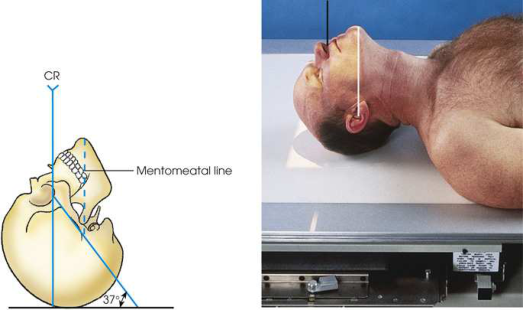

# Radiografia oaselor feței — Incidență acantoparietală — Incidență occipito-mentonieră inversată (Metoda Waters) (Merrill)

  📷 Radiografie Convențională (Rx)
  <strong>Actualizat:</strong> 2026-09-16
  <strong>Autor:</strong> Referință Merrill

---

-   __1. Rezumat Clinic & Indicații__

    ---

    === "Indicații Clinice"

        - Conform reperelor anatomice standard din tratat

    === "Ghid Național IRIS"

        !!! info "Referință Primară: Ghidul Național IRIS (Ordinul MS 1342/2012)"
            - **Capitol Ghid IRIS:** *Ghidul Național IRIS*
            - **Grad de Recomandare:** **De verificat pe indicație; fără grad atribuit automat**
            - **Nivel de Iradiere Estimată:** `De verificat pentru examinarea și populația selectate`

            [:octicons-search-16: Deschide Ghidul IRIS](../../iris.md){ .md-button .md-button--primary } [:material-open-in-new: Aplicația Oficială PWA](https://radiologie-pediatrica.ro/iris/){ .md-button target="_blank" rel="noopener" }
-   __2. Poziționare & Centrare Fascicul__

    ---

    - **Poziție Pacient:** Cu pacientul în decubit dorsal, se centrează MSP al corpului pe linia mediană a grilei. Ridicând bărbia pacientului, se ajustează extensia gâtului astfel încât linia orbitomeatală (LOM) să formeze un unghi de 37 de grade cu planul receptorului de imagine (Fig. 11.112). Dacă este necesar, se plasează un suport sub umerii pacientului pentru a ajuta la extensia gâtului. Linia mentomeatală (LMM) este aproximativ perpendiculară pe planul receptorului de imagine. Se ajustează capul astfel încât MSP să fie perpendicular pe planul receptorului de imagine. Se imobilizează capul pacientului.
    - **Punct de Centrare Fascicul:** Perpendicular pe acantion și centrat pe receptorul de imagine
    - **Distanță Focar-Film (DFF / SID):** Nespecificat în fragmentul extras; de verificat în sursă
    - **Comandă Respiratorie:** apnee (oprirea respirației).

-   __3. Parametri Tehnici Expunere__

    ---

    | Parametru Tehnic | Valoare Configurare Generator / Tub |
    |:-----------------|:-------------------------------------|
    | **Tensiune Tub (kV)** | DE CONFIGURAT PE APARAT |
    | **Sarcină / Produs Curent-Timp (mAs)** | DE CONFIGURAT PE APARAT |
    | **Distanță Focar-Film (DFF / SID)** | Nespecificat în fragmentul extras; de verificat în sursă |
    | **Grilă Antidifuzoare (Bucky)** | DE CONFIGURAT PE APARAT |
    | **Dimensiune Focar** | DE CONFIGURAT PE APARAT |
    | **Camere de Ionizare AEC** | DE CONFIGURAT PE APARAT |
    | **Colimare Fascicul** | se ajustează câmpul de iradiere pentru a se extinde cu aproximativ 1 inch (2.5 cm) dincolo de marginile laterale ale feței, superior până imediat la nivelul umbrei cutanate și inferior până la bărbie. Câmpul de expunere nu trebuie să fie mai mare de 8 × 10 inches (18 × 24 cm). Se plasează markerul de lateralitate (D/S) în câmpul de expunere colimat. |
    | **Filtrare Tub** | DE CONFIGURAT PE APARAT |

-   __4. Criterii de Calitate & Reușită Imagine__

    ---

    - Criterii radiologice de calitate a imaginii: n Dovada colimării corecte și prezența markerului de lateralitate (D/S), plasat clar față de anatomia de interes n Orbitele în întregime și masivul facial (oasele feței) n Absența rotației anatomice (simetrie bilaterală perfectă) sau a înclinării, evidențiată prin:
    - Distanțe egale între marginile laterale ale craniului și orbite, pe fiecare parte
    - MSP al capului aliniat cu axa longitudinală a câmpului colimat n Stâncile temporale (piramidele pietroase) proiectate inferior față de sinusurile maxilare n Părți moi și detalii trabeculare osoase

-   __5. Protecție Radiologică (ALARA)__

    ---

    - Nespecificat în fragmentul extras; de verificat în sursă

!!! note "Observații Clinice & Tehnice"
    Conform reperelor anatomice standard din tratat

### 🖼️ Imagini

<figure class="protocol-image-card" markdown>

<figcaption><strong>Merrill — pagina 910, imaginea 1</strong> — Imagine din fragmentul sursă; asocierea necesită revizie.</figcaption>

</figure>

=== "Ghid Rapid de Execuție"

    1. **Identificarea și verificarea pacientului:** verificare identitate, zonă de examinat, consimțământ conform procedurii și evaluarea posibilității unei sarcini, când este relevantă.
    2. **Pregătire:** îndepărtarea oricăror obiecte radiopace (bijuterii, agrafe, fermoare, proteze, pansamente dense).
    3. **Poziționare precisă:** alinierea receptorului de imagine și a tubului la distanța prescrisă (Nespecificat în fragmentul extras; de verificat în sursă).
    4. **Colimare strictă:** adaptarea fasciculului strict la regiunea de diagnostic pentru scăderea iradierii și reducerea radiației difuze.
    5. **Radioprotecție:** verificarea [politicii RX](../radioprotectie.md), cu măsuri distincte pentru pacient, personal și însoțitor.

## Surse de documentare

- [Merrill’s Atlas, 11. Cranium, pagini 909–910](https://books.google.com/books/about/Merrill_s_Atlas_of_Radiographic_Position.html?id=BM0lEQAAQBAJ)

## Fragmente sursă traduse (referință tehnică)

### anatomie

Metoda Waters inversă evidențiază oasele faciale superioare. Imaginea este similară celei obținute prin metoda Waters, dar structurile faciale sunt considerabil mărite (Fig. 11.113).

### colimare

• Se ajustează câmpul de iradiere astfel încât să se extindă cu aproximativ 1 inch (2.5 cm) dincolo de laturile laterale ale feței, superior până la nivelul umbrei cutanate și inferior până la bărbie. Câmpul de expunere trebuie să nu fie mai mare de 8 × 10 inches (18 × 24 cm). Se plasează markerul de lateralitate (D/S) în câmpul de expunere colimat.

### raza centrală

• Perpendicular pe acantion și centrat pe receptorul de imagine

### criterii

Criterii radiologice de calitate a imaginii:
n Dovada colimării corecte și prezența markerului de lateralitate (D/S), plasat clar față de anatomia de interes
n Orbitele în întregime și oasele faciale
n Absența rotației anatomice (simetrie bilaterală perfectă) sau a înclinării, evidențiată prin:
• Distanțe egale între marginile laterale ale craniului și orbite, pe fiecare parte
• MSP al capului aliniat cu axa longitudinală a câmpului colimat
n Stâncile temporale (piramidele pietroase) proiectate inferior față de sinusurile maxilare
n Părți moi și detalii trabeculare osoase

### part_pos

• Ridicând bărbia pacientului, se ajustează extensia gâtului astfel încât linia orbitomeatală (LOM) să formeze un unghi de 37 de grade cu planul receptorului de imagine (Fig. 11.112). Dacă este necesar, se plasează un suport sub umerii pacientului pentru a ajuta la extensia gâtului.
• Linia mentomeatală (LMM) este aproximativ perpendiculară pe planul receptorului de imagine.
• Se ajustează capul astfel încât MSP să fie perpendicular pe planul receptorului de imagine.
• Se imobilizează capul pacientului.

### patient_pos

• Cu pacientul în decubit dorsal, se centrează MSP al corpului pe linia mediană a grilei.

### respirație

apnee (oprirea respirației).

### tehnică

poziționarea se efectuează conform protocolului producătorului sau al departamentului, pentru afișarea corectă a orientării anatomice; receptor de imagine: 10 × 12 inches (24 ×
30 cm), longitudinal.
Metoda Waters inversată este utilizată pentru vizualizarea oaselor feței atunci când pacientul nu poate fi plasat în decubit ventral. (A se vedea secțiunile privind metoda pentru traumatisme din Capitolul 12, p. 142.)

