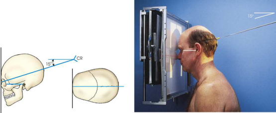

# Rx Facial Bone Radiography — Incidență PA Axială — Incidență Occipito-Frontală (Metoda Caldwell) (Merrill)

  📷 Radiografie Convențională (Rx)
  <strong>Actualizat:</strong> 2026-09-16
  <strong>Autor:</strong> Referință Merrill

---

-   __1. Rezumat Clinic & Indicații__

    ---

    === "Indicații Clinice"

        - Conform reperelor anatomice standard din tratat

    === "Ghid Național IRIS"

        !!! info "Referință Primară: Ghidul Național IRIS (Ordinul MS 1342/2012)"
            - **Capitol Ghid IRIS:** *Ghidul Național IRIS*
            - **Grad de Recomandare:** **De verificat pe indicație; fără grad atribuit automat**
            - **Nivel de Iradiere Estimată:** `De verificat pentru examinarea și populația selectate`

            [:octicons-search-16: Deschide Ghidul IRIS](../../iris.md){ .md-button .md-button--primary } [:material-open-in-new: Aplicația Oficială PWA](https://radiologie-pediatrica.ro/iris/){ .md-button target="_blank" rel="noopener" }
-   __2. Poziționare & Centrare Fascicul__

    ---

    - **Poziție Pacient:** se așază pacientul în Decubit ventral sau Poziție Șezândă poziție. Center MSP de pacientul’s corp la linia mediană grilă. se sprijină pacientul’s forehead și nose pe masa de examinare sau pe / sprijinit de stativ vertical Bucky. se flectează pacient’s coate, și place brațele în comfortable poziție.; se ajustează flexion de pacientul’s neck astfel încât linie orbitomeatală (LOM) este perpendicular pe plane de receptorul de imagine. If pacientul este obese sau hypersthenic, small radiolucent sponge poate need la fie plasat în front de forehead. Align MSP de capul perpendicular pe receptorul de imagine (RI) prin adjusting lateral margins de Orbite sau conduct auditiv extern (CAE) echidistant față de tabletop. Se imobilizează capul pacientului, și se centrează receptorul de imagine la nazion (Fig. 11.115).
    - **Punct de Centrare Fascicul:** se orientează raza centrală centrală la exit nazion la un unghi de 15 grade caudal. la show orbital rims, în particular, orbital floors, use a 30-grade caudal angle (sometimes referred la ca exaͨ erated Caldwell). Se centrează receptorul de imagine pe raza centrală.
    - **Distanță Focar-Film (DFF / SID):** Nespecificat în fragmentul extras; de verificat în sursă
    - **Comandă Respiratorie:** apnee (oprirea respirației).

-   __3. Parametri Tehnici Expunere__

    ---

    | Parametru Tehnic | Valoare Configurare Generator / Tub |
    |:-----------------|:-------------------------------------|
    | **Tensiune Tub (kV)** | DE CONFIGURAT PE APARAT |
    | **Sarcină / Produs Curent-Timp (mAs)** | DE CONFIGURAT PE APARAT |
    | **Distanță Focar-Film (DFF / SID)** | Nespecificat în fragmentul extras; de verificat în sursă |
    | **Grilă Antidifuzoare (Bucky)** | DE CONFIGURAT PE APARAT |
    | **Dimensiune Focar** | DE CONFIGURAT PE APARAT |
    | **Camere de Ionizare AEC** | DE CONFIGURAT PE APARAT |
    | **Colimare Fascicul** | se ajustează câmp de iradiere la extend about 1 inch (2.5 cm) beyond lateral sides de fața, superiorly pentru include supraorbital margins, și inferiorly la bărbia. expunere field trebuie să fie fără larger than 8 × 10 inches (18 × 24 cm). Place marker de lateralitate (D/S) în collimated expunere field. |
    | **Filtrare Tub** | DE CONFIGURAT PE APARAT |

-   __4. Criterii de Calitate & Reușită Imagine__

    ---

    - Criterii radiologice de calitate imaginii: n Evidence de corect collimation și presence de marker de lateralitate (D/S) plasat clear de anatomy de interest n Entire Orbite și Masiv Facial (Oase ale Feței) n Absența rotației anatomice (simetrie bilaterală perfectă) sau tilt, evidențiat prin:
    - Equal distances de la lateral margini de Craniu la lateral margini de Orbite pe ambele părți (bilateral)
    - MSP de cap aliniat cu axa longitudinală de câmp colimat n simetric stânci temporale (piramide pietroase) culcat în lower third de orbit n Bony detail și surrounding soft tissues

-   __5. Protecție Radiologică (ALARA)__

    ---

    - Nespecificat în fragmentul extras; de verificat în sursă

!!! note "Observații Clinice & Tehnice"
    Conform reperelor anatomice standard din tratat

### 🖼️ Imagini

<figure class="protocol-image-card" markdown>

<figcaption><strong>Merrill — pagina PDF 912, imaginea 1</strong> — Imagine din fragmentul sursă; asocierea necesită revizie.</figcaption>

</figure>

=== "Ghid Rapid de Execuție"

    1. **Identificarea și verificarea pacientului:** verificare identitate, zonă de examinat, consimțământ conform procedurii și evaluarea posibilității unei sarcini, când este relevantă.
    2. **Pregătire:** îndepărtarea oricăror obiecte radiopace (bijuterii, agrafe, fermoare, proteze, pansamente dense).
    3. **Poziționare precisă:** alinierea receptorului de imagine și a tubului la distanța prescrisă (Nespecificat în fragmentul extras; de verificat în sursă).
    4. **Colimare strictă:** adaptarea fasciculului strict la regiunea de diagnostic pentru scăderea iradierii și reducerea radiației difuze.
    5. **Radioprotecție:** verificarea [politicii RX](../radioprotectie.md), cu măsuri distincte pentru pacient, personal și însoțitor.

## Surse de documentare

- [Merrill’s Atlas, 11. Cranium, pagini PDF 911–912](../../assets/protocols/sources/a56d45c16829_Merrills_Atlas_of_Radiographic_Positioning__Procedures_3Vol_Set.pdf#page=911)

## Fragmente sursă traduse (referință tehnică)

### anatomy

orbital rims, maxillae, nasal septum, zygomatic bones, și anterior nasal coloană vertebrală. When raza centrală este Înclinat 15 grade caudal la nazion, stânci temporale (piramide pietroase) sunt projected into lower third de orbits (Fig. 11.116). When raza centrală este Înclinat 30 grade caudal, stânci temporale (piramide pietroase) sunt projected below inferior margins de orbits.

### collimation

• se ajustează câmp de iradiere la extend about 1 inch (2.5 cm) beyond lateral sides de fața, superiorly pentru include supraorbital
margins, și inferiorly la bărbia. expunere field trebuie să fie fără larger than 8 × 10 inches (18 × 24 cm). Place marker de lateralitate (D/S) în collimated expunere field.

### cr

• se orientează raza centrală centrală la exit nazion la un unghi de 15 grade caudal.
• la show orbital rims, în particular, orbital floors, use a 30-grade caudal angle (sometimes referred la ca exaͨ erated
Caldwell).
• Se centrează receptorul de imagine pe raza centrală.

### criteria

Criterii radiologice de calitate imaginii:
n Evidence de corect collimation și presence de marker de lateralitate (D/S) plasat clear de anatomy de interest
n Entire orbits și facial bones
n Absența rotației anatomice (simetrie bilaterală perfectă) sau tilt, evidențiat prin:
• Equal distances de la lateral margini de skull la lateral margini de orbits pe ambele părți (bilateral)
• MSP de cap aliniat cu axa longitudinală de câmp colimat
n simetric stânci temporale (piramide pietroase) culcat în lower third de orbit
n Bony detail și surrounding soft tissues

### part_pos

• se ajustează flexion de pacientul’s neck astfel încât linie orbitomeatală (LOM) este perpendicular pe plane de receptorul de imagine.
• If pacientul este obese sau hypersthenic, small radiolucent sponge poate need la fie plasat în front de forehead.
• Align MSP de capul perpendicular pe receptorul de imagine (RI) prin adjusting lateral margins de orbits sau conduct auditiv extern (CAE) echidistant față de tabletop.
• Se imobilizează capul pacientului, și se centrează receptorul de imagine la nazion (Fig. 11.115).

### patient_pos

• se așază pacientul în decubit ventral sau așezat pe scaun poziție.
• Center MSP de pacientul’s corp la linia mediană grilă.
• se sprijină pacientul’s forehead și nose pe masa de examinare sau pe / sprijinit de stativ vertical Bucky.
• se flectează pacient’s coate, și place brațele în comfortable poziție.

### respiration

apnee (oprirea respirației).

### tech

poziționat prin manufacturer sau department protocol pentru corect anatomy display orientation; raza centrală plate: 10 × 12 inches (24 ×
30 cm) longitudinal.

