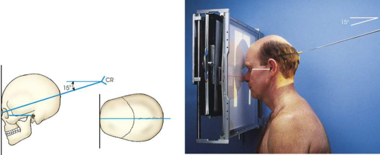

# Radiografia oaselor feței — Incidență PA axială — Incidență occipito-frontală (Metoda Caldwell) (Merrill)

  📷 Radiografie Convențională (Rx)
  <strong>Actualizat:</strong> 2026-09-16
  <strong>Autor:</strong> Referință Merrill

---

-   __1. Rezumat Clinic & Indicații__

    ---

    === "Indicații Clinice"

        - Conform reperelor anatomice standard din tratat

    === "Ghid Național IRIS"

        !!! info "Referință Primară: Ghidul Național IRIS (Ordinul MS 1342/2012)"
            - **Capitol Ghid IRIS:** *Ghidul Național IRIS*
            - **Grad de Recomandare:** **De verificat pe indicație; fără grad atribuit automat**
            - **Nivel de Iradiere Estimată:** `De verificat pentru examinarea și populația selectate`

            [:octicons-search-16: Deschide Ghidul IRIS](../../iris.md){ .md-button .md-button--primary } [:material-open-in-new: Aplicația Oficială PWA](https://radiologie-pediatrica.ro/iris/){ .md-button target="_blank" rel="noopener" }
-   __2. Poziționare & Centrare Fascicul__

    ---

    - **Poziție Pacient:** se așază pacientul în decubit ventral sau în poziție șezândă. Se centrează MSP al corpului pacientului pe linia mediană a grilei. Se sprijină fruntea și nasul pacientului pe masa de examinare sau pe stativul vertical Bucky. Se flectează coatele pacientului și se așază brațele într-o poziție confortabilă. Se ajustează flexia gâtului pacientului astfel încât linia orbitomeatală (LOM) să fie perpendiculară pe planul receptorului de imagine. Dacă pacientul este obez sau hiperstenic, poate fi necesar să se plaseze un burete radiotransparent în fața frunții. Se aliniază MSP al capului perpendicular pe receptorul de imagine (RI), ajustând marginile laterale ale orbitelor sau conductele auditive externe (CAE) astfel încât să fie echidistante față de tăblia mesei. Se imobilizează capul pacientului și se centrează receptorul de imagine la nivelul nazionului (Fig. 11.115).
    - **Punct de Centrare Fascicul:** se orientează raza centrală spre ieșirea nazionului, la un unghi de 15 grade caudal. Pentru evidențierea marginilor orbitare, în special a planșeelor orbitare, se utilizează un unghi de 30 de grade caudal (denumit uneori Caldwell exagerat). Se centrează receptorul de imagine pe raza centrală.
    - **Distanță Focar-Film (DFF / SID):** Nespecificat în fragmentul extras; de verificat în sursă
    - **Comandă Respiratorie:** apnee (oprirea respirației).

-   __3. Parametri Tehnici Expunere__

    ---

    | Parametru Tehnic | Valoare Configurare Generator / Tub |
    |:-----------------|:-------------------------------------|
    | **Tensiune Tub (kV)** | DE CONFIGURAT PE APARAT |
    | **Sarcină / Produs Curent-Timp (mAs)** | DE CONFIGURAT PE APARAT |
    | **Distanță Focar-Film (DFF / SID)** | Nespecificat în fragmentul extras; de verificat în sursă |
    | **Grilă Antidifuzoare (Bucky)** | DE CONFIGURAT PE APARAT |
    | **Dimensiune Focar** | DE CONFIGURAT PE APARAT |
    | **Camere de Ionizare AEC** | DE CONFIGURAT PE APARAT |
    | **Colimare Fascicul** | se ajustează câmpul de iradiere pentru a se extinde cu aproximativ 1 inch (2.5 cm) dincolo de marginile laterale ale feței, superior pentru a include marginile supraorbitare și inferior până la bărbie. Câmpul de expunere nu trebuie să fie mai mare de 8 × 10 inches (18 × 24 cm). Se plasează markerul de lateralitate (D/S) în câmpul de expunere colimat. |
    | **Filtrare Tub** | DE CONFIGURAT PE APARAT |

-   __4. Criterii de Calitate & Reușită Imagine__

    ---

    - Criterii radiologice de calitate a imaginii: n Dovada colimării corecte și prezența markerului de lateralitate (D/S), plasat clar față de anatomia de interes n Orbitele în întregime și masivul facial (oasele feței) n Absența rotației anatomice (simetrie bilaterală perfectă) sau a înclinării, evidențiată prin:
    - Distanțe egale de la marginile laterale ale craniului la marginile laterale ale orbitelor pe ambele părți (bilateral)
    - MSP al capului aliniat cu axa longitudinală a câmpului colimat; stâncile temporale (piramidele pietroase) proiectate simetric în treimea inferioară a orbitelor; detaliu osos și țesuturi moi înconjurătoare

-   __5. Protecție Radiologică (ALARA)__

    ---

    - Nespecificat în fragmentul extras; de verificat în sursă

!!! note "Observații Clinice & Tehnice"
    Conform reperelor anatomice standard din tratat

### 🖼️ Imagini

<figure class="protocol-image-card" markdown>

<figcaption><strong>Merrill — pagina 912, imaginea 1</strong> — Imagine din fragmentul sursă; asocierea necesită revizie.</figcaption>

</figure>

=== "Ghid Rapid de Execuție"

    1. **Identificarea și verificarea pacientului:** verificare identitate, zonă de examinat, consimțământ conform procedurii și evaluarea posibilității unei sarcini, când este relevantă.
    2. **Pregătire:** îndepărtarea oricăror obiecte radiopace (bijuterii, agrafe, fermoare, proteze, pansamente dense).
    3. **Poziționare precisă:** alinierea receptorului de imagine și a tubului la distanța prescrisă (Nespecificat în fragmentul extras; de verificat în sursă).
    4. **Colimare strictă:** adaptarea fasciculului strict la regiunea de diagnostic pentru scăderea iradierii și reducerea radiației difuze.
    5. **Radioprotecție:** verificarea [politicii RX](../radioprotectie.md), cu măsuri distincte pentru pacient, personal și însoțitor.

## Surse de documentare

- [Merrill’s Atlas, 11. Cranium, pagini 911–912](https://books.google.com/books/about/Merrill_s_Atlas_of_Radiographic_Position.html?id=BM0lEQAAQBAJ)

## Fragmente sursă traduse (referință tehnică)

### anatomie

marginile orbitare, maxilarele, septul nazal, oasele zigomatice și coloana nazală anterioară. Când raza centrală este înclinată cu 15 grade caudal spre nazion, stâncile temporale (piramidele pietroase) sunt proiectate în treimea inferioară a orbitelor (Fig. 11.116). Când raza centrală este înclinată cu 30 de grade caudal, stâncile temporale (piramidele pietroase) sunt proiectate sub marginile inferioare ale orbitelor.

### colimare

• se ajustează câmpul de iradiere pentru a se extinde cu aproximativ 1 inch (2.5 cm) dincolo de marginile laterale ale feței, superior pentru a include marginile supraorbitare și inferior până la bărbie. Câmpul de expunere nu trebuie să fie mai mare de 8 × 10 inches (18 × 24 cm). Se plasează markerul de lateralitate (D/S) în câmpul de expunere colimat.

### raza centrală

• se orientează raza centrală spre ieșirea nazionului, la un unghi de 15 grade caudal.
• Pentru evidențierea marginilor orbitare, în special a planșeelor orbitare, se utilizează un unghi de 30 de grade caudal (denumit uneori Caldwell exagerat).
• Se centrează receptorul de imagine pe raza centrală.

### criterii

Criterii radiologice de calitate a imaginii:
▪ Dovezi de colimare corectă și prezența markerului de lateralitate (D/S), plasat clar în afara anatomiei de interes
▪ Orbitele și oasele feței în întregime
▪ Absența rotației anatomice (simetrie bilaterală perfectă) sau a înclinării, evidențiată prin:
• Distanțe egale de la marginile laterale ale craniului la marginile laterale ale orbitelor, bilateral
• MSP al capului aliniat cu axa longitudinală a câmpului colimat
▪ Stânci temporale (piramide pietroase) proiectate simetric în treimea inferioară a orbitelor
▪ Detaliu osos și țesuturi moi înconjurătoare

### part_pos

• se ajustează flexia gâtului pacientului astfel încât linia orbitomeatală (LOM) să fie perpendiculară pe planul receptorului de imagine.
• Dacă pacientul este obez sau hiperstenic, poate fi necesar să se plaseze un burete radiotransparent în fața frunții.
• Se aliniază MSP al capului perpendicular pe receptorul de imagine (RI), ajustând marginile laterale ale orbitelor sau conductele auditive externe (CAE) astfel încât să fie echidistante față de tăblia mesei.
• Se imobilizează capul pacientului și se centrează receptorul de imagine la nivelul nazionului (Fig. 11.115).

### patient_pos

• se așază pacientul în decubit ventral sau în poziție șezândă pe scaun.
• Se centrează MSP al corpului pacientului pe linia mediană a grilei.
• se sprijină fruntea și nasul pacientului pe masa de examinare sau pe stativul vertical Bucky.
• se flectează coatele pacientului și se așază brațele într-o poziție confortabilă.

### respirație

apnee (oprirea respirației).

### tehnică

Poziționat conform indicațiilor producătorului sau protocolului departamentului pentru orientarea corectă a afișării structurilor anatomice; placă pentru raza centrală: 10 × 12 țoli (24 ×
30 cm), longitudinal.

