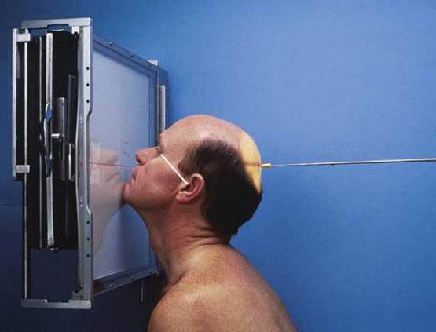
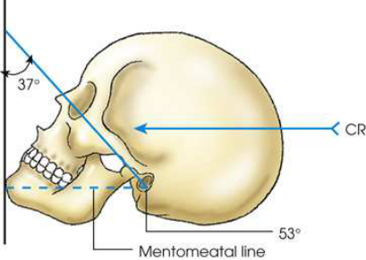
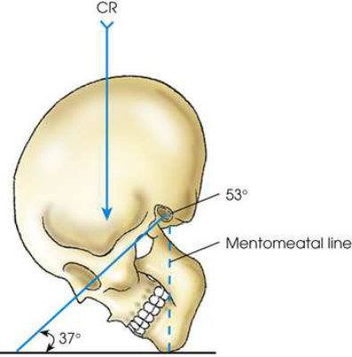
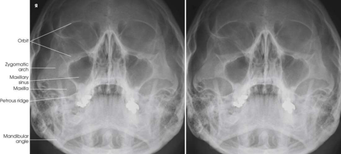
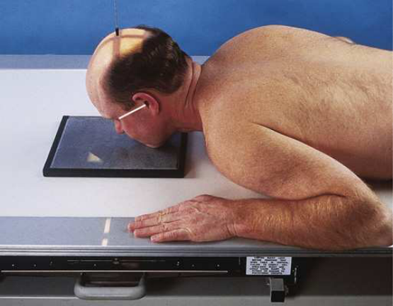
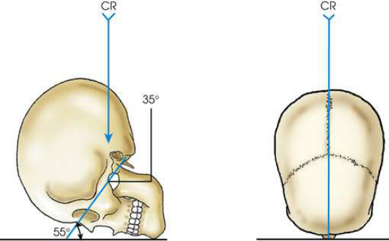

# Rx Facial Bone Radiography — Parietoacanthial Incidență — Incidență Occipito-Mentonieră (Metoda Waters) 9 (Merrill)

  📷 Radiografie Convențională (Rx)
  <strong>Actualizat:</strong> 2026-09-16
  <strong>Autor:</strong> Referință Merrill

---

-   __1. Rezumat Clinic & Indicații__

    ---

    === "Indicații Clinice"

        - Conform reperelor anatomice standard din tratat

    === "Ghid Național IRIS"

        !!! info "Referință Primară: Ghidul Național IRIS (Ordinul MS 1342/2012)"
            - **Capitol Ghid IRIS:** *Ghidul Național IRIS*
            - **Grad de Recomandare:** **De verificat pe indicație; fără grad atribuit automat**
            - **Nivel de Iradiere Estimată:** `De verificat pentru examinarea și populația selectate`

            [:octicons-search-16: Deschide Ghidul IRIS](../../iris.md){ .md-button .md-button--primary } [:material-open-in-new: Aplicația Oficială PWA](https://radiologie-pediatrica.ro/iris/){ .md-button target="_blank" rel="noopener" }
-   __2. Poziționare & Centrare Fascicul__

    ---

    - **Poziție Pacient:** se așază pacientul în Decubit ventral sau Poziție Șezândă-ortostatism. Center MSP de pacientul’s corp la linia mediană grilă device.; se sprijină pacientul’s cap pe tip de extins chin. Hyperextend gâtul astfel încât linie orbitomeatală (LOM) forms a 37-grade angle cu plane de receptorul de imagine. linie mentomeatală (LMM) este approximately perpendicular pe plane de receptorul de imagine; average pacient’s nose este about inch (1.9 cm) away de la grila device. se ajustează cap so that MSP este perpendicular pe plane de receptorul de imagine (Figs. 11.104–11.106). se centrează receptorul de imagine la nivelul acantion. Se imobilizează capul pacientului.
    - **Punct de Centrare Fascicul:** perpendicular la exit acantion
    - **Distanță Focar-Film (DFF / SID):** Nespecificat în fragmentul extras; de verificat în sursă
    - **Comandă Respiratorie:** apnee (oprirea respirației).

-   __3. Parametri Tehnici Expunere__

    ---

    | Parametru Tehnic | Valoare Configurare Generator / Tub |
    |:-----------------|:-------------------------------------|
    | **Tensiune Tub (kV)** | DE CONFIGURAT PE APARAT |
    | **Sarcină / Produs Curent-Timp (mAs)** | DE CONFIGURAT PE APARAT |
    | **Distanță Focar-Film (DFF / SID)** | Nespecificat în fragmentul extras; de verificat în sursă |
    | **Grilă Antidifuzoare (Bucky)** | DE CONFIGURAT PE APARAT |
    | **Dimensiune Focar** | DE CONFIGURAT PE APARAT |
    | **Camere de Ionizare AEC** | DE CONFIGURAT PE APARAT |
    | **Colimare Fascicul** | se ajustează câmp de iradiere la 1 inch (2.5 cm) beyond shadows de lateral sides de fața, superiorly pentru include supraorbital margins și inferiorly la level de bărbia. expunere field trebuie să fie fără larger than 8 × 10 inches (18 × 24 cm). Place marker de lateralitate (D/S) în collimated expunere field. |
    | **Filtrare Tub** | DE CONFIGURAT PE APARAT |

-   __4. Criterii de Calitate & Reușită Imagine__

    ---

    - Criterii radiologice de calitate imaginii: n Evidence de corect collimation și presence de marker de lateralitate (D/S) plasat clear de anatomy de interest n Entire Orbite și Masiv Facial (Oase ale Feței) n Absența rotației anatomice (simetrie bilaterală perfectă) sau tilt, evidențiat prin:
    - Distances între lateral margini de Craniu și Orbite equal pe fiecare side
    - MSP de cap aliniat cu axa longitudinală de câmp colimat n stânci temporale (piramide pietroase) projected immediately below sinusuri maxilare n părți moi și bony detalii trabeculare osoase

-   __5. Protecție Radiologică (ALARA)__

    ---

    - Nespecificat în fragmentul extras; de verificat în sursă

!!! note "Observații Clinice & Tehnice"
    Conform reperelor anatomice standard din tratat

### 🖼️ Imagini

<figure class="protocol-image-card" markdown>

<figcaption><strong>Merrill — pagina PDF 906, imaginea 1</strong> — Imagine din fragmentul sursă; asocierea necesită revizie.</figcaption>

</figure>

<figure class="protocol-image-card" markdown>

<figcaption><strong>Merrill — pagina PDF 906, imaginea 2</strong> — Imagine din fragmentul sursă; asocierea necesită revizie.</figcaption>

</figure>

<figure class="protocol-image-card" markdown>

<figcaption><strong>Merrill — pagina PDF 907, imaginea 3</strong> — Imagine din fragmentul sursă; asocierea necesită revizie.</figcaption>

</figure>

<figure class="protocol-image-card" markdown>

<figcaption><strong>Merrill — pagina PDF 907, imaginea 4</strong> — Imagine din fragmentul sursă; asocierea necesită revizie.</figcaption>

</figure>

<figure class="protocol-image-card" markdown>

<figcaption><strong>Merrill — pagina PDF 908, imaginea 5</strong> — Imagine din fragmentul sursă; asocierea necesită revizie.</figcaption>

</figure>

<figure class="protocol-image-card" markdown>

<figcaption><strong>Merrill — pagina PDF 908, imaginea 6</strong> — Imagine din fragmentul sursă; asocierea necesită revizie.</figcaption>

</figure>

=== "Ghid Rapid de Execuție"

    1. **Identificarea și verificarea pacientului:** verificare identitate, zonă de examinat, consimțământ conform procedurii și evaluarea posibilității unei sarcini, când este relevantă.
    2. **Pregătire:** îndepărtarea oricăror obiecte radiopace (bijuterii, agrafe, fermoare, proteze, pansamente dense).
    3. **Poziționare precisă:** alinierea receptorului de imagine și a tubului la distanța prescrisă (Nespecificat în fragmentul extras; de verificat în sursă).
    4. **Colimare strictă:** adaptarea fasciculului strict la regiunea de diagnostic pentru scăderea iradierii și reducerea radiației difuze.
    5. **Radioprotecție:** verificarea [politicii RX](../radioprotectie.md), cu măsuri distincte pentru pacient, personal și însoțitor.

## Surse de documentare

- [Merrill’s Atlas, 11. Cranium, pagini PDF 905–908](../../assets/protocols/sources/a56d45c16829_Merrills_Atlas_of_Radiographic_Positioning__Procedures_3Vol_Set.pdf#page=905)

## Fragmente sursă traduse (referință tehnică)

### anatomy

orbits, maxillae, și zygomatic arches (Fig. 11.107).

### collimation

• se ajustează câmp de iradiere la 1 inch (2.5 cm) beyond shadows de lateral sides de fața, superiorly pentru include supraorbital
margins și inferiorly la level de bărbia. expunere field trebuie să fie fără larger than 8 × 10 inches (18 × 24 cm). Place side
marker în collimated expunere field.

### cr

• perpendicular la exit acantion

### criteria

Criterii radiologice de calitate imaginii:
n Evidence de corect collimation și presence de marker de lateralitate (D/S) plasat clear de anatomy de interest
n Entire orbits și facial bones
n Absența rotației anatomice (simetrie bilaterală perfectă) sau tilt, evidențiat prin:
• Distances între lateral margini de craniul și orbits equal pe fiecare side
• MSP de cap aliniat cu axa longitudinală de câmp colimat
n stânci temporale (piramide pietroase) projected immediately below sinusuri maxilare
n părți moi și bony detalii trabeculare osoase

### part_pos

• se sprijină pacientul’s cap pe tip de extins chin. Hyperextend gâtul astfel încât linie orbitomeatală (LOM) forms a 37-grade angle cu plane
de receptorul de imagine.
• linie mentomeatală (LMM) este approximately perpendicular pe plane de receptorul de imagine; average pacient’s nose este about
inch (1.9 cm) away de la grila device.
• se ajustează cap so that MSP este perpendicular pe plane de receptorul de imagine (Figs. 11.104–11.106).
• se centrează receptorul de imagine la nivelul acantion.
• Se imobilizează capul pacientului.

### patient_pos

• se așază pacientul în decubit ventral sau așezat pe scaun-ortostatism.
• Center MSP de pacientul’s corp la linia mediană grilă device.

### respiration

apnee (oprirea respirației).

### tech

poziționat prin manufacturer sau department protocol pentru corect anatomy display orientation; raza centrală plate: 10 × 12 inches (24 ×
30 cm) longitudinal.

