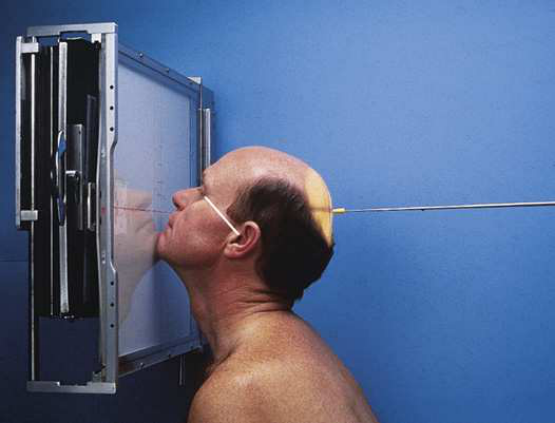
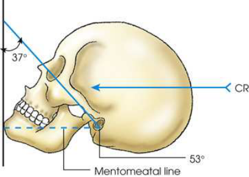
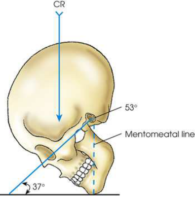
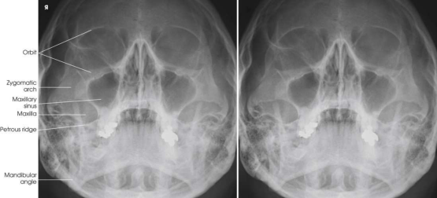
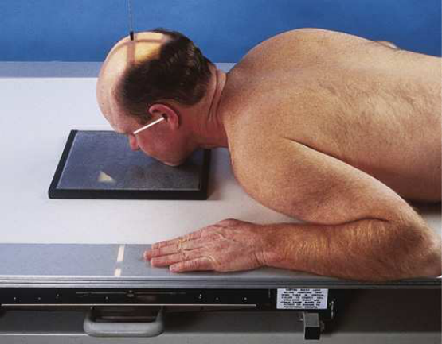
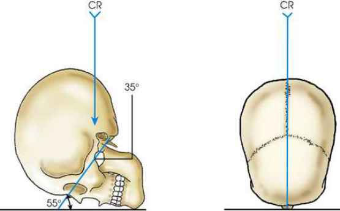

# Radiografia oaselor feței — Incidență parietoacantială — Incidență occipito-mentonieră (Metoda Waters) 9 (Merrill)

  📷 Radiografie Convențională (Rx)
  <strong>Actualizat:</strong> 2026-09-16
  <strong>Autor:</strong> Referință Merrill

---

-   __1. Rezumat Clinic & Indicații__

    ---

    === "Indicații Clinice"

        - Conform reperelor anatomice standard din tratat

    === "Ghid Național IRIS"

        !!! info "Referință Primară: Ghidul Național IRIS (Ordinul MS 1342/2012)"
            - **Capitol Ghid IRIS:** *Ghidul Național IRIS*
            - **Grad de Recomandare:** **De verificat pe indicație; fără grad atribuit automat**
            - **Nivel de Iradiere Estimată:** `De verificat pentru examinarea și populația selectate`

            [:octicons-search-16: Deschide Ghidul IRIS](../../iris.md){ .md-button .md-button--primary } [:material-open-in-new: Aplicația Oficială PWA](https://radiologie-pediatrica.ro/iris/){ .md-button target="_blank" rel="noopener" }
-   __2. Poziționare & Centrare Fascicul__

    ---

    - **Poziție Pacient:** se așază pacientul în decubit ventral sau în poziție șezândă-ortostatism. Se centrează MSP al corpului pacientului pe linia mediană a dispozitivului cu grilă. Se sprijină capul pacientului pe suport, cu bărbia extinsă. Se hiperextinde gâtul astfel încât linia orbitomeatală (LOM) să formeze un unghi de 37 de grade cu planul receptorului de imagine. Linia mentomeatală (LMM) este aproximativ perpendiculară pe planul receptorului de imagine; nasul pacientului mediu se află la aproximativ inch (1.9 cm) de dispozitivul cu grilă. Se ajustează capul astfel încât MSP să fie perpendicular pe planul receptorului de imagine (Figs. 11.104–11.106). Se centrează receptorul de imagine la nivelul acantionului. Se imobilizează capul pacientului.
    - **Punct de Centrare Fascicul:** perpendiculară pe ieșirea acantionului
    - **Distanță Focar-Film (DFF / SID):** Nespecificat în fragmentul extras; de verificat în sursă
    - **Comandă Respiratorie:** apnee (oprirea respirației).

-   __3. Parametri Tehnici Expunere__

    ---

    | Parametru Tehnic | Valoare Configurare Generator / Tub |
    |:-----------------|:-------------------------------------|
    | **Tensiune Tub (kV)** | DE CONFIGURAT PE APARAT |
    | **Sarcină / Produs Curent-Timp (mAs)** | DE CONFIGURAT PE APARAT |
    | **Distanță Focar-Film (DFF / SID)** | Nespecificat în fragmentul extras; de verificat în sursă |
    | **Grilă Antidifuzoare (Bucky)** | DE CONFIGURAT PE APARAT |
    | **Dimensiune Focar** | DE CONFIGURAT PE APARAT |
    | **Camere de Ionizare AEC** | DE CONFIGURAT PE APARAT |
    | **Colimare Fascicul** | se ajustează câmpul de iradiere la 1 inch (2.5 cm) dincolo de umbrele marginilor laterale ale feței, superior pentru a include marginile supraorbitare și inferior până la nivelul bărbiei. Câmpul de expunere nu trebuie să fie mai mare de 8 × 10 inches (18 × 24 cm). Se plasează markerul de lateralitate (D/S) în câmpul de expunere colimat. |
    | **Filtrare Tub** | DE CONFIGURAT PE APARAT |

-   __4. Criterii de Calitate & Reușită Imagine__

    ---

    - Criterii radiologice de calitate a imaginii: n Dovada colimării corecte și prezența markerului de lateralitate (D/S), plasat clar față de anatomia de interes n Orbitele în întregime și masivul facial (oasele feței) n Absența rotației anatomice (simetrie bilaterală perfectă) sau a înclinării, evidențiată prin:
    - Distanțe egale între marginile laterale ale craniului și orbite, pe fiecare parte
    - MSP al capului aliniat cu axa longitudinală a câmpului colimat; stâncile temporale (piramidele pietroase) proiectate imediat sub sinusurile maxilare; țesuturi moi și detalii osoase trabeculare

-   __5. Protecție Radiologică (ALARA)__

    ---

    - Nespecificat în fragmentul extras; de verificat în sursă

!!! note "Observații Clinice & Tehnice"
    Conform reperelor anatomice standard din tratat

### 🖼️ Imagini

<figure class="protocol-image-card" markdown>

<figcaption><strong>Merrill — pagina 906, imaginea 1</strong> — Imagine din fragmentul sursă; asocierea necesită revizie.</figcaption>

</figure>

<figure class="protocol-image-card" markdown>

<figcaption><strong>Merrill — pagina 906, imaginea 2</strong> — Imagine din fragmentul sursă; asocierea necesită revizie.</figcaption>

</figure>

<figure class="protocol-image-card" markdown>

<figcaption><strong>Merrill — pagina 907, imaginea 3</strong> — Imagine din fragmentul sursă; asocierea necesită revizie.</figcaption>

</figure>

<figure class="protocol-image-card" markdown>

<figcaption><strong>Merrill — pagina 907, imaginea 4</strong> — Imagine din fragmentul sursă; asocierea necesită revizie.</figcaption>

</figure>

<figure class="protocol-image-card" markdown>

<figcaption><strong>Merrill — pagina 908, imaginea 5</strong> — Imagine din fragmentul sursă; asocierea necesită revizie.</figcaption>

</figure>

<figure class="protocol-image-card" markdown>

<figcaption><strong>Merrill — pagina 908, imaginea 6</strong> — Imagine din fragmentul sursă; asocierea necesită revizie.</figcaption>

</figure>

=== "Ghid Rapid de Execuție"

    1. **Identificarea și verificarea pacientului:** verificare identitate, zonă de examinat, consimțământ conform procedurii și evaluarea posibilității unei sarcini, când este relevantă.
    2. **Pregătire:** îndepărtarea oricăror obiecte radiopace (bijuterii, agrafe, fermoare, proteze, pansamente dense).
    3. **Poziționare precisă:** alinierea receptorului de imagine și a tubului la distanța prescrisă (Nespecificat în fragmentul extras; de verificat în sursă).
    4. **Colimare strictă:** adaptarea fasciculului strict la regiunea de diagnostic pentru scăderea iradierii și reducerea radiației difuze.
    5. **Radioprotecție:** verificarea [politicii RX](../radioprotectie.md), cu măsuri distincte pentru pacient, personal și însoțitor.

## Surse de documentare

- [Merrill’s Atlas, 11. Cranium, pagini 905–908](https://books.google.com/books/about/Merrill_s_Atlas_of_Radiographic_Position.html?id=BM0lEQAAQBAJ)

## Fragmente sursă traduse (referință tehnică)

### anatomie

orbitele, maxilarele și arcadele zigomatice (Fig. 11.107).

### colimare

• se ajustează câmpul de iradiere la 1 inch (2.5 cm) dincolo de umbrele marginilor laterale ale feței, superior pentru a include marginile supraorbitare și inferior până la nivelul bărbiei. Câmpul de expunere nu trebuie să fie mai mare de 8 × 10 inches (18 × 24 cm). Se plasează markerul lateral în câmpul de expunere colimat.

### raza centrală

• perpendiculară pe ieșirea acantionului

### criterii

Criterii radiologice de calitate a imaginii:
▪ Dovezi de colimare corectă și prezența markerului de lateralitate (D/S), plasat clar în afara anatomiei de interes
▪ Orbitele și oasele feței în întregime
▪ Absența rotației anatomice (simetrie bilaterală perfectă) sau a înclinării, evidențiată prin:
• Distanțe egale între marginile laterale ale craniului și orbite, pe fiecare parte
• MSP al capului aliniat cu axa longitudinală a câmpului colimat
▪ Stânci temporale (piramide pietroase) proiectate imediat sub sinusurile maxilare
▪ Țesuturi moi și detalii osoase trabeculare

### part_pos

• se sprijină capul pacientului pe suport, cu bărbia extinsă. Se hiperextinde gâtul astfel încât linia orbitomeatală (LOM) să formeze un unghi de 37 de grade cu planul receptorului de imagine.
• Linia mentomeatală (LMM) este aproximativ perpendiculară pe planul receptorului de imagine; nasul pacientului mediu se află la aproximativ inch (1.9 cm) de dispozitivul cu grilă.
• se ajustează capul astfel încât MSP să fie perpendicular pe planul receptorului de imagine (Figs. 11.104–11.106).
• se centrează receptorul de imagine la nivelul acantionului.
• Se imobilizează capul pacientului.

### patient_pos

• se așază pacientul în decubit ventral sau așezat pe scaun, în ortostatism.
• Se centrează MSP al corpului pacientului pe linia mediană a dispozitivului cu grilă.

### respirație

apnee (oprirea respirației).

### tehnică

Poziționat conform indicațiilor producătorului sau protocolului departamentului pentru orientarea corectă a afișării structurilor anatomice; placă pentru raza centrală: 10 × 12 țoli (24 ×
30 cm), longitudinal.

