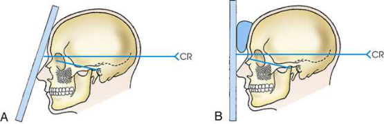
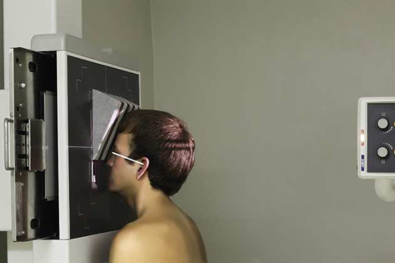

# Rx Frontal and Anterior Ethmoidal Sinuses — Incidență PA Axială — Incidență Occipito-Frontală (Metoda Caldwell) landmarks and localization planes remain unchanged. (Merrill)

  📷 Radiografie Convențională (Rx)
  <strong>Actualizat:</strong> 2026-09-16
  <strong>Autor:</strong> Referință Merrill

---

-   __1. Rezumat Clinic & Indicații__

    ---

    === "Indicații Clinice"

        - Conform reperelor anatomice standard din tratat

    === "Ghid Național IRIS"

        !!! info "Referință Primară: Ghidul Național IRIS (Ordinul MS 1342/2012)"
            - **Capitol Ghid IRIS:** *Ghidul Național IRIS*
            - **Grad de Recomandare:** **De verificat pe indicație; fără grad atribuit automat**
            - **Nivel de Iradiere Estimată:** `De verificat pentru examinarea și populația selectate`

            [:octicons-search-16: Deschide Ghidul IRIS](../../iris.md){ .md-button .md-button--primary } [:material-open-in-new: Aplicația Oficială PWA](https://radiologie-pediatrica.ro/iris/){ .md-button target="_blank" rel="noopener" }
-   __2. Poziționare & Centrare Fascicul__

    ---

    - **Poziție Pacient:** se așază pacientul pe scaun facing stativ vertical Bucky. Center MSP de pacientul’s corp la linia mediană grilă.; înclinat grilă technique Before positioning pacientul, tilt stativ vertical Bucky down so that angle de 15 grade este obtained (Fig. 11.171A). se sprijină pacientul’s nose și forehead pe stativ vertical Bucky, și se centrează nazion la receptorul de imagine. se ajustează MSP și linie orbitomeatală (LOM) de pacientul’s cap perpendicular pe plane de receptorul de imagine. This positioning places linie orbitomeatală (LOM) perpendicular pe înclinat receptorul de imagine și 15 grade de la raza centrală orizontală centrală. Se imobilizează capul pacientului.
    - **Punct de Centrare Fascicul:** orientat horizon̍ al la exit nazion. 15-grade relationship între raza centrală și linie orbitomeatală (LOM) remains same pentru ambele techniques. Se centrează receptorul de imagine pe raza centrală.
    - **Distanță Focar-Film (DFF / SID):** Nespecificat în fragmentul extras; de verificat în sursă
    - **Comandă Respiratorie:** apnee (oprirea respirației). vertical grilă technique When stativ vertical Bucky cannot fie înclinat, se extinde pacient’s neck slightly, rest tip de nasul pe grila device, și se centrează nazion la receptorul de imagine. se poziționează pacientul’s cap astfel încât linie orbitomeatală (LOM) forms angle de 15 grade cu raza centrală orizontală centrală. pentru support, place radiolucent sponge între forehead și grila device (see Figs. 11.171B și 11.172). se ajustează MSP de pacientul’s cap perpendicular pe plane de receptorul de imagine. Se imobilizează capul pacientului. apnee (oprirea respirației).

-   __3. Parametri Tehnici Expunere__

    ---

    | Parametru Tehnic | Valoare Configurare Generator / Tub |
    |:-----------------|:-------------------------------------|
    | **Tensiune Tub (kV)** | DE CONFIGURAT PE APARAT |
    | **Sarcină / Produs Curent-Timp (mAs)** | DE CONFIGURAT PE APARAT |
    | **Distanță Focar-Film (DFF / SID)** | Nespecificat în fragmentul extras; de verificat în sursă |
    | **Grilă Antidifuzoare (Bucky)** | DE CONFIGURAT PE APARAT |
    | **Dimensiune Focar** | DE CONFIGURAT PE APARAT |
    | **Camere de Ionizare AEC** | DE CONFIGURAT PE APARAT |
    | **Colimare Fascicul** | Conform reperelor anatomice standard din tratat |
    | **Filtrare Tub** | DE CONFIGURAT PE APARAT |

-   __4. Criterii de Calitate & Reușită Imagine__

    ---

    - Conform reperelor anatomice standard din tratat

-   __5. Protecție Radiologică (ALARA)__

    ---

    - Nespecificat în fragmentul extras; de verificat în sursă

!!! note "Observații Clinice & Tehnice"
    înclinat grilă technique este preferred because it brings receptorul de imagine closer la sinuses, increasing resolution. Angulation de grila device provides natural poziție pentru placement de pacientul’s nose și forehead.

### 🖼️ Imagini

<figure class="protocol-image-card" markdown>

<figcaption><strong>Merrill — pagina PDF 952, imaginea 1</strong> — Imagine din fragmentul sursă; asocierea necesită revizie.</figcaption>

</figure>

<figure class="protocol-image-card" markdown>

<figcaption><strong>Merrill — pagina PDF 952, imaginea 2</strong> — Imagine din fragmentul sursă; asocierea necesită revizie.</figcaption>

</figure>

=== "Ghid Rapid de Execuție"

    1. **Identificarea și verificarea pacientului:** verificare identitate, zonă de examinat, consimțământ conform procedurii și evaluarea posibilității unei sarcini, când este relevantă.
    2. **Pregătire:** îndepărtarea oricăror obiecte radiopace (bijuterii, agrafe, fermoare, proteze, pansamente dense).
    3. **Poziționare precisă:** alinierea receptorului de imagine și a tubului la distanța prescrisă (Nespecificat în fragmentul extras; de verificat în sursă).
    4. **Colimare strictă:** adaptarea fasciculului strict la regiunea de diagnostic pentru scăderea iradierii și reducerea radiației difuze.
    5. **Radioprotecție:** verificarea [politicii RX](../radioprotectie.md), cu măsuri distincte pentru pacient, personal și însoțitor.

## Surse de documentare

- [Merrill’s Atlas, 11. Cranium, pagini PDF 951–952](../../assets/protocols/sources/a56d45c16829_Merrills_Atlas_of_Radiographic_Positioning__Procedures_3Vol_Set.pdf#page=951)

## Fragmente sursă traduse (referință tehnică)

### cr

• orientat horizon̍ al la exit nazion. 15-grade relationship între raza centrală și linie orbitomeatală (LOM) remains same pentru ambele
techniques.
• Se centrează receptorul de imagine pe raza centrală.

### notes

înclinat grilă technique este preferred because it brings receptorul de imagine closer la sinuses, increasing resolution. Angulation de grila device
provides natural poziție pentru placement de pacientul’s nose și forehead.

### part_pos

înclinat grilă technique
• Before positioning pacientul, tilt stativ vertical Bucky down so that angle de 15 grade este obtained (Fig. 11.171A).
• se sprijină pacientul’s nose și forehead pe stativ vertical Bucky, și se centrează nazion la receptorul de imagine.
• se ajustează MSP și linie orbitomeatală (LOM) de pacientul’s cap perpendicular pe plane de receptorul de imagine.
• This positioning places linie orbitomeatală (LOM) perpendicular pe înclinat receptorul de imagine și 15 grade de la raza centrală orizontală centrală.
• Se imobilizează capul pacientului.

### patient_pos

• se așază pacientul pe scaun facing stativ vertical Bucky.
• Center MSP de pacientul’s corp la linia mediană grilă.

### respiration

apnee (oprirea respirației).
vertical grilă technique
• When stativ vertical Bucky cannot fie înclinat, se extinde pacient’s neck slightly, rest tip de nasul pe grila device, și center
nazion la receptorul de imagine.
• se poziționează pacientul’s cap astfel încât linie orbitomeatală (LOM) forms angle de 15 grade cu raza centrală orizontală centrală. pentru support, place radiolucent sponge între forehead și grila device (see Figs. 11.171B și 11.172).
• se ajustează MSP de pacientul’s cap perpendicular pe plane de receptorul de imagine.
• Se imobilizează capul pacientului.
apnee (oprirea respirației).

### tech

poziționat prin manufacturer sau department protocol pentru corect anatomy display orientation; raza centrală plate: 10 × 12 inches (24
× 30 cm) longitudinal.

