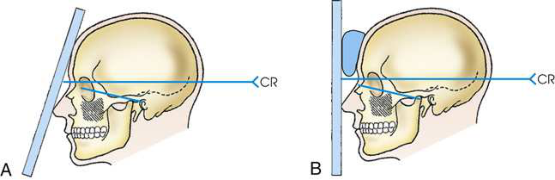
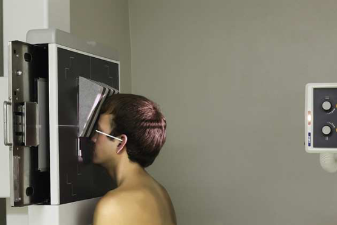

# Radiografia sinusurilor frontale și etmoidale anterioare — Incidență PA axială — Incidență occipito-frontală (Metoda Caldwell); reperele și planurile de localizare rămân neschimbate. (Merrill)

  📷 Radiografie Convențională (Rx)
  <strong>Actualizat:</strong> 2026-09-16
  <strong>Autor:</strong> Referință Merrill

---

-   __1. Rezumat Clinic & Indicații__

    ---

    === "Indicații Clinice"

        - Conform reperelor anatomice standard din tratat

    === "Ghid Național IRIS"

        !!! info "Referință Primară: Ghidul Național IRIS (Ordinul MS 1342/2012)"
            - **Capitol Ghid IRIS:** *Cap — ORL*
            - **Grad de Recomandare:** **Grad B**
            - **Nivel de Iradiere Estimată:** `Clasa 1 (Minimă < 0.1 mSv)`

            [:octicons-search-16: Deschide Ghidul IRIS](../../iris.md){ .md-button .md-button--primary } [:material-open-in-new: Aplicația Oficială PWA](https://radiologie-pediatrica.ro/iris/){ .md-button target="_blank" rel="noopener" }

-   __2. Poziționare & Centrare Fascicul__

    ---

    - **Poziție Pacient:** se așază pacientul pe scaun, cu fața spre stativul vertical Bucky. Se centrează MSP al corpului pacientului pe linia mediană a grilei. Tehnica cu grilă înclinată: înainte de poziționarea pacientului, se înclină în jos stativul vertical Bucky astfel încât să se obțină un unghi de 15 grade (Fig. 11.171A). Se sprijină nasul și fruntea pacientului pe stativul vertical Bucky și se centrează nazionul la receptorul de imagine. Se ajustează MSP și linia orbitomeatală (LOM) ale capului pacientului perpendicular pe planul receptorului de imagine. Această poziționare plasează linia orbitomeatală (LOM) perpendicular pe receptorul de imagine înclinat și la 15 grade față de raza centrală orizontală. Se imobilizează capul pacientului.
    - **Punct de Centrare Fascicul:** orientată orizontal spre ieșirea nazionului. Relația de 15 grade dintre raza centrală și linia orbitomeatală (LOM) rămâne aceeași pentru ambele tehnici. Se centrează receptorul de imagine pe raza centrală.
    - **Distanță Focar-Film (DFF / SID):** Nespecificat în fragmentul extras; de verificat în sursă
    - **Comandă Respiratorie:** apnee (oprirea respirației). Tehnica cu grilă verticală: când stativul vertical Bucky nu poate fi înclinat, se extinde ușor gâtul pacientului, se sprijină vârful nasului pe dispozitivul cu grilă și se centrează nazionul la receptorul de imagine. Se poziționează capul pacientului astfel încât linia orbitomeatală (LOM) să formeze un unghi de 15 grade cu raza centrală orizontală. Pentru susținere, se plasează un burete radiotransparent între frunte și dispozitivul cu grilă (a se vedea Fig. 11.171B și 11.172). Se ajustează MSP al capului pacientului perpendicular pe planul receptorului de imagine. Se imobilizează capul pacientului. Apnee (oprirea respirației).

-   __3. Parametri Tehnici Expunere__

    ---

    | Parametru Tehnic | Valoare Configurare Generator / Tub |
    |:-----------------|:-------------------------------------|
    | **Tensiune Tub (kV)** | DE CONFIGURAT PE APARAT |
    | **Sarcină / Produs Curent-Timp (mAs)** | DE CONFIGURAT PE APARAT |
    | **Distanță Focar-Film (DFF / SID)** | Nespecificat în fragmentul extras; de verificat în sursă |
    | **Grilă Antidifuzoare (Bucky)** | DE CONFIGURAT PE APARAT |
    | **Dimensiune Focar** | DE CONFIGURAT PE APARAT |
    | **Camere de Ionizare AEC** | DE CONFIGURAT PE APARAT |
    | **Colimare Fascicul** | Conform reperelor anatomice standard din tratat |
    | **Filtrare Tub** | DE CONFIGURAT PE APARAT |

-   __4. Criterii de Calitate & Reușită Imagine__

    ---

    - Conform reperelor anatomice standard din tratat

-   __5. Protecție Radiologică (ALARA)__

    ---

    - Nespecificat în fragmentul extras; de verificat în sursă

!!! note "Observații Clinice & Tehnice"
    Tehnica cu grilă înclinată este preferată deoarece aduce receptorul de imagine mai aproape de sinusuri, crescând rezoluția. Înclinarea dispozitivului cu grilă asigură o poziție naturală pentru plasarea nasului și frunții pacientului.

### 🖼️ Imagini

<figure class="protocol-image-card" markdown>

<figcaption><strong>Merrill — pagina 952, imaginea 1</strong> — Imagine din fragmentul sursă; asocierea necesită revizie.</figcaption>

</figure>

<figure class="protocol-image-card" markdown>

<figcaption><strong>Merrill — pagina 952, imaginea 2</strong> — Imagine din fragmentul sursă; asocierea necesită revizie.</figcaption>

</figure>

=== "Ghid Rapid de Execuție"

    1. **Identificarea și verificarea pacientului:** verificare identitate, zonă de examinat, consimțământ conform procedurii și evaluarea posibilității unei sarcini, când este relevantă.
    2. **Pregătire:** îndepărtarea oricăror obiecte radiopace (bijuterii, agrafe, fermoare, proteze, pansamente dense).
    3. **Poziționare precisă:** alinierea receptorului de imagine și a tubului la distanța prescrisă (Nespecificat în fragmentul extras; de verificat în sursă).
    4. **Colimare strictă:** adaptarea fasciculului strict la regiunea de diagnostic pentru scăderea iradierii și reducerea radiației difuze.
    5. **Radioprotecție:** verificarea [politicii RX](../radioprotectie.md), cu măsuri distincte pentru pacient, personal și însoțitor.

## Surse de documentare

- [Merrill’s Atlas, 11. Cranium, pagini 951–952](https://books.google.com/books/about/Merrill_s_Atlas_of_Radiographic_Position.html?id=BM0lEQAAQBAJ)
