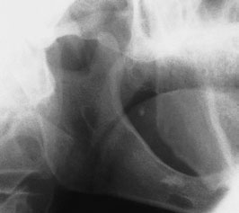
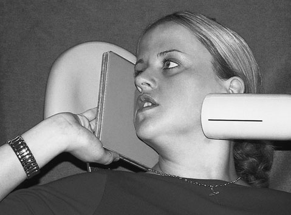

# Rx Mandibulă and maxilla Profil (Lateral) Oblică of the ramus of the Mandibulă

  📷 Radiografie Convențională (Rx)
  <strong>Actualizat:</strong> 2026-09-16
  <strong>Autor:</strong> Departamentul de Radiologie / Referință Clark (Ed. 12)

---

-   __1. Rezumat Clinic & Indicații__

    ---

    === "Indicații Clinice"

        - Evaluare radiografică regiunii Mandibulă și maxilla (Profil (lateral) Oblică de ramus de Mandibulă).
        - Suspiciune de leziuni traumatice (fracturi, luxații sau diastazis articular).
        - Bilanț osteoarticular / visceral conform recomandării medicale de trimitere.

    === "Ghid Național IRIS"

        !!! info "Referință Primară: Ghidul Național IRIS (Ordinul MS 1342/2012)"
            - **Capitol Ghid IRIS:** *Ghidul Național IRIS*
            - **Grad de Recomandare:** **De verificat pe indicație; fără grad atribuit automat**
            - **Nivel de Iradiere Estimată:** `De verificat pentru examinarea și populația selectate`

            [:octicons-search-16: Deschide Ghidul IRIS](../../iris.md){ .md-button .md-button--primary } [:material-open-in-new: Aplicația Oficială PWA](https://radiologie-pediatrica.ro/iris/){ .md-button target="_blank" rel="noopener" }
-   __2. Poziționare & Centrare Fascicul__

    ---

    - **Poziție Pacient:** • Pacientul stă așezat confortabil pe scaun, cu capul sprijinit. planul mediosagital este vertical.
• A 13  18-cm casetă este used cu removable film radiologic marker attached la designate side de Mandibulă la fie imaged.
• caseta este poziționat pe / sprijinit de pacient’s cheek overlying ascending ramus și posterior aspect de condyle de Mandibulă under investigation.
• caseta este poziționat so that its lower margine este paralel cu inferior margine de Mandibulă but lies la least 2 cm below it.
• positioning achieves a 10-grade angle de separation între plan mediosagital și film radiologic.
• pacientul este instructed la support caseta în this poziție.
• Mandibulă este extins ca far ca possible.
• Limit rotație de cap ( 10 grade) spre caseta.
    - **Punct de Centrare Fascicul:** • raza centrală este orientat posteriorly cu upward angulation (cranial) de 10 grade spre centre de ramus de Mandibulă pe side de interest.
• centring poziție de tubul este contralateral side de Mandibulă la point 2 cm below inferior margine în region de first/second permanent molar.
    - **Distanță Focar-Film (DFF / SID):** 100 cm
    - **Comandă Respiratorie:** Apnee pe durata expunerii (apnee în inspir pentru torace; expir pentru Abdomen/bazin).

-   __3. Parametri Tehnici Expunere__

    ---

    | Parametru Tehnic | Valoare Configurare Generator / Tub |
    |:-----------------|:-------------------------------------|
    | **Tensiune Tub (kV)** | DE CONFIGURAT PE APARAT |
    | **Sarcină / Produs Curent-Timp (mAs)** | Conform AEC / grosime anatomică |
    | **Distanță Focar-Film (DFF / SID)** | 100 cm |
    | **Grilă Antidifuzoare (Bucky)** | Conform grosimii anatomice (> 10-12 cm cu grilă) |
    | **Dimensiune Focar** | Focar Mic (0.6 mm) |
    | **Camere de Ionizare AEC** | DE CONFIGURAT PE APARAT |
    | **Colimare Fascicul** | Colimare strictă adaptată pe receptor 13 x 18 cm |
    | **Filtrare Tub** | Totală ≥ 2.5 mm Al echivalent (conform Clark: 3.0 mm Al eq.) |

-   __4. Criterii de Calitate & Reușită Imagine__

    ---

    - There trebuie să fie fără removable metallic corp străin radiopac.
    - There trebuie să fie fără mișcare artefacts.
    - There trebuie să fie fără Antero-posterior (AP) positioning errors.
    - There trebuie să fie fără evidence de excessive elongation.
    - There trebuie să fie fără evidence de incorrect orizontal angulation.
    - There trebuie să fie minimal superimposition de os hioid pe region de (clinical) interest.
    - There trebuie să fie good densitate optică și adecvat contrast între enamel și dentine.
    - There trebuie să fie fără pressure marks pe film radiologic și fără emulsion scratches. 316
    - There trebuie să fie fără roller marks (automatic processing only).
    - There trebuie să fie fără evidence de film radiologic fog.
    - There trebuie să fie fără chemical streaks/splashes/contamination.
    - There trebuie să fie fără evidence de inadequate fixation/washing.
    - name/date/stâng sau drept marker trebuie să fie legible. Profil (lateral) Oblică radiografie de ramus de Mandibulă casetă și X-ray tube poziții pentru drept Profil (lateral) Oblică radiografie de ramus de Mandibulă casetă Direction de X-ray fascicul Schematic la illustrate direction de fascicul pentru Profil (lateral) Oblică radiografie de ramus de Mandibulă

-   __5. Protecție Radiologică (ALARA)__

    ---

    - Ecranare gonadică cu șorț plumbat dacă gonadele sunt în apropierea fasciculului util (regula ALARA).
    - Colimare precisă la dimensiunea anatomică strict necesară pentru reducerea dozei și a radiației difuze.
    - Verificarea posibilității unei sarcini la pacientele de vârstă fertilă înainte de expunere.

!!! note "Observații Clinice & Tehnice"
    Some operators prefer slight ( 10 grade) downward (caudal) angulation de tubul la prevent imagine de os hioid being superimposed pe corp de Mandibulă.

### 🖼️ Imagini

<figure class="protocol-image-card" markdown>

<figcaption><strong>Profil (lateral) Oblică radiografie de ramus de Mandibulă</strong> — Poziționare pacient și centrare fascicul conform Clark (Ed. 12)</figcaption>

</figure>

<figure class="protocol-image-card" markdown>

<figcaption><strong>casetă și X-ray tube poziții pentru drept Profil (lateral) Oblică radiografie</strong> — Aspect radiografic / ghid de poziționare conform tratatului Clark (Ed. 12)</figcaption>

</figure>

=== "Ghid Rapid de Execuție"

    1. **Identificarea și verificarea pacientului:** verificare identitate, zonă de examinat, consimțământ conform procedurii și evaluarea posibilității unei sarcini, când este relevantă.
    2. **Pregătire:** îndepărtarea oricăror obiecte radiopace (bijuterii, agrafe, fermoare, proteze, pansamente dense).
    3. **Poziționare precisă:** alinierea receptorului de imagine și a tubului la distanța prescrisă (100 cm).
    4. **Colimare strictă:** adaptarea fasciculului strict la regiunea de diagnostic pentru scăderea iradierii și reducerea radiației difuze.
    5. **Radioprotecție:** verificarea [politicii RX](../radioprotectie.md), cu măsuri distincte pentru pacient, personal și însoțitor.

## Surse de documentare

- [Clark's Positioning in Radiography (Ed. 12), Pagina 331](../../assets/protocols/sources/Clark___Positioning_in_Radiography__12th_edition.pdf#page=331)
