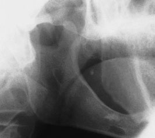
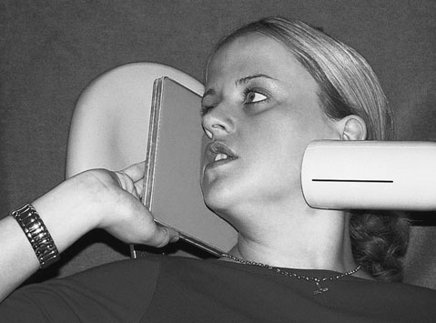

# Radiografie oblică de profil a ramurii mandibulei

  📷 Radiografie Convențională (Rx)
  <strong>Actualizat:</strong> 2026-09-16
  <strong>Autor:</strong> Departamentul de Radiologie / Referință Clark (Ed. 12)

---

-   __1. Rezumat Clinic & Indicații__

    ---

    === "Indicații Clinice"

        - Evaluarea radiografică a regiunii mandibulei și maxilei (incidență oblică de profil a ramurii mandibulei).
        - Suspiciune de leziuni traumatice (fracturi, luxații sau diastazis articular).
        - Bilanț osteoarticular / visceral conform recomandării medicale de trimitere.

    === "Ghid Național IRIS"

        !!! info "Referință Primară: Ghidul Național IRIS (Ordinul MS 1342/2012)"
            - **Capitol Ghid IRIS:** *Ghidul Național IRIS*
            - **Grad de Recomandare:** **De verificat pe indicație; fără grad atribuit automat**
            - **Nivel de Iradiere Estimată:** `De verificat pentru examinarea și populația selectate`

            [:octicons-search-16: Deschide Ghidul IRIS](../../iris.md){ .md-button .md-button--primary } [:material-open-in-new: Aplicația Oficială PWA](https://radiologie-pediatrica.ro/iris/){ .md-button target="_blank" rel="noopener" }
-   __2. Poziționare & Centrare Fascicul__

    ---

    - **Poziție Pacient:** • Pacientul stă așezat confortabil pe scaun, cu capul sprijinit. Planul mediosagital este vertical.
• Se utilizează o casetă de 13 × 18 cm, cu marker de film radiologic detașabil atașat, pentru a indica partea mandibulei care urmează să fie reprezentată.
• Caseta este poziționată pe obrazul pacientului / sprijinită de obrazul pacientului, deasupra ramurii ascendente și a aspectului posterior al condilului mandibulei examinate.
• Caseta este poziționată astfel încât marginea sa inferioară să fie paralelă cu marginea inferioară a mandibulei, dar situată la cel puțin 2 cm sub aceasta.
• Poziționarea realizează un unghi de separare de 10 grade între planul mediosagital și filmul radiologic.
• Pacientul este instruit să sprijine caseta în această poziție.
• Mandibula este extinsă cât mai mult posibil.
• Se limitează rotația capului (± 10 grade) spre casetă.
    - **Punct de Centrare Fascicul:** • Raza centrală este orientată posterior, cu o angulație ascendentă (cranială) de 10 grade, spre centrul ramurii mandibulei de partea de interes.
• Poziția de centrare a tubului este pe partea contralaterală a mandibulei, într-un punct situat la 2 cm sub marginea inferioară, în regiunea primului/al doilea molar permanent.
    - **Distanță Focar-Film (DFF / SID):** 100 cm
    - **Comandă Respiratorie:** Apnee pe durata expunerii (apnee în inspir pentru torace; expir pentru Abdomen/bazin).

-   __3. Parametri Tehnici Expunere__

    ---

    | Parametru Tehnic | Valoare Configurare Generator / Tub |
    |:-----------------|:-------------------------------------|
    | **Tensiune Tub (kV)** | DE CONFIGURAT PE APARAT |
    | **Sarcină / Produs Curent-Timp (mAs)** | Conform AEC / grosimii anatomice |
    | **Distanță Focar-Film (DFF / SID)** | 100 cm |
    | **Grilă Antidifuzoare (Bucky)** | Conform grosimii anatomice (> 10-12 cm cu grilă) |
    | **Dimensiune Focar** | Focar Mic (0.6 mm) |
    | **Camere de Ionizare AEC** | DE CONFIGURAT PE APARAT |
    | **Colimare Fascicul** | Colimare strictă adaptată la receptorul de 13 × 18 cm |
    | **Filtrare Tub** | Totală ≥ 2.5 mm Al echivalent (conform Clark: 3.0 mm Al echivalent) |

-   __4. Criterii de Calitate & Reușită Imagine__

    ---

    - Nu trebuie să existe corp străin metalic radiopac detașabil.
    - Nu trebuie să existe artefacte de mișcare.
    - Nu trebuie să existe erori de poziționare anteroposterioară (AP).
    - Nu trebuie să existe dovezi de alungire excesivă.
    - Nu trebuie să existe dovezi de angulație orizontală incorectă.
    - Trebuie să existe o suprapunere minimă a osului hioid peste regiunea de interes (clinică).
    - Trebuie să existe o densitate optică bună și un contrast adecvat între smalț și dentină.
    - Nu trebuie să existe urme de presiune pe filmul radiologic și nici zgârieturi ale emulsiei. 316
    - Nu trebuie să existe urme de role (numai la procesarea automată).
    - Nu trebuie să existe dovezi de voalare a filmului radiologic.
    - Nu trebuie să existe dâre/picături de substanțe chimice/contaminare.
    - Nu trebuie să existe dovezi de fixare/spălare insuficientă.
    - Markerul cu numele/data/stânga sau dreapta trebuie să fie lizibil. Radiografie oblică de profil a ramurii mandibulei; pozițiile casetei și tubului de raze X pentru radiografia oblică de profil dreaptă a ramurii mandibulei; casetă; direcția fasciculului de raze X; schemă pentru ilustrarea direcției fasciculului pentru radiografia oblică de profil a ramurii mandibulei

-   __5. Protecție Radiologică (ALARA)__

    ---

    - Ecranare gonadică cu șorț plumbat dacă gonadele sunt în apropierea fasciculului util (regula ALARA).
    - Colimare precisă la dimensiunea anatomică strict necesară pentru reducerea dozei și a radiației difuze.
    - Verificarea posibilității unei sarcini la pacientele de vârstă fertilă înainte de expunere.

!!! note "Observații Clinice & Tehnice"
    Unii operatori preferă o angulație ușor descendentă (± 10 grade) a tubului pentru a preveni suprapunerea osului hioid peste corpul mandibulei.

### 🖼️ Imagini

<figure class="protocol-image-card" markdown>

<figcaption><strong>Radiografie oblică de profil a ramurii mandibulei</strong> — Poziționarea pacientului și centrarea fasciculului conform Clark (Ed. 12)</figcaption>

</figure>

<figure class="protocol-image-card" markdown>

<figcaption><strong>Pozițiile casetei și tubului de raze X pentru radiografia oblică de profil dreaptă</strong> — Aspect radiografic / ghid de poziționare conform tratatului Clark (Ed. 12)</figcaption>

</figure>

=== "Ghid Rapid de Execuție"

    1. **Identificarea și verificarea pacientului:** verificare identitate, zonă de examinat, consimțământ conform procedurii și evaluarea posibilității unei sarcini, când este relevantă.
    2. **Pregătire:** îndepărtarea oricăror obiecte radiopace (bijuterii, agrafe, fermoare, proteze, pansamente dense).
    3. **Poziționare precisă:** alinierea receptorului de imagine și a tubului la distanța prescrisă (100 cm).
    4. **Colimare strictă:** adaptarea fasciculului strict la regiunea de diagnostic pentru scăderea iradierii și reducerea radiației difuze.
    5. **Radioprotecție:** verificarea [politicii RX](../radioprotectie.md), cu măsuri distincte pentru pacient, personal și însoțitor.

## Surse de documentare

- [Clark's Positioning in Radiography (Ed. 12), Pagina 331](https://books.google.com/books/about/Clark_s_Positioning_in_Radiography.html?id=Xxu6MwEACAAJ)
