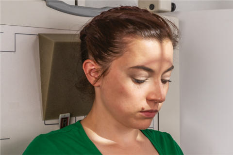
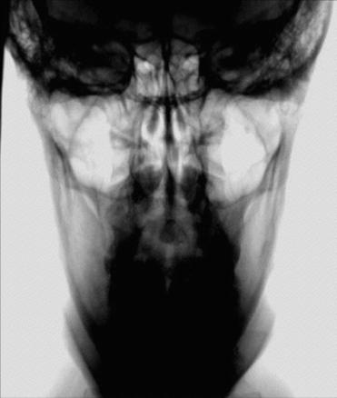
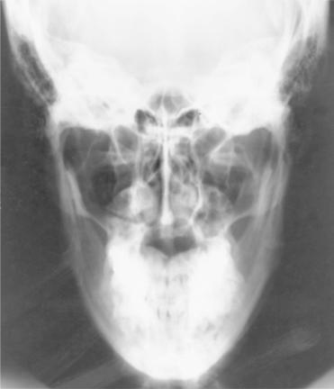

# Rx Mandibulă AP Axială (Incidență AP Axială (Metoda Towne))

  📷 Radiografie Convențională (Rx)
  <strong>Actualizat:</strong> 2026-09-15
  <strong>Autor:</strong> Departamentul de Radiologie / Referință Bontrager

---

-   __1. Rezumat Clinic & Indicații__

    ---

    === "Indicații Clinice"

        - suspiciune de fractură
        - Neoplastic sau inflammatory processes de condyloid processes de Mandibulă

    === "Ghid Național IRIS"

        !!! info "Referință Primară: Ghidul Național IRIS (Ordinul MS 1342/2012)"
            - **Capitol Ghid IRIS:** *Ghidul Național IRIS*
            - **Grad de Recomandare:** **De verificat pe indicație; fără grad atribuit automat**
            - **Nivel de Iradiere Estimată:** `De verificat pentru examinarea și populația selectate`

            [:octicons-search-16: Deschide Ghidul IRIS](../../iris.md){ .md-button .md-button--primary } [:material-open-in-new: Aplicația Oficială PWA](https://radiologie-pediatrica.ro/iris/){ .md-button target="_blank" rel="noopener" }
-   __2. Poziționare & Centrare Fascicul__

    ---

    - **Poziție Pacient:** Pacient: Se îndepărtează toate obiectele metalice sau din plastic din regiunea capului și gâtului. pacient poziție este Ortostatism sau Decubit dorsal.; Regiune anatomică: Rest pacient’s posterior Craniu against table/în ortostatism imaging device surface. Tuck chin, aligning linie orbitomeatală (LOM) perpendicular pe receptorul de imagine sau place linie infraorbitomeatală (LIOM) perpendicular și se ajustează raza centrală angle accordingly (see NOTE). Align MsP perpendicular la midline de grilă sau table/în ortostatism imaging device surface la prevent cap rotație sau tilt.
    - **Punct de Centrare Fascicul:** Raza centrală se înclină 35° caudal (spre picioare) if linie orbitomeatală (LOM) este perpendicular pe receptorul de imagine, sau 42° caudal if linie infraorbitomeatală (LIOM) este perpendicular pe receptorul de imagine (see NOTE). Center raza centrală 1 inch (2.5 cm) superior la glabelă. Se centrează receptorul de imagine pe raza centrală.
    - **Distanță Focar-Film (DFF / SID):** 100 cm
    - **Comandă Respiratorie:** Apnee pe durata expunerii.

-   __3. Parametri Tehnici Expunere__

    ---

    | Parametru Tehnic | Valoare Configurare Generator / Tub |
    |:-----------------|:-------------------------------------|
    | **Tensiune Tub (kV)** | 75-90 kV |
    | **Sarcină / Produs Curent-Timp (mAs)** | DE CONFIGURAT PE APARAT |
    | **Distanță Focar-Film (DFF / SID)** | 100 cm |
    | **Grilă Antidifuzoare (Bucky)** | Cu grilă antidifuzoare Bucky |
    | **Dimensiune Focar** | Focar Mare (1.0 - 1.2 mm) |
    | **Camere de Ionizare AEC** | Camerele laterale (sau camera centrală funcție de regiune) |
    | **Colimare Fascicul** | Collimate pe four sides la anatomy de interest. |
    | **Filtrare Tub** | Totală ≥ 2.5 mm Al echivalent |

-   __4. Criterii de Calitate & Reușită Imagine__

    ---

    - Condyloid processes de Mandibulă și TM fossae. poziție:
    - correctly poziționat imagine cu Absența rotației anatomice: clavicule echidistante față de linia apofizelor spinoase evidențiază following: condyloid processes visualized symmetrically, lateral la Coloană Cervicală; clear visualization de condyle/TM fossae relationship, cu minimal superimposition de TM fossae și mastoid portions (Figs. 11.164 și 11.165).
    - Collimation la aria de interes diagnostic. expunere:
    - optim receptorul de imagine expunere și contrast sunt sufficient la visualize condyloid process și TM fossa.
    - fără mișcare exists, ca indicated prin net bony margins. R Fig. 11.164 AP axial—Mandibulă. Condyle cap corp Neck R Temporomandibular fossa Fig. 11.165 AP axial—Mandibulă. Fig. 11.163 AP axial—raza centrală 35° la 40° la linie orbitomeatală (LOM), Ortostatism și Decubit dorsal (inset).

-   __5. Protecție Radiologică (ALARA)__

    ---

    - Ecranare gonadică și a organelor radiosensibile conform procedurilor locale de radioprotecție ALARA.
    - Colimare strictă la aria de interes pentru limitarea radiației difuze.
    - Verificarea posibilității unei sarcini la pacientele de vârstă fertilă înainte de expunere.

!!! note "Observații Clinice & Tehnice"
    If pacient este unable la bring linie orbitomeatală (LOM) perpendicular pe receptorul de imagine, align linie infraorbitomeatală (LIOM) perpendicular și increase 35° raza centrală angle prin 7° la 42° caudal (Fig. 11.163). If aria de interes diagnostic este TM fossae, increase raza centrală angle la 40° la linie orbitomeatală (LOM) la reduce superimposition de TM fossae și mastoid portions de temporal bone. Mandibulă ROUTINE Axiolateral oblic PA (sau PA axial) AP axial (Incidență AP Axială (Metoda Towne))

### 🖼️ Imagini

<figure class="protocol-image-card" markdown>

<figcaption><strong>Fig. 11.164 AP axial—Mandibulă.</strong> — Poziționare pacient conform Ghidului Bontrager (Fig. 11.164 AP axial—mandible.)</figcaption>

</figure>

<figure class="protocol-image-card" markdown>

<figcaption><strong>Fig. 11.165 AP axial—Mandibulă.</strong> — Aspect radiografic de referință conform Ghidului Bontrager (Fig. 11.165 AP axial—mandible.)</figcaption>

</figure>

<figure class="protocol-image-card" markdown>

<figcaption><strong>Fig. 11.163 AP axial—raza centrală 35° la 40° la linie orbitomeatală (LOM), Ortostatism și Decubit dorsal (inset).</strong> — Aspect radiografic de referință conform Ghidului Bontrager (Fig. 11.163 AP axial—raza centrală 35° la 40° la linie orbitomeatală (LOM), în ortostatism și în decubit dorsal (inset).)</figcaption>

</figure>

=== "Ghid Rapid de Execuție"

    1. **Identificarea și verificarea pacientului:** verificare identitate, zonă de examinat, consimțământ conform procedurii și evaluarea posibilității unei sarcini, când este relevantă.
    2. **Pregătire:** îndepărtarea oricăror obiecte radiopace (bijuterii, agrafe, fermoare, proteze, pansamente dense).
    3. **Poziționare precisă:** alinierea receptorului de imagine și a tubului la distanța prescrisă (100 cm).
    4. **Colimare strictă:** adaptarea fasciculului strict la regiunea de diagnostic pentru scăderea iradierii și reducerea radiației difuze.
    5. **Radioprotecție:** verificarea [politicii RX](../radioprotectie.md), cu măsuri distincte pentru pacient, personal și însoțitor.

## Surse de documentare

- [Bontrager's Textbook of Radiographic Positioning (Ed. 9/10), Pagina 456](https://www.elsevier.com/books/textbook-of-radiographic-positioning-and-related-anatomy/lampignano/978-0-323-65367-1)
