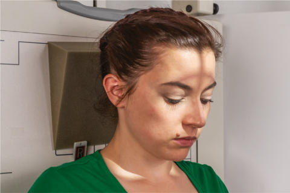
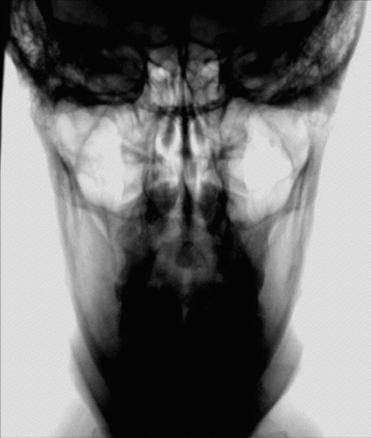
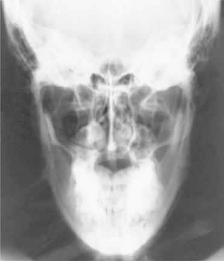

# Mandibulă AP axială (incidență AP axială (metoda Towne))

  📷 Radiografie Convențională (Rx)
  <strong>Actualizat:</strong> 2026-09-15
  <strong>Autor:</strong> Departamentul de Radiologie / Referință Bontrager

---

-   __1. Rezumat Clinic & Indicații__

    ---

    === "Indicații Clinice"

        - Suspiciune de fractură
        - Procese neoplazice sau inflamatorii ale proceselor condiliene ale mandibulei

    === "Ghid Național IRIS"

        !!! info "Referință Primară: Ghidul Național IRIS (Ordinul MS 1342/2012)"
            - **Capitol Ghid IRIS:** *Ghidul Național IRIS*
            - **Grad de Recomandare:** **De verificat pe indicație; fără grad atribuit automat**
            - **Nivel de Iradiere Estimată:** `De verificat pentru examinarea și populația selectate`

            [:octicons-search-16: Deschide Ghidul IRIS](../../iris.md){ .md-button .md-button--primary } [:material-open-in-new: Aplicația Oficială PWA](https://radiologie-pediatrica.ro/iris/){ .md-button target="_blank" rel="noopener" }
-   __2. Poziționare & Centrare Fascicul__

    ---

    - **Poziție Pacient:** Pacient: Se îndepărtează toate obiectele metalice sau din plastic din regiunea capului și gâtului. Poziția pacientului este ortostatism sau decubit dorsal. Regiune anatomică: Se sprijină partea posterioară a craniului pacientului pe masă/suprafața dispozitivului de imagistică în ortostatism. Se retrage bărbia, aliniind linia orbitomeatală (LOM) perpendicular pe receptorul de imagine sau poziționând linia infraorbitomeatală (LIOM) perpendicular, apoi se ajustează corespunzător unghiul razei centrale (vezi NOTA). Se aliniază MsP perpendicular pe linia mediană a grilei sau pe suprafața mesei/dispozitivului de imagistică în ortostatism, pentru a preveni rotația sau înclinarea capului.
    - **Punct de Centrare Fascicul:** Raza centrală se înclină cu 35° caudal (spre picioare) dacă linia orbitomeatală (LOM) este perpendiculară pe receptorul de imagine sau cu 42° caudal dacă linia infraorbitomeatală (LIOM) este perpendiculară pe receptorul de imagine (vezi NOTA). Se centrează raza centrală la 1 inch (2,5 cm) superior de glabelă. Receptorul de imagine se centrează pe raza centrală.
    - **Distanță Focar-Film (DFF / SID):** 100 cm
    - **Comandă Respiratorie:** Apnee pe durata expunerii.

-   __3. Parametri Tehnici Expunere__

    ---

    | Parametru Tehnic | Valoare Configurare Generator / Tub |
    |:-----------------|:-------------------------------------|
    | **Tensiune Tub (kV)** | 75-90 kV |
    | **Sarcină / Produs Curent-Timp (mAs)** | DE CONFIGURAT PE APARAT |
    | **Distanță Focar-Film (DFF / SID)** | 100 cm |
    | **Grilă Antidifuzoare (Bucky)** | Cu grilă antidifuzoare Bucky |
    | **Dimensiune Focar** | Focar Mare (1.0 - 1.2 mm) |
    | **Camere de Ionizare AEC** | Camerele laterale (sau camera centrală, în funcție de regiune) |
    | **Colimare Fascicul** | Colimați pe cele patru laturi la anatomia de interes. |
    | **Filtrare Tub** | Totală ≥ 2.5 mm Al echivalent |

-   __4. Criterii de Calitate & Reușită Imagine__

    ---

    - Procesele condiliene ale mandibulei și fosele TM. Poziție:
    - Imagine poziționată corect, cu absența rotației anatomice: claviculele echidistante față de linia apofizelor spinoase evidențiază următoarele: procesele condiliene vizualizate simetric, lateral față de coloana cervicală; vizualizare clară a relației condil–fosă TM, cu suprapunere minimă a foselor TM și a porțiunilor mastoidiene (Fig. 11.164 și 11.165).
    - Colimare la aria de interes diagnostic. Expunere:
    - Expunerea și contrastul optime ale receptorului de imagine sunt suficiente pentru vizualizarea procesului condilian și a fosei TM.
    - Nu există mișcare, după cum indică marginile osoase nete. R Fig. 11.164 AP axială—mandibulă. Cap condilian; corp; col; R; fosă temporomandibulară. Fig. 11.165 AP axială—mandibulă. Fig. 11.163 AP axială—raza centrală de la 35° la 40° față de linia orbitomeatală (LOM), în ortostatism și decubit dorsal (casetă inserată).

-   __5. Protecție Radiologică (ALARA)__

    ---

    - Ecranare gonadică și a organelor radiosensibile conform procedurilor locale de radioprotecție ALARA.
    - Colimare strictă la aria de interes pentru limitarea radiației difuze.
    - Verificarea posibilității unei sarcini la pacientele de vârstă fertilă înainte de expunere.

!!! note "Observații Clinice & Tehnice"
    Dacă pacientul nu poate aduce linia orbitomeatală (LOM) în poziție perpendiculară pe receptorul de imagine, se aliniază linia infraorbitomeatală (LIOM) perpendicular și se mărește unghiul razei centrale de 35° cu 7°, până la 42° caudal (Fig. 11.163). Dacă regiunea de interes diagnostic este reprezentată de fosele TM, se mărește unghiul razei centrale la 40° față de linia orbitomeatală (LOM) pentru a reduce suprapunerea foselor TM și a porțiunilor mastoidiene ale osului temporal. Mandibulă, tehnică de rutină, axiolaterală oblică PA (sau PA axială); AP axială (incidență AP axială (metoda Towne))

### 🖼️ Imagini

<figure class="protocol-image-card" markdown>

<figcaption><strong>Fig. 11.164 AP axială—mandibulă.</strong> — Poziționarea pacientului conform Ghidului Bontrager (Fig. 11.164 AP axială—mandibulă.)</figcaption>

</figure>

<figure class="protocol-image-card" markdown>

<figcaption><strong>Fig. 11.165 AP axială—mandibulă.</strong> — Aspect radiografic de referință conform Ghidului Bontrager (Fig. 11.165 AP axială—mandibulă.)</figcaption>

</figure>

<figure class="protocol-image-card" markdown>

<figcaption><strong>Fig. 11.163 AP axială—raza centrală de la 35° la 40° față de linia orbitomeatală (LOM), în ortostatism și decubit dorsal (casetă inserată).</strong> — Aspect radiografic de referință conform Ghidului Bontrager (Fig. 11.163 AP axială—raza centrală de la 35° la 40° față de linia orbitomeatală (LOM), în ortostatism și în decubit dorsal (casetă inserată).)</figcaption>

</figure>

=== "Ghid Rapid de Execuție"

    1. **Identificarea și verificarea pacientului:** verificare identitate, zonă de examinat, consimțământ conform procedurii și evaluarea posibilității unei sarcini, când este relevantă.
    2. **Pregătire:** îndepărtarea oricăror obiecte radiopace (bijuterii, agrafe, fermoare, proteze, pansamente dense).
    3. **Poziționare precisă:** alinierea receptorului de imagine și a tubului la distanța prescrisă (100 cm).
    4. **Colimare strictă:** adaptarea fasciculului strict la regiunea de diagnostic pentru scăderea iradierii și reducerea radiației difuze.
    5. **Radioprotecție:** verificarea [politicii RX](../radioprotectie.md), cu măsuri distincte pentru pacient, personal și însoțitor.

## Surse de documentare

- [Bontrager's Textbook of Radiographic Positioning (Ed. 9/10), Pagina 456](https://www.elsevier.com/books/textbook-of-radiographic-positioning-and-related-anatomy/lampignano/978-0-323-65367-1)
