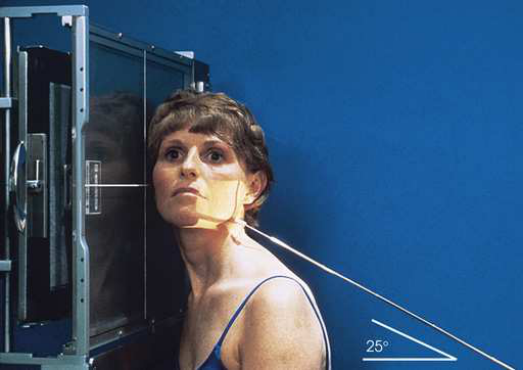
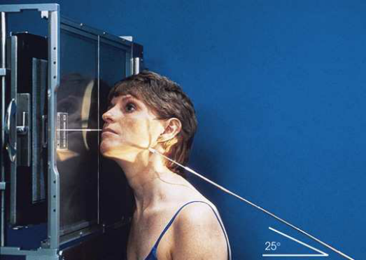
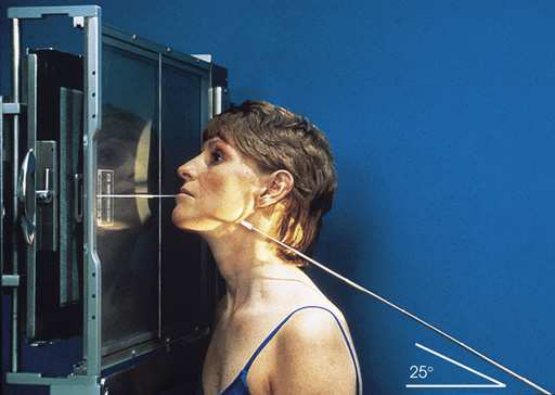
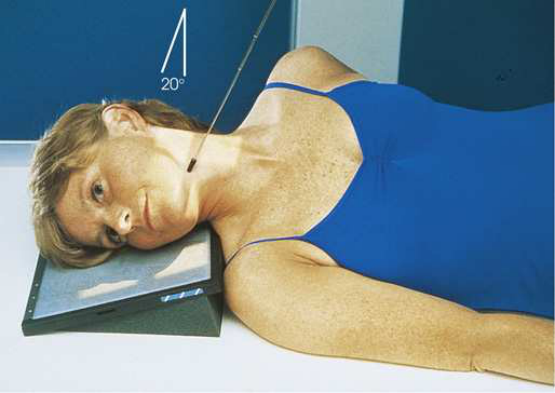
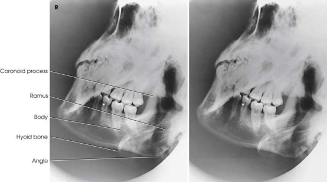
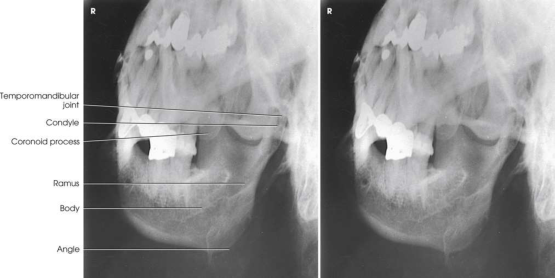
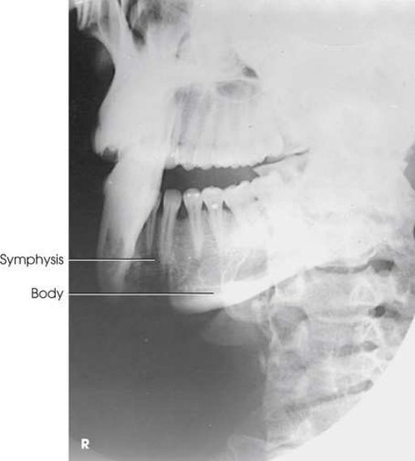

# Rx Mandibulă — Axiolateral And Axiolateral Oblique Incidență (Merrill)

  📷 Radiografie Convențională (Rx)
  <strong>Actualizat:</strong> 2026-09-16
  <strong>Autor:</strong> Referință Merrill

---

-   __1. Rezumat Clinic & Indicații__

    ---

    === "Indicații Clinice"

        - Conform reperelor anatomice standard din tratat

    === "Ghid Național IRIS"

        !!! info "Referință Primară: Ghidul Național IRIS (Ordinul MS 1342/2012)"
            - **Capitol Ghid IRIS:** *Ghidul Național IRIS*
            - **Grad de Recomandare:** **De verificat pe indicație; fără grad atribuit automat**
            - **Nivel de Iradiere Estimată:** `De verificat pentru examinarea și populația selectate`

            [:octicons-search-16: Deschide Ghidul IRIS](../../iris.md){ .md-button .md-button--primary } [:material-open-in-new: Aplicația Oficială PWA](https://radiologie-pediatrica.ro/iris/){ .md-button target="_blank" rel="noopener" }
-   __2. Poziționare & Centrare Fascicul__

    ---

    - **Poziție Pacient:** se așază pacientul în Poziție Șezândă, semiprone, sau semisupine poziție.; se poziționează pacientul’s cap în Incidență de Profil (lateral) cu linie interpupilară (LIP) perpendicular pe receptorul de imagine (RI). mouth trebuie să fie closed cu teeth together. se extinde pacient’s neck enough that axa longitudinală de corp mandibular este paralel cu transverse axis de receptorul de imagine la prevent superimposition de Coloană Cervicală. If incidență este la fie performed pe tabletop, poziție receptorul de imagine astfel încât complete corp de Mandibulă este pe receptorul de imagine. se ajustează rotație de pacientul’s cap la place aria de interes diagnostic paralel cu receptorul de imagine (RI), ca follows. Ramus Keep pacientul’s cap în true Incidență de Profil (lateral) (Fig. 11.140). corp se rotește pacient’s cap 30 grade spre receptorul de imagine (Fig. 11.141). simfiză se rotește pacient’s cap 45 grade spre receptorul de imagine (Fig. 11.142).
    - **Punct de Centrare Fascicul:** orientat 25 grade cranial la pass directly through mandibular region de interest (see note pe p. 87). Se centrează receptorul de imagine pe raza centrală pentru incidențe done pe în ortostatism grilă units.
    - **Distanță Focar-Film (DFF / SID):** Nespecificat în fragmentul extras; de verificat în sursă
    - **Comandă Respiratorie:** apnee (oprirea respirației).

-   __3. Parametri Tehnici Expunere__

    ---

    | Parametru Tehnic | Valoare Configurare Generator / Tub |
    |:-----------------|:-------------------------------------|
    | **Tensiune Tub (kV)** | DE CONFIGURAT PE APARAT |
    | **Sarcină / Produs Curent-Timp (mAs)** | DE CONFIGURAT PE APARAT |
    | **Distanță Focar-Film (DFF / SID)** | Nespecificat în fragmentul extras; de verificat în sursă |
    | **Grilă Antidifuzoare (Bucky)** | DE CONFIGURAT PE APARAT |
    | **Dimensiune Focar** | DE CONFIGURAT PE APARAT |
    | **Camere de Ionizare AEC** | DE CONFIGURAT PE APARAT |
    | **Colimare Fascicul** | se ajustează câmp de iradiere la extend 1 inch (2.5 cm) beyond anterior și inferior skin shadows și above TMī. expunere field trebuie să fie fără larger than 8 × 10 inches (18 × 24 cm). Place marker de lateralitate (D/S) în collimated expunere field. |
    | **Filtrare Tub** | DE CONFIGURAT PE APARAT |

-   __4. Criterii de Calitate & Reușită Imagine__

    ---

    - Criterii radiologice de calitate imaginii: n Evidence de corect collimation și presence de marker de lateralitate (D/S) plasat clear de anatomy de interest n părți moi și bony detalii trabeculare osoase Ramus și corp n fără overlap de ramus prin opposite side de Mandibulă n fără elongation sau foreshortening de ramus sau corp n fără superimposition de ramus prin Coloană Cervicală simfiză n fără overlap de mentum region prin opposite side de Mandibulă n fără foreshortening de mentum region

-   __5. Protecție Radiologică (ALARA)__

    ---

    - Nespecificat în fragmentul extras; de verificat în sursă

!!! note "Observații Clinice & Tehnice"
    When pacientul este în semisupine poziție, place receptorul de imagine pe wedge device sau wedge sponge (Fig. 11.143). Ensure that combined raza centrală angle și plan mediosagital tilt equals 25 grade. la reduce possibility de projecting Umăr over Mandibulă when radiographing muscular sau hypersthenic pacienți, adjust MSP de pacientul’s Craniu cu approximately 15-grade angle, open inferiorly. cranial angulation de 10 grade de raza centrală maintains optim 25-grade raza centrală/part angle relationship.

### 🖼️ Imagini

<figure class="protocol-image-card" markdown>

<figcaption><strong>Merrill — pagina PDF 930, imaginea 1</strong> — Imagine din fragmentul sursă; asocierea necesită revizie.</figcaption>

</figure>

<figure class="protocol-image-card" markdown>

<figcaption><strong>Merrill — pagina PDF 930, imaginea 2</strong> — Imagine din fragmentul sursă; asocierea necesită revizie.</figcaption>

</figure>

<figure class="protocol-image-card" markdown>

<figcaption><strong>Merrill — pagina PDF 931, imaginea 3</strong> — Imagine din fragmentul sursă; asocierea necesită revizie.</figcaption>

</figure>

<figure class="protocol-image-card" markdown>

<figcaption><strong>Merrill — pagina PDF 931, imaginea 4</strong> — Imagine din fragmentul sursă; asocierea necesită revizie.</figcaption>

</figure>

<figure class="protocol-image-card" markdown>

<figcaption><strong>Merrill — pagina PDF 932, imaginea 5</strong> — Imagine din fragmentul sursă; asocierea necesită revizie.</figcaption>

</figure>

<figure class="protocol-image-card" markdown>

<figcaption><strong>Merrill — pagina PDF 932, imaginea 6</strong> — Imagine din fragmentul sursă; asocierea necesită revizie.</figcaption>

</figure>

<figure class="protocol-image-card" markdown>

<figcaption><strong>Merrill — pagina PDF 933, imaginea 7</strong> — Imagine din fragmentul sursă; asocierea necesită revizie.</figcaption>

</figure>

=== "Ghid Rapid de Execuție"

    1. **Identificarea și verificarea pacientului:** verificare identitate, zonă de examinat, consimțământ conform procedurii și evaluarea posibilității unei sarcini, când este relevantă.
    2. **Pregătire:** îndepărtarea oricăror obiecte radiopace (bijuterii, agrafe, fermoare, proteze, pansamente dense).
    3. **Poziționare precisă:** alinierea receptorului de imagine și a tubului la distanța prescrisă (Nespecificat în fragmentul extras; de verificat în sursă).
    4. **Colimare strictă:** adaptarea fasciculului strict la regiunea de diagnostic pentru scăderea iradierii și reducerea radiației difuze.
    5. **Radioprotecție:** verificarea [politicii RX](../radioprotectie.md), cu măsuri distincte pentru pacient, personal și însoțitor.

## Surse de documentare

- [Merrill’s Atlas, 11. Cranium, pagini PDF 929–933](../../assets/protocols/sources/a56d45c16829_Merrills_Atlas_of_Radiographic_Positioning__Procedures_3Vol_Set.pdf#page=929)

## Fragmente sursă traduse (referință tehnică)

### anatomy

fiecare incidență shows region de mandible that was paralel cu receptorul de imagine (Figs. 11.144–11.146).

### collimation

• se ajustează câmp de iradiere la extend 1 inch (2.5 cm) beyond anterior și inferior skin shadows și above TMī. expunere
field trebuie să fie fără larger than 8 × 10 inches (18 × 24 cm). Place marker de lateralitate (D/S) în collimated expunere field.

### cr

• orientat 25 grade cranial la pass directly through mandibular region de interest (see note pe p. 87).
• Se centrează receptorul de imagine pe raza centrală pentru incidențe done pe în ortostatism grilă units.

### criteria

Criterii radiologice de calitate imaginii:
n Evidence de corect collimation și presence de marker de lateralitate (D/S) plasat clear de anatomy de interest
n părți moi și bony detalii trabeculare osoase
Ramus și corp
n fără overlap de ramus prin opposite side de mandible
n fără elongation sau foreshortening de ramus sau corp
n fără superimposition de ramus prin cervical coloană vertebrală
simfiză
n fără overlap de mentum region prin opposite side de mandible
n fără foreshortening de mentum region

### notes

When pacientul este în semisupine poziție, place receptorul de imagine pe wedge device sau wedge sponge (Fig. 11.143). Ensure that combined raza centrală
angle și plan mediosagital tilt equals 25 grade.
la reduce possibility de projecting umăr over mandible when radiographing muscular sau hypersthenic pacienți, adjust
MSP de pacientul’s skull cu approximately 15-grade angle, open inferiorly. cranial angulation de 10 grade de raza centrală
maintains optim 25-grade raza centrală/part angle relationship.

### part_pos

• se poziționează pacientul’s cap în poziție de profil (lateral) cu linie interpupilară (LIP) perpendicular pe receptorul de imagine (RI). mouth trebuie să fie closed cu teeth together.
• se extinde pacient’s neck enough that axa longitudinală de corp mandibular este paralel cu transverse axis de receptorul de imagine la prevent
superimposition de cervical coloană vertebrală.
• If incidență este la fie performed pe tabletop, poziție receptorul de imagine astfel încât complete corp de mandible este pe receptorul de imagine.
• se ajustează rotație de pacientul’s cap la place aria de interes diagnostic paralel cu receptorul de imagine (RI), ca follows.
Ramus
• Keep pacientul’s cap în true poziție de profil (lateral) (Fig. 11.140).
corp
• se rotește pacient’s cap 30 grade spre receptorul de imagine (Fig. 11.141).
simfiză
• se rotește pacient’s cap 45 grade spre receptorul de imagine (Fig. 11.142).

### patient_pos

• se așază pacientul în așezat pe scaun, semiprone, sau semisupine poziție.

### respiration

apnee (oprirea respirației).

### tech

poziționat prin manufacturer sau department protocol pentru corect anatomy display orientation; raza centrală plate: 10 × 12 inches (24
× 30 cm) longitudinal.

