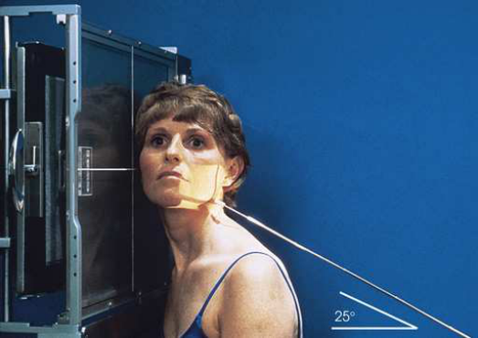
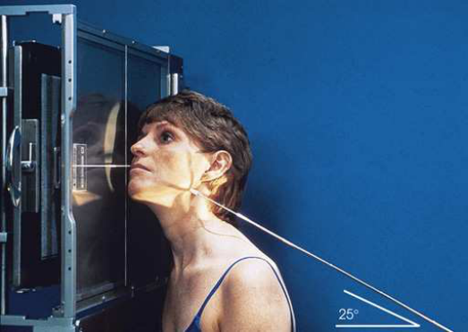
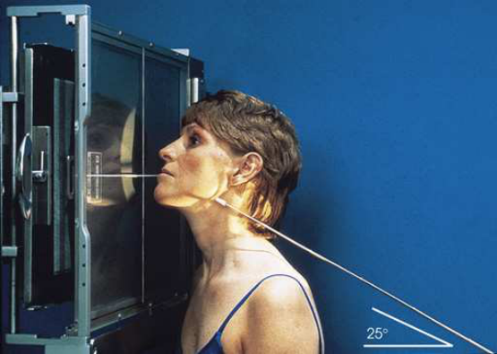
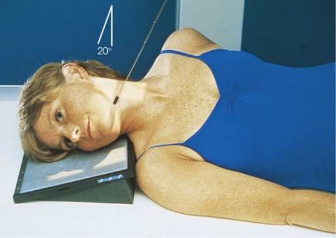
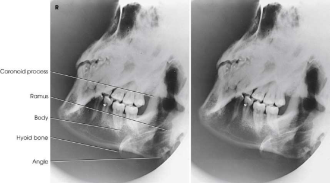
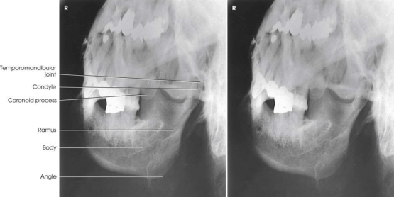
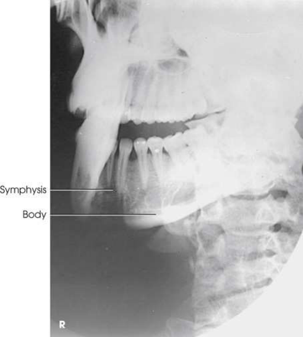

# Rx Mandibulă — Incidență axiolaterală și axiolaterală oblică (Merrill)

  📷 Radiografie Convențională (Rx)
  <strong>Actualizat:</strong> 2026-09-16
  <strong>Autor:</strong> Referință Merrill

---

-   __1. Rezumat Clinic & Indicații__

    ---

    === "Indicații Clinice"

        - Conform reperelor anatomice standard din tratat

    === "Ghid Național IRIS"

        !!! info "Referință Primară: Ghidul Național IRIS (Ordinul MS 1342/2012)"
            - **Capitol Ghid IRIS:** *Traumatisme — Față și orbite*
            - **Grad de Recomandare:** **Grad B**
            - **Nivel de Iradiere Estimată:** `Clasa 1 (Minimă < 0.1 mSv)`

            [:octicons-search-16: Deschide Ghidul IRIS](../../iris.md){ .md-button .md-button--primary } [:material-open-in-new: Aplicația Oficială PWA](https://radiologie-pediatrica.ro/iris/){ .md-button target="_blank" rel="noopener" }

-   __2. Poziționare & Centrare Fascicul__

    ---

    - **Poziție Pacient:** Pacientul este așezat în poziție șezândă, semipronă sau semisupină. Capul pacientului este poziționat în incidență de profil, cu linia interpupilară (LIP) perpendiculară pe receptorul de imagine (RI). Gura trebuie să fie închisă, cu dinții în contact. Gâtul pacientului este extins suficient astfel încât axa longitudinală a corpului mandibular să fie paralelă cu axa transversală a receptorului de imagine, pentru a preveni suprapunerea coloanei cervicale. Dacă incidența este efectuată pe masă, receptorul de imagine este poziționat astfel încât întregul corp al mandibulei să se afle pe receptorul de imagine. Rotația capului pacientului este ajustată pentru a plasa aria de interes diagnostic paralelă cu receptorul de imagine (RI), după cum urmează. Ramură: capul pacientului este menținut în adevărată incidență de profil (Fig. 11.140). Corp: capul pacientului este rotit cu 30 grade spre receptorul de imagine (Fig. 11.141). Simfiză: capul pacientului este rotit cu 45 grade spre receptorul de imagine (Fig. 11.142).
    - **Punct de Centrare Fascicul:** Orientată cu 25 grade cranial pentru a trece direct prin regiunea mandibulară de interes (vezi nota de la p. 87). Receptorul de imagine se centrează pe raza centrală pentru incidențele efectuate pe unități cu grilă, în ortostatism.
    - **Distanță Focar-Film (DFF / SID):** Nespecificat în fragmentul extras; de verificat în sursă
    - **Comandă Respiratorie:** apnee (oprirea respirației).

-   __3. Parametri Tehnici Expunere__

    ---

    | Parametru Tehnic | Valoare Configurare Generator / Tub |
    |:-----------------|:-------------------------------------|
    | **Tensiune Tub (kV)** | DE CONFIGURAT PE APARAT |
    | **Sarcină / Produs Curent-Timp (mAs)** | DE CONFIGURAT PE APARAT |
    | **Distanță Focar-Film (DFF / SID)** | Nespecificat în fragmentul extras; de verificat în sursă |
    | **Grilă Antidifuzoare (Bucky)** | DE CONFIGURAT PE APARAT |
    | **Dimensiune Focar** | DE CONFIGURAT PE APARAT |
    | **Camere de Ionizare AEC** | DE CONFIGURAT PE APARAT |
    | **Colimare Fascicul** | Se ajustează câmpul de iradiere astfel încât să se extindă cu 1 țol (2.5 cm) dincolo de umbrele cutanate anterioară și inferioară și deasupra ATM. Câmpul de expunere trebuie să nu fie mai mare de 8 × 10 țoli (18 × 24 cm). Se plasează markerul de lateralitate (D/S) în câmpul de expunere colimat. |
    | **Filtrare Tub** | DE CONFIGURAT PE APARAT |

-   __4. Criterii de Calitate & Reușită Imagine__

    ---

    - Criterii radiologice de calitate imaginii: n Dovezi de colimare corectă și prezența markerului de lateralitate (D/S), plasat clar față de anatomia de interes n părți moi și detalii osoase trabeculare Ramus și corp n fără suprapunerea ramusului de partea opusă a mandibulei n fără alungirea sau scurtarea ramusului ori corpului n fără suprapunerea ramusului de coloana cervicală simfiză n fără suprapunerea regiunii mentoniere de partea opusă a mandibulei n fără scurtarea regiunii mentoniere

-   __5. Protecție Radiologică (ALARA)__

    ---

    - Nespecificat în fragmentul extras; de verificat în sursă

!!! note "Observații Clinice & Tehnice"
    Când pacientul se află în poziție semisupină, se plasează receptorul de imagine pe dispozitivul tip pană sau pe buretele tip pană (Fig. 11.143). Se asigură că unghiul combinat al razei centrale și înclinarea planului mediosagital este egal cu 25 grade. Pentru a reduce posibilitatea proiectării umărului peste mandibulă la radiografierea pacienților musculoși sau hiperstenici, se ajustează MSP al craniului pacientului cu aproximativ 15 grade, deschis inferior. Angulația cranială de 10 grade a razei centrale menține relația optimă de 25 grade dintre raza centrală și partea anatomică.

### 🖼️ Imagini

<figure class="protocol-image-card" markdown>

<figcaption><strong>Merrill — pagina 930, imaginea 1</strong> — Imagine din fragmentul sursă; asocierea necesită revizie.</figcaption>

</figure>

<figure class="protocol-image-card" markdown>

<figcaption><strong>Merrill — pagina 930, imaginea 2</strong> — Imagine din fragmentul sursă; asocierea necesită revizie.</figcaption>

</figure>

<figure class="protocol-image-card" markdown>

<figcaption><strong>Merrill — pagina 931, imaginea 3</strong> — Imagine din fragmentul sursă; asocierea necesită revizie.</figcaption>

</figure>

<figure class="protocol-image-card" markdown>

<figcaption><strong>Merrill — pagina 931, imaginea 4</strong> — Imagine din fragmentul sursă; asocierea necesită revizie.</figcaption>

</figure>

<figure class="protocol-image-card" markdown>

<figcaption><strong>Merrill — pagina 932, imaginea 5</strong> — Imagine din fragmentul sursă; asocierea necesită revizie.</figcaption>

</figure>

<figure class="protocol-image-card" markdown>

<figcaption><strong>Merrill — pagina 932, imaginea 6</strong> — Imagine din fragmentul sursă; asocierea necesită revizie.</figcaption>

</figure>

<figure class="protocol-image-card" markdown>

<figcaption><strong>Merrill — pagina 933, imaginea 7</strong> — Imagine din fragmentul sursă; asocierea necesită revizie.</figcaption>

</figure>

=== "Ghid Rapid de Execuție"

    1. **Identificarea și verificarea pacientului:** verificare identitate, zonă de examinat, consimțământ conform procedurii și evaluarea posibilității unei sarcini, când este relevantă.
    2. **Pregătire:** îndepărtarea oricăror obiecte radiopace (bijuterii, agrafe, fermoare, proteze, pansamente dense).
    3. **Poziționare precisă:** alinierea receptorului de imagine și a tubului la distanța prescrisă (Nespecificat în fragmentul extras; de verificat în sursă).
    4. **Colimare strictă:** adaptarea fasciculului strict la regiunea de diagnostic pentru scăderea iradierii și reducerea radiației difuze.
    5. **Radioprotecție:** verificarea [politicii RX](../radioprotectie.md), cu măsuri distincte pentru pacient, personal și însoțitor.

## Surse de documentare

- [Merrill’s Atlas, 11. Cranium, pagini 929–933](https://books.google.com/books/about/Merrill_s_Atlas_of_Radiographic_Position.html?id=BM0lEQAAQBAJ)
