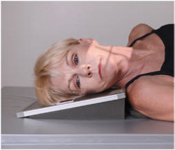
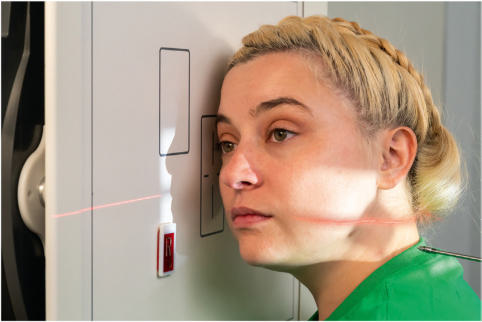
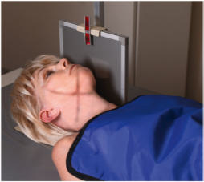

# Rx Mandibulă AXIOLATERAL OR AXIOLATERAL Oblică

  📷 Radiografie Convențională (Rx)
  <strong>Actualizat:</strong> 2026-09-15
  <strong>Autor:</strong> Departamentul de Radiologie / Referință Bontrager

---

-   __1. Rezumat Clinic & Indicații__

    ---

    === "Indicații Clinice"

        - suspiciune de fractură și neoplastic sau inflammatory processes de Mandibulă ambele părți (bilateral) de Mandibulă sunt examined pentru comparison.

    === "Ghid Național IRIS"

        !!! info "Referință Primară: Ghidul Național IRIS (Ordinul MS 1342/2012)"
            - **Capitol Ghid IRIS:** *Ghidul Național IRIS*
            - **Grad de Recomandare:** **De verificat pe indicație; fără grad atribuit automat**
            - **Nivel de Iradiere Estimată:** `De verificat pentru examinarea și populația selectate`

            [:octicons-search-16: Deschide Ghidul IRIS](../../iris.md){ .md-button .md-button--primary } [:material-open-in-new: Aplicația Oficială PWA](https://radiologie-pediatrica.ro/iris/){ .md-button target="_blank" rel="noopener" }
-   __2. Poziționare & Centrare Fascicul__

    ---

    - **Poziție Pacient:** Pacient: Se îndepărtează toate obiectele metalice sau din plastic din regiunea capului și gâtului. pacient poziție este Ortostatism sau Decubit. If performed Decubit, place receptorul de imagine pe wedge sponge la minimize OID (Fig. 11.155). pentru Ortostatism poziție, place region de interest against perete bucky și paralel cu receptorul de imagine (Fig. 11.156). pentru orizontal fascicul traumatism acuttism / Regim Urgență poziție, place receptorul de imagine (și grilă if used) paralel la Mandibulă (Fig. 11.157).; Regiune anatomică: Place cap în true Incidență de Profil (lateral), cu side de interest against receptorul de imagine. If possible, have pacient close mouth și bring teeth together. Extend neck slightly la prevent superimposition de gonion (unghiul mandibulei) over Coloană Cervicală. Rotate cap spre receptorul de imagine (pentru axiolateral oblic) la place mandibular aria de interes diagnostic paralel cu receptorul de imagine. grade de rotație/obliquity depends pe which section de Mandibulă este de interest. cap în true Incidență de Profil (lateral) best evidențiază ramus. 10° la 15° rotație best provides general survey de Mandibulă. 30° rotație spre receptorul de imagine best evidențiază corp. 45° rotație best evidențiază mentum.
    - **Punct de Centrare Fascicul:** angle. Fig. 11.157 orizontal fascicul traumatism acuttism / Regim Urgență incidență—25° cranial raza centrală angle; stâng lateral.
    - **Distanță Focar-Film (DFF / SID):** 100 cm
    - **Comandă Respiratorie:** Apnee pe durata expunerii. fără AEC Mandibulă ROUTINE Axiolateral sau axiolateral oblic PA (sau PA axial) AP axial (Incidență AP Axială (Metoda Towne))

-   __3. Parametri Tehnici Expunere__

    ---

    | Parametru Tehnic | Valoare Configurare Generator / Tub |
    |:-----------------|:-------------------------------------|
    | **Tensiune Tub (kV)** | 70-85 kV |
    | **Sarcină / Produs Curent-Timp (mAs)** | DE CONFIGURAT PE APARAT |
    | **Distanță Focar-Film (DFF / SID)** | 100 cm |
    | **Grilă Antidifuzoare (Bucky)** | Fără grilă (expunere directă) |
    | **Dimensiune Focar** | Focar Mic (0.6 mm) |
    | **Camere de Ionizare AEC** | DE CONFIGURAT PE APARAT |
    | **Colimare Fascicul** | la aria de interes diagnostic. expunere: optim receptorul de imagine expunere și contrast sunt sufficient la visualize mandibular aria de interes diagnostic. net bony margins indicate fără mișcare. Fig. 11.155 Semisupine—15° wedge sponge și 10° cranial raza centrală angle. Fig. 11.156 Ortostatism 10°–15° cap rotație spre receptorul de imagine și 10° cranial |
    | **Filtrare Tub** | Totală ≥ 2.5 mm Al echivalent |

-   __4. Criterii de Calitate & Reușită Imagine__

    ---

    - Ramus, condyloid, și coronoid processes, corp, și mentum de Mandibulă nearest receptorul de imagine sunt evidențiat (Figs. 11.158 și 11.159). poziție:
    - appearance de imagine/poziție de pacientul depends pe structures under examination.
    - pentru ramus și corp, ramus de interest este evidențiat cu fără superimposition de la opposite Mandibulă (indicating correct raza centrală angulation).
    - fără superimposition de Coloană Cervicală prin ramus trebuie să occur (indicating sufficient extension de neck).
    - ramus și corp trebuie să fie evidențiat fără foreshortening (indicating correct rotație de cap).
    - aria de interes diagnostic este evidențiat cu minimal superimposition și minimal foreshortening.

-   __5. Protecție Radiologică (ALARA)__

    ---

    - Ecranare gonadică și a organelor radiosensibile conform procedurilor locale de radioprotecție ALARA.
    - Colimare strictă la aria de interes pentru limitarea radiației difuze.
    - Verificarea posibilității unei sarcini la pacientele de vârstă fertilă înainte de expunere.

### 🖼️ Imagini

<figure class="protocol-image-card" markdown>

<figcaption><strong>Fig. 11.155 Semisupine—15° wedge sponge și 10° cranial raza centrală</strong> — Poziționare pacient conform Ghidului Bontrager (Fig. 11.155 Semisupine—15° wedge sponge și 10° cranial raza centrală)</figcaption>

</figure>

<figure class="protocol-image-card" markdown>

<figcaption><strong>Fig. 11.156 Ortostatism 10°–15° cap rotație spre receptorul de imagine și 10° cranial</strong> — Aspect radiografic de referință conform Ghidului Bontrager (Fig. 11.156 în ortostatism 10°–15° cap rotație spre receptorul de imagine și 10° cranial)</figcaption>

</figure>

<figure class="protocol-image-card" markdown>

<figcaption><strong>Fig. 11.157 orizontal fascicul traumatism acuttism / Regim Urgență incidență—25° cranial raza centrală</strong> — Aspect radiografic de referință conform Ghidului Bontrager (Fig. 11.157 orizontal fascicul trauma incidență—25° cranial raza centrală)</figcaption>

</figure>

=== "Ghid Rapid de Execuție"

    1. **Identificarea și verificarea pacientului:** verificare identitate, zonă de examinat, consimțământ conform procedurii și evaluarea posibilității unei sarcini, când este relevantă.
    2. **Pregătire:** îndepărtarea oricăror obiecte radiopace (bijuterii, agrafe, fermoare, proteze, pansamente dense).
    3. **Poziționare precisă:** alinierea receptorului de imagine și a tubului la distanța prescrisă (100 cm).
    4. **Colimare strictă:** adaptarea fasciculului strict la regiunea de diagnostic pentru scăderea iradierii și reducerea radiației difuze.
    5. **Radioprotecție:** verificarea [politicii RX](../radioprotectie.md), cu măsuri distincte pentru pacient, personal și însoțitor.

## Surse de documentare

- [Bontrager's Textbook of Radiographic Positioning (Ed. 9/10), Pagina 453](https://www.elsevier.com/books/textbook-of-radiographic-positioning-and-related-anatomy/lampignano/978-0-323-65367-1)
