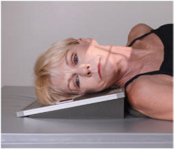
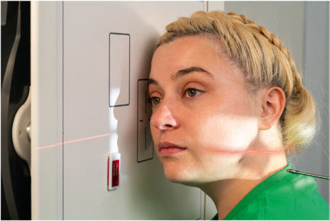
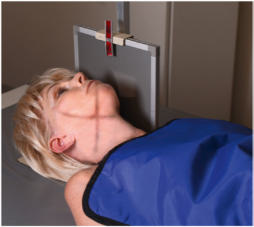

# Rx Mandibulă — Incidență axiolaterală și axiolaterală oblică

  📷 Radiografie Convențională (Rx)
  <strong>Actualizat:</strong> 2026-09-15
  <strong>Autor:</strong> Departamentul de Radiologie / Referință Bontrager

---

-   __1. Rezumat Clinic & Indicații__

    ---

    === "Indicații Clinice"

        - Suspiciune de fractură și procese neoplazice sau inflamatorii ale mandibulei; ambele părți ale mandibulei sunt examinate pentru comparație.

    === "Ghid Național IRIS"

        !!! info "Referință Primară: Ghidul Național IRIS (Ordinul MS 1342/2012)"
            - **Capitol Ghid IRIS:** *Ghidul Național IRIS*
            - **Grad de Recomandare:** **De verificat pe indicație; fără grad atribuit automat**
            - **Nivel de Iradiere Estimată:** `De verificat pentru examinarea și populația selectate`

            [:octicons-search-16: Deschide Ghidul IRIS](../../iris.md){ .md-button .md-button--primary } [:material-open-in-new: Aplicația Oficială PWA](https://radiologie-pediatrica.ro/iris/){ .md-button target="_blank" rel="noopener" }
-   __2. Poziționare & Centrare Fascicul__

    ---

    - **Poziție Pacient:** Pacient: Se îndepărtează toate obiectele metalice sau din plastic din regiunea capului și gâtului. Poziția pacientului este în ortostatism sau decubit. Dacă se efectuează în decubit, se plasează receptorul de imagine pe o pernă în pană pentru a minimiza OID (fig. 11.155). Pentru poziția în ortostatism, se plasează regiunea de interes sprijinită de stativul Bucky și paralelă cu receptorul de imagine (fig. 11.156). Pentru poziția cu fascicul orizontal, în traumatism acut / regim de urgență, se plasează receptorul de imagine (și grila, dacă este utilizată) paralel cu mandibula (fig. 11.157). Regiune anatomică: Se plasează capul în adevărată incidență de profil (lateral), cu partea de interes sprijinită de receptorul de imagine. Dacă este posibil, pacientul închide gura și apropie dinții. Se extinde ușor gâtul pentru a preveni suprapunerea gonionului (unghiul mandibulei) peste coloana cervicală. Se rotește capul spre receptorul de imagine (pentru axiolaterală oblică) pentru a plasa aria de interes mandibulară paralelă cu receptorul de imagine. Gradul de rotație/oblicitate depinde de segmentul mandibulei de interes. Capul în adevărată incidență de profil (lateral) evidențiază cel mai bine ramusul. Rotația de 10° la 15° oferă cea mai bună examinare generală a mandibulei. Rotația de 30° spre receptorul de imagine evidențiază cel mai bine corpul. Rotația de 45° evidențiază cel mai bine mentumul.
    - **Punct de Centrare Fascicul:** Unghi. Fig. 11.157: fascicul orizontal, traumatism acut / regim de urgență, incidență — raza centrală angulată cranial cu 25°; lateral stâng.
    - **Distanță Focar-Film (DFF / SID):** 100 cm
    - **Comandă Respiratorie:** Apnee pe durata expunerii. Fără AEC. Mandibulă. DE RUTINĂ: axiolaterală sau axiolaterală oblică PA (sau PA axială); AP axială (incidență AP axială (metoda Towne)).

-   __3. Parametri Tehnici Expunere__

    ---

    | Parametru Tehnic | Valoare Configurare Generator / Tub |
    |:-----------------|:-------------------------------------|
    | **Tensiune Tub (kV)** | 70-85 kV |
    | **Sarcină / Produs Curent-Timp (mAs)** | DE CONFIGURAT PE APARAT |
    | **Distanță Focar-Film (DFF / SID)** | 100 cm |
    | **Grilă Antidifuzoare (Bucky)** | Fără grilă (expunere directă) |
    | **Dimensiune Focar** | Focar Mic (0.6 mm) |
    | **Camere de Ionizare AEC** | DE CONFIGURAT PE APARAT |
    | **Colimare Fascicul** | La aria de interes diagnostic. Expunere: expunerea și contrastul receptorului de imagine sunt optime și suficiente pentru vizualizarea ariei de interes mandibulare. Marginile osoase clare indică absența mișcării. Fig. 11.155 Semisupină — pernă în pană de 15° și raza centrală angulată cranial cu 10°. Fig. 11.156 Ortostatism: rotația capului cu 10°–15° spre receptorul de imagine și raza centrală angulată cranial cu 10°. |
    | **Filtrare Tub** | Totală ≥ 2.5 mm Al echivalent |

-   __4. Criterii de Calitate & Reușită Imagine__

    ---

    - Ramusul, procesele condilian și coronoid, corpul și mentumul mandibulei aflate cel mai aproape de receptorul de imagine sunt evidențiate (fig. 11.158 și 11.159). Poziție:
    - Aspectul imaginii/poziția pacientului depinde de structurile examinate.
    - Pentru ramus și corp, ramusul de interes este evidențiat fără suprapunerea mandibulei opuse (indicând angularea corectă a razei centrale).
    - Nu trebuie să existe suprapunerea coloanei cervicale peste ramus (indicând extensia suficientă a gâtului).
    - Ramusul și corpul trebuie să fie evidențiate fără scurtare (indicând rotația corectă a capului).
    - Aria de interes diagnostic este evidențiată cu suprapunere minimă și scurtare minimă.

-   __5. Protecție Radiologică (ALARA)__

    ---

    - Ecranare gonadică și a organelor radiosensibile conform procedurilor locale de radioprotecție ALARA.
    - Colimare strictă la aria de interes pentru limitarea radiației difuze.
    - Verificarea posibilității unei sarcini la pacientele de vârstă fertilă înainte de expunere.

### 🖼️ Imagini

<figure class="protocol-image-card" markdown>

<figcaption><strong>Fig. 11.155 Semisupină — pernă în pană de 15° și raza centrală angulată cranial cu 10°</strong> — Poziționarea pacientului conform Ghidului Bontrager (fig. 11.155 Semisupină — pernă în pană de 15° și raza centrală angulată cranial cu 10°)</figcaption>

</figure>

<figure class="protocol-image-card" markdown>

<figcaption><strong>Fig. 11.156 Ortostatism: rotația capului cu 10°–15° spre receptorul de imagine și raza centrală angulată cranial cu 10°</strong> — Aspect radiografic de referință conform Ghidului Bontrager (fig. 11.156 în ortostatism: rotația capului cu 10°–15° spre receptorul de imagine și raza centrală angulată cranial cu 10°)</figcaption>

</figure>

<figure class="protocol-image-card" markdown>

<figcaption><strong>Fig. 11.157 Fascicul orizontal, traumatism acut / regim de urgență, incidență — raza centrală angulată cranial cu 25°</strong> — Aspect radiografic de referință conform Ghidului Bontrager (fig. 11.157 fascicul orizontal, incidență pentru traumatism — raza centrală angulată cranial cu 25°)</figcaption>

</figure>

=== "Ghid Rapid de Execuție"

    1. **Identificarea și verificarea pacientului:** verificare identitate, zonă de examinat, consimțământ conform procedurii și evaluarea posibilității unei sarcini, când este relevantă.
    2. **Pregătire:** îndepărtarea oricăror obiecte radiopace (bijuterii, agrafe, fermoare, proteze, pansamente dense).
    3. **Poziționare precisă:** alinierea receptorului de imagine și a tubului la distanța prescrisă (100 cm).
    4. **Colimare strictă:** adaptarea fasciculului strict la regiunea de diagnostic pentru scăderea iradierii și reducerea radiației difuze.
    5. **Radioprotecție:** verificarea [politicii RX](../radioprotectie.md), cu măsuri distincte pentru pacient, personal și însoțitor.

## Surse de documentare

- [Bontrager's Textbook of Radiographic Positioning (Ed. 9/10), Pagina 453](https://www.elsevier.com/books/textbook-of-radiographic-positioning-and-related-anatomy/lampignano/978-0-323-65367-1)
