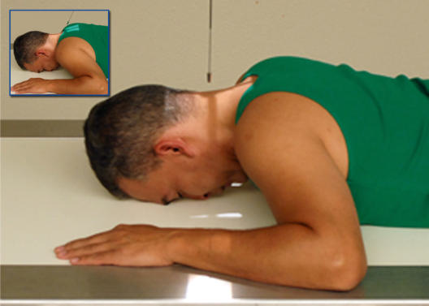
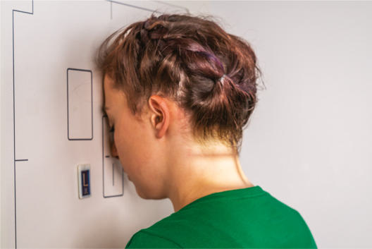
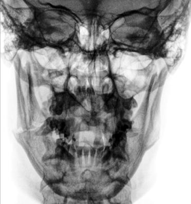
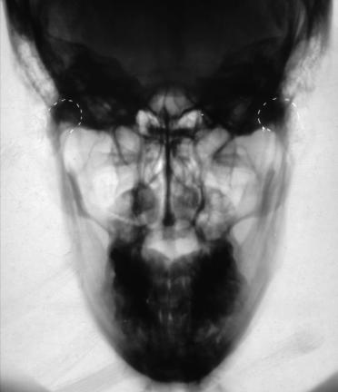

# Rx Mandibulă PA OR PA Axială

  📷 Radiografie Convențională (Rx)
  <strong>Actualizat:</strong> 2026-09-15
  <strong>Autor:</strong> Departamentul de Radiologie / Referință Bontrager

---

-   __1. Rezumat Clinic & Indicații__

    ---

    === "Indicații Clinice"

        - suspiciune de fractură
        - Neoplastic sau inflammatory processes de Mandibulă Optional PA axial best evidențiază proximal rami și elongated incidență de condyloid processes.

    === "Ghid Național IRIS"

        !!! info "Referință Primară: Ghidul Național IRIS (Ordinul MS 1342/2012)"
            - **Capitol Ghid IRIS:** *Ghidul Național IRIS*
            - **Grad de Recomandare:** **De verificat pe indicație; fără grad atribuit automat**
            - **Nivel de Iradiere Estimată:** `De verificat pentru examinarea și populația selectate`

            [:octicons-search-16: Deschide Ghidul IRIS](../../iris.md){ .md-button .md-button--primary } [:material-open-in-new: Aplicația Oficială PWA](https://radiologie-pediatrica.ro/iris/){ .md-button target="_blank" rel="noopener" }
-   __2. Poziționare & Centrare Fascicul__

    ---

    - **Poziție Pacient:** Pacient: Se îndepărtează toate obiectele metalice sau din plastic din regiunea capului și gâtului. pacient poziție este Ortostatism sau Decubit ventral.; Regiune anatomică: Rest pacient’s forehead și nose against table/în ortostatism imaging device surface (Fig. 11.160). Tuck chin, bringing linie orbitomeatală (LOM) perpendicular pe receptorul de imagine (see NOTE). Align MsP perpendicular la midline de grilă sau table/imaging device surface (ensuring Absența rotației anatomice: clavicule echidistante față de linia apofizelor spinoase sau tilt de cap). Se centrează receptorul de imagine pe proiecția razei centrale (la junction de lips).
    - **Punct de Centrare Fascicul:** PA: Align Raza centrală (RC) perpendiculară pe receptorul de imagine, centrat pe exit la junction de lips. (pentru traumatism acuttism / Regim Urgență pacienți, perform AP cu pacient Decubit dorsal). Optional PA axial: Raza centrală se înclină 20°–25° cranial (spre cap), centrat pe exit la acantion. (pentru traumatism acuttism / Regim Urgență pacienți, perform AP axial cu pacient Decubit dorsal).
    - **Distanță Focar-Film (DFF / SID):** 100 cm
    - **Comandă Respiratorie:** Apnee pe durata expunerii.

-   __3. Parametri Tehnici Expunere__

    ---

    | Parametru Tehnic | Valoare Configurare Generator / Tub |
    |:-----------------|:-------------------------------------|
    | **Tensiune Tub (kV)** | 75-90 kV |
    | **Sarcină / Produs Curent-Timp (mAs)** | DE CONFIGURAT PE APARAT |
    | **Distanță Focar-Film (DFF / SID)** | 100 cm |
    | **Grilă Antidifuzoare (Bucky)** | Cu grilă antidifuzoare Bucky |
    | **Dimensiune Focar** | Focar Mare (1.0 - 1.2 mm) |
    | **Camere de Ionizare AEC** | Camerele laterale (sau camera centrală funcție de regiune) |
    | **Colimare Fascicul** | Collimate pe four sides la anatomy de interest. |
    | **Filtrare Tub** | Totală ≥ 2.5 mm Al echivalent |

-   __4. Criterii de Calitate & Reușită Imagine__

    ---

    - PA: ramuri mandibulare și lateral portion de corp sunt vizibil (Fig. 11.161).
    - optional PA axial: Articulații Temporomandibulare (ATM) region și heads de condyles sunt vizibil through mastoid processes; condyloid processes sunt well visualized (slightly elongated) (Fig. 11.162). poziție:
    - fără pacient rotație exists, ca indicated prin ramuri mandibulare visualized symmetrically, lateral la Coloană Cervicală.
    - Midbody și mentum sunt faintly visualized, superimposed pe Coloană Cervicală.
    - Collimation la aria de interes diagnostic. expunere:
    - optim receptorul de imagine expunere și contrast sunt sufficient la visualize corp mandibular și rami.
    - net bony margins indicate fără mișcare. R Fig. 11.161 PA; suspiciune de fractură through stâng ramus. Fig. 11.160 PA—Raza centrală perpendiculară, exit la junction de lips. Inset, Optional PA axial—raza centrală 20° la 25° cranial, exit la acantion. R Fig. 11.162 Optional PA axial—raza centrală 20° la 25° cranial.

-   __5. Protecție Radiologică (ALARA)__

    ---

    - Ecranare gonadică și a organelor radiosensibile conform procedurilor locale de radioprotecție ALARA.
    - Colimare strictă la aria de interes pentru limitarea radiației difuze.
    - Verificarea posibilității unei sarcini la pacientele de vârstă fertilă înainte de expunere.

!!! note "Observații Clinice & Tehnice"
    pentru Incidență Postero-Anterioară (PA) de corp mandibular (if this este aria de interes diagnostic), raise chin la bring linie acantiomeatală (LAM) perpendicular pe receptorul de imagine (RI). raza centrală este orientat perpendicular pe receptorul de imagine (RI), exits la junction de lips. fără AEC Mandibulă ROUTINE Axiolateral oblic PA (sau PA axial) AP axial (Incidență AP Axială (Metoda Towne))

### 🖼️ Imagini

<figure class="protocol-image-card" markdown>

<figcaption><strong>Fig. 11.161 PA; suspiciune de fractură through stâng ramus.</strong> — Poziționare pacient conform Ghidului Bontrager (Fig. 11.161 PA; suspiciune de fractură through stâng ramus.)</figcaption>

</figure>

<figure class="protocol-image-card" markdown>

<figcaption><strong>Fig. 11.160 PA—Raza centrală perpendiculară, exit la junction de lips. Inset,</strong> — Aspect radiografic de referință conform Ghidului Bontrager (Fig. 11.160 PA—raza centrală perpendicular, exit la junction de lips. Inset,)</figcaption>

</figure>

<figure class="protocol-image-card" markdown>

<figcaption><strong>Fig. 11.162 Optional PA axial—raza centrală 20° la 25° cranial.</strong> — Aspect radiografic de referință conform Ghidului Bontrager (Fig. 11.162 Optional PA axial—raza centrală 20° la 25° cranial.)</figcaption>

</figure>

<figure class="protocol-image-card" markdown>

<figcaption><strong>Figura 4</strong> — Aspect radiografic de referință conform Ghidului Bontrager (Figura 4)</figcaption>

</figure>

=== "Ghid Rapid de Execuție"

    1. **Identificarea și verificarea pacientului:** verificare identitate, zonă de examinat, consimțământ conform procedurii și evaluarea posibilității unei sarcini, când este relevantă.
    2. **Pregătire:** îndepărtarea oricăror obiecte radiopace (bijuterii, agrafe, fermoare, proteze, pansamente dense).
    3. **Poziționare precisă:** alinierea receptorului de imagine și a tubului la distanța prescrisă (100 cm).
    4. **Colimare strictă:** adaptarea fasciculului strict la regiunea de diagnostic pentru scăderea iradierii și reducerea radiației difuze.
    5. **Radioprotecție:** verificarea [politicii RX](../radioprotectie.md), cu măsuri distincte pentru pacient, personal și însoțitor.

## Surse de documentare

- [Bontrager's Textbook of Radiographic Positioning (Ed. 9/10), Pagina 455](https://www.elsevier.com/books/textbook-of-radiographic-positioning-and-related-anatomy/lampignano/978-0-323-65367-1)
