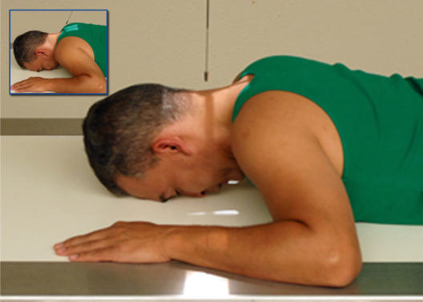
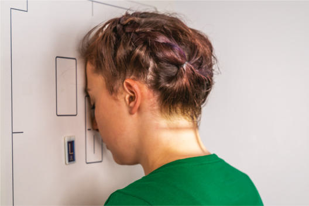
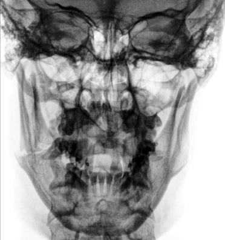
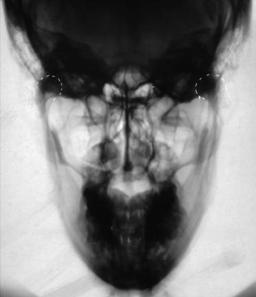

# Rx Mandibulă — Incidență PA sau PA axială

  📷 Radiografie Convențională (Rx)
  <strong>Actualizat:</strong> 2026-09-15
  <strong>Autor:</strong> Departamentul de Radiologie / Referință Bontrager

---

-   __1. Rezumat Clinic & Indicații__

    ---

    === "Indicații Clinice"

        - Suspiciune de fractură
        - Procese neoplazice sau inflamatorii ale mandibulei. Opțional, PA axială evidențiază cel mai bine ramurile proximale și procesele condiliene alungite.

    === "Ghid Național IRIS"

        !!! info "Referință Primară: Ghidul Național IRIS (Ordinul MS 1342/2012)"
            - **Capitol Ghid IRIS:** *Ghidul Național IRIS*
            - **Grad de Recomandare:** **De verificat pe indicație; fără grad atribuit automat**
            - **Nivel de Iradiere Estimată:** `De verificat pentru examinarea și populația selectate`

            [:octicons-search-16: Deschide Ghidul IRIS](../../iris.md){ .md-button .md-button--primary } [:material-open-in-new: Aplicația Oficială PWA](https://radiologie-pediatrica.ro/iris/){ .md-button target="_blank" rel="noopener" }
-   __2. Poziționare & Centrare Fascicul__

    ---

    - **Poziție Pacient:** Pacient: Se îndepărtează toate obiectele metalice sau din plastic din regiunea capului și gâtului. Poziția pacientului este în ortostatism sau decubit ventral. Regiune anatomică: Se sprijină fruntea și nasul pacientului de masă/în ortostatism de suprafața dispozitivului de imagistică (fig. 11.160). Se retrage bărbia, aducând linia orbitomeatală (LOM) perpendicular pe receptorul de imagine (vezi NOTA). Se aliniază MSP perpendicular pe linia mediană a grilei sau pe suprafața mesei/dispozitivului de imagistică (asigurând absența rotației anatomice: claviculele echidistante față de linia apofizelor spinoase sau înclinarea capului). Se centrează receptorul de imagine pe proiecția razei centrale (la nivelul comisurii buzelor).
    - **Punct de Centrare Fascicul:** PA: Se aliniază raza centrală (RC) perpendicular pe receptorul de imagine, centrată la ieșirea la nivelul comisurii buzelor. (Pentru pacienții cu traumatism acut / regim de urgență, se efectuează AP cu pacientul în decubit dorsal.) Opțional PA axială: raza centrală se înclină cu 20°–25° cranial (spre cap), centrată la ieșirea la nivelul acantionului. (Pentru pacienții cu traumatism acut / regim de urgență, se efectuează AP axială cu pacientul în decubit dorsal.)
    - **Distanță Focar-Film (DFF / SID):** 100 cm
    - **Comandă Respiratorie:** Apnee pe durata expunerii.

-   __3. Parametri Tehnici Expunere__

    ---

    | Parametru Tehnic | Valoare Configurare Generator / Tub |
    |:-----------------|:-------------------------------------|
    | **Tensiune Tub (kV)** | 75-90 kV |
    | **Sarcină / Produs Curent-Timp (mAs)** | DE CONFIGURAT PE APARAT |
    | **Distanță Focar-Film (DFF / SID)** | 100 cm |
    | **Grilă Antidifuzoare (Bucky)** | Cu grilă antidifuzoare Bucky |
    | **Dimensiune Focar** | Focar Mare (1.0 - 1.2 mm) |
    | **Camere de Ionizare AEC** | Camerele laterale (sau camera centrală, în funcție de regiune) |
    | **Colimare Fascicul** | Colimați pe cele patru laturi la anatomia de interes. |
    | **Filtrare Tub** | Totală ≥ 2.5 mm Al echivalent |

-   __4. Criterii de Calitate & Reușită Imagine__

    ---

    - PA: Ramurile mandibulare și porțiunea laterală a corpului sunt vizibile (fig. 11.161).
    - PA axială opțională: Regiunea articulațiilor temporomandibulare (ATM) și capetele condililor sunt vizibile prin procesele mastoide; procesele condiliene sunt bine vizualizate (ușor alungite) (fig. 11.162). Poziție:
    - Nu există rotația pacientului, după cum indică ramurile mandibulare vizualizate simetric, lateral față de coloana cervicală.
    - Porțiunea mijlocie a corpului și mentumul sunt vizualizate discret, suprapuse peste coloana cervicală.
    - Colimare la aria de interes diagnostic. Expunere:
    - Expunerea și contrastul optime ale receptorului de imagine sunt suficiente pentru vizualizarea corpului mandibular și a ramurilor.
    - Marginile osoase clare indică absența mișcării. R Fig. 11.161 PA; suspiciune de fractură prin ramusul stâng. Fig. 11.160 PA — raza centrală perpendiculară, ieșire la nivelul comisurii buzelor. Inserție, PA axială opțională — raza centrală cu 20° la 25° cranial, ieșire la nivelul acantionului. R Fig. 11.162 PA axială opțională — raza centrală cu 20° la 25° cranial.

-   __5. Protecție Radiologică (ALARA)__

    ---

    - Ecranare gonadică și a organelor radiosensibile conform procedurilor locale de radioprotecție ALARA.
    - Colimare strictă la aria de interes pentru limitarea radiației difuze.
    - Verificarea posibilității unei sarcini la pacientele de vârstă fertilă înainte de expunere.

!!! note "Observații Clinice & Tehnice"
    Pentru incidența postero-anterioară (PA) a corpului mandibular (dacă aceasta este aria de interes diagnostic), se ridică bărbia pentru a aduce linia acantiomeatală (LAM) perpendicular pe receptorul de imagine (RI). Raza centrală este orientată perpendicular pe receptorul de imagine (RI), ieșind la nivelul comisurii buzelor. Fără AEC. Mandibulă. DE RUTINĂ: axiolaterală oblică PA (sau PA axială); AP axială (incidență AP axială (metoda Towne)).

### 🖼️ Imagini

<figure class="protocol-image-card" markdown>

<figcaption><strong>Fig. 11.161 PA; suspiciune de fractură prin ramusul stâng.</strong> — Poziționarea pacientului conform Ghidului Bontrager (fig. 11.161 PA; suspiciune de fractură prin ramusul stâng.)</figcaption>

</figure>

<figure class="protocol-image-card" markdown>

<figcaption><strong>Fig. 11.160 PA — raza centrală perpendiculară, ieșire la nivelul comisurii buzelor. Inserție,</strong> — Aspect radiografic de referință conform Ghidului Bontrager (fig. 11.160 PA — raza centrală perpendiculară, ieșire la nivelul comisurii buzelor. Inserție,)</figcaption>

</figure>

<figure class="protocol-image-card" markdown>

<figcaption><strong>Fig. 11.162 PA axială opțională — raza centrală cu 20° la 25° cranial.</strong> — Aspect radiografic de referință conform Ghidului Bontrager (fig. 11.162 PA axială opțională — raza centrală cu 20° la 25° cranial.)</figcaption>

</figure>

<figure class="protocol-image-card" markdown>

<figcaption><strong>Figura 4</strong> — Aspect radiografic de referință conform Ghidului Bontrager (Figura 4)</figcaption>

</figure>

=== "Ghid Rapid de Execuție"

    1. **Identificarea și verificarea pacientului:** verificare identitate, zonă de examinat, consimțământ conform procedurii și evaluarea posibilității unei sarcini, când este relevantă.
    2. **Pregătire:** îndepărtarea oricăror obiecte radiopace (bijuterii, agrafe, fermoare, proteze, pansamente dense).
    3. **Poziționare precisă:** alinierea receptorului de imagine și a tubului la distanța prescrisă (100 cm).
    4. **Colimare strictă:** adaptarea fasciculului strict la regiunea de diagnostic pentru scăderea iradierii și reducerea radiației difuze.
    5. **Radioprotecție:** verificarea [politicii RX](../radioprotectie.md), cu măsuri distincte pentru pacient, personal și însoțitor.

## Surse de documentare

- [Bontrager's Textbook of Radiographic Positioning (Ed. 9/10), Pagina 455](https://www.elsevier.com/books/textbook-of-radiographic-positioning-and-related-anatomy/lampignano/978-0-323-65367-1)
