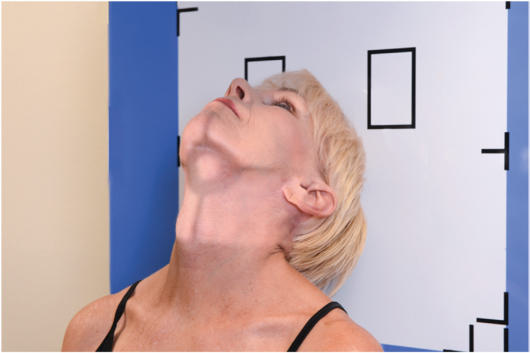
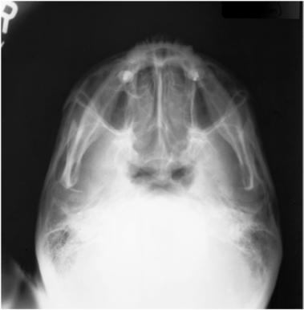
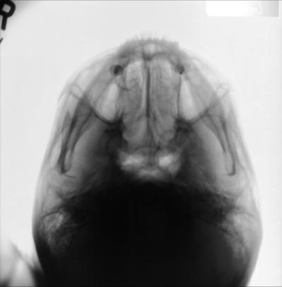

# Rx Mandibulă SUBMENTOVERTICAL (SMV) PROJECTION

  📷 Radiografie Convențională (Rx)
  <strong>Actualizat:</strong> 2026-09-15
  <strong>Autor:</strong> Departamentul de Radiologie / Referință Bontrager

---

-   __1. Rezumat Clinic & Indicații__

    ---

    === "Indicații Clinice"

        - suspiciune de fractură and neoplastic or inflammatory process of Mandibulă

    === "Ghid Național IRIS"

        !!! info "Referință Primară: Ghidul Național IRIS (Ordinul MS 1342/2012)"
            - **Capitol Ghid IRIS:** *Ghidul Național IRIS*
            - **Grad de Recomandare:** **De verificat pe indicație; fără grad atribuit automat**
            - **Nivel de Iradiere Estimată:** `De verificat pentru examinarea și populația selectate`

            [:octicons-search-16: Deschide Ghidul IRIS](../../iris.md){ .md-button .md-button--primary } [:material-open-in-new: Aplicația Oficială PWA](https://radiologie-pediatrica.ro/iris/){ .md-button target="_blank" rel="noopener" }
-   __2. Poziționare & Centrare Fascicul__

    ---

    - **Poziție Pacient:** Pacient: Remove all metallic or plastic objects from head and neck. Patient position is Ortostatism or Decubit Dorsal (Ortostatism preferred, if patient’s condition allows). Ortostatism may be done with an upright imaging device (Fig. 11.166).; Regiune anatomică: Hyperextend neck until ioMl is parallel to IR. Rest head on vertex of Craniu. Align MsP perpendicular to midline of grid or table/upright imaging device surface to prevent head rotation or tilt.
    - **Punct de Centrare Fascicul:** Align Raza centrală (RC) perpendiculară pe receptorul de imagine or IOML (see NOTE). Center CR to a point midway between angles of Mandibulă or at a level 1½ inches (4 cm) inferior to mandibular symphysis. Center IR to projected CR.
    - **Distanță Focar-Film (DFF / SID):** 100 cm
    - **Comandă Respiratorie:** Suspend respiration.

-   __3. Parametri Tehnici Expunere__

    ---

    | Parametru Tehnic | Valoare Configurare Generator / Tub |
    |:-----------------|:-------------------------------------|
    | **Tensiune Tub (kV)** | 80-95 kV |
    | **Sarcină / Produs Curent-Timp (mAs)** | DE CONFIGURAT PE APARAT |
    | **Distanță Focar-Film (DFF / SID)** | 100 cm |
    | **Grilă Antidifuzoare (Bucky)** | Cu grilă antidifuzoare Bucky |
    | **Dimensiune Focar** | Focar Mare (1.0 - 1.2 mm) |
    | **Camere de Ionizare AEC** | Camerele laterale (sau camera centrală funcție de regiune) |
    | **Colimare Fascicul** | Collimate on four sides to anatomy of interest. |
    | **Filtrare Tub** | Totală ≥ 2.5 mm Al echivalent |

-   __4. Criterii de Calitate & Reușită Imagine__

    ---

    - Entire Mandibulă and coronoid and condyloid processes are demonstrated (Figs. 11.167 and 11.168). Position:
    - Correct neck extension is indicated by the following: mandibular symphysis superimposing frontal bone; mandibular condyles projected anterior to petrous ridges.
    - no patient rotation or tilt is indicated by the following: no tilt as evidenced by equal distance from Mandibulă to lateral border of Craniu; Absența rotației anatomice: clavicule echidistante față de linia apofizelor spinoase as evidenced by symmetric mandibular condyles.
    - Collimation to area of interest. Exposure:
    - Optimal image receptor exposure and contrast are sufficient to visualize the Mandibulă superimposed on the Craniu.
    - Sharp bony margins indicate no motion. Fig. 11.166 SMV—Mandibulă. Mandibulă Petrous pyramids Condyloid process (includes head and neck) Coronoid process Mentum and mandibular symphysis Fig. 11.168 SMV—Mandibulă. Fig. 11.167 SMV—Mandibulă.

-   __5. Protecție Radiologică (ALARA)__

    ---

    - Ecranare gonadică și a organelor radiosensibile conform procedurilor locale de radioprotecție ALARA.
    - Colimare strictă la aria de interes pentru limitarea radiației difuze.
    - Verificarea posibilității unei sarcini la pacientele de vârstă fertilă înainte de expunere.

!!! note "Observații Clinice & Tehnice"
    If patient is unable to extend the neck sufficiently, angle tube to align Raza centrală perpendiculară to ioMl. This position is very uncomfortable for the patient; complete the projection as quickly as possible. Mandibulă SPECIAL SMV Orthopantomography (Mandibulă or TMJs or both)

### 🖼️ Imagini

<figure class="protocol-image-card" markdown>

<figcaption><strong>Fig. 11.166 SMV—Mandibulă.</strong> — Poziționare pacient conform Ghidului Bontrager (Fig. 11.166 SMV—mandible.)</figcaption>

</figure>

<figure class="protocol-image-card" markdown>

<figcaption><strong>Fig. 11.168 SMV—Mandibulă.</strong> — Aspect radiografic de referință conform Ghidului Bontrager (Fig. 11.168 SMV—mandible.)</figcaption>

</figure>

<figure class="protocol-image-card" markdown>

<figcaption><strong>Fig. 11.167 SMV—Mandibulă.</strong> — Aspect radiografic de referință conform Ghidului Bontrager (Fig. 11.167 SMV—mandible.)</figcaption>

</figure>

=== "Ghid Rapid de Execuție"

    1. **Identificarea și verificarea pacientului:** verificare identitate, zonă de examinat, consimțământ conform procedurii și evaluarea posibilității unei sarcini, când este relevantă.
    2. **Pregătire:** îndepărtarea oricăror obiecte radiopace (bijuterii, agrafe, fermoare, proteze, pansamente dense).
    3. **Poziționare precisă:** alinierea receptorului de imagine și a tubului la distanța prescrisă (100 cm).
    4. **Colimare strictă:** adaptarea fasciculului strict la regiunea de diagnostic pentru scăderea iradierii și reducerea radiației difuze.
    5. **Radioprotecție:** verificarea [politicii RX](../radioprotectie.md), cu măsuri distincte pentru pacient, personal și însoțitor.

## Surse de documentare

- [Bontrager's Textbook of Radiographic Positioning (Ed. 9/10), Pagina 457](https://www.elsevier.com/books/textbook-of-radiographic-positioning-and-related-anatomy/lampignano/978-0-323-65367-1)
