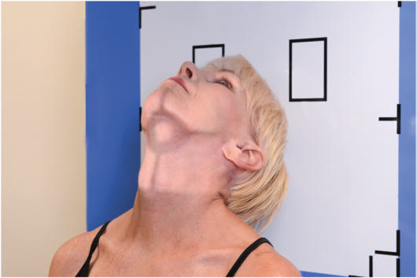
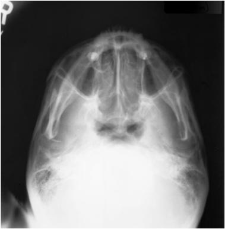
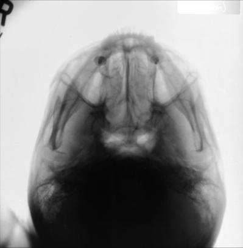

# Rx Mandibulă Incidență SUBMENTOVERTICALĂ (SMV)

  📷 Radiografie Convențională (Rx)
  <strong>Actualizat:</strong> 2026-09-15
  <strong>Autor:</strong> Departamentul de Radiologie / Referință Bontrager

---

-   __1. Rezumat Clinic & Indicații__

    ---

    === "Indicații Clinice"

        - suspiciune de fractură și proces neoplazic sau inflamator al mandibulei

    === "Ghid Național IRIS"

        !!! info "Referință Primară: Ghidul Național IRIS (Ordinul MS 1342/2012)"
            - **Capitol Ghid IRIS:** *Ghidul Național IRIS*
            - **Grad de Recomandare:** **De verificat pe indicație; fără grad atribuit automat**
            - **Nivel de Iradiere Estimată:** `De verificat pentru examinarea și populația selectate`

            [:octicons-search-16: Deschide Ghidul IRIS](../../iris.md){ .md-button .md-button--primary } [:material-open-in-new: Aplicația Oficială PWA](https://radiologie-pediatrica.ro/iris/){ .md-button target="_blank" rel="noopener" }
-   __2. Poziționare & Centrare Fascicul__

    ---

    - **Poziție Pacient:** Pacient: Se îndepărtează toate obiectele metalice sau din plastic din regiunea capului și gâtului. Poziția pacientului este ortostatism sau decubit dorsal (se preferă ortostatismul, dacă starea pacientului permite). Ortostatismul poate fi realizat cu un dispozitiv de radiografie în ortostatism (Fig. 11.166).; Regiune anatomică: Se hiperextinde gâtul până când linia infraorbitomeatală (LIOM) este paralelă cu receptorul de imagine. Se sprijină capul pe vertexul craniului. Se aliniază MSP perpendicular pe linia mediană a grilei sau pe suprafața mesei/dispozitivului de radiografie în ortostatism pentru a preveni rotația sau înclinarea capului.
    - **Punct de Centrare Fascicul:** Se aliniază raza centrală (RC) perpendicular pe receptorul de imagine sau pe linia infraorbitomeatală (LIOM) (a se vedea NOTA). Se centrează raza centrală la punctul situat la jumătatea distanței dintre unghiurile mandibulei sau la nivelul de 1½ inches (4 cm) inferior față de simfiza mandibulară. Se centrează receptorul de imagine pe proiecția razei centrale.
    - **Distanță Focar-Film (DFF / SID):** 100 cm
    - **Comandă Respiratorie:** Apnee pe durata expunerii.

-   __3. Parametri Tehnici Expunere__

    ---

    | Parametru Tehnic | Valoare Configurare Generator / Tub |
    |:-----------------|:-------------------------------------|
    | **Tensiune Tub (kV)** | 80-95 kV |
    | **Sarcină / Produs Curent-Timp (mAs)** | DE CONFIGURAT PE APARAT |
    | **Distanță Focar-Film (DFF / SID)** | 100 cm |
    | **Grilă Antidifuzoare (Bucky)** | Cu grilă antidifuzoare Bucky |
    | **Dimensiune Focar** | Focar Mare (1.0 - 1.2 mm) |
    | **Camere de Ionizare AEC** | Camerele laterale (sau camera centrală, în funcție de regiune) |
    | **Colimare Fascicul** | Colimați pe cele patru laturi la anatomia de interes. |
    | **Filtrare Tub** | Totală ≥ 2.5 mm Al echivalent |

-   __4. Criterii de Calitate & Reușită Imagine__

    ---

    - Întreaga mandibulă, precum și procesele coronoid și condiloid, sunt evidențiate (Figs. 11.167 și 11.168). Poziție:
    - Extensia corectă a gâtului este indicată prin următoarele: simfiza mandibulară se suprapune peste osul frontal; condilii mandibulari sunt proiectați anterior față de stâncile temporale (piramidele pietroase).
    - Absența rotației sau a înclinării pacientului este indicată prin următoarele: absența înclinării, evidențiată prin distanțe egale de la mandibulă la marginea laterală a craniului; absența rotației anatomice: claviculele sunt echidistante față de linia apofizelor spinoase, fapt evidențiat prin condili mandibulari simetrici.
    - Colimare la aria de interes diagnostic. Expunere:
    - Expunerea și contrastul optime ale receptorului de imagine sunt suficiente pentru vizualizarea mandibulei suprapuse peste craniu.
    - Marginile osoase nete indică absența mișcării. Fig. 11.166 SMV—Mandibulă. Mandibulă; stânci temporale (piramide pietroase); proces condiloid (include capul și colul); proces coronoid; menton și simfiză mandibulară. Fig. 11.168 SMV—Mandibulă. Fig. 11.167 SMV—Mandibulă.

-   __5. Protecție Radiologică (ALARA)__

    ---

    - Ecranare gonadică și a organelor radiosensibile conform procedurilor locale de radioprotecție ALARA.
    - Colimare strictă la aria de interes pentru limitarea radiației difuze.
    - Verificarea posibilității unei sarcini la pacientele de vârstă fertilă înainte de expunere.

!!! note "Observații Clinice & Tehnice"
    Dacă pacientul nu poate extinde gâtul suficient, se angulează tubul pentru a alinia raza centrală perpendicular pe linia infraorbitomeatală (LIOM). Această poziție este foarte incomodă pentru pacient; se efectuează incidența cât mai rapid posibil. Mandibulă SPECIAL SMV Ortopantomografie (mandibulă sau ATM-uri sau ambele)

### 🖼️ Imagini

<figure class="protocol-image-card" markdown>

<figcaption><strong>Fig. 11.166 SMV—Mandibulă.</strong> — Poziționarea pacientului conform Ghidului Bontrager (Fig. 11.166 SMV—mandibulă.)</figcaption>

</figure>

<figure class="protocol-image-card" markdown>

<figcaption><strong>Fig. 11.168 SMV—Mandibulă.</strong> — Aspect radiografic de referință conform Ghidului Bontrager (Fig. 11.168 SMV—mandibulă.)</figcaption>

</figure>

<figure class="protocol-image-card" markdown>

<figcaption><strong>Fig. 11.167 SMV—Mandibulă.</strong> — Aspect radiografic de referință conform Ghidului Bontrager (Fig. 11.167 SMV—mandibulă.)</figcaption>

</figure>

=== "Ghid Rapid de Execuție"

    1. **Identificarea și verificarea pacientului:** verificare identitate, zonă de examinat, consimțământ conform procedurii și evaluarea posibilității unei sarcini, când este relevantă.
    2. **Pregătire:** îndepărtarea oricăror obiecte radiopace (bijuterii, agrafe, fermoare, proteze, pansamente dense).
    3. **Poziționare precisă:** alinierea receptorului de imagine și a tubului la distanța prescrisă (100 cm).
    4. **Colimare strictă:** adaptarea fasciculului strict la regiunea de diagnostic pentru scăderea iradierii și reducerea radiației difuze.
    5. **Radioprotecție:** verificarea [politicii RX](../radioprotectie.md), cu măsuri distincte pentru pacient, personal și însoțitor.

## Surse de documentare

- [Bontrager's Textbook of Radiographic Positioning (Ed. 9/10), Pagina 457](https://www.elsevier.com/books/textbook-of-radiographic-positioning-and-related-anatomy/lampignano/978-0-323-65367-1)
