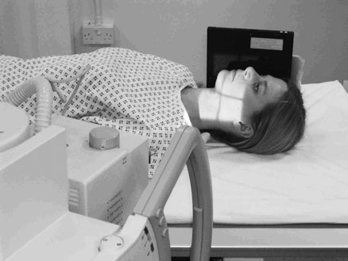
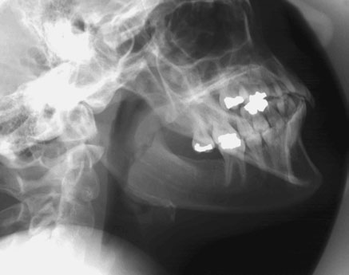
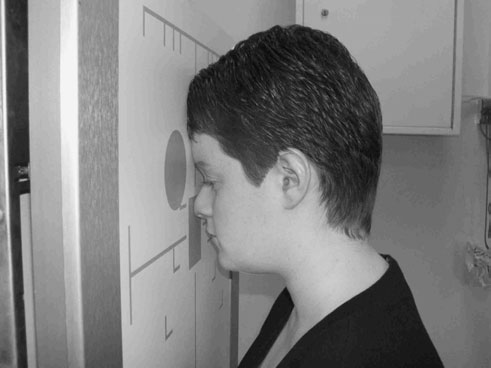
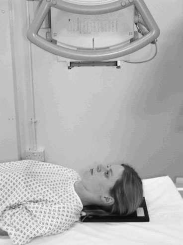
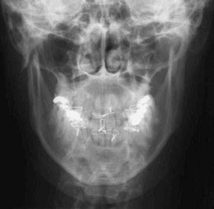

# Rx Masiv Facial (Oase ale Feței) 30°

  📷 Radiografie Convențională (Rx)
  <strong>Actualizat:</strong> 2026-09-16
  <strong>Autor:</strong> Departamentul de Radiologie / Referință Clark (Ed. 12)

---

-   __1. Rezumat Clinic & Indicații__

    ---

    === "Indicații Clinice"

        - Do nu mistake mandibular canal, which transmits inferior alveolar nerve, pentru suspiciune de fractură.
        - This incidență evidențiază corp și rami de Mandibulă și poate show transverse sau Oblică suspiciune de fractură nu evident pe other incidențe sau dental panoramic Tomografie Liniară Convențională (DPT) (orthopantomography, OPT).
        - region de simfiză menti este superimposed over cervical vertebra și will fie seen more clearly when using Oblică Anterioară incidență.

    === "Ghid Național IRIS"

        !!! info "Referință Primară: Ghidul Național IRIS (Ordinul MS 1342/2012)"
            - **Capitol Ghid IRIS:** *Ghidul Național IRIS*
            - **Grad de Recomandare:** **De verificat pe indicație; fără grad atribuit automat**
            - **Nivel de Iradiere Estimată:** `De verificat pentru examinarea și populația selectate`

            [:octicons-search-16: Deschide Ghidul IRIS](../../iris.md){ .md-button .md-button--primary } [:material-open-in-new: Aplicația Oficială PWA](https://radiologie-pediatrica.ro/iris/){ .md-button target="_blank" rel="noopener" }
-   __2. Poziționare & Centrare Fascicul__

    ---

    - **Poziție Pacient:** • pacientul este culcat în Decubit dorsal poziție. trunk este rotit slightly și then sprijinit cu pads la allow side de fața being examined la come into contact cu caseta, which will fie culcat pe tabletop.

• pacientul stă așezat facing stativ vertical Bucky sau Craniu unit casetă holder. Alternatively, în case de trauma, incidență poate fie Decubit dorsal pe trolley, giving Antero-posterior (AP) incidență.
• pacientul’s plan mediosagital trebuie să fie coincident cu linia mediană Bucky sau casetă holder. capul este then ajustat la bring orbito-meatal baseline perpendicular pe Bucky sau casetă holder.
• planul mediosagital trebuie să fie perpendicular pe casetă. Check that extern auditory meatuses sunt echidistant față de caseta.
• caseta trebuie să fie poziționat astfel încât middle de an 18  24-cm casetă, when plasat longitudinally în Bucky sau casetă holder, este centred la nivelul angles de Mandibulă.
    - **Punct de Centrare Fascicul:** • raza centrală este înclinat 30 grade cranially la un unghi de 60 grade la caseta și este centred 5 cm inferior la angle de Mandibulă remote de la caseta.
• Collimate pentru include whole de Mandibulă și temporo-mandibular articulație (TMJ) (include extern auditory meatus (conduct auditiv extern (CAE)) la edge de collimation field).

• raza centrală este orientat perpendicular pe casetă și centred în linia mediană la levels de angles de Mandibulă.
    - **Distanță Focar-Film (DFF / SID):** 100 cm
    - **Comandă Respiratorie:** Apnee pe durata expunerii (apnee în inspir pentru torace; expir pentru Abdomen/bazin).

-   __3. Parametri Tehnici Expunere__

    ---

    | Parametru Tehnic | Valoare Configurare Generator / Tub |
    |:-----------------|:-------------------------------------|
    | **Tensiune Tub (kV)** | DE CONFIGURAT PE APARAT |
    | **Sarcină / Produs Curent-Timp (mAs)** | Conform AEC / grosime anatomică |
    | **Distanță Focar-Film (DFF / SID)** | 100 cm |
    | **Grilă Antidifuzoare (Bucky)** | Cu grilă antidifuzoare Bucky |
    | **Dimensiune Focar** | Focar Mic (0.6 mm) |
    | **Camere de Ionizare AEC** | Camerele laterale (sau camera centrală funcție de regiune) |
    | **Colimare Fascicul** | Colimare strictă adaptată pe receptor 18 x 24 cm |
    | **Filtrare Tub** | Totală ≥ 2.5 mm Al echivalent (conform Clark: 3.0 mm Al eq.) |

-   __4. Criterii de Calitate & Reușită Imagine__

    ---

    - corp și ramus de fiecare side de Mandibulă trebuie să nu fie superimposed.
    - imagine trebuie să include whole de Mandibulă, de la TMJ la simfiză menti.
    - whole de Mandibulă de la lower portions de TMJs la simfiză menti trebuie să fie included în imagine.
    - There trebuie să fie Absența rotației anatomice (simetrie bilaterală perfectă) evident.
    - Erori de evitat / remedii: Superimposition de mandibular corpuri will result if angle applied la tubul este less than 30 grade sau if centring point este too high.
    - Erori de evitat / remedii: If Umăr este obscuring region de interest în Fascicul Orizontal incidență, then slight angulation spre floor poate have la fie applied, sau, if pacientul’s condition will allow, tilt capul spre side under examination. Superimposition de upper parts de Mandibulă over temporal bone will result if orbito-meatal baseline este nu perpendicular pe casetă.

-   __5. Protecție Radiologică (ALARA)__

    ---

    - Ecranare gonadică cu șorț plumbat dacă gonadele sunt în apropierea fasciculului util (regula ALARA).
    - Colimare precisă la dimensiunea anatomică strict necesară pentru reducerea dozei și a radiației difuze.
    - Verificarea posibilității unei sarcini la pacientele de vârstă fertilă înainte de expunere.

!!! note "Observații Clinice & Tehnice"
    • în cases de injury, ambele părți (bilateral) trebuie să fie examined la evidențiază possible contre-coup suspiciune de fractură.
• Tilting capul spre side being examined poate aid positioning if Umăr este interfering cu primary fascicul.

A 10-grade cranial angulation de fascicul poate fie required la evidențiază mandibular condyles și temporal mandibular articulații.
272

### 🖼️ Imagini

<figure class="protocol-image-card" markdown>

<figcaption><strong>ior alveolar nerve, pentru suspiciune de fractură.</strong> — Poziționare pacient și centrare fascicul conform Clark (Ed. 12)</figcaption>

</figure>

<figure class="protocol-image-card" markdown>

<figcaption><strong>strate possible contre-coup suspiciune de fractură.</strong> — Aspect radiografic / ghid de poziționare conform tratatului Clark (Ed. 12)</figcaption>

</figure>

<figure class="protocol-image-card" markdown>

<figcaption><strong>Figura 3: Aspect radiografic / Poziționare (Clark Ed. 12)</strong> — Aspect radiografic / ghid de poziționare conform tratatului Clark (Ed. 12)</figcaption>

</figure>

<figure class="protocol-image-card" markdown>

<figcaption><strong>Mandibulă și poate show transverse sau Oblică suspiciune de fractură nu</strong> — Aspect radiografic / ghid de poziționare conform tratatului Clark (Ed. 12)</figcaption>

</figure>

<figure class="protocol-image-card" markdown>

<figcaption><strong>Figura 5: Aspect radiografic / Poziționare (Clark Ed. 12)</strong> — Aspect radiografic / ghid de poziționare conform tratatului Clark (Ed. 12)</figcaption>

</figure>

<figure class="protocol-image-card" markdown>

<figcaption><strong>Figura 6: Aspect radiografic / Poziționare (Clark Ed. 12)</strong> — Aspect radiografic / ghid de poziționare conform tratatului Clark (Ed. 12)</figcaption>

</figure>

=== "Ghid Rapid de Execuție"

    1. **Identificarea și verificarea pacientului:** verificare identitate, zonă de examinat, consimțământ conform procedurii și evaluarea posibilității unei sarcini, când este relevantă.
    2. **Pregătire:** îndepărtarea oricăror obiecte radiopace (bijuterii, agrafe, fermoare, proteze, pansamente dense).
    3. **Poziționare precisă:** alinierea receptorului de imagine și a tubului la distanța prescrisă (100 cm).
    4. **Colimare strictă:** adaptarea fasciculului strict la regiunea de diagnostic pentru scăderea iradierii și reducerea radiației difuze.
    5. **Radioprotecție:** verificarea [politicii RX](../radioprotectie.md), cu măsuri distincte pentru pacient, personal și însoțitor.

## Surse de documentare

- [Clark's Positioning in Radiography (Ed. 12), Pagina 286](../../assets/protocols/sources/Clark___Positioning_in_Radiography__12th_edition.pdf#page=286)
