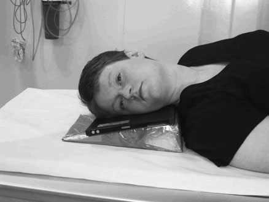
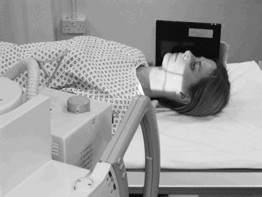
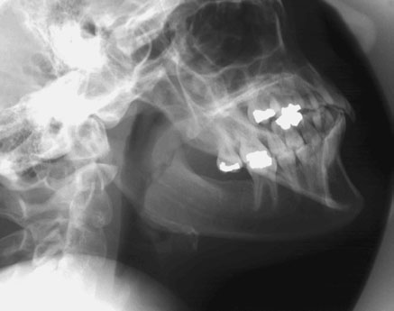
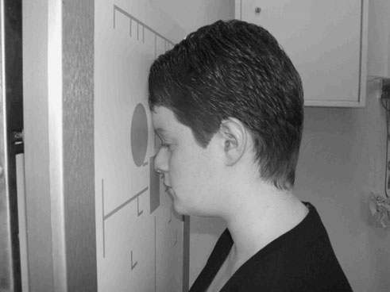
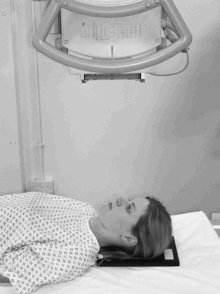
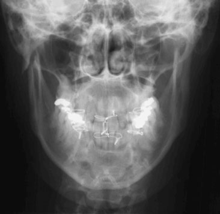

# Rx Masiv Facial (Oase ale Feței) 30°

  📷 Radiografie Convențională (Rx)
  <strong>Actualizat:</strong> 2026-09-16
  <strong>Autor:</strong> Departamentul de Radiologie / Referință Clark (Ed. 12)

---

-   __1. Rezumat Clinic & Indicații__

    ---

    === "Indicații Clinice"

        - Nu confundați canalul mandibular, care transmite nervul alveolar inferior, cu o suspiciune de fractură.
        - Această incidență evidențiază corpul și ramurile mandibulei și poate evidenția o suspiciune de fractură transversală sau oblică, care nu este evidentă pe alte incidențe sau la tomografia liniară convențională dentară panoramică (DPT) (ortopantomografie, OPT).
        - Regiunea simfizei mentoniere este suprapusă peste vertebrele cervicale și va fi vizualizată mai clar la utilizarea unei incidențe oblice anterioare.

    === "Ghid Național IRIS"

        !!! info "Referință Primară: Ghidul Național IRIS (Ordinul MS 1342/2012)"
            - **Capitol Ghid IRIS:** *Ghidul Național IRIS*
            - **Grad de Recomandare:** **De verificat pe indicație; fără grad atribuit automat**
            - **Nivel de Iradiere Estimată:** `De verificat pentru examinarea și populația selectate`

            [:octicons-search-16: Deschide Ghidul IRIS](../../iris.md){ .md-button .md-button--primary } [:material-open-in-new: Aplicația Oficială PWA](https://radiologie-pediatrica.ro/iris/){ .md-button target="_blank" rel="noopener" }
-   __2. Poziționare & Centrare Fascicul__

    ---

    - **Poziție Pacient:** • Pacientul este culcat în decubit dorsal. Trunchiul este rotit ușor și apoi sprijinit cu suporturi, pentru a permite părții examinate a feței să intre în contact cu caseta, așezată pe suprafața mesei.

• Pacientul stă așezat cu fața spre stativul Bucky vertical sau spre suportul casetei aparatului pentru craniu. Alternativ, în caz de traumatism, examinarea se poate efectua în decubit dorsal pe cărucior, obținând o incidență antero-posterioară (AP).
• Planul mediosagital al pacientului trebuie să coincidă cu linia mediană a stativului Bucky sau a suportului casetei. Capul este apoi ajustat pentru a aduce linia orbitomeatală perpendicular pe stativul Bucky sau pe suportul casetei.
• Planul mediosagital trebuie să fie perpendicular pe casetă. Se verifică dacă conductele auditive externe sunt echidistante față de casetă.
• Caseta trebuie poziționată astfel încât centrul unei casete de 18 × 24 cm, așezată longitudinal în stativul Bucky sau în suportul casetei, să fie centrat la nivelul unghiurilor mandibulei.
    - **Punct de Centrare Fascicul:** • raza centrală este înclinată cu 30 grade cranial, la un unghi de 60 grade față de casetă, și este centrată la 5 cm inferior față de unghiul mandibulei îndepărtat de casetă.
• Se colimează pentru a include întreaga mandibulă și articulația temporomandibulară (ATM) (se include conductul auditiv extern (CAE) la marginea câmpului de colimare).

• raza centrală este orientată perpendicular pe casetă și centrată pe linia mediană la nivelul unghiurilor mandibulei.
    - **Distanță Focar-Film (DFF / SID):** 100 cm
    - **Comandă Respiratorie:** Apnee pe durata expunerii (apnee în inspir pentru torace; expir pentru Abdomen/bazin).

-   __3. Parametri Tehnici Expunere__

    ---

    | Parametru Tehnic | Valoare Configurare Generator / Tub |
    |:-----------------|:-------------------------------------|
    | **Tensiune Tub (kV)** | DE CONFIGURAT PE APARAT |
    | **Sarcină / Produs Curent-Timp (mAs)** | Conform AEC / grosimii anatomice |
    | **Distanță Focar-Film (DFF / SID)** | 100 cm |
    | **Grilă Antidifuzoare (Bucky)** | Cu grilă antidifuzoare Bucky |
    | **Dimensiune Focar** | Focar Mic (0.6 mm) |
    | **Camere de Ionizare AEC** | Camerele laterale (sau camera centrală, în funcție de regiune) |
    | **Colimare Fascicul** | Colimare strictă adaptată pe receptor 18 x 24 cm |
    | **Filtrare Tub** | Totală ≥ 2.5 mm Al echivalent (conform Clark: 3.0 mm Al echivalent) |

-   __4. Criterii de Calitate & Reușită Imagine__

    ---

    - corpul și ramura de fiecare parte a mandibulei nu trebuie să fie suprapuse.
    - imaginea trebuie să includă întreaga mandibulă, de la ATM la simfiza mentonieră.
    - întreaga mandibulă, de la porțiunile inferioare ale ATM-urilor până la simfiza mentonieră, trebuie inclusă în imagine.
    - Trebuie să fie evidentă absența rotației anatomice (simetrie bilaterală perfectă).
    - Erori de evitat / remedii: Suprapunerea corpurilor mandibulare va apărea dacă unghiul aplicat tubului este mai mic de 30 grade sau dacă punctul de centrare este prea sus.
    - Erori de evitat / remedii: Dacă umărul obstrucționează regiunea de interes în incidența cu fascicul orizontal, se poate aplica o ușoară angulație spre podea sau, dacă starea pacientului permite, se poate înclina capul spre partea examinată. Suprapunerea porțiunilor superioare ale mandibulei peste osul temporal va apărea dacă linia orbito-meatală nu este perpendiculară pe casetă.

-   __5. Protecție Radiologică (ALARA)__

    ---

    - Ecranare gonadică cu șorț plumbat dacă gonadele sunt în apropierea fasciculului util (regula ALARA).
    - Colimare precisă la dimensiunea anatomică strict necesară pentru reducerea dozei și a radiației difuze.
    - Verificarea posibilității unei sarcini la pacientele de vârstă fertilă înainte de expunere.

!!! note "Observații Clinice & Tehnice"
    • în cazurile de traumatism, ambele părți (bilateral) trebuie examinate pentru a evidenția o posibilă suspiciune de fractură prin contralovitură.
• Înclinarea capului spre partea examinată poate ajuta la poziționare dacă umărul interferează cu fasciculul primar.

Poate fi necesară o angulație cranială de 10 grade a fasciculului pentru a evidenția condilii mandibulari și articulațiile temporomandibulare.
272

### 🖼️ Imagini

<figure class="protocol-image-card" markdown>

<figcaption><strong>nervul alveolar inferior, pentru o suspiciune de fractură.</strong> — Poziționarea pacientului și centrarea fasciculului conform Clark (Ed. 12)</figcaption>

</figure>

<figure class="protocol-image-card" markdown>

<figcaption><strong>posibilă contralovitură, suspiciune de fractură.</strong> — Aspect radiografic / ghid de poziționare conform tratatului Clark (Ed. 12)</figcaption>

</figure>

<figure class="protocol-image-card" markdown>

<figcaption><strong>Figura 3: Aspect radiografic / Poziționare (Clark Ed. 12)</strong> — Aspect radiografic / ghid de poziționare conform tratatului Clark (Ed. 12)</figcaption>

</figure>

<figure class="protocol-image-card" markdown>

<figcaption><strong>Mandibula poate prezenta o fractură transversală sau oblică; nu există suspiciune de fractură.</strong> — Aspect radiografic / ghid de poziționare conform tratatului Clark (Ed. 12)</figcaption>

</figure>

<figure class="protocol-image-card" markdown>

<figcaption><strong>Figura 5: Aspect radiografic / Poziționare (Clark Ed. 12)</strong> — Aspect radiografic / ghid de poziționare conform tratatului Clark (Ed. 12)</figcaption>

</figure>

<figure class="protocol-image-card" markdown>

<figcaption><strong>Figura 6: Aspect radiografic / Poziționare (Clark Ed. 12)</strong> — Aspect radiografic / ghid de poziționare conform tratatului Clark (Ed. 12)</figcaption>

</figure>

=== "Ghid Rapid de Execuție"

    1. **Identificarea și verificarea pacientului:** verificare identitate, zonă de examinat, consimțământ conform procedurii și evaluarea posibilității unei sarcini, când este relevantă.
    2. **Pregătire:** îndepărtarea oricăror obiecte radiopace (bijuterii, agrafe, fermoare, proteze, pansamente dense).
    3. **Poziționare precisă:** alinierea receptorului de imagine și a tubului la distanța prescrisă (100 cm).
    4. **Colimare strictă:** adaptarea fasciculului strict la regiunea de diagnostic pentru scăderea iradierii și reducerea radiației difuze.
    5. **Radioprotecție:** verificarea [politicii RX](../radioprotectie.md), cu măsuri distincte pentru pacient, personal și însoțitor.

## Surse de documentare

- [Clark's Positioning in Radiography (Ed. 12), Pagina 286](https://books.google.com/books/about/Clark_s_Positioning_in_Radiography.html?id=Xxu6MwEACAAJ)
