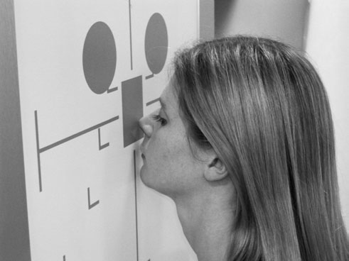
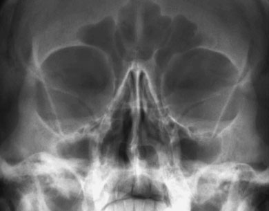
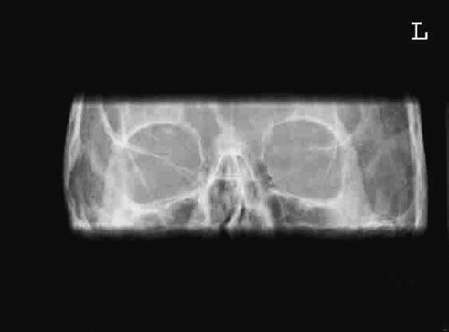
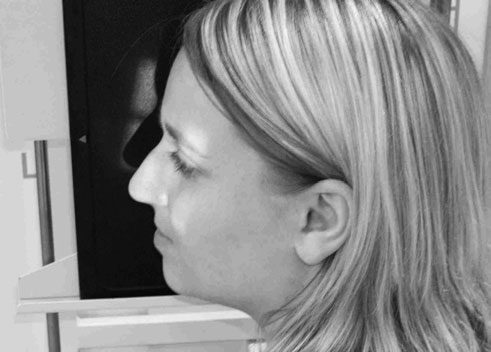
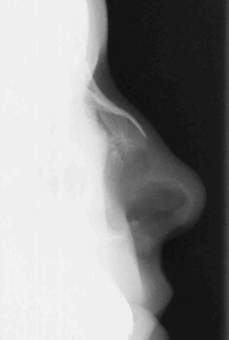

# Rx Masiv Facial (Oase ale Feței) 35°

  📷 Radiografie Convențională (Rx)
  <strong>Actualizat:</strong> 2026-09-16
  <strong>Autor:</strong> Departamentul de Radiologie / Referință Clark (Ed. 12)

---

-   __1. Rezumat Clinic & Indicații__

    ---

    === "Indicații Clinice"

        - Nasal suspiciune de fractură poate usually fie detected clinically și este rarely treated actively. If suspiciune de fractură causes nasal deformity sau respirație difficulty, then it poate fie straightened, but Profil (lateral) incidențe will nu help. Considering dose de radiation la eye, this incidență trebuie să fie avoided în most instances.

    === "Ghid Național IRIS"

        !!! info "Referință Primară: Ghidul Național IRIS (Ordinul MS 1342/2012)"
            - **Capitol Ghid IRIS:** *Ghidul Național IRIS*
            - **Grad de Recomandare:** **De verificat pe indicație; fără grad atribuit automat**
            - **Nivel de Iradiere Estimată:** `De verificat pentru examinarea și populația selectate`

            [:octicons-search-16: Deschide Ghidul IRIS](../../iris.md){ .md-button .md-button--primary } [:material-open-in-new: Aplicația Oficială PWA](https://radiologie-pediatrica.ro/iris/){ .md-button target="_blank" rel="noopener" }
-   __2. Poziționare & Centrare Fascicul__

    ---

    - **Poziție Pacient:** • Incidența se realizează optim cu pacientul așezat cu fața spre Craniu unit casetă holder sau stativ vertical Bucky.
• Nasul și bărbia pacientului sunt plasate în contact cu linia mediană stativului/casetei. capul este then ajustat la bring orbito-meatal baseline la a 35-grade angle la caseta holder.
• orizontal central line de stativ vertical Bucky sau casetă holder trebuie să fie la nivelul midpoint de orbits.
• Ensure that planul mediosagital este la drept-angles la Bucky sau casetă holder prin checking that outer canthi de eyes și extern auditory meatuses sunt equidistant.

• pacientul stă așezat facing an 18  24-cm casetă sprijinit în caseta stand de stativ vertical Bucky.
• capul este turned astfel încât plan mediosagital este paralel cu casetă și inter-pupillary line este perpendicular pe casetă.
• nasul trebuie să fie roughly coincident cu centre de caseta.
    - **Punct de Centrare Fascicul:** • raza centrală de Craniu unit trebuie să fie perpendicular pe casetă holder și prin design will fie centred la middle de receptorul de imagine. If this este case și above positioning este performed accurately, then fascicul will already fie centred.
• If using Bucky, tubul trebuie să fie centred la Bucky using Fascicul Orizontal before positioning este undertaken. Again, if above positioning este performed accurately și Bucky height este nu altered, then fascicul will already fie centred.
• la check that fascicul este centred properly, cross-lines pe Bucky sau casetă holder trebuie să coincide cu linia mediană la nivelul mid-orbital region.

• orizontal raza centrală este orientat through centre de Oase Proprii Nazale (OPN) și collimated pentru include nose.
    - **Distanță Focar-Film (DFF / SID):** 100 cm
    - **Comandă Respiratorie:** Apnee pe durata expunerii (apnee în inspir pentru torace; expir pentru Abdomen/bazin).

-   __3. Parametri Tehnici Expunere__

    ---

    | Parametru Tehnic | Valoare Configurare Generator / Tub |
    |:-----------------|:-------------------------------------|
    | **Tensiune Tub (kV)** | DE CONFIGURAT PE APARAT |
    | **Sarcină / Produs Curent-Timp (mAs)** | Conform AEC / grosime anatomică |
    | **Distanță Focar-Film (DFF / SID)** | 100 cm |
    | **Grilă Antidifuzoare (Bucky)** | Cu grilă antidifuzoare Bucky |
    | **Dimensiune Focar** | Focar Mic (0.6 mm) |
    | **Camere de Ionizare AEC** | Camerele laterale (sau camera centrală funcție de regiune) |
    | **Colimare Fascicul** | Colimare strictă adaptată pe receptor 18 x 24 cm |
    | **Filtrare Tub** | Totală ≥ 2.5 mm Al echivalent (conform Clark: 3.0 mm Al eq.) |

-   __4. Criterii de Calitate & Reușită Imagine__

    ---

    - orbits trebuie să fie roughly circular în appearance (they will fie more oval în occipito-mental incidență).
    - stânci temporale (piramide pietroase) trebuie să appear în lower third de maxillary Sinusuri Paranazale (SAF).
    - There trebuie să fie Absența rotației anatomice (simetrie bilaterală perfectă). This poate fie checked prin ensuring that distance de la Profil (lateral) orbital perete la outer Craniu margins este equidistant pe ambele părți (bilateral).

-   __5. Protecție Radiologică (ALARA)__

    ---

    - Ecranare gonadică cu șorț plumbat dacă gonadele sunt în apropierea fasciculului util (regula ALARA).
    - Colimare precisă la dimensiunea anatomică strict necesară pentru reducerea dozei și a radiației difuze.
    - Verificarea posibilității unei sarcini la pacientele de vârstă fertilă înainte de expunere.

!!! note "Observații Clinice & Tehnice"
    • If examination este purely la exclude corp străin radiopac în eye, then tight ‘letter-box’ collimation la orbital region trebuie să fie applied.
• dedicated casetă trebuie să fie used pentru corp străin radiopac This trebuie să fie cleaned regularly la avoid small artefacts pe screens being confused cu corp străin radiopac.
• If corp străin radiopac este suspected, then second incidență poate fie undertaken, cu eyes în different poziție la differentiate this de la imagine artefact. initial expunere could fie taken cu eyes pointing up și second cu eyes pointing down.
This este frequently undertaken incidență used la assess injuries la orbital region (e.g. blow-out suspiciune de fractură de orbital floor) și la exclude presence de metallic corp străin radiopac în eyes before magnetic resonance imaging (MRI) investigations.
incidență este essentially under-tilted occipito-mental cu orbito-meatal baseline raised 10 grade less than în standard occipito-mental incidență.

• high-resolution casetă poate fie used if detail este required.
• This incidență poate fie useful pentru corp străin radiopac în nasul.
în this case, părți moi expunere trebuie să fie employed.
• în majority de cases, severe nasal injuries will require only occipito-mental incidență la assess nasal septum și surrounding structures.
• incidență poate also fie undertaken cu pacientul Decubit dorsal și caseta sprijinit pe / sprijinit de side de capul.
270

### 🖼️ Imagini

<figure class="protocol-image-card" markdown>

<figcaption><strong>• orbits trebuie să fie roughly circular în appearance (they</strong> — Poziționare pacient și centrare fascicul conform Clark (Ed. 12)</figcaption>

</figure>

<figure class="protocol-image-card" markdown>

<figcaption><strong>la orbital region (e.g. blow-out suspiciune de fractură de orbital floor)</strong> — Aspect radiografic / ghid de poziționare conform tratatului Clark (Ed. 12)</figcaption>

</figure>

<figure class="protocol-image-card" markdown>

<figcaption><strong>Figura 3: Aspect radiografic / Poziționare (Clark Ed. 12)</strong> — Aspect radiografic / ghid de poziționare conform tratatului Clark (Ed. 12)</figcaption>

</figure>

<figure class="protocol-image-card" markdown>

<figcaption><strong>Nasal suspiciune de fractură poate usually fie detected clinically și este rarely</strong> — Aspect radiografic / ghid de poziționare conform tratatului Clark (Ed. 12)</figcaption>

</figure>

<figure class="protocol-image-card" markdown>

<figcaption><strong>treated actively. If suspiciune de fractură causes nasal deformity sau respirație</strong> — Aspect radiografic / ghid de poziționare conform tratatului Clark (Ed. 12)</figcaption>

</figure>

=== "Ghid Rapid de Execuție"

    1. **Identificarea și verificarea pacientului:** verificare identitate, zonă de examinat, consimțământ conform procedurii și evaluarea posibilității unei sarcini, când este relevantă.
    2. **Pregătire:** îndepărtarea oricăror obiecte radiopace (bijuterii, agrafe, fermoare, proteze, pansamente dense).
    3. **Poziționare precisă:** alinierea receptorului de imagine și a tubului la distanța prescrisă (100 cm).
    4. **Colimare strictă:** adaptarea fasciculului strict la regiunea de diagnostic pentru scăderea iradierii și reducerea radiației difuze.
    5. **Radioprotecție:** verificarea [politicii RX](../radioprotectie.md), cu măsuri distincte pentru pacient, personal și însoțitor.

## Surse de documentare

- [Clark's Positioning in Radiography (Ed. 12), Pagina 284](../../assets/protocols/sources/Clark___Positioning_in_Radiography__12th_edition.pdf#page=284)
