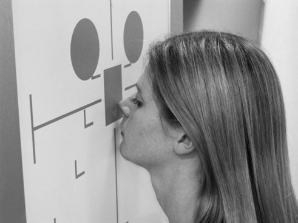
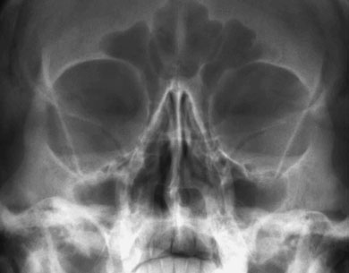
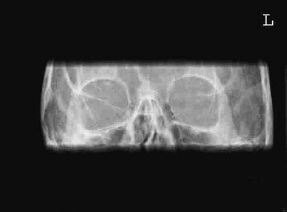
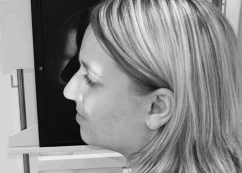
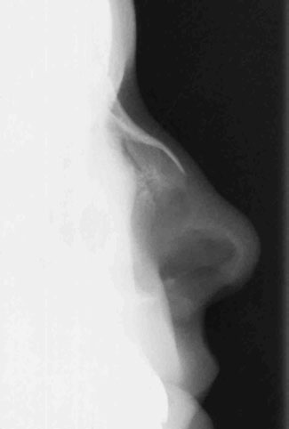

# Rx Masiv Facial (Oase ale Feței) 35°

  📷 Radiografie Convențională (Rx)
  <strong>Actualizat:</strong> 2026-09-16
  <strong>Autor:</strong> Departamentul de Radiologie / Referință Clark (Ed. 12)

---

-   __1. Rezumat Clinic & Indicații__

    ---

    === "Indicații Clinice"

        - Suspiciunea de fractură nazală poate fi de obicei detectată clinic și este rareori tratată activ. Dacă suspiciunea de fractură determină deformarea nasului sau dificultăți de respirație, atunci acesta poate fi îndreptat, dar incidențele de profil nu vor fi utile. Având în vedere doza de radiație la nivelul ochiului, această incidență trebuie evitată în majoritatea cazurilor.

    === "Ghid Național IRIS"

        !!! info "Referință Primară: Ghidul Național IRIS (Ordinul MS 1342/2012)"
            - **Capitol Ghid IRIS:** *Ghidul Național IRIS*
            - **Grad de Recomandare:** **De verificat pe indicație; fără grad atribuit automat**
            - **Nivel de Iradiere Estimată:** `De verificat pentru examinarea și populația selectate`

            [:octicons-search-16: Deschide Ghidul IRIS](../../iris.md){ .md-button .md-button--primary } [:material-open-in-new: Aplicația Oficială PWA](https://radiologie-pediatrica.ro/iris/){ .md-button target="_blank" rel="noopener" }
-   __2. Poziționare & Centrare Fascicul__

    ---

    - **Poziție Pacient:** • Incidența se realizează optim cu pacientul așezat cu fața spre suportul casetei unității de Craniu sau spre stativul vertical Bucky.
• Nasul și bărbia pacientului sunt plasate în contact cu linia mediană a stativului/casetei. Capul este apoi ajustat pentru a aduce linia de bază orbito-meatală la un unghi de 35 de grade față de suportul casetei.
• Linia centrală orizontală a stativului vertical Bucky sau a suportului casetei trebuie să fie la nivelul punctului median al orbitelor.
• Asigurați-vă că planul mediosagital este perpendicular pe Bucky sau pe suportul casetei, verificând dacă unghiurile externe ale ochilor și conductele auditive externe sunt echidistante.

• Pacientul stă așezat cu fața spre o casetă de 18 × 24 cm, sprijinită în suportul casetei stativului vertical Bucky.
• Capul este rotit astfel încât planul mediosagital să fie paralel cu caseta, iar linia interpupilară să fie perpendiculară pe casetă.
• Nasul trebuie să coincidă aproximativ cu centrul casetei.
    - **Punct de Centrare Fascicul:** • Raza centrală a unității de Craniu trebuie să fie perpendiculară pe suportul casetei și, prin proiectare, va fi centrată la mijlocul receptorului de imagine. Dacă acesta este cazul și poziționarea de mai sus este efectuată corect, atunci fasciculul va fi deja centrat.
• Dacă se utilizează Bucky, tubul trebuie să fie centrat pe Bucky folosind Fasciculul Orizontal înainte de efectuarea poziționării. Din nou, dacă poziționarea de mai sus este efectuată corect și înălțimea Bucky nu este modificată, atunci fasciculul va fi deja centrat.
• Pentru a verifica dacă fasciculul este centrat corect, liniile în cruce de pe Bucky sau de pe suportul casetei trebuie să coincidă cu linia mediană la nivelul regiunii medio-orbitale.

• Raza centrală orizontală este orientată prin centrul Oaselor Proprii Nazale (OPN) și colimată pentru a include nasul.
    - **Distanță Focar-Film (DFF / SID):** 100 cm
    - **Comandă Respiratorie:** Apnee pe durata expunerii (apnee în inspir pentru torace; expir pentru Abdomen/bazin).

-   __3. Parametri Tehnici Expunere__

    ---

    | Parametru Tehnic | Valoare Configurare Generator / Tub |
    |:-----------------|:-------------------------------------|
    | **Tensiune Tub (kV)** | DE CONFIGURAT PE APARAT |
    | **Sarcină / Produs Curent-Timp (mAs)** | Conform AEC / grosimii anatomice |
    | **Distanță Focar-Film (DFF / SID)** | 100 cm |
    | **Grilă Antidifuzoare (Bucky)** | Cu grilă antidifuzoare Bucky |
    | **Dimensiune Focar** | Focar Mic (0.6 mm) |
    | **Camere de Ionizare AEC** | Camerele laterale (sau camera centrală, în funcție de regiune) |
    | **Colimare Fascicul** | Colimare strictă adaptată pe receptor 18 x 24 cm |
    | **Filtrare Tub** | Totală ≥ 2.5 mm Al echivalent (conform Clark: 3.0 mm Al echivalent) |

-   __4. Criterii de Calitate & Reușită Imagine__

    ---

    - orbitele trebuie să fie aproximativ circulare ca aspect (vor fi mai ovale în incidența occipito-mentală).
    - stâncile temporale (piramidele pietroase) trebuie să apară în treimea inferioară a sinusurilor maxilare paranazale (SAF).
    - Trebuie să existe absența rotației anatomice (simetrie bilaterală perfectă). Aceasta poate fi verificată asigurându-se că distanța de la peretele orbital de profil la marginile externe ale craniului este echidistantă pe ambele părți (bilateral).

-   __5. Protecție Radiologică (ALARA)__

    ---

    - Ecranare gonadică cu șorț plumbat dacă gonadele sunt în apropierea fasciculului util (regula ALARA).
    - Colimare precisă la dimensiunea anatomică strict necesară pentru reducerea dozei și a radiației difuze.
    - Verificarea posibilității unei sarcini la pacientele de vârstă fertilă înainte de expunere.

!!! note "Observații Clinice & Tehnice"
    • Dacă examinarea are ca unic scop excluderea unui corp străin radiopac în ochi, trebuie aplicată colimarea strânsă, de tip „cutie de scris”, asupra regiunii orbitare.
• Pentru corpul străin radiopac trebuie utilizată o casetă dedicată. Aceasta trebuie curățată regulat pentru a evita confundarea artefactelor mici de pe ecrane cu un corp străin radiopac.
• Dacă se suspectează un corp străin radiopac, poate fi efectuată o a doua incidență, cu ochii în poziții diferite, pentru a-l diferenția de un artefact de imagine. Expunerea inițială poate fi efectuată cu ochii orientați în sus, iar a doua cu ochii orientați în jos.
Aceasta este o incidență utilizată frecvent pentru evaluarea leziunilor regiunii orbitare (de exemplu, suspiciunea de fractură „blow-out” a planșeului orbitar) și pentru excluderea prezenței unui corp străin metalic radiopac în ochi înaintea investigațiilor prin rezonanță magnetică (MRI).
Incidența este, în esență, o incidență occipito-mentală subînclinată, cu linia de bază orbito-meatală ridicată cu 10 grade mai puțin decât în incidența occipito-mentală standard.

• Dacă este necesar un detaliu suplimentar, poate fi utilizată o casetă de înaltă rezoluție.
• Această incidență poate fi utilă pentru un corp străin radiopac în nas.
În acest caz trebuie utilizată o expunere pentru părți moi.
• În majoritatea cazurilor, leziunile nazale severe vor necesita doar o incidență occipito-mentală pentru evaluarea septului nazal și a structurilor înconjurătoare.
• Incidența poate fi efectuată și cu pacientul în decubit dorsal, iar caseta sprijinită pe/lângă partea laterală a capului.
270

### 🖼️ Imagini

<figure class="protocol-image-card" markdown>

<figcaption><strong>orbitele trebuie să fie aproximativ circulare ca aspect (vor</strong> — Poziționarea pacientului și centrarea fasciculului conform Clark (Ed. 12)</figcaption>

</figure>

<figure class="protocol-image-card" markdown>

<figcaption><strong>la nivelul regiunii orbitare (de exemplu, suspiciunea de fractură „blow-out” a planșeului orbitar)</strong> — Aspect radiografic / ghid de poziționare conform tratatului Clark (Ed. 12)</figcaption>

</figure>

<figure class="protocol-image-card" markdown>

<figcaption><strong>Figura 3: Aspect radiografic / Poziționare (Clark Ed. 12)</strong> — Aspect radiografic / ghid de poziționare conform tratatului Clark (Ed. 12)</figcaption>

</figure>

<figure class="protocol-image-card" markdown>

<figcaption><strong>Suspiciunea de fractură nazală poate fi de obicei detectată clinic și este rareori</strong> — Aspect radiografic / ghid de poziționare conform tratatului Clark (Ed. 12)</figcaption>

</figure>

<figure class="protocol-image-card" markdown>

<figcaption><strong>tratată activ. Dacă suspiciunea de fractură determină deformarea nazală sau dificultăți de respirație</strong> — Aspect radiografic / ghid de poziționare conform tratatului Clark (Ed. 12)</figcaption>

</figure>

=== "Ghid Rapid de Execuție"

    1. **Identificarea și verificarea pacientului:** verificare identitate, zonă de examinat, consimțământ conform procedurii și evaluarea posibilității unei sarcini, când este relevantă.
    2. **Pregătire:** îndepărtarea oricăror obiecte radiopace (bijuterii, agrafe, fermoare, proteze, pansamente dense).
    3. **Poziționare precisă:** alinierea receptorului de imagine și a tubului la distanța prescrisă (100 cm).
    4. **Colimare strictă:** adaptarea fasciculului strict la regiunea de diagnostic pentru scăderea iradierii și reducerea radiației difuze.
    5. **Radioprotecție:** verificarea [politicii RX](../radioprotectie.md), cu măsuri distincte pentru pacient, personal și însoțitor.

## Surse de documentare

- [Clark's Positioning in Radiography (Ed. 12), Pagina 284](https://books.google.com/books/about/Clark_s_Positioning_in_Radiography.html?id=Xxu6MwEACAAJ)
