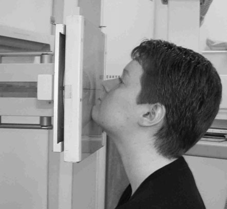
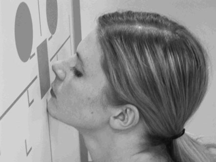
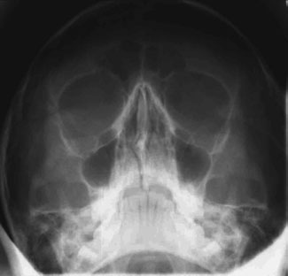

# Rx Masiv Facial (Oase ale Feței) 45°

  📷 Radiografie Convențională (Rx)
  <strong>Actualizat:</strong> 2026-09-16
  <strong>Autor:</strong> Departamentul de Radiologie / Referință Clark (Ed. 12)

---

-   __1. Rezumat Clinic & Indicații__

    ---

    === "Indicații Clinice"

        - 263 9 Masiv Facial (Oase ale Feței) 45° 45° b Stâncile temporale (piramidele pietroase) chiar sub marginea inferioară a sinusurilor maxilare sunt vizualizate de capăt, cu întreaga lor lungime suprapusă peste o mică parte a imaginii. Incidența occipito-mentală (OM) este concepută pentru a proiecta porțiunile pietroase ale osului temporal (care se suprapun peste regiune și ar produce un artefact nedorit pe imaginea oaselor feței) sub partea inferioară a maxilei.

    === "Ghid Național IRIS"

        !!! info "Referință Primară: Ghidul Național IRIS (Ordinul MS 1342/2012)"
            - **Capitol Ghid IRIS:** *Traumatisme — Față și orbite*
            - **Grad de Recomandare:** **Grad B**
            - **Nivel de Iradiere Estimată:** `Clasa 1 (Minimă < 0.1 mSv)`

            [:octicons-search-16: Deschide Ghidul IRIS](../../iris.md){ .md-button .md-button--primary } [:material-open-in-new: Aplicația Oficială PWA](https://radiologie-pediatrica.ro/iris/){ .md-button target="_blank" rel="noopener" }

-   __2. Poziționare & Centrare Fascicul__

    ---

    - **Poziție Pacient:**
        - Incidența se realizează optim cu pacientul așezat cu fața spre suportul casetei unității de Craniu sau spre stativul vertical Bucky.
        - Nasul și bărbia pacientului sunt plasate în contact cu linia mediană a stativului/casetei. Capul este apoi ajustat pentru a aduce linia de bază orbito-meatală la un unghi de 45 de grade față de suportul casetei.
        - Linia centrală orizontală a Bucky/suportului casetei trebuie să fie la nivelul marginilor orbitare inferioare.
        - Asigurați-vă că planul mediosagital este perpendicular pe Bucky/suportul casetei, verificând dacă unghiurile externe ale ochilor și conductele auditive externe sunt echidistante.
    - **Punct de Centrare Fascicul:**
        - Raza centrală a unității de Craniu trebuie să fie perpendiculară pe suportul casetei. Prin proiectare, va fi centrată la mijlocul suportului casetei. Dacă acesta este cazul și poziționarea de mai sus este efectuată corect, atunci fasciculul va fi deja centrat.
        - Dacă se utilizează Bucky, tubul trebuie să fie centrat pe Bucky folosind Fasciculul Orizontal înainte de efectuarea poziționării. Din nou, dacă poziționarea de mai sus este efectuată corect și înălțimea Bucky nu este modificată, atunci fasciculul va fi deja centrat.
        - Pentru a verifica dacă fasciculul este centrat corect, liniile în cruce de pe Bucky sau de pe suportul casetei trebuie să coincidă cu coloana vertebrală nazală anterioară a pacientului.
    - **Distanță Focar-Film (DFF / SID):** 100 cm
    - **Comandă Respiratorie:** Apnee pe durata expunerii (apnee în inspir pentru torace; expir pentru Abdomen/bazin).

-   __3. Parametri Tehnici Expunere__

    ---

    | Parametru Tehnic | Valoare Configurare Generator / Tub |
    |:-----------------|:-------------------------------------|
    | **Tensiune Tub (kV)** | DE CONFIGURAT PE APARAT |
    | **Sarcină / Produs Curent-Timp (mAs)** | Conform AEC / grosimii anatomice |
    | **Distanță Focar-Film (DFF / SID)** | 100 cm |
    | **Grilă Antidifuzoare (Bucky)** | Cu grilă antidifuzoare Bucky |
    | **Dimensiune Focar** | Focar Mic (0.6 mm) |
    | **Camere de Ionizare AEC** | Camerele laterale (sau camera centrală, în funcție de regiune) |
    | **Colimare Fascicul** | Colimare strictă la aria anatomică de interes diagnostic |
    | **Filtrare Tub** | Totală ≥ 2.5 mm Al echivalent (conform Clark: 3.0 mm Al echivalent) |

-   __4. Criterii de Calitate & Reușită Imagine__

    ---

    - stâncile temporale (piramidele pietroase) trebuie să apară sub planșeele sinusurilor maxilare paranazale (SAF).
    - Trebuie să existe absența rotației anatomice (simetrie bilaterală perfectă). Aceasta poate fi verificată asigurându-se că distanța de la peretele orbital de profil la marginile externe ale craniului este echidistantă pe ambele părți (bilateral) (marcată și b pe imaginea opusă).
    - Erori de evitat / remedii: stâncile temporale (piramidele pietroase) suprapuse peste partea inferioară a sinusurilor maxilare paranazale (SAF): în acest caz, este posibil să fi apărut mai multe erori. Linia de bază orbito-meatală este posibil să nu fi fost poziționată la 45 de grade față de filmul radiologic: pentru compensare, tubului i se poate aplica o angulație caudală de cinci până la zece grade.
    - Erori de evitat / remedii: deoarece aceasta este o poziție incomodă de menținut, pacienții lasă adesea unghiul liniei de bază să se reducă între poziționare și expunere. Verificați întotdeauna unghiul liniei de bază imediat înaintea expunerii. Această incidență evidențiază planșeele orbitelor de profil, regiunea nazală, maxilele, porțiunile inferioare ale osului frontal și osul zigomatic. Arcurile zigomatice pot fi vizualizate, dar ele Incidență occipito-mentală utilizând unitatea de Craniu Incidență occipito-mentală utilizând stativul vertical Bucky

-   __5. Protecție Radiologică (ALARA)__

    ---

    - Ecranare gonadică cu șorț plumbat dacă gonadele sunt în apropierea fasciculului util (regula ALARA).
    - Colimare precisă la dimensiunea anatomică strict necesară pentru reducerea dozei și a radiației difuze.
    - Verificarea posibilității unei sarcini la pacientele de vârstă fertilă înainte de expunere.

!!! note "Observații Clinice & Tehnice"
    Pregătirea pacientului prin îndepărtarea tuturor accesoriilor radio-opace.

### 🖼️ Imagini

<figure class="protocol-image-card" markdown>

<figcaption><strong>Figura 1: Aspect radiografic / Poziționare (Clark Ed. 12)</strong> — Poziționarea pacientului și centrarea fasciculului conform Clark (Ed. 12)</figcaption>

</figure>

<figure class="protocol-image-card" markdown>

<figcaption><strong>Figura 2: Aspect radiografic / Poziționare (Clark Ed. 12)</strong> — Aspect radiografic / ghid de poziționare conform tratatului Clark (Ed. 12)</figcaption>

</figure>

<figure class="protocol-image-card" markdown>

<figcaption><strong>Figura 3: Aspect radiografic / Poziționare (Clark Ed. 12)</strong> — Aspect radiografic / ghid de poziționare conform tratatului Clark (Ed. 12)</figcaption>

</figure>

=== "Ghid Rapid de Execuție"

    1. **Identificarea și verificarea pacientului:** verificare identitate, zonă de examinat, consimțământ conform procedurii și evaluarea posibilității unei sarcini, când este relevantă.
    2. **Pregătire:** îndepărtarea oricăror obiecte radiopace (bijuterii, agrafe, fermoare, proteze, pansamente dense).
    3. **Poziționare precisă:** alinierea receptorului de imagine și a tubului la distanța prescrisă (100 cm).
    4. **Colimare strictă:** adaptarea fasciculului strict la regiunea de diagnostic pentru scăderea iradierii și reducerea radiației difuze.
    5. **Radioprotecție:** verificarea [politicii RX](../radioprotectie.md), cu măsuri distincte pentru pacient, personal și însoțitor.

## Surse de documentare

- [Clark's Positioning in Radiography (Ed. 12), Pagina 278](https://books.google.com/books/about/Clark_s_Positioning_in_Radiography.html?id=Xxu6MwEACAAJ)
