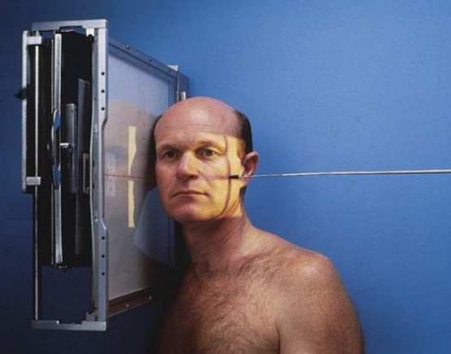
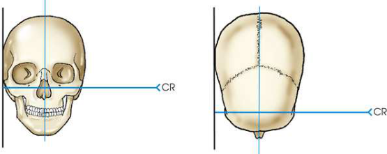
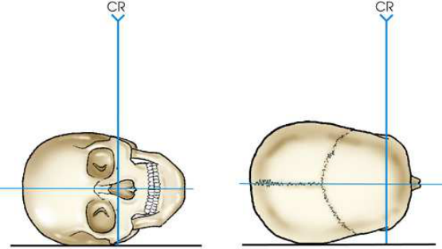
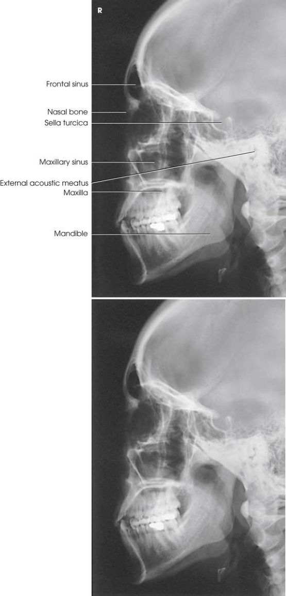

# Rx Masiv Facial (Oase ale Feței) — Incidență de Profil (Lateral) — Profil (Drept sau Stâng) (Merrill)

  📷 Radiografie Convențională (Rx)
  <strong>Actualizat:</strong> 2026-09-16
  <strong>Autor:</strong> Referință Merrill

---

-   __1. Rezumat Clinic & Indicații__

    ---

    === "Indicații Clinice"

        - Conform reperelor anatomice standard din tratat

    === "Ghid Național IRIS"

        !!! info "Referință Primară: Ghidul Național IRIS (Ordinul MS 1342/2012)"
            - **Capitol Ghid IRIS:** *Ghidul Național IRIS*
            - **Grad de Recomandare:** **De verificat pe indicație; fără grad atribuit automat**
            - **Nivel de Iradiere Estimată:** `De verificat pentru examinarea și populația selectate`

            [:octicons-search-16: Deschide Ghidul IRIS](../../iris.md){ .md-button .md-button--primary } [:material-open-in-new: Aplicația Oficială PWA](https://radiologie-pediatrica.ro/iris/){ .md-button target="_blank" rel="noopener" }
-   __2. Poziționare & Centrare Fascicul__

    ---

    - **Poziție Pacient:** se așază pacientul în Decubit anterior oblic sau Poziție Șezândă anterior Incidență Oblică before stativ vertical Bucky. This este same basic poziție that este used pentru lateral Craniu poziție.; se ajustează pacient’s cap so that MSP este paralel cu receptorul de imagine și linie interpupilară (LIP) este perpendicular pe receptorul de imagine (RI). se ajustează flexion de pacientul’s neck astfel încât linie infraorbitomeatală (LIOM) este perpendicular pe front edge de receptorul de imagine (Figs. 11.100–11.102). Se imobilizează capul pacientului.
    - **Punct de Centrare Fascicul:** perpendicular și entering lateral surface de zygomatic bone halfway între outer canthus și conduct auditiv extern (CAE). Center receptorul de imagine la raza centrală.
    - **Distanță Focar-Film (DFF / SID):** Nespecificat în fragmentul extras; de verificat în sursă
    - **Comandă Respiratorie:** apnee (oprirea respirației).

-   __3. Parametri Tehnici Expunere__

    ---

    | Parametru Tehnic | Valoare Configurare Generator / Tub |
    |:-----------------|:-------------------------------------|
    | **Tensiune Tub (kV)** | DE CONFIGURAT PE APARAT |
    | **Sarcină / Produs Curent-Timp (mAs)** | DE CONFIGURAT PE APARAT |
    | **Distanță Focar-Film (DFF / SID)** | Nespecificat în fragmentul extras; de verificat în sursă |
    | **Grilă Antidifuzoare (Bucky)** | DE CONFIGURAT PE APARAT |
    | **Dimensiune Focar** | DE CONFIGURAT PE APARAT |
    | **Camere de Ionizare AEC** | DE CONFIGURAT PE APARAT |
    | **Colimare Fascicul** | Adjust câmp de iradiere la extend 1 inch (2.5 cm) beyond shadow de tip de nasul, superiorly la 1 inch (2.5 cm) above supraorbital margins, inferiorly la gonion (unghiul mandibulei), și posteriorly la conduct auditiv extern (CAE). expunere field trebuie să fie set fără larger than 6 × 10 inches (15 × 24 cm). Place marker de lateralitate (D/S) în collimated expunere field. |
    | **Filtrare Tub** | DE CONFIGURAT PE APARAT |

-   __4. Criterii de Calitate & Reușită Imagine__

    ---

    - Criterii radiologice de calitate imaginii: n Evidence de corect collimation și presence de marker de lateralitate (D/S) plasat clear de anatomy de interest n toate Masiv Facial (Oase ale Feței) în their entirety, cu zygomatic bone în center n Absența rotației anatomice (simetrie bilaterală perfectă) sau tilt de Masiv Facial (Oase ale Feței), evidențiat prin:
    - Almost perfectly superimposed ramuri mandibulare
    - Superimposed orbital roofs
    - șa turcească în profile n părți moi și bony detalii trabeculare osoase

-   __5. Protecție Radiologică (ALARA)__

    ---

    - Nespecificat în fragmentul extras; de verificat în sursă

!!! note "Observații Clinice & Tehnice"
    Conform reperelor anatomice standard din tratat

### 🖼️ Imagini

<figure class="protocol-image-card" markdown>

<figcaption><strong>Merrill — pagina PDF 901, imaginea 1</strong> — Imagine din fragmentul sursă; asocierea necesită revizie.</figcaption>

</figure>

<figure class="protocol-image-card" markdown>

<figcaption><strong>Merrill — pagina PDF 902, imaginea 2</strong> — Imagine din fragmentul sursă; asocierea necesită revizie.</figcaption>

</figure>

<figure class="protocol-image-card" markdown>

<figcaption><strong>Merrill — pagina PDF 902, imaginea 3</strong> — Imagine din fragmentul sursă; asocierea necesită revizie.</figcaption>

</figure>

<figure class="protocol-image-card" markdown>

<figcaption><strong>Merrill — pagina PDF 904, imaginea 4</strong> — Imagine din fragmentul sursă; asocierea necesită revizie.</figcaption>

</figure>

=== "Ghid Rapid de Execuție"

    1. **Identificarea și verificarea pacientului:** verificare identitate, zonă de examinat, consimțământ conform procedurii și evaluarea posibilității unei sarcini, când este relevantă.
    2. **Pregătire:** îndepărtarea oricăror obiecte radiopace (bijuterii, agrafe, fermoare, proteze, pansamente dense).
    3. **Poziționare precisă:** alinierea receptorului de imagine și a tubului la distanța prescrisă (Nespecificat în fragmentul extras; de verificat în sursă).
    4. **Colimare strictă:** adaptarea fasciculului strict la regiunea de diagnostic pentru scăderea iradierii și reducerea radiației difuze.
    5. **Radioprotecție:** verificarea [politicii RX](../radioprotectie.md), cu măsuri distincte pentru pacient, personal și însoțitor.

## Surse de documentare

- [Merrill’s Atlas, 11. Cranium, pagini PDF 901–905](../../assets/protocols/sources/a56d45c16829_Merrills_Atlas_of_Radiographic_Positioning__Procedures_3Vol_Set.pdf#page=901)

## Fragmente sursă traduse (referință tehnică)

### anatomy

lateral imagine de bones de fața, cu drept și stâng sides superimposed (Fig. 11.103).

### collimation

• Adjust câmp de iradiere la extend 1 inch (2.5 cm) beyond shadow de tip de nasul, superiorly la 1 inch (2.5 cm) above supraorbital margins, inferiorly la gonion (unghiul mandibulei), și posteriorly la conduct auditiv extern (CAE). expunere field trebuie să fie set fără larger than 6 × 10
inches (15 × 24 cm). Place marker de lateralitate (D/S) în collimated expunere field.

### cr

• perpendicular și entering lateral surface de zygomatic bone halfway între outer canthus și conduct auditiv extern (CAE).
• Center receptorul de imagine la raza centrală.

### criteria

Criterii radiologice de calitate imaginii:
n Evidence de corect collimation și presence de marker de lateralitate (D/S) plasat clear de anatomy de interest
n toate facial bones în their entirety, cu zygomatic bone în center
n Absența rotației anatomice (simetrie bilaterală perfectă) sau tilt de facial bones, evidențiat prin:
• Almost perfectly superimposed ramuri mandibulare
• Superimposed orbital roofs
• șa turcească în profile
n părți moi și bony detalii trabeculare osoase

### part_pos

• se ajustează pacient’s cap so that MSP este paralel cu receptorul de imagine și linie interpupilară (LIP) este perpendicular pe receptorul de imagine (RI).
• se ajustează flexion de pacientul’s neck astfel încât linie infraorbitomeatală (LIOM) este perpendicular pe front edge de receptorul de imagine (Figs. 11.100–11.102).
• Se imobilizează capul pacientului.

### patient_pos

• se așază pacientul în recumbent anterior oblic sau așezat pe scaun anterior oblic poziție before stativ vertical Bucky. This este same basic
poziție that este used pentru lateral skull poziție.

### respiration

apnee (oprirea respirației).

### tech

poziționat prin manufacturer sau department protocol pentru corect anatomy display orientation; raza centrală plate: 10 × 12 inches (24 ×
30 cm) longitudinal.

