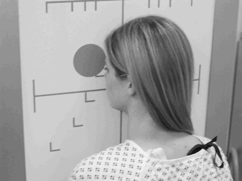
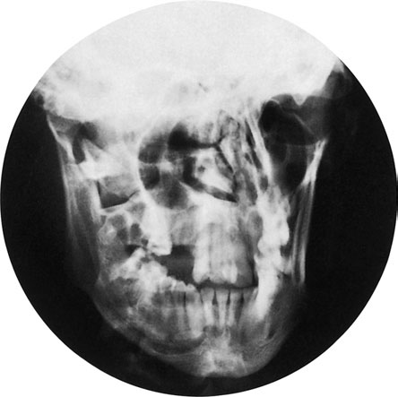
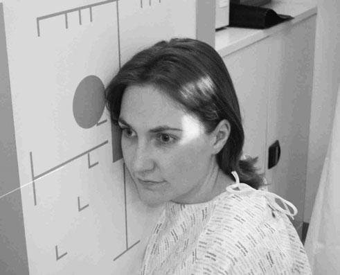
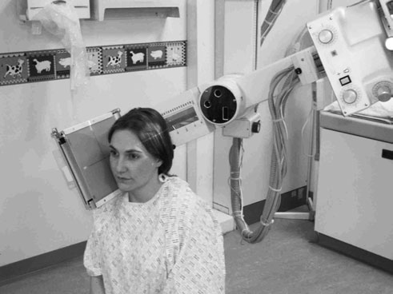
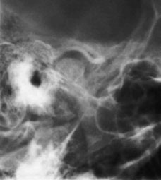
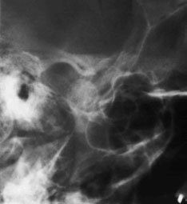

# Rx Masiv Facial (Oase ale Feței) Mandibulă: postero - Oblică Anterioară

  📷 Radiografie Convențională (Rx)
  <strong>Actualizat:</strong> 2026-09-16
  <strong>Autor:</strong> Departamentul de Radiologie / Referință Clark (Ed. 12)

---

-   __1. Rezumat Clinic & Indicații__

    ---

    === "Indicații Clinice"

        - TMJ imagini sunt useful în assessing articulație dysfunction prin evidențiind erosive și degenerative changes. Open- și closedmouth incidențe poate fie very helpful în assessing whether normal anterior gliding movement de condil mandibular occurs pe jaw opening. MRI promises greater accuracy, since it also evidențiază articular cartilages și fibrocartilage discs și how they behave during articulație movement.

    === "Ghid Național IRIS"

        !!! info "Referință Primară: Ghidul Național IRIS (Ordinul MS 1342/2012)"
            - **Capitol Ghid IRIS:** *Ghidul Național IRIS*
            - **Grad de Recomandare:** **De verificat pe indicație; fără grad atribuit automat**
            - **Nivel de Iradiere Estimată:** `De verificat pentru examinarea și populația selectate`

            [:octicons-search-16: Deschide Ghidul IRIS](../../iris.md){ .md-button .md-button--primary } [:material-open-in-new: Aplicația Oficială PWA](https://radiologie-pediatrica.ro/iris/){ .md-button target="_blank" rel="noopener" }
-   __2. Poziționare & Centrare Fascicul__

    ---

    - **Poziție Pacient:** • pacientul stă așezat facing stativ vertical Bucky sau Craniu unit casetă holder. Alternatively, în case de trauma, incidență poate fie Decubit dorsal pe trolley, giving Antero-posterior (AP) incidență.
• pacientul’s plan mediosagital trebuie să fie coincident cu linia mediană Bucky sau casetă holder. capul este then ajustat la bring orbito-meatal baseline perpendicular pe Bucky sau casetă holder.
• de la poziție cu planul mediosagital perpendicular pe casetă, capul este rotit 20 grade la either side, astfel încât cervical vertebra will fie projected clear de simfiză menti.
• capul este now repositioned so region de simfiză menti este coincident cu middle de caseta.
• caseta trebuie să fie poziționat astfel încât middle de an 18  24-cm casetă, when plasat longitudinally în Bucky sau casetă holder, este centred la nivelul angles de Mandibulă.

• pacientul stă așezat facing stativ vertical Bucky sau Craniu unit casetă holder sau lies Decubit ventral pe masa radiologică. în toate cases, capul este rotit la bring side de capul under examination în contact cu masa de examinare. umerii poate also fie rotit slightly la help pacientul achieve this poziție.
• capul și Bucky sau casetă holder level este ajustat so centre cross-lines sunt poziționat la coincide cu point 1 cm along orbito-meatal baseline anterior la extern auditory meatus.
• planul mediosagital este brought paralel cu casetă prin ensuring that inter-pupillary line este la drept-angles la masa de examinare top și nazion și extern occipital protuberance sunt echidistant față de it.
• caseta este plasat longitudinally în caseta holder, such that two expuneri poate fie made fără superimposition de imagini.
    - **Punct de Centrare Fascicul:** • raza centrală este orientat perpendicular pe casetă și centred 5 cm de la linia mediană, away de la side being examined, la nivelul angles de Mandibulă.

• Using well-collimated fascicul sau extension cone, raza centrală este înclinat 25 grade caudally și will fie centred la point 5 cm superior la articulație remote de la caseta so raza centrală passes through articulație nearer caseta.
    - **Distanță Focar-Film (DFF / SID):** 100 cm
    - **Comandă Respiratorie:** Apnee pe durata expunerii (apnee în inspir pentru torace; expir pentru Abdomen/bazin).

-   __3. Parametri Tehnici Expunere__

    ---

    | Parametru Tehnic | Valoare Configurare Generator / Tub |
    |:-----------------|:-------------------------------------|
    | **Tensiune Tub (kV)** | DE CONFIGURAT PE APARAT |
    | **Sarcină / Produs Curent-Timp (mAs)** | Conform AEC / grosime anatomică |
    | **Distanță Focar-Film (DFF / SID)** | 100 cm |
    | **Grilă Antidifuzoare (Bucky)** | Cu grilă antidifuzoare Bucky |
    | **Dimensiune Focar** | Focar Mic (0.6 mm) |
    | **Camere de Ionizare AEC** | Camerele laterale (sau camera centrală funcție de regiune) |
    | **Colimare Fascicul** | Colimare strictă adaptată pe receptor 18 x 24 cm |
    | **Filtrare Tub** | Totală ≥ 2.5 mm Al echivalent (conform Clark: 3.0 mm Al eq.) |

-   __4. Criterii de Calitate & Reușită Imagine__

    ---

    - simfiză menti trebuie să evidențiat fără orice superimposition de cervical vertebra. 20° Cervical vertebra Mandibulă casetă

-   __5. Protecție Radiologică (ALARA)__

    ---

    - Ecranare gonadică cu șorț plumbat dacă gonadele sunt în apropierea fasciculului util (regula ALARA).
    - Colimare precisă la dimensiunea anatomică strict necesară pentru reducerea dozei și a radiației difuze.
    - Verificarea posibilității unei sarcini la pacientele de vârstă fertilă înainte de expunere.

!!! note "Observații Clinice & Tehnice"
    • imagine trebuie să include correct side-marker și labels la indicate poziție de mouth when expunere was taken (open, closed, etc.).
• If using Craniu unit în which tubul cannot fie înclinat independently de caseta holder, inter-pupillary line este la drept-angles la imaginary vertical line drawn de la floor.
• This incidență poate supplement DPT (OPT) imagini de TMJs. Postero-anterior (PA) incidențe poate fie undertaken prin modifying technique described pentru Postero-anterior (PA) Mandibulă pe p. 272.
274 25° Mouth gură deschisă (transorală) closed

### 🖼️ Imagini

<figure class="protocol-image-card" markdown>

<figcaption><strong>Figura 1: Aspect radiografic / Poziționare (Clark Ed. 12)</strong> — Poziționare pacient și centrare fascicul conform Clark (Ed. 12)</figcaption>

</figure>

<figure class="protocol-image-card" markdown>

<figcaption><strong>Figura 2: Aspect radiografic / Poziționare (Clark Ed. 12)</strong> — Aspect radiografic / ghid de poziționare conform tratatului Clark (Ed. 12)</figcaption>

</figure>

<figure class="protocol-image-card" markdown>

<figcaption><strong>mouth incidențe poate fie very helpful în assessing whether normal</strong> — Aspect radiografic / ghid de poziționare conform tratatului Clark (Ed. 12)</figcaption>

</figure>

<figure class="protocol-image-card" markdown>

<figcaption><strong>Figura 4: Aspect radiografic / Poziționare (Clark Ed. 12)</strong> — Aspect radiografic / ghid de poziționare conform tratatului Clark (Ed. 12)</figcaption>

</figure>

<figure class="protocol-image-card" markdown>

<figcaption><strong>Figura 5: Aspect radiografic / Poziționare (Clark Ed. 12)</strong> — Aspect radiografic / ghid de poziționare conform tratatului Clark (Ed. 12)</figcaption>

</figure>

<figure class="protocol-image-card" markdown>

<figcaption><strong>Figura 6: Aspect radiografic / Poziționare (Clark Ed. 12)</strong> — Aspect radiografic / ghid de poziționare conform tratatului Clark (Ed. 12)</figcaption>

</figure>

=== "Ghid Rapid de Execuție"

    1. **Identificarea și verificarea pacientului:** verificare identitate, zonă de examinat, consimțământ conform procedurii și evaluarea posibilității unei sarcini, când este relevantă.
    2. **Pregătire:** îndepărtarea oricăror obiecte radiopace (bijuterii, agrafe, fermoare, proteze, pansamente dense).
    3. **Poziționare precisă:** alinierea receptorului de imagine și a tubului la distanța prescrisă (100 cm).
    4. **Colimare strictă:** adaptarea fasciculului strict la regiunea de diagnostic pentru scăderea iradierii și reducerea radiației difuze.
    5. **Radioprotecție:** verificarea [politicii RX](../radioprotectie.md), cu măsuri distincte pentru pacient, personal și însoțitor.

## Surse de documentare

- [Clark's Positioning in Radiography (Ed. 12), Pagina 288](../../assets/protocols/sources/Clark___Positioning_in_Radiography__12th_edition.pdf#page=288)
