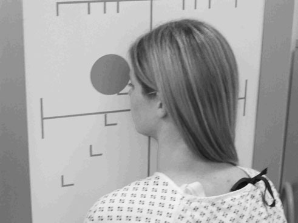
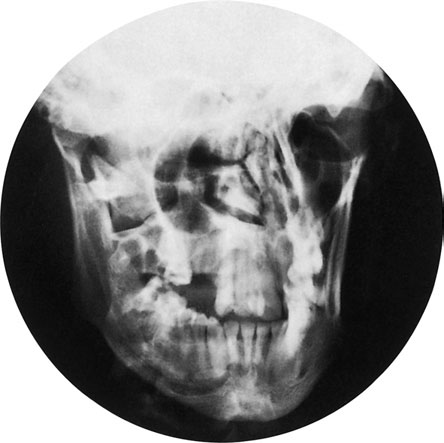
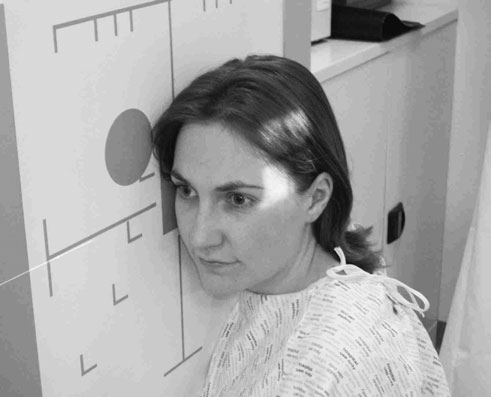
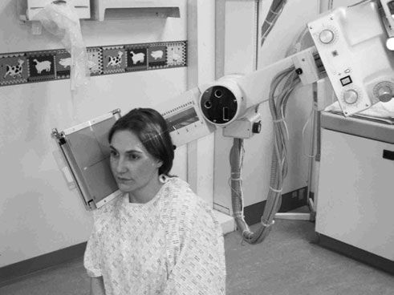
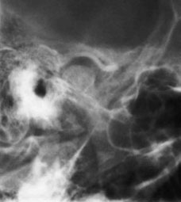
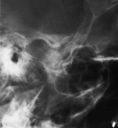

# Radiografia masivului facial (oaselor feței), mandibulă: incidență postero-oblică anterioară

  📷 Radiografie Convențională (Rx)
  <strong>Actualizat:</strong> 2026-09-16
  <strong>Autor:</strong> Departamentul de Radiologie / Referință Clark (Ed. 12)

---

-   __1. Rezumat Clinic & Indicații__

    ---

    === "Indicații Clinice"

        - Imaginile TMJ sunt utile pentru evaluarea disfuncției articulației, evidențiind modificările erozive și degenerative. Incidențele cu gura deschisă și închisă pot fi foarte utile pentru evaluarea apariției mișcării normale de alunecare anterioară a condilului mandibular la deschiderea gurii. MRI oferă o precizie mai mare, deoarece evidențiază și cartilajele articulare și discurile fibrocartilaginoase, precum și modul în care acestea se comportă în timpul mișcării articulației.

    === "Ghid Național IRIS"

        !!! info "Referință Primară: Ghidul Național IRIS (Ordinul MS 1342/2012)"
            - **Capitol Ghid IRIS:** *Ghidul Național IRIS*
            - **Grad de Recomandare:** **De verificat pe indicație; fără grad atribuit automat**
            - **Nivel de Iradiere Estimată:** `De verificat pentru examinarea și populația selectate`

            [:octicons-search-16: Deschide Ghidul IRIS](../../iris.md){ .md-button .md-button--primary } [:material-open-in-new: Aplicația Oficială PWA](https://radiologie-pediatrica.ro/iris/){ .md-button target="_blank" rel="noopener" }
-   __2. Poziționare & Centrare Fascicul__

    ---

    - **Poziție Pacient:** • pacientul stă așezat cu fața spre stativul vertical Bucky sau suportul casetei aparatului pentru craniu. Alternativ, în caz de traumatism, incidența poate fi efectuată în decubit dorsal pe targa mobilă, obținându-se o incidență antero-posterioară (AP).
• planul mediosagital al pacientului trebuie să coincidă cu linia mediană a stativului Bucky sau a suportului casetei. Capul este apoi ajustat pentru a aduce linia orbitomeatală perpendicular pe stativul Bucky sau suportul casetei.
• din poziția cu planul mediosagital perpendicular pe casetă, capul este rotit cu 20 grade spre oricare parte, astfel încât vertebrele cervicale să fie proiectate liber de simfiza mentonieră.
• capul este repoziționat astfel încât regiunea simfizei mentoniere să coincidă cu mijlocul casetei.
• caseta trebuie poziționată astfel încât mijlocul unei casete de 18 × 24-cm, plasată longitudinal în stativul Bucky sau suportul casetei, să fie centrat la nivelul unghiurilor mandibulei.

• pacientul stă așezat cu fața spre stativul vertical Bucky sau suportul casetei aparatului pentru craniu ori se află în decubit ventral pe masa radiologică. În toate cazurile, capul este rotit pentru a aduce partea examinată a capului în contact cu masa de examinare. Umerii pot fi, de asemenea, rotiți ușor pentru a ajuta pacientul să obțină această poziție.
• nivelul capului și al stativului Bucky sau suportului casetei este ajustat astfel încât liniile centrale încrucișate să coincidă cu punctul situat la 1 cm de-a lungul liniei orbitomeatale, anterior de meatul auditiv extern.
• planul mediosagital este adus paralel cu caseta, asigurându-se că linia interpupilară este perpendiculară pe suprafața mesei de examinare și că nazionul și protuberanța occipitală externă sunt echidistante față de aceasta.
• caseta este plasată longitudinal în suportul casetei, astfel încât să poată fi efectuate două expuneri fără suprapunerea imaginilor.
    - **Punct de Centrare Fascicul:** • Raza centrală este orientată perpendicular pe casetă și centrată la 5 cm de linia mediană, în direcție opusă părții examinate, la nivelul unghiurilor mandibulei.

• Folosind un fascicul bine colimat sau un con de extensie, raza centrală este înclinată cu 25 de grade caudal și va fi centrată într-un punct situat la 5 cm superior față de articulația îndepărtată de casetă, astfel încât raza centrală să treacă prin articulația mai apropiată de casetă.
    - **Distanță Focar-Film (DFF / SID):** 100 cm
    - **Comandă Respiratorie:** Apnee pe durata expunerii (apnee în inspir pentru torace; expir pentru Abdomen/bazin).

-   __3. Parametri Tehnici Expunere__

    ---

    | Parametru Tehnic | Valoare Configurare Generator / Tub |
    |:-----------------|:-------------------------------------|
    | **Tensiune Tub (kV)** | DE CONFIGURAT PE APARAT |
    | **Sarcină / Produs Curent-Timp (mAs)** | Conform AEC / grosimii anatomice |
    | **Distanță Focar-Film (DFF / SID)** | 100 cm |
    | **Grilă Antidifuzoare (Bucky)** | Cu grilă antidifuzoare Bucky |
    | **Dimensiune Focar** | Focar Mic (0.6 mm) |
    | **Camere de Ionizare AEC** | Camerele laterale (sau camera centrală, în funcție de regiune) |
    | **Colimare Fascicul** | Colimare strictă adaptată pe receptor 18 x 24 cm |
    | **Filtrare Tub** | Totală ≥ 2.5 mm Al echivalent (conform Clark: 3.0 mm Al echivalent) |

-   __4. Criterii de Calitate & Reușită Imagine__

    ---

    - simfiza mentonieră trebuie evidențiată fără nicio suprapunere a vertebrelor cervicale. 20° Vertebră cervicală Mandibulă Casetă

-   __5. Protecție Radiologică (ALARA)__

    ---

    - Ecranare gonadică cu șorț plumbat dacă gonadele sunt în apropierea fasciculului util (regula ALARA).
    - Colimare precisă la dimensiunea anatomică strict necesară pentru reducerea dozei și a radiației difuze.
    - Verificarea posibilității unei sarcini la pacientele de vârstă fertilă înainte de expunere.

!!! note "Observații Clinice & Tehnice"
    • imaginea trebuie să includă markerul de lateralitate corect și etichete pentru indicarea poziției gurii în momentul efectuării expunerii (deschisă, închisă etc.).
• Dacă se utilizează un aparat pentru craniu la care tubul nu poate fi înclinat independent de suportul casetei, linia interpupilară este perpendiculară pe linia verticală imaginară trasată de la podea.
• Această incidență poate completa imaginile DPT (OPT) ale ATM-urilor. Incidențele postero-anterioare (PA) pot fi efectuate prin modificarea tehnicii descrise pentru mandibulă postero-anterioară (PA) la p. 272.
274 25° Gură deschisă (transorală) închisă

### 🖼️ Imagini

<figure class="protocol-image-card" markdown>

<figcaption><strong>Figura 1: Aspect radiografic / Poziționare (Clark Ed. 12)</strong> — Poziționarea pacientului și centrarea fasciculului conform Clark (Ed. 12)</figcaption>

</figure>

<figure class="protocol-image-card" markdown>

<figcaption><strong>Figura 2: Aspect radiografic / Poziționare (Clark Ed. 12)</strong> — Aspect radiografic / ghid de poziționare conform tratatului Clark (Ed. 12)</figcaption>

</figure>

<figure class="protocol-image-card" markdown>

<figcaption><strong>incidențele cu gura deschisă pot fi foarte utile pentru evaluarea caracterului normal</strong> — Aspect radiografic / ghid de poziționare conform tratatului Clark (Ed. 12)</figcaption>

</figure>

<figure class="protocol-image-card" markdown>

<figcaption><strong>Figura 4: Aspect radiografic / Poziționare (Clark Ed. 12)</strong> — Aspect radiografic / ghid de poziționare conform tratatului Clark (Ed. 12)</figcaption>

</figure>

<figure class="protocol-image-card" markdown>

<figcaption><strong>Figura 5: Aspect radiografic / Poziționare (Clark Ed. 12)</strong> — Aspect radiografic / ghid de poziționare conform tratatului Clark (Ed. 12)</figcaption>

</figure>

<figure class="protocol-image-card" markdown>

<figcaption><strong>Figura 6: Aspect radiografic / Poziționare (Clark Ed. 12)</strong> — Aspect radiografic / ghid de poziționare conform tratatului Clark (Ed. 12)</figcaption>

</figure>

=== "Ghid Rapid de Execuție"

    1. **Identificarea și verificarea pacientului:** verificare identitate, zonă de examinat, consimțământ conform procedurii și evaluarea posibilității unei sarcini, când este relevantă.
    2. **Pregătire:** îndepărtarea oricăror obiecte radiopace (bijuterii, agrafe, fermoare, proteze, pansamente dense).
    3. **Poziționare precisă:** alinierea receptorului de imagine și a tubului la distanța prescrisă (100 cm).
    4. **Colimare strictă:** adaptarea fasciculului strict la regiunea de diagnostic pentru scăderea iradierii și reducerea radiației difuze.
    5. **Radioprotecție:** verificarea [politicii RX](../radioprotectie.md), cu măsuri distincte pentru pacient, personal și însoțitor.

## Surse de documentare

- [Clark's Positioning in Radiography (Ed. 12), Pagina 288](https://books.google.com/books/about/Clark_s_Positioning_in_Radiography.html?id=Xxu6MwEACAAJ)
