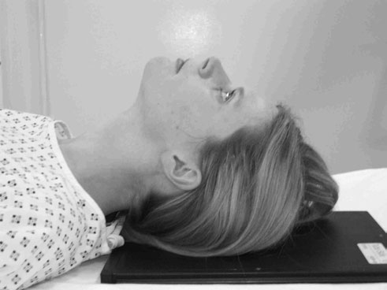
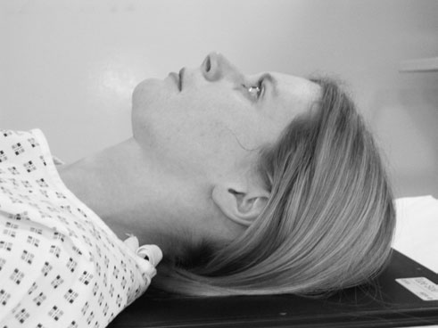
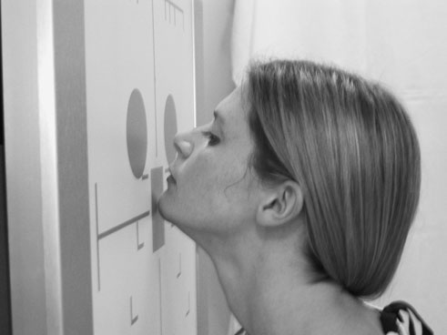
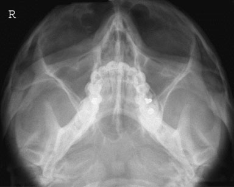
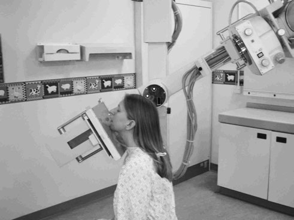

# Rx Masiv Facial (Oase ale Feței) Modified mento - occipital

  📷 Radiografie Convențională (Rx)
  <strong>Actualizat:</strong> 2026-09-16
  <strong>Autor:</strong> Departamentul de Radiologie / Referință Clark (Ed. 12)

---

-   __1. Rezumat Clinic & Indicații__

    ---

    === "Indicații Clinice"

        - 265 9 Masiv Facial (Oase ale Feței) 30° 45° Occipito-mental 30 grade caudal

    === "Ghid Național IRIS"

        !!! info "Referință Primară: Ghidul Național IRIS (Ordinul MS 1342/2012)"
            - **Capitol Ghid IRIS:** *Ghidul Național IRIS*
            - **Grad de Recomandare:** **De verificat pe indicație; fără grad atribuit automat**
            - **Nivel de Iradiere Estimată:** `De verificat pentru examinarea și populația selectate`

            [:octicons-search-16: Deschide Ghidul IRIS](../../iris.md){ .md-button .md-button--primary } [:material-open-in-new: Aplicația Oficială PWA](https://radiologie-pediatrica.ro/iris/){ .md-button target="_blank" rel="noopener" }
-   __2. Poziționare & Centrare Fascicul__

    ---

    - **Poziție Pacient:** • pacientul will fie Decubit dorsal pe trolley și trebuie să nu fie moved. If it este possible la place casetă și grilă under pacientul’s cap fără moving gâtul, then this trebuie să fie undertaken. If this este nu possible, then place caseta și grilă în caseta tray under pacientul.
• top de caseta trebuie să fie la least 5 cm above top de capul la allow pentru orice cranial fascicul angulation.
• A 24  30-cm casetă este recommended.

• Incidența se realizează optim cu pacientul așezat cu fața spre Craniu unit casetă holder sau stativ vertical Bucky.
• Nasul și bărbia pacientului sunt plasate în contact cu linia mediană stativului/casetei. capul then este ajustat la bring orbito-meatal baseline la a 45-grade angle la caseta holder.
• orizontal central line de Bucky sau casetă holder trebuie să fie la nivelul simfiză menti.
• Ensure that planul mediosagital este la drept-angles la Bucky sau casetă holder prin checking that outer canthi de eyes și extern auditory meatuses sunt equidistant.
    - **Punct de Centrare Fascicul:** • pacientul trebuie să fie assessed pentru poziție (angle) de linie orbitomeatală (LOM) în relation la caseta.
• If baseline makes angle de 45 grade back de la vertical (chin raised), then perpendicular fascicul poate fie employed centred la linia mediană la nivelul lower orbital margins.
• If orbito-meatal baseline makes angle de less than 45 grade cu caseta because de gâtul brace, then difference între measured angle și 45 grade trebuie să fie added la fascicul în form de cranial angulation. centring point remains same.
• pentru example, if orbito-meatal baseline was estimated la fie 20 grade de la vertical ca bărbia was raised, then a 25-grade cranial angulation would need la fie applied la tubul la maintain required angle (see diagram).

• tubul este înclinat 30 grade caudally și centred along linia mediană, astfel încât raza centrală exits la nivelul lower orbital margins.
• la check that fascicul este centred properly, cross-lines pe Bucky sau casetă holder trebuie să coincide approximately cu upper simfiză menti region (this will vary cu anatomical differences între pacienți).
    - **Distanță Focar-Film (DFF / SID):** 100 cm
    - **Comandă Respiratorie:** Apnee pe durata expunerii (apnee în inspir pentru torace; expir pentru Abdomen/bazin).

-   __3. Parametri Tehnici Expunere__

    ---

    | Parametru Tehnic | Valoare Configurare Generator / Tub |
    |:-----------------|:-------------------------------------|
    | **Tensiune Tub (kV)** | DE CONFIGURAT PE APARAT |
    | **Sarcină / Produs Curent-Timp (mAs)** | Conform AEC / grosime anatomică |
    | **Distanță Focar-Film (DFF / SID)** | 100 cm |
    | **Grilă Antidifuzoare (Bucky)** | Cu grilă antidifuzoare Bucky |
    | **Dimensiune Focar** | Focar Mic (0.6 mm) |
    | **Camere de Ionizare AEC** | Camerele laterale (sau camera centrală funcție de regiune) |
    | **Colimare Fascicul** | Colimare strictă adaptată pe receptor 24 x 30 cm |
    | **Filtrare Tub** | Totală ≥ 2.5 mm Al echivalent (conform Clark: 3.0 mm Al eq.) |

-   __4. Criterii de Calitate & Reușită Imagine__

    ---

    - floors de orbit will fie clearly vizibil through maxillary Sinusuri Paranazale (SAF), și lower orbital margin trebuie să fie clar evidențiat(e).
    - There trebuie să fie Absența rotației anatomice (simetrie bilaterală perfectă). This poate fie checked prin ensuring that distance de la Profil (lateral) orbital perete la outer Craniu margins este equidistant pe ambele părți (bilateral).
    - Erori de evitat / remedii: Failure la evidențiază whole de orbital floor due la under-angulation și failure la maintain orbito-meatal baseline la 45 grade. pentru pacientul who finds difficulty în achieving latter, greater caudal tube angle poate fie required.

-   __5. Protecție Radiologică (ALARA)__

    ---

    - Ecranare gonadică cu șorț plumbat dacă gonadele sunt în apropierea fasciculului util (regula ALARA).
    - Colimare precisă la dimensiunea anatomică strict necesară pentru reducerea dozei și a radiației difuze.
    - Verificarea posibilității unei sarcini la pacientele de vârstă fertilă înainte de expunere.

!!! note "Observații Clinice & Tehnice"
    • ca cranial angulation increases, top de caseta trebuie să fie displaced further de la top de capul.
• These imagini suffer greatly de la poor resolution resulting de la magnification și distortion de la cranial angulation. It poate fie worth considering postponing examination until orice spinal injury poate fie ruled out și pacientul poate fie examined fără gâtul brace sau moved pe la Craniu unit if other injuries will allow.
264 45° pacient imaged Decubit dorsal cu 45-grade baseline 25° 20° pacient imaged Decubit dorsal cu 20-grade baseline și 25-grade cranial angulation

pe many Craniu units, tubul și casetă holder sunt fixed permanently, astfel încât tube este perpendicular pe casetă. This presents problem pentru this incidență, ca baseline trebuie să fie 45 grade la caseta. This would nu fie case when 30-grade tube angle este applied. pacientul trebuie să therefore fie poziționat cu their linie orbitomeatală (LOM) poziționat la 45 grade la imaginary vertical line de la floor (see imagine opposite).
Although such arrangement makes positioning și imobilizare more difficult, it does have advantage de producing imagine that este liber de distortion.
This incidență evidențiază lower orbital margins și orbital floors en face. zygomatic arches sunt opened out compared cu occipito-mental incidență but they sunt still foreshortened.

### 🖼️ Imagini

<figure class="protocol-image-card" markdown>

<figcaption><strong>trolley, în neck brace, și cu radiographic baseline în</strong> — Poziționare pacient și centrare fascicul conform Clark (Ed. 12)</figcaption>

</figure>

<figure class="protocol-image-card" markdown>

<figcaption><strong>Figura 2: Aspect radiografic / Poziționare (Clark Ed. 12)</strong> — Aspect radiografic / ghid de poziționare conform tratatului Clark (Ed. 12)</figcaption>

</figure>

<figure class="protocol-image-card" markdown>

<figcaption><strong>Figura 3: Aspect radiografic / Poziționare (Clark Ed. 12)</strong> — Aspect radiografic / ghid de poziționare conform tratatului Clark (Ed. 12)</figcaption>

</figure>

<figure class="protocol-image-card" markdown>

<figcaption><strong>Figura 4: Aspect radiografic / Poziționare (Clark Ed. 12)</strong> — Aspect radiografic / ghid de poziționare conform tratatului Clark (Ed. 12)</figcaption>

</figure>

<figure class="protocol-image-card" markdown>

<figcaption><strong>Figura 5: Aspect radiografic / Poziționare (Clark Ed. 12)</strong> — Aspect radiografic / ghid de poziționare conform tratatului Clark (Ed. 12)</figcaption>

</figure>

=== "Ghid Rapid de Execuție"

    1. **Identificarea și verificarea pacientului:** verificare identitate, zonă de examinat, consimțământ conform procedurii și evaluarea posibilității unei sarcini, când este relevantă.
    2. **Pregătire:** îndepărtarea oricăror obiecte radiopace (bijuterii, agrafe, fermoare, proteze, pansamente dense).
    3. **Poziționare precisă:** alinierea receptorului de imagine și a tubului la distanța prescrisă (100 cm).
    4. **Colimare strictă:** adaptarea fasciculului strict la regiunea de diagnostic pentru scăderea iradierii și reducerea radiației difuze.
    5. **Radioprotecție:** verificarea [politicii RX](../radioprotectie.md), cu măsuri distincte pentru pacient, personal și însoțitor.

## Surse de documentare

- [Clark's Positioning in Radiography (Ed. 12), Pagina 279](../../assets/protocols/sources/Clark___Positioning_in_Radiography__12th_edition.pdf#page=279)
