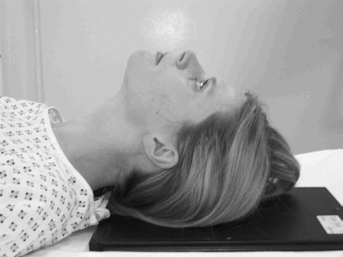
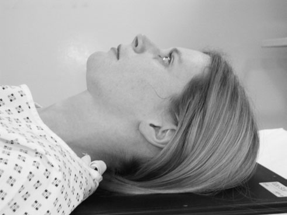
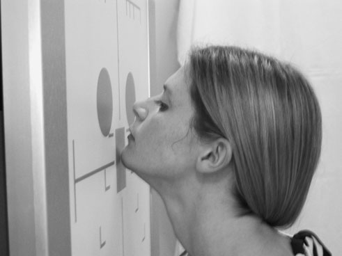
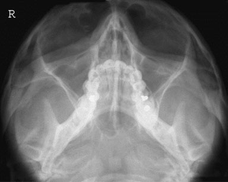
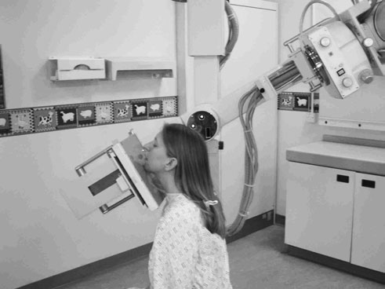

# Radiografia masivului facial (oaselor feței), incidență occipito-mentonieră modificată

  📷 Radiografie Convențională (Rx)
  <strong>Actualizat:</strong> 2026-09-16
  <strong>Autor:</strong> Departamentul de Radiologie / Referință Clark (Ed. 12)

---

-   __1. Rezumat Clinic & Indicații__

    ---

    === "Indicații Clinice"

        - 265 9 Masiv facial (oasele feței) 30° 45° Occipito-mentonieră 30 grade caudal

    === "Ghid Național IRIS"

        !!! info "Referință Primară: Ghidul Național IRIS (Ordinul MS 1342/2012)"
            - **Capitol Ghid IRIS:** *Cap — ORL*
            - **Grad de Recomandare:** **Grad B**
            - **Nivel de Iradiere Estimată:** `Clasa 1 (Minimă < 0.1 mSv)`

            [:octicons-search-16: Deschide Ghidul IRIS](../../iris.md){ .md-button .md-button--primary } [:material-open-in-new: Aplicația Oficială PWA](https://radiologie-pediatrica.ro/iris/){ .md-button target="_blank" rel="noopener" }

-   __2. Poziționare & Centrare Fascicul__

    ---

    - **Poziție Pacient:**
        - pacientul va fi în decubit dorsal pe targa mobilă și nu trebuie mișcat. Dacă este posibilă introducerea casetei și a grilei sub capul pacientului fără mobilizarea gâtului, aceasta trebuie efectuată. Dacă nu este posibil, introduceți caseta și grila în tava pentru casetă de sub pacient.
        - partea superioară a casetei trebuie să fie la cel puțin 5 cm deasupra părții superioare a capului, pentru a permite orice angulație craniană a fasciculului.
        - se recomandă o casetă de 24 × 30-cm.
        - incidența se realizează optim cu pacientul așezat cu fața spre suportul casetei aparatului pentru craniu sau stativul vertical Bucky.
        - nasul și bărbia pacientului sunt plasate în contact cu linia mediană a stativului/casetei. Capul este apoi ajustat pentru a aduce linia orbitomeatală la un unghi de 45 grade față de suportul casetei.
        - linia centrală orizontală a stativului Bucky sau a suportului casetei trebuie să fie la nivelul simfizei mentoniere.
        - asigurați-vă că planul mediosagital este perpendicular pe stativul Bucky sau suportul casetei, verificând că canthusurile externe ale ochilor și meatul auditiv extern sunt echidistante.
    - **Punct de Centrare Fascicul:**
        - pacientul trebuie evaluat în ceea ce privește poziția (unghiul) liniei orbitomeatale (LOM) în raport cu caseta.
        - Dacă linia de bază formează un unghi de 45 grade posterior față de verticală (bărbia ridicată), poate fi utilizat un fascicul perpendicular, centrat pe linia mediană la nivelul marginilor orbitare inferioare.
        - Dacă linia orbitomeatală formează cu caseta un unghi mai mic de 45 grade din cauza ortezei cervicale, diferența dintre unghiul măsurat și 45 grade trebuie adăugată fasciculului sub forma unei angulații craniene. Punctul de centrare rămâne același.
        - de exemplu, dacă linia orbitomeatală a fost estimată la 20 grade față de verticală deoarece bărbia era ridicată, trebuie aplicată o angulație craniană de 25 grade tubului pentru a menține unghiul necesar (vezi schema).
        - tubul este înclinat cu 30 grade caudal și centrat de-a lungul liniei mediane, astfel încât raza centrală să iasă la nivelul marginilor orbitare inferioare.
        - pentru a verifica dacă fasciculul este centrat corect, liniile încrucișate de pe stativul Bucky sau suportul casetei trebuie să coincidă aproximativ cu regiunea superioară a simfizei mentoniere (aceasta va varia în funcție de diferențele anatomice dintre pacienți).
    - **Distanță Focar-Film (DFF / SID):** 100 cm
    - **Comandă Respiratorie:** Apnee pe durata expunerii (apnee în inspir pentru torace; expir pentru Abdomen/bazin).

-   __3. Parametri Tehnici Expunere__

    ---

    | Parametru Tehnic | Valoare Configurare Generator / Tub |
    |:-----------------|:-------------------------------------|
    | **Tensiune Tub (kV)** | DE CONFIGURAT PE APARAT |
    | **Sarcină / Produs Curent-Timp (mAs)** | Conform AEC / grosimii anatomice |
    | **Distanță Focar-Film (DFF / SID)** | 100 cm |
    | **Grilă Antidifuzoare (Bucky)** | Cu grilă antidifuzoare Bucky |
    | **Dimensiune Focar** | Focar Mic (0.6 mm) |
    | **Camere de Ionizare AEC** | Camerele laterale (sau camera centrală, în funcție de regiune) |
    | **Colimare Fascicul** | Colimare strictă adaptată pe receptor 24 x 30 cm |
    | **Filtrare Tub** | Totală ≥ 2.5 mm Al echivalent (conform Clark: 3.0 mm Al echivalent) |

-   __4. Criterii de Calitate & Reușită Imagine__

    ---

    - planșeele orbitare vor fi clar vizibile prin sinusurile maxilare paranazale (SAF), iar marginea orbitală inferioară trebuie evidențiată clar.
    - Trebuie să existe absența rotației anatomice (simetrie bilaterală perfectă). Aceasta poate fi verificată asigurându-se că distanța de la peretele orbital de profil la marginile externe ale craniului este echidistantă pe ambele părți (bilateral).
    - Erori de evitat / remedii: imposibilitatea evidențierii întregului planșeu orbital din cauza angulației insuficiente și imposibilitatea menținerii liniei orbitomeatale la 45 grade. Pentru pacientul care întâmpină dificultăți în obținerea ultimei poziții, poate fi necesar un unghi mai mare al tubului, caudal.

-   __5. Protecție Radiologică (ALARA)__

    ---

    - Ecranare gonadică cu șorț plumbat dacă gonadele sunt în apropierea fasciculului util (regula ALARA).
    - Colimare precisă la dimensiunea anatomică strict necesară pentru reducerea dozei și a radiației difuze.
    - Verificarea posibilității unei sarcini la pacientele de vârstă fertilă înainte de expunere.

!!! note "Observații Clinice & Tehnice"
    - pe măsură ce angulația craniană crește, partea superioară a casetei trebuie deplasată mai mult față de partea superioară a capului.
    - aceste imagini prezintă o deteriorare accentuată din cauza rezoluției slabe, rezultată din mărirea și distorsiunea produse de angulația craniană. Poate fi util să se ia în considerare amânarea examinării până când orice leziune spinală poate fi exclusă și pacientul poate fi examinat fără orteza cervicală sau mutat pe aparatul pentru craniu, dacă celelalte leziuni permit. 264 45° pacient examinat în decubit dorsal cu linia de bază la 45 grade 25° 20° pacient examinat în decubit dorsal cu linia de bază la 20 grade și angulație craniană de 25 grade
    la multe aparate pentru craniu, tubul și suportul casetei sunt fixate permanent, astfel încât tubul este perpendicular pe casetă. Aceasta reprezintă o problemă pentru această incidență, deoarece linia de bază trebuie să formeze 45 grade cu caseta. Acest lucru nu ar fi valabil când se aplică un unghi al tubului de 30 grade. Pacientul trebuie, prin urmare, poziționat cu linia orbitomeatală (LOM) la 45 grade față de linia verticală imaginară trasată de la podea (vezi imaginea alăturată).

    Deși acest aranjament face poziționarea și imobilizarea mai dificile, are avantajul de a produce o imagine lipsită de distorsiune.

    Această incidență evidențiază marginile orbitare inferioare și planșeele orbitare en face. Arcurile zigomatice sunt desfăcute comparativ cu incidența occipito-mentonieră, dar sunt încă scurtate.

### 🖼️ Imagini

<figure class="protocol-image-card" markdown>

<figcaption><strong>targă mobilă, cu orteză cervicală și cu linia de bază radiografică în</strong> — Poziționarea pacientului și centrarea fasciculului conform Clark (Ed. 12)</figcaption>

</figure>

<figure class="protocol-image-card" markdown>

<figcaption><strong>Figura 2: Aspect radiografic / Poziționare (Clark Ed. 12)</strong> — Aspect radiografic / ghid de poziționare conform tratatului Clark (Ed. 12)</figcaption>

</figure>

<figure class="protocol-image-card" markdown>

<figcaption><strong>Figura 3: Aspect radiografic / Poziționare (Clark Ed. 12)</strong> — Aspect radiografic / ghid de poziționare conform tratatului Clark (Ed. 12)</figcaption>

</figure>

<figure class="protocol-image-card" markdown>

<figcaption><strong>Figura 4: Aspect radiografic / Poziționare (Clark Ed. 12)</strong> — Aspect radiografic / ghid de poziționare conform tratatului Clark (Ed. 12)</figcaption>

</figure>

<figure class="protocol-image-card" markdown>

<figcaption><strong>Figura 5: Aspect radiografic / Poziționare (Clark Ed. 12)</strong> — Aspect radiografic / ghid de poziționare conform tratatului Clark (Ed. 12)</figcaption>

</figure>

=== "Ghid Rapid de Execuție"

    1. **Identificarea și verificarea pacientului:** verificare identitate, zonă de examinat, consimțământ conform procedurii și evaluarea posibilității unei sarcini, când este relevantă.
    2. **Pregătire:** îndepărtarea oricăror obiecte radiopace (bijuterii, agrafe, fermoare, proteze, pansamente dense).
    3. **Poziționare precisă:** alinierea receptorului de imagine și a tubului la distanța prescrisă (100 cm).
    4. **Colimare strictă:** adaptarea fasciculului strict la regiunea de diagnostic pentru scăderea iradierii și reducerea radiației difuze.
    5. **Radioprotecție:** verificarea [politicii RX](../radioprotectie.md), cu măsuri distincte pentru pacient, personal și însoțitor.

## Surse de documentare

- [Clark's Positioning in Radiography (Ed. 12), Pagina 279](https://books.google.com/books/about/Clark_s_Positioning_in_Radiography.html?id=Xxu6MwEACAAJ)
