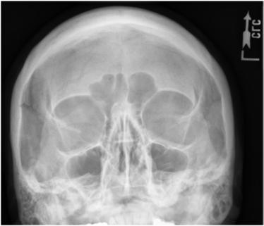
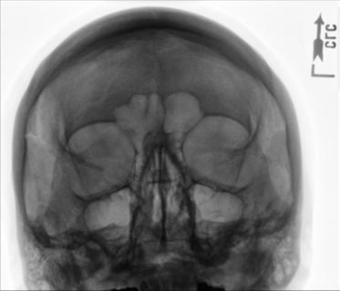

# Rx Masiv Facial (Oase ale Feței) MODIFIED PARIETOACANTHIAL Incidență (MODIFIED Incidență Occipito-Mentonieră (Metoda Waters))

  📷 Radiografie Convențională (Rx)
  <strong>Actualizat:</strong> 2026-09-15
  <strong>Autor:</strong> Departamentul de Radiologie / Referință Bontrager

---

-   __1. Rezumat Clinic & Indicații__

    ---

    === "Indicații Clinice"

        - Orbital suspiciune de fractură (e.g., blowout) și neoplastic sau inflammatory processes
        - Corp străin / corpuri străine radio-opace în eye

    === "Ghid Național IRIS"

        !!! info "Referință Primară: Ghidul Național IRIS (Ordinul MS 1342/2012)"
            - **Capitol Ghid IRIS:** *Ghidul Național IRIS*
            - **Grad de Recomandare:** **De verificat pe indicație; fără grad atribuit automat**
            - **Nivel de Iradiere Estimată:** `De verificat pentru examinarea și populația selectate`

            [:octicons-search-16: Deschide Ghidul IRIS](../../iris.md){ .md-button .md-button--primary } [:material-open-in-new: Aplicația Oficială PWA](https://radiologie-pediatrica.ro/iris/){ .md-button target="_blank" rel="noopener" }
-   __2. Poziționare & Centrare Fascicul__

    ---

    - **Poziție Pacient:** Pacient: se îndepărtează toate obiectele radio-opace (metalice sau din plastic) de la capul și neck. pacient poziție este Ortostatism sau Decubit ventral (Ortostatism este preferred if pacient’s condition allows).; Regiune anatomică: Extend neck, resting chin și nose against table/în ortostatism imaging device surface. Adjust cap until lMl este perpendicular; linie orbitomeatală (LOM) forms a 55° angle cu receptorul de imagine (Fig. 11.135). poziție MsP perpendicular la midline de grilă sau table/în ortostatism imaging device surface. Ensure Absența rotației anatomice: clavicule echidistante față de linia apofizelor spinoase sau tilt de cap.
    - **Punct de Centrare Fascicul:** Align Raza centrală perpendiculară, centrat pe exit la acantion. Se centrează receptorul de imagine pe raza centrală.
    - **Distanță Focar-Film (DFF / SID):** 100 cm
    - **Comandă Respiratorie:** Apnee pe durata expunerii. Masiv Facial (Oase ale Feței) SPECIAL Modified parietoacanthial (modified Incidență Occipito-Mentonieră (Metoda Waters))

-   __3. Parametri Tehnici Expunere__

    ---

    | Parametru Tehnic | Valoare Configurare Generator / Tub |
    |:-----------------|:-------------------------------------|
    | **Tensiune Tub (kV)** | 70-85 kV |
    | **Sarcină / Produs Curent-Timp (mAs)** | DE CONFIGURAT PE APARAT |
    | **Distanță Focar-Film (DFF / SID)** | 100 cm |
    | **Grilă Antidifuzoare (Bucky)** | Cu grilă antidifuzoare Bucky |
    | **Dimensiune Focar** | Focar Mic (0.6 mm) |
    | **Camere de Ionizare AEC** | Camerele laterale (sau camera centrală funcție de regiune) |
    | **Colimare Fascicul** | Collimate pe four sides la anatomy de interest. |
    | **Filtrare Tub** | Totală ≥ 2.5 mm Al echivalent |

-   __4. Criterii de Calitate & Reușită Imagine__

    ---

    - inferior orbital margins sunt perpendicular pe receptorul de imagine, which also provides less distorted incidență de orbital base/floor than parietoacanthial (Waters) incidență (Figs. 11.136 și 11.137). poziție:
    - Correct poziție/raza centrală angulation este indicated prin stânci temporale (piramide pietroase) projected into lower half de sinusuri maxilare, below IOMs.
    - Absența rotației anatomice: clavicule echidistante față de linia apofizelor spinoase de Craniu este indicated prin equal distance de la midlateral orbital margin la lateral cortex de Craniu (side rotit spre receptorul de imagine will appear wider).
    - Collimation la aria de interes diagnostic. expunere:
    - optim receptorul de imagine expunere și contrast sunt sufficient la visualize inferior orbital margins.
    - net bony margins indicate fără mișcare. Fig. 11.136 Modified parietoacanthial (Waters). sinusuri frontale Bony nasal septum stânci temporale (piramide pietroase) stânci temporale (piramide pietroase) sinusuri maxilare inferior orbital margin Fig. 11.137 Modified parietoacanthial (Waters). 18 24 L Fig. 11.135 Modified parietoacanthial (Waters)—lMl perpendicular (linie orbitomeatală (LOM) 55°). (Decubit ventral vizualizat în inset.)

-   __5. Protecție Radiologică (ALARA)__

    ---

    - Ecranare gonadică și a organelor radiosensibile conform procedurilor locale de radioprotecție ALARA.
    - Colimare strictă la aria de interes pentru limitarea radiației difuze.
    - Verificarea posibilității unei sarcini la pacientele de vârstă fertilă înainte de expunere.

### 🖼️ Imagini

<figure class="protocol-image-card" markdown>

<figcaption><strong>Fig. 11.136 Modified parietoacanthial (Waters).</strong> — Poziționare pacient conform Ghidului Bontrager (Fig. 11.136 Modified parietoacanthial (Waters).)</figcaption>

</figure>

<figure class="protocol-image-card" markdown>

<figcaption><strong>Fig. 11.137 Modified parietoacanthial (Waters).</strong> — Aspect radiografic de referință conform Ghidului Bontrager (Fig. 11.137 Modified parietoacanthial (Waters).)</figcaption>

</figure>

<figure class="protocol-image-card" markdown>

<figcaption><strong>Fig. 11.135 Modified parietoacanthial (Waters)—lMl perpendicular</strong> — Aspect radiografic de referință conform Ghidului Bontrager (Fig. 11.135 Modified parietoacanthial (Waters)—lMl perpendicular)</figcaption>

</figure>

<figure class="protocol-image-card" markdown>

<figcaption><strong>Figura 4</strong> — Aspect radiografic de referință conform Ghidului Bontrager (Figura 4)</figcaption>

</figure>

=== "Ghid Rapid de Execuție"

    1. **Identificarea și verificarea pacientului:** verificare identitate, zonă de examinat, consimțământ conform procedurii și evaluarea posibilității unei sarcini, când este relevantă.
    2. **Pregătire:** îndepărtarea oricăror obiecte radiopace (bijuterii, agrafe, fermoare, proteze, pansamente dense).
    3. **Poziționare precisă:** alinierea receptorului de imagine și a tubului la distanța prescrisă (100 cm).
    4. **Colimare strictă:** adaptarea fasciculului strict la regiunea de diagnostic pentru scăderea iradierii și reducerea radiației difuze.
    5. **Radioprotecție:** verificarea [politicii RX](../radioprotectie.md), cu măsuri distincte pentru pacient, personal și însoțitor.

## Surse de documentare

- [Bontrager's Textbook of Radiographic Positioning (Ed. 9/10), Pagina 446](https://www.elsevier.com/books/textbook-of-radiographic-positioning-and-related-anatomy/lampignano/978-0-323-65367-1)
