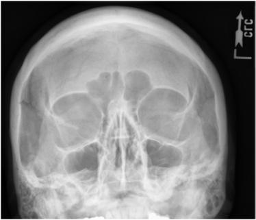
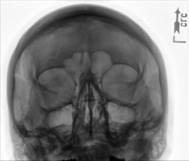

# Radiografia masivului facial (oaselor feței), incidență parieto-acantială modificată (incidență occipito-mentonieră modificată (metoda Waters))

  📷 Radiografie Convențională (Rx)
  <strong>Actualizat:</strong> 2026-09-15
  <strong>Autor:</strong> Departamentul de Radiologie / Referință Bontrager

---

-   __1. Rezumat Clinic & Indicații__

    ---

    === "Indicații Clinice"

        - Suspiciune de fractură orbitală (de exemplu, fractură de tip blowout) și procese neoplazice sau inflamatorii
        - Corp străin/corpuri străine radioopace în ochi

    === "Ghid Național IRIS"

        !!! info "Referință Primară: Ghidul Național IRIS (Ordinul MS 1342/2012)"
            - **Capitol Ghid IRIS:** *Cap — ORL*
            - **Grad de Recomandare:** **Grad B**
            - **Nivel de Iradiere Estimată:** `Clasa 1 (Minimă < 0.1 mSv)`

            [:octicons-search-16: Deschide Ghidul IRIS](../../iris.md){ .md-button .md-button--primary } [:material-open-in-new: Aplicația Oficială PWA](https://radiologie-pediatrica.ro/iris/){ .md-button target="_blank" rel="noopener" }

-   __2. Poziționare & Centrare Fascicul__

    ---

    - **Poziție Pacient:** Pacient: se îndepărtează toate obiectele radioopace (metalice sau din plastic) de la nivelul capului și gâtului. Poziția pacientului este ortostatism sau decubit ventral (ortostatismul este preferat dacă starea pacientului permite).; Regiune anatomică: Extindeți gâtul, sprijinind bărbia și nasul pe masă/suprafața dispozitivului de imagistică în ortostatism. Ajustați capul până când lMl este perpendicular; linia orbitomeatală (LOM) formează un unghi de 55° cu receptorul de imagine (Fig. 11.135). Poziția MsP perpendiculară pe linia mediană a grilei sau a mesei/suprafeței dispozitivului de imagistică în ortostatism. Asigurați absența rotației anatomice: claviculele sunt echidistante față de linia apofizelor spinoase sau a înclinării capului.
    - **Punct de Centrare Fascicul:** Aliniați raza centrală perpendicular, centrată pentru a ieși la acantion. Centrați receptorul de imagine pe raza centrală.
    - **Distanță Focar-Film (DFF / SID):** 100 cm
    - **Comandă Respiratorie:** Apnee pe durata expunerii. Masiv facial (oasele feței) SPECIALĂ Incidență parieto-acantială modificată (incidență occipito-mentonieră modificată (metoda Waters))

-   __3. Parametri Tehnici Expunere__

    ---

    | Parametru Tehnic | Valoare Configurare Generator / Tub |
    |:-----------------|:-------------------------------------|
    | **Tensiune Tub (kV)** | 70-85 kV |
    | **Sarcină / Produs Curent-Timp (mAs)** | DE CONFIGURAT PE APARAT |
    | **Distanță Focar-Film (DFF / SID)** | 100 cm |
    | **Grilă Antidifuzoare (Bucky)** | Cu grilă antidifuzoare Bucky |
    | **Dimensiune Focar** | Focar Mic (0.6 mm) |
    | **Camere de Ionizare AEC** | Camerele laterale (sau camera centrală, în funcție de regiune) |
    | **Colimare Fascicul** | Colimați pe cele patru laturi la anatomia de interes. |
    | **Filtrare Tub** | Totală ≥ 2.5 mm Al echivalent |

-   __4. Criterii de Calitate & Reușită Imagine__

    ---

    - marginile orbitare inferioare sunt perpendiculare pe receptorul de imagine, ceea ce oferă, de asemenea, o incidență mai puțin distorsionată a bazei/planșeului orbitar decât incidența parieto-acantială (Waters) (Fig. 11.136 și 11.137). Poziție:
    - Poziția corectă/angulația razei centrale este indicată de piramidele pietroase proiectate în jumătatea inferioară a sinusurilor maxilare, sub IOM.
    - Absența rotației anatomice: claviculele echidistante față de linia apofizelor spinoase ale craniului este indicată de distanța egală dintre marginea orbitală mediolaterală și cortexul lateral al craniului (partea rotită spre receptorul de imagine va apărea mai lată).
    - Colimare la aria de interes diagnostic. Expunere:
    - expunerea și contrastul receptorului de imagine sunt suficiente pentru vizualizarea marginilor orbitare inferioare.
    - marginile osoase nete indică absența mișcării. Fig. 11.136 Incidență parieto-acantială modificată (Waters). Sinusuri frontale Sept nazal osos Piramide pietroase Piramide pietroase Sinusuri maxilare Margine orbitală inferioară Fig. 11.137 Incidență parieto-acantială modificată (Waters). 18 24 L Fig. 11.135 Incidență parieto-acantială modificată (Waters)—lMl perpendicular (linia orbitomeatală (LOM) 55°). (Decubitul ventral este prezentat în imaginea inserată.)

-   __5. Protecție Radiologică (ALARA)__

    ---

    - Ecranare gonadică și a organelor radiosensibile conform procedurilor locale de radioprotecție ALARA.
    - Colimare strictă la aria de interes pentru limitarea radiației difuze.
    - Verificarea posibilității unei sarcini la pacientele de vârstă fertilă înainte de expunere.

### 🖼️ Imagini

<figure class="protocol-image-card" markdown>

<figcaption><strong>Fig. 11.136 Incidență parieto-acantială modificată (Waters).</strong> — Poziționarea pacientului conform Ghidului Bontrager (Fig. 11.136 Incidență parieto-acantială modificată (Waters).)</figcaption>

</figure>

<figure class="protocol-image-card" markdown>

<figcaption><strong>Fig. 11.137 Incidență parieto-acantială modificată (Waters).</strong> — Aspect radiografic de referință conform Ghidului Bontrager (Fig. 11.137 Incidență parieto-acantială modificată (Waters).)</figcaption>

</figure>

<figure class="protocol-image-card" markdown>

<figcaption><strong>Fig. 11.135 Incidență parieto-acantială modificată—lMl perpendicular</strong> — Aspect radiografic de referință conform Ghidului Bontrager (Fig. 11.135 Incidență parieto-acantială modificată—lMl perpendicular)</figcaption>

</figure>

<figure class="protocol-image-card" markdown>

<figcaption><strong>Figura 4</strong> — Aspect radiografic de referință conform Ghidului Bontrager (Figura 4)</figcaption>

</figure>

=== "Ghid Rapid de Execuție"

    1. **Identificarea și verificarea pacientului:** verificare identitate, zonă de examinat, consimțământ conform procedurii și evaluarea posibilității unei sarcini, când este relevantă.
    2. **Pregătire:** îndepărtarea oricăror obiecte radiopace (bijuterii, agrafe, fermoare, proteze, pansamente dense).
    3. **Poziționare precisă:** alinierea receptorului de imagine și a tubului la distanța prescrisă (100 cm).
    4. **Colimare strictă:** adaptarea fasciculului strict la regiunea de diagnostic pentru scăderea iradierii și reducerea radiației difuze.
    5. **Radioprotecție:** verificarea [politicii RX](../radioprotectie.md), cu măsuri distincte pentru pacient, personal și însoțitor.

## Surse de documentare

- [Bontrager's Textbook of Radiographic Positioning (Ed. 9/10), Pagina 446](https://www.elsevier.com/books/textbook-of-radiographic-positioning-and-related-anatomy/lampignano/978-0-323-65367-1)
