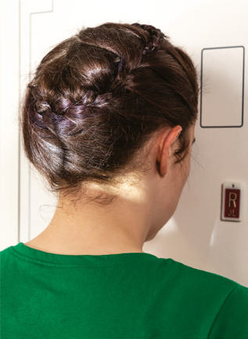
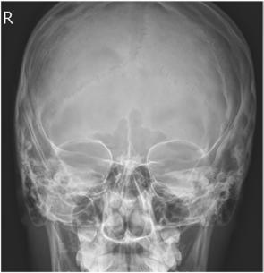
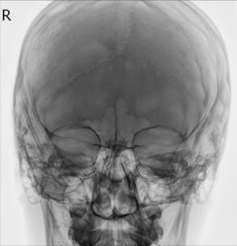

# Rx Masiv Facial (Oase ale Feței) PA Axială (Incidență Occipito-Frontală (Metoda Caldwell))

  📷 Radiografie Convențională (Rx)
  <strong>Actualizat:</strong> 2026-09-15
  <strong>Autor:</strong> Departamentul de Radiologie / Referință Bontrager

---

-   __1. Rezumat Clinic & Indicații__

    ---

    === "Indicații Clinice"

        - suspiciune de fractură și neoplastic sau inflammatory processes de Masiv Facial (Oase ale Feței)

    === "Ghid Național IRIS"

        !!! info "Referință Primară: Ghidul Național IRIS (Ordinul MS 1342/2012)"
            - **Capitol Ghid IRIS:** *Ghidul Național IRIS*
            - **Grad de Recomandare:** **De verificat pe indicație; fără grad atribuit automat**
            - **Nivel de Iradiere Estimată:** `De verificat pentru examinarea și populația selectate`

            [:octicons-search-16: Deschide Ghidul IRIS](../../iris.md){ .md-button .md-button--primary } [:material-open-in-new: Aplicația Oficială PWA](https://radiologie-pediatrica.ro/iris/){ .md-button target="_blank" rel="noopener" }
-   __2. Poziționare & Centrare Fascicul__

    ---

    - **Poziție Pacient:** Pacient: Se îndepărtează toate obiectele metalice sau din plastic din regiunea capului și gâtului. pacient poziție este Ortostatism sau Decubit ventral (Ortostatism este preferred if pacient’s condition permits it).; Regiune anatomică: Rest pacient’s nose și forehead pe / sprijinit de imaging device. Tuck chin, bringing linie orbitomeatală (LOM) perpendicular pe receptorul de imagine. Align MsP perpendicular la midline de grilă sau table/imaging device surface. Ensure Absența rotației anatomice: clavicule echidistante față de linia apofizelor spinoase sau tilt de cap (Fig. 11.132).
    - **Punct de Centrare Fascicul:** Raza centrală se înclină 15° caudal (spre picioare), la exit la nazion (see NOTE). Center raza centrală la receptorul de imagine.
    - **Distanță Focar-Film (DFF / SID):** 100 cm
    - **Comandă Respiratorie:** Apnee pe durata expunerii.

-   __3. Parametri Tehnici Expunere__

    ---

    | Parametru Tehnic | Valoare Configurare Generator / Tub |
    |:-----------------|:-------------------------------------|
    | **Tensiune Tub (kV)** | 70-85 kV |
    | **Sarcină / Produs Curent-Timp (mAs)** | DE CONFIGURAT PE APARAT |
    | **Distanță Focar-Film (DFF / SID)** | 100 cm |
    | **Grilă Antidifuzoare (Bucky)** | Cu grilă antidifuzoare Bucky |
    | **Dimensiune Focar** | Focar Mic (0.6 mm) |
    | **Camere de Ionizare AEC** | Camerele laterale (sau camera centrală funcție de regiune) |
    | **Colimare Fascicul** | Collimate pe four sides la anatomy de interest. |
    | **Filtrare Tub** | Totală ≥ 2.5 mm Al echivalent |

-   __4. Criterii de Calitate & Reușită Imagine__

    ---

    - superior orbital margins, maxillae, nasal septum, zygomatic bones, și anterior nasal coloană vertebrală (Figs. 11.133 și 11.134). poziție:
    - Correct pacient poziție/raza centrală angulation este indicated prin stânci temporale (piramide pietroase) projected into lower onethird de Orbite cu 15° caudal raza centrală. If inferior orbital margins sunt aria de interes diagnostic, 30° caudal angle projects stânci temporale (piramide pietroase) below IOMs.
    - Absența rotației anatomice: clavicule echidistante față de linia apofizelor spinoase de Craniu este indicated prin equal distance de la midlateral orbital margin la lateral cortex de Craniu (wider distance would indicate rotație spre receptorul de imagine); superior orbital fissures sunt simetric.
    - Collimation la aria de interes diagnostic. expunere:
    - optim receptorul de imagine expunere și contrast sunt sufficient la visualize maxillary region și superior orbital margins.
    - net bony margins indicate fără mișcare. Fig. 11.133 PA axial Caldwell—raza centrală 15°. (de la Curtis T: Online course pentru Mosby’s digital positioning consult, Philadelphia, 2019, Elsevier.) stânci temporale (piramide pietroase) Floor de orbit sinusuri maxilare sinusuri frontale superior orbital fissure Bony Nasal septum anterior Nasal coloană vertebrală Crista galli Fig. 11.134 PA axial Caldwell—raza centrală 15°. (Modified de la Curtis T: Online course pentru Mosby’s digital positioning consult, Philadelphia, 2019, Elsevier.)

-   __5. Protecție Radiologică (ALARA)__

    ---

    - Ecranare gonadică și a organelor radiosensibile conform procedurilor locale de radioprotecție ALARA.
    - Colimare strictă la aria de interes pentru limitarea radiației difuze.
    - Verificarea posibilității unei sarcini la pacientele de vârstă fertilă înainte de expunere.

!!! note "Observații Clinice & Tehnice"
    If aria de interes diagnostic este orbital margins, use a 30° caudal angle la project stânci temporale (piramide pietroase) below IOM. raza centrală will exit level de midorbits. Fig. 11.132 PA axial Caldwell—linie orbitomeatală (LOM) perpendicular, raza centrală 15° caudal, Ortostatism și Decubit ventral (inset). Masiv Facial (Oase ale Feței) ROUTINE lateral Parietoacanthial (Incidență Occipito-Mentonieră (Metoda Waters)) PA axial (Incidență Occipito-Frontală (Metoda Caldwell))

### 🖼️ Imagini

<figure class="protocol-image-card" markdown>

<figcaption><strong>Fig. 11.132 PA axial Caldwell—linie orbitomeatală (LOM) perpendicular, raza centrală 15° caudal,</strong> — Poziționare pacient conform Ghidului Bontrager (Fig. 11.132 PA axial Caldwell—linie orbitomeatală (LOM) perpendicular, raza centrală 15° caudal,)</figcaption>

</figure>

<figure class="protocol-image-card" markdown>

<figcaption><strong>Fig. 11.133 PA axial Caldwell—raza centrală 15°. (de la Curtis T: Online course</strong> — Aspect radiografic de referință conform Ghidului Bontrager (Fig. 11.133 PA axial Caldwell—raza centrală 15°. (de la Curtis T: Online course)</figcaption>

</figure>

<figure class="protocol-image-card" markdown>

<figcaption><strong>Fig. 11.134 PA axial Caldwell—raza centrală 15°. (Modified de la Curtis T:</strong> — Aspect radiografic de referință conform Ghidului Bontrager (Fig. 11.134 PA axial Caldwell—raza centrală 15°. (Modified de la Curtis T:)</figcaption>

</figure>

<figure class="protocol-image-card" markdown>

<figcaption><strong>Figura 4</strong> — Aspect radiografic de referință conform Ghidului Bontrager (Figura 4)</figcaption>

</figure>

=== "Ghid Rapid de Execuție"

    1. **Identificarea și verificarea pacientului:** verificare identitate, zonă de examinat, consimțământ conform procedurii și evaluarea posibilității unei sarcini, când este relevantă.
    2. **Pregătire:** îndepărtarea oricăror obiecte radiopace (bijuterii, agrafe, fermoare, proteze, pansamente dense).
    3. **Poziționare precisă:** alinierea receptorului de imagine și a tubului la distanța prescrisă (100 cm).
    4. **Colimare strictă:** adaptarea fasciculului strict la regiunea de diagnostic pentru scăderea iradierii și reducerea radiației difuze.
    5. **Radioprotecție:** verificarea [politicii RX](../radioprotectie.md), cu măsuri distincte pentru pacient, personal și însoțitor.

## Surse de documentare

- [Bontrager's Textbook of Radiographic Positioning (Ed. 9/10), Pagina 445](https://www.elsevier.com/books/textbook-of-radiographic-positioning-and-related-anatomy/lampignano/978-0-323-65367-1)
