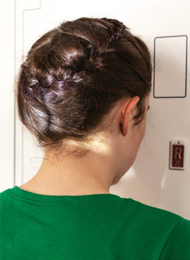
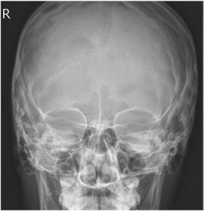
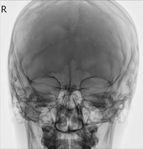

# Rx Masiv facial (oasele feței) PA axială (incidență occipito-frontală (metoda Caldwell))

  📷 Radiografie Convențională (Rx)
  <strong>Actualizat:</strong> 2026-09-15
  <strong>Autor:</strong> Departamentul de Radiologie / Referință Bontrager

---

-   __1. Rezumat Clinic & Indicații__

    ---

    === "Indicații Clinice"

        - suspiciune de fractură și procese neoplazice sau inflamatorii ale masivului facial (oaselor feței)

    === "Ghid Național IRIS"

        !!! info "Referință Primară: Ghidul Național IRIS (Ordinul MS 1342/2012)"
            - **Capitol Ghid IRIS:** *Cap — ORL*
            - **Grad de Recomandare:** **Grad B**
            - **Nivel de Iradiere Estimată:** `Clasa 1 (Minimă < 0.1 mSv)`

            [:octicons-search-16: Deschide Ghidul IRIS](../../iris.md){ .md-button .md-button--primary } [:material-open-in-new: Aplicația Oficială PWA](https://radiologie-pediatrica.ro/iris/){ .md-button target="_blank" rel="noopener" }

-   __2. Poziționare & Centrare Fascicul__

    ---

    - **Poziție Pacient:** Pacient: Se îndepărtează toate obiectele metalice sau din plastic din regiunea capului și gâtului. Poziția pacientului este ortostatism sau decubit ventral (ortostatismul este preferat dacă starea pacientului permite).; Regiune anatomică: Restul nasului și fruntea pacientului pe/sprijinite de dispozitivul de imagistică. Se flectează bărbia, aducând linia orbitomeatală (LOM) perpendiculară pe receptorul de imagine. Se aliniază MSP perpendicular pe linia mediană a grilei sau pe suprafața mesei/dispozitivului de imagistică. Se asigură absența rotației anatomice: claviculele sunt echidistante față de linia apofizelor spinoase sau față de înclinarea capului (Fig. 11.132).
    - **Punct de Centrare Fascicul:** Raza centrală se înclină cu 15° caudal (spre picioare), ieșind la nivelul nazionului (vezi NOTA). Centrați raza centrală pe receptorul de imagine.
    - **Distanță Focar-Film (DFF / SID):** 100 cm
    - **Comandă Respiratorie:** Apnee pe durata expunerii.

-   __3. Parametri Tehnici Expunere__

    ---

    | Parametru Tehnic | Valoare Configurare Generator / Tub |
    |:-----------------|:-------------------------------------|
    | **Tensiune Tub (kV)** | 70-85 kV |
    | **Sarcină / Produs Curent-Timp (mAs)** | DE CONFIGURAT PE APARAT |
    | **Distanță Focar-Film (DFF / SID)** | 100 cm |
    | **Grilă Antidifuzoare (Bucky)** | Cu grilă antidifuzoare Bucky |
    | **Dimensiune Focar** | Focar Mic (0.6 mm) |
    | **Camere de Ionizare AEC** | Camerele laterale (sau camera centrală, în funcție de regiune) |
    | **Colimare Fascicul** | Colimați pe cele patru laturi la anatomia de interes. |
    | **Filtrare Tub** | Totală ≥ 2.5 mm Al echivalent |

-   __4. Criterii de Calitate & Reușită Imagine__

    ---

    - marginile orbitare superioare, maxilarele, septul nazal, oasele zigomatice și coloana nazală anterioară (Fig. 11.133 și 11.134). Poziție:
    - Poziționarea corectă a pacientului/angulația razei centrale este indicată de stâncile temporale (piramidele pietroase) proiectate în treimea inferioară a orbitelor, cu raza centrală angulată 15° caudal. Dacă marginile orbitare inferioare reprezintă aria de interes diagnostic, un unghi caudal de 30° proiectează stâncile temporale (piramidele pietroase) sub IOM.
    - Absența rotației anatomice: claviculele echidistante față de linia apofizelor spinoase ale craniului este indicată de distanța egală de la marginea orbitală midlaterală la cortexul lateral al craniului (o distanță mai mare ar indica rotație spre receptorul de imagine); fisurile orbitare superioare sunt simetrice.
    - Colimare la aria de interes diagnostic. Expunere:
    - Expunerea și contrastul optime ale receptorului de imagine sunt suficiente pentru vizualizarea regiunii maxilare și a marginilor orbitare superioare.
    - Marginile osoase nete indică absența mișcării. Fig. 11.133 PA axială Caldwell—raza centrală 15°. (de la Curtis T: Curs online pentru consultul de poziționare digitală Mosby, Philadelphia, 2019, Elsevier.) stânci temporale (piramide pietroase) planșeul orbitelor sinusuri maxilare sinusuri frontale fisura orbitală superioară sept nazal osos coloana nazală anterioară crista galli Fig. 11.134 PA axială Caldwell—raza centrală 15°. (Modificat de la Curtis T: Curs online pentru consultul de poziționare digitală Mosby, Philadelphia, 2019, Elsevier.)

-   __5. Protecție Radiologică (ALARA)__

    ---

    - Ecranare gonadică și a organelor radiosensibile conform procedurilor locale de radioprotecție ALARA.
    - Colimare strictă la aria de interes pentru limitarea radiației difuze.
    - Verificarea posibilității unei sarcini la pacientele de vârstă fertilă înainte de expunere.

!!! note "Observații Clinice & Tehnice"
    Dacă aria de interes diagnostic este reprezentată de marginile orbitare, utilizați un unghi caudal de 30° pentru a proiecta piramidele pietroase sub IOM. Raza centrală va ieși la nivelul orbitelor medii. Fig. 11.132 Incidență axială PA Caldwell—linia orbitomeatală (LOM) perpendiculară, raza centrală 15° caudal, ortostatism și decubit ventral (imagine inserată). Masiv facial (oasele feței) DE RUTINĂ profil Incidență parieto-acantială (incidență occipito-mentonieră (metoda Waters)) Incidență axială PA (incidență occipito-frontală (metoda Caldwell))

### 🖼️ Imagini

<figure class="protocol-image-card" markdown>

<figcaption><strong>Fig. 11.132 PA axială Caldwell—linia orbitomeatală (LOM) perpendiculară, raza centrală 15° caudal,</strong> — Poziționarea pacientului conform Ghidului Bontrager (Fig. 11.132 PA axială Caldwell—linia orbitomeatală (LOM) perpendiculară, raza centrală 15° caudal,)</figcaption>

</figure>

<figure class="protocol-image-card" markdown>

<figcaption><strong>Fig. 11.133 PA axială Caldwell—raza centrală 15°. (de la Curtis T: Curs online</strong> — Aspect radiografic de referință conform Ghidului Bontrager (Fig. 11.133 PA axială Caldwell—raza centrală 15°. (de la Curtis T: Curs online)</figcaption>

</figure>

<figure class="protocol-image-card" markdown>

<figcaption><strong>Fig. 11.134 PA axială Caldwell—raza centrală 15°. (Modificat de la Curtis T:</strong> — Aspect radiografic de referință conform Ghidului Bontrager (Fig. 11.134 PA axială Caldwell—raza centrală 15°. (Modificat de la Curtis T:)</figcaption>

</figure>

<figure class="protocol-image-card" markdown>

<figcaption><strong>Figura 4</strong> — Aspect radiografic de referință conform Ghidului Bontrager (Figura 4)</figcaption>

</figure>

=== "Ghid Rapid de Execuție"

    1. **Identificarea și verificarea pacientului:** verificare identitate, zonă de examinat, consimțământ conform procedurii și evaluarea posibilității unei sarcini, când este relevantă.
    2. **Pregătire:** îndepărtarea oricăror obiecte radiopace (bijuterii, agrafe, fermoare, proteze, pansamente dense).
    3. **Poziționare precisă:** alinierea receptorului de imagine și a tubului la distanța prescrisă (100 cm).
    4. **Colimare strictă:** adaptarea fasciculului strict la regiunea de diagnostic pentru scăderea iradierii și reducerea radiației difuze.
    5. **Radioprotecție:** verificarea [politicii RX](../radioprotectie.md), cu măsuri distincte pentru pacient, personal și însoțitor.

## Surse de documentare

- [Bontrager's Textbook of Radiographic Positioning (Ed. 9/10), Pagina 445](https://www.elsevier.com/books/textbook-of-radiographic-positioning-and-related-anatomy/lampignano/978-0-323-65367-1)
